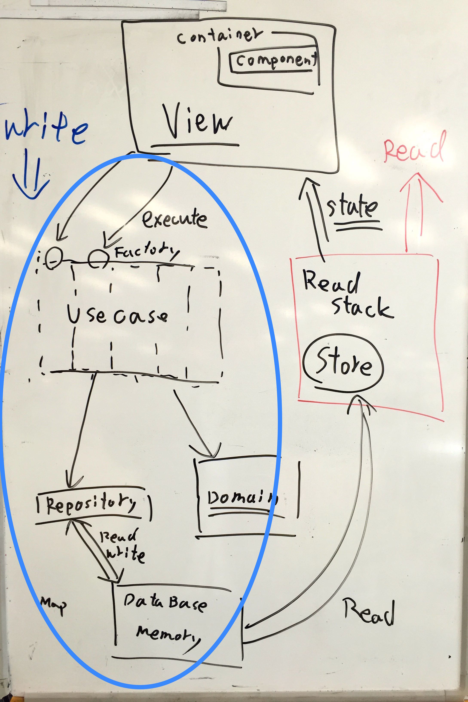
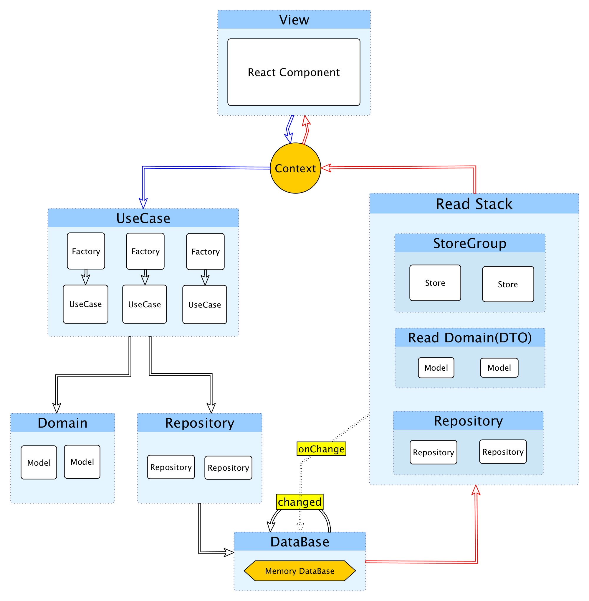
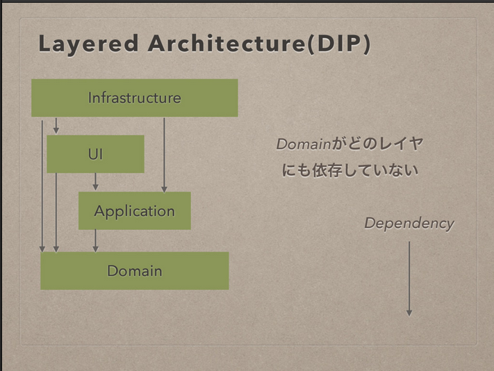
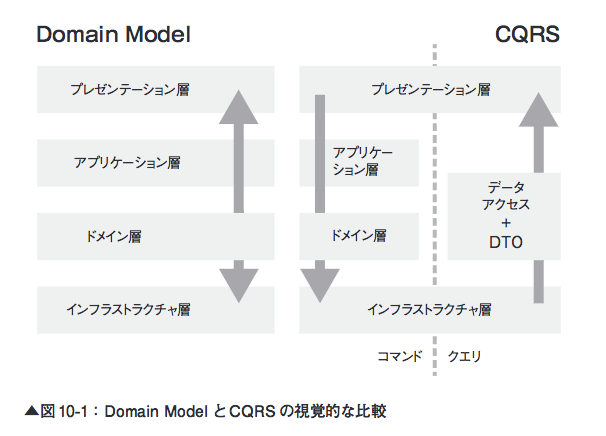
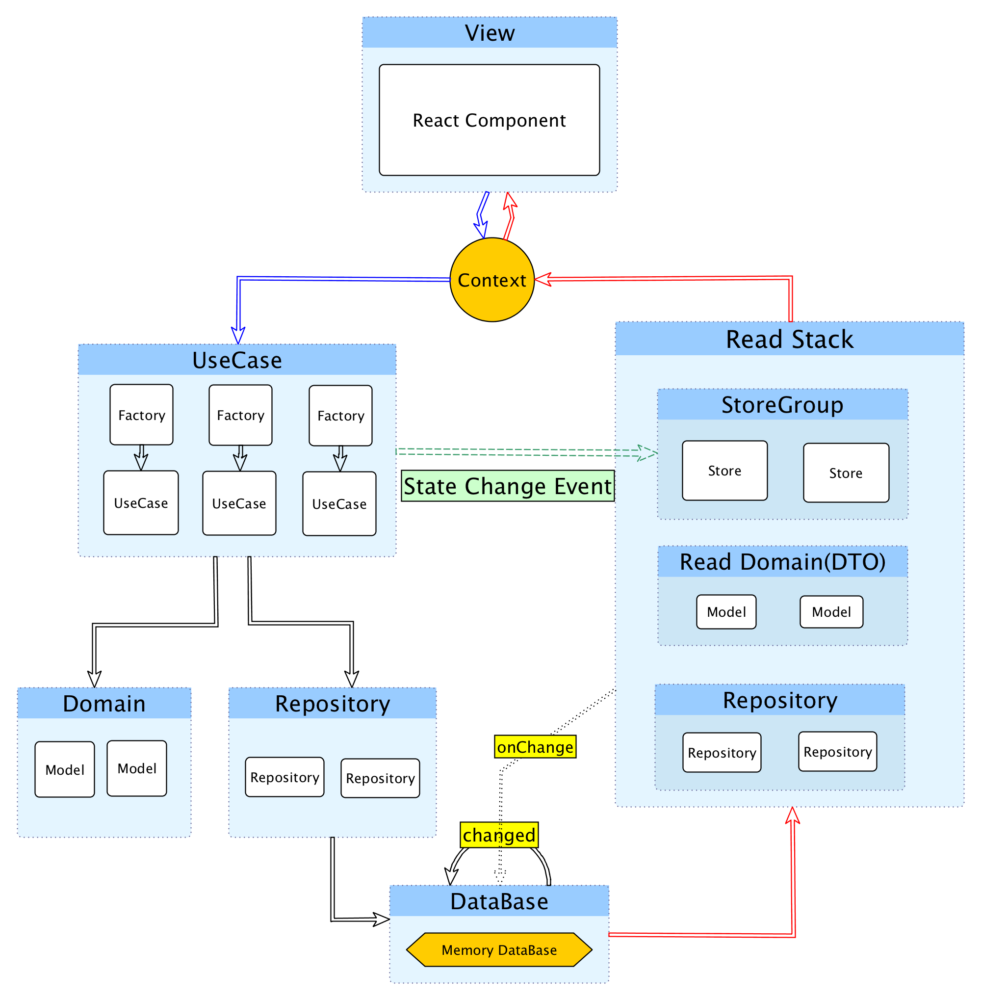

autoscale: true

# Read/Write Stack | JavaScriptアーキテクチャ

-----

# 自己紹介


- Name : **azu**
- Twitter : @[azu_re](https://twitter.com/azu_re)
- Website: [Web scratch], [JSer.info]

[Web scratch]: http://efcl.info/ "Web scratch"
[JSer.info]: http://jser.info/ "JSer.info"

-----

# This is  [Bikeshed.js](http://connpass.com/event/29019/ "Bikeshed.js") :bike:

## 抽象的な話が多いので、実装はコード見て(Pull Request投げて！)
## これが正しいという話ではないです。
## 自転車置き場の議論なので！


-----

# 中規模以上のJavaScript

- 設計が必要になる
- 正しい設計はない [Bikeshed.js](http://connpass.com/event/29019/ "Bikeshed.js") :bike:
	- 人、目的、何を作るかによってアーキテクチャは異なる
- 前回の続き? : [How to work as a Team](http://azu.github.io/slide/2016/reject-sushi/how-to-work-team.html "How to work as a Team")


-----


# 用語


------


-----

# 設計の目的

- 中規模以上のウェブアプリ
	- SPAというよりは、画面が複雑なElectronアプリのようなイメージ
- スケーラブル
	- 人、機能追加、柔軟性、独立性
- 見た目が複雑ではないアーキテクチャ
	- 書き方が特殊ではなく見て分かるもの

-----

# 設計の目的

- テストが自然に書ける
	- パーツごとに無理なく依存を切り離せる
- 新しい機能を追加するときにどこに何があるかが分かる
- ドメインモデルを持てるようにする
	- わかりやすいモデルがありビジネスロジックを持つ
	- Fluxにおける「ドメインロジックをどこに実装するか」問題

-----

# 要求にもとづいてアーキテクチャを作成する

> 要求にもとづいて作業をしていないアーキテクトは、  
> 実際上「大仕掛なハッキング」をしているだけです。
> -- [オブジェクト開発の神髄](http://bpstore.nikkeibp.co.jp/item/books/P82370.html)


-----


# 実装例

[New framework by azu · Pull Request #7 · azu/presentation-annotator](https://github.com/azu/presentation-annotator/pull/7 "New framework by azu · Pull Request #7 · azu/presentation-annotator")

-----
# 考えるポイント

- クライアントサイドで問題点となるのはオブジェクトの永続化
	- シングルトンがでてくる問題
- Write StackとRead Stackを隔離する
	- データの流れがシンプルになる
- 結果統合性のみでは解決しない物がクライアントサイドにある
	- CQRS + Event Sourcing

----

# 全体像(Simple版)




----

# 全体像(Simple版)




## 画像は概念イメージで、データや処理の流れを表すものではありません
### あえて表現するなら説明の流れにすぎません

-----


## 登場人物

- View(React Component)
- Write Stack
	- UseCase
	- Domain
	- Repository :arrow_left:
- Read Stack
	- Store
	- Repository :arrow_right:


----

# View

-----

## View


- Reactを使う 以上
- React ComponentとCSSの設計も色々ある
	- コンポーネントなCSS
	- SUIT CSS
	- コンポーネントの分類と命名規則
	- 長いので省略


-----

# Write Stack 

-----
# Write Stack


-----


# UseCase

-----

## UseCase


- ViewからUseCaseを発行(ActionCreatorと類似) [^図]
- 振るまいの流れを記述する
- トランザクションスクリプトっぽくもある(アプリケーション層)
- UseCaseと対になるFactoryを持ってる
	- Factoryはテストのため
	- FactoryがRepositoryのインスタンスをUseCaseに渡す(依存関係逆転の原則)
- `execute()`にユースケース実装する

[^図]: 概念にすぎず、データや処理の流れを表すものではありません

-----

# Domain Model

----


## Domain Model


- 作ろうとしてるものを表現するオブジェクト[^図]
- モデルクラス
- ここでは、データと**振る舞い**を持ったクラス
- できるだけPOJO(Plain Old JavaScript)である
- [いまさらきけない「ドメインモデル」と「トランザクションスクリプト」](http://d.hatena.ne.jp/higayasuo/20080519/1211183826 "いまさらきけない「ドメインモデル」と「トランザクションスクリプト」")

[^図]: 概念にすぎず、データや処理の流れを表すものではありません


----

## モデルとは…


via [.NETのエンタープライズアプリケーションアーキテクチャ](http://ec.nikkeibp.co.jp/item/books/P98480.html ".NETのエンタープライズアプリケーションアーキテクチャ　第2版")

----

## :memo: 言葉を定義するのも設計

-----

# Repository

-----

# Repository


- ドメインモデルのインタンスを永続化するレイヤー [^図]
	- Repositoryパターン
- シングルトン！！！
- `find(id)`/`save(model)`/`delete(model)` 表からはコレクションっぽい
	- JavaScriptの場合はメモリ(ただのMap)として保持する

[^図]: 概念にすぎず、データや処理の流れを表すものではありません


-----

# Repositoryの永続化問題


- クライアントサイドJavaScriptでは永続化が難しい
- どこでインスタンス化するの?問題
- そのためシングルトンなどを使う
- 依存関係逆転の原則
- UseCaseのコンストラクタに引数(依存)としてrepositoryを渡す
	- Factoryはそのための存在


-----

# 依存関係逆転の原則(DIP)



[Scalaで学ぶヘキサゴナルアーキテクチャ実践入門 // Speaker Deck](https://speakerdeck.com/kimutyam/scaladexue-buhekisagonaruakitekutiyashi-jian-ru-men "Scalaで学ぶヘキサゴナルアーキテクチャ実践入門 // Speaker Deck")

-----

# :memo: 設計の進め方

- 理想のAPIを擬似コードで書くのはあくまで参考
- クライアントサイドでは永続化の持ち方の問題が付きまとう
	- サーバならどっかにプロセス立てて、プロセス同士で通信みたいなことができる
- 実際にデータの流れと状態の持ち方を**コードとして**書いてみて、設計することが重要

-----

> 処理の流れではなく、
> データの流れを定義 
> -- http://www.slideshare.net/MasashiSakurai/javascript-js-53219222

-----

# DataBase

-----

# DataBase


- ただの`Map`オブジェクト [^図]
- Repositoryをできるだけシンプルに保つため、データベースもシンプルに
	- `key` : `value` だと簡単で良い
- `localStorage`とかに入れても良い
- 変更されたら変更したことを通知する(実際はrepositoryが投げてる)
	- `emit("Changed")`

[^図]: データベースは一つとは限らないしやっぱり概念

-----

## UseCaseで処理の流れを記述

```js
export class UpdatePageNoteUseCase {
    constructor({documentRepository}) {
        this.documentRepository = documentRepository;
    }
    execute({note, pageNumber}) {
        const document = this.documentRepository.lastUsed();
        document.updateNodeAtPage(note, pageNumber);
        this.documentRepository.save(document);// => onChange
    }
}
```

----

## Factory


```js
import documentRepository from "../infra/DocumentRepository";
export class UpdatePageNoteFactory {
    static create() {
        return new UpdatePageNoteUseCase({
            documentRepository
        });
    }
}
```

-----

## Async UseCase

```js
export class AddTodoItemUseCase{
    constructor({todoListRepository, todoBackendServer}) {
        this.todoListRepository = todoListRepository;
        this.todoBackendServer = todoBackendServer;
    }
    execute({title}) {
        const todoList = this.todoListRepository.lastUsed();
        const todoItem = todoList.addItem({title});
        return this.todoBackendServer.add(todoItem).then(() => {
            this.todoListRepository.save(todoList);
        });
    }
}
````

-----

## Transaction UseCase(再利用性)


```js
export class TransactionTodoUseCase {
	//...
    async execute({title}) {
        const options = {
            todoListRepository: this.todoListRepository,
            todoBackendServer: this.todoBackendServer
        };
        const addTodo = new AddTodoItemUseCase(options);
        const updateTodoItem = new UpdateTodoItemTitleUseCase(options);
        const removeTodoItem = new RemoveTodoItemUseCase(options);
        // Add => Update => Remove
        await addTodo.execute({title});
        await updateTodoItem.execute({itemId: todoItem.id, title: "UPDATING TITLE"});
        await removeTodoItem.execute({itemId: todoItem.id});
    }
}
````

-----

# Read Stack

-----

# Read Stack?

-----



-----

# Write(Command)とRead(Query)

- CQRS (Command Query Responsibility Segregation)
- ざっくり: WriteとReadを層として分けて責務を分離する
- 一方通行のデータフロー
- FluxとかReduxでやっていることと同じ

-----


-----

# Read Stack


- Readはデータベースが読み込んでView用のデータを作って渡すだけ[^図]
- 読み取り専用(変更はしない)ので色々簡略化できる
- 縦に別れたので、テスト依存関係が簡略化できる！

[^図]: やっぱりただの概念で、依存のフローという話ではない

----

## Read Stack


- Repository
	- Write Stackと同じものを参照してもいいかも?
- Read Model
	- Writeのドメインから振るまいを消したモデルを作ってもよい
	- ドメインモデル貧血症にわざとする = Viewのためのモデル
- Store
	- FluxのStoreと同じだけど、Read Stackでは一番重要


[^図]: ご自由に考えて

----

# Store


- Stateを持つオブジェクト[^図]
- StateはUIに渡してUIが更新される
- Stateが更新された事をUIに伝える(Context経由)

[^図]: 入れ物っぽい感じがするよね


----

# クライアントサイドで多発する問題 :warning:

-----
# クライアントサイドで多発する問題

- 現在のアーキテクチャでは、永続化したデータしか使えない
- クライアントサイドではStateを更新したら、UIにすぐ反映されて欲しいことがある
	- 「ほんのいっとき」が許されないケースはクライアントサイドにはある
	- コンポーネントに閉じ込めるというのあり
- そのため縦(Read/Writeの層)じゃなくて、横のルールも必要

----


via [.NETのエンタープライズアプリケーションアーキテクチャ　第2版](http://ec.nikkeibp.co.jp/item/books/P98480.html ".NETのエンタープライズアプリケーションアーキテクチャ　第2版") p299


-----

# UseCase -> Store




- UseCaseからdispatchしたイベントが、Storeに届く横のルート
	- 抜け穴感があるので慎重に取り扱いたい
- FluxやReduxはこのルートが基本的な流れ
	- 図の上半分がよく見る流れ

-----

# :memo: 構造化の考え方

-----

# ものごとを構造化するための方法はたくさんある
## [^今日からはじめる情報設計, p131]


[^今日からはじめる情報設計, p131]: [今日からはじめる情報設計](http://www.bnn.co.jp/dl/mess/ "今日からはじめる情報設計")

----

# 分類法(タクソノミー)

- 分類法(タクソノミー) は構造化の手法
- 分類法を組み合わせて形状を作る
	- UIに反映する形となったもの。 e.g.) ページ、Repositoryとか
- 曖昧な分類と正確な分類はそれぞれメリット、デメリットがある
	- 曖昧さは明確性を犠牲にし、正確性は柔軟性を犠牲にする
- ファセット = 主キーで分類する

-----

## 分類の結果


- 分類法は
	- 並列的構造
	- 階層的構造
- どちらかになる [^p143]

[^p143]: [今日からはじめる情報設計](http://www.bnn.co.jp/dl/mess/ "今日からはじめる情報設計")


-----

## 実装したもの

- [azu/presentation-annotator: viewing presentation and annotate.](https://github.com/azu/presentation-annotator "azu/presentation-annotator: viewing presentation and annotate.")
	- この話は [New framework by azu · Pull Request #7 · azu/presentation-annotator](https://github.com/azu/presentation-annotator/pull/7 "New framework by azu · Pull Request #7 · azu/presentation-annotator") で加えた変更を元にしているので、masterは書かれている事と違うコードになっている可能性があります。

-----

## 参考書籍

- [今日からはじめる情報設計](http://www.bnn.co.jp/dl/mess/ "今日からはじめる情報設計")
- [オブジェクト開発の神髄](http://bpstore.nikkeibp.co.jp/item/books/P82370.html "オブジェクト開発の神髄")
- [.NETのエンタープライズアプリケーションアーキテクチャ　第2版](http://ec.nikkeibp.co.jp/item/books/P98480.html ".NETのエンタープライズアプリケーションアーキテクチャ　第2版")

----

## 参考

- CQRS + ES
	- [CQRS+ESをAkka Persistenceを使って実装してみる。](http://www.slideshare.net/MatsushitaSatoshi/cqrsesakka-persistence)
	- [最新DDDアーキテクチャとAkkaでの実装ヒントについて // Speaker Deck](https://speakerdeck.com/j5ik2o/zui-xin-dddakitekutiyatoakkadefalseshi-zhuang-hintonituite)
- DDD クリーンアーキテクチャ
	- [DDD + Clean Architecture + UCDOM Essence版 // Speaker Deck](https://speakerdeck.com/yoskhdia/ddd-plus-clean-architecture-plus-ucdom-essenceban)
	- [Scalaで学ぶヘキサゴナルアーキテクチャ実践入門 // Speaker Deck](https://speakerdeck.com/kimutyam/scaladexue-buhekisagonaruakitekutiyashi-jian-ru-men)
- [レイヤー設計とか、オブジェクト指向とか、DDDとか、その辺 - まっつんの日記](http://mattun.hatenablog.com/entry/2014/07/19/135320)

----
## 参考 

- [[ Android ] – これからの「設計」の話をしよう – NET BIZ DIV. TECH BLOG](https://tech.recruit-mp.co.jp/mobile/android-architecture/)
- [CQRSの小さな演習(1) 現実の問題 - 考える場所](http://blog.fukuchiharuki.me/entry/2016/02/20/173233)

----

## 参考 MVVM

- [MVVMパターンとは？](http://www.slideboom.com/presentations/381148)
- [塹壕よりLivetとMVVM](http://www.slideshare.net/Posaune/livetmvvm)
- [MVVMのModelにまつわる誤解 - the sea of fertility](http://ugaya40.hateblo.jp/entry/model-mistake)
- [MVVMパターンの常識 ― 「M」「V」「VM」の役割とは？ － ＠IT](http://www.atmarkit.co.jp/fdotnet/chushin/greatblogentry_02/greatblogentry_02_01.html)
- [開発者が知っておくべき、6つのUIアーキテクチャ・パターン － ＠IT](http://www.atmarkit.co.jp/fdotnet/chushin/greatblogentry_10/greatblogentry_10_01.html)
