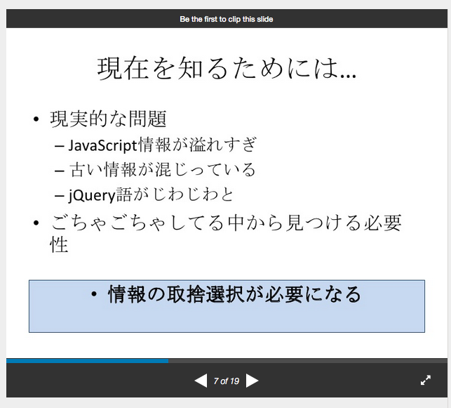
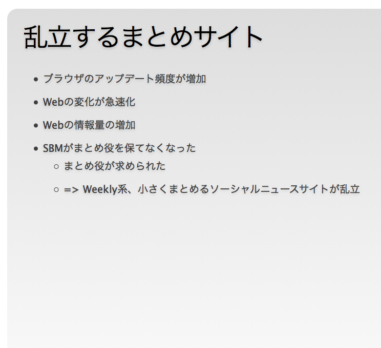
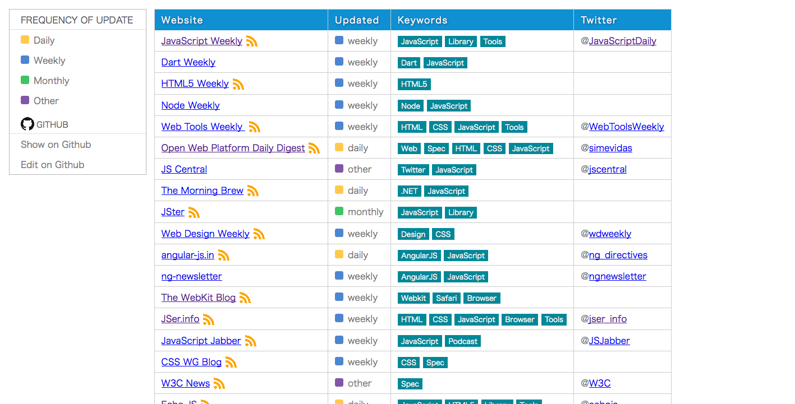
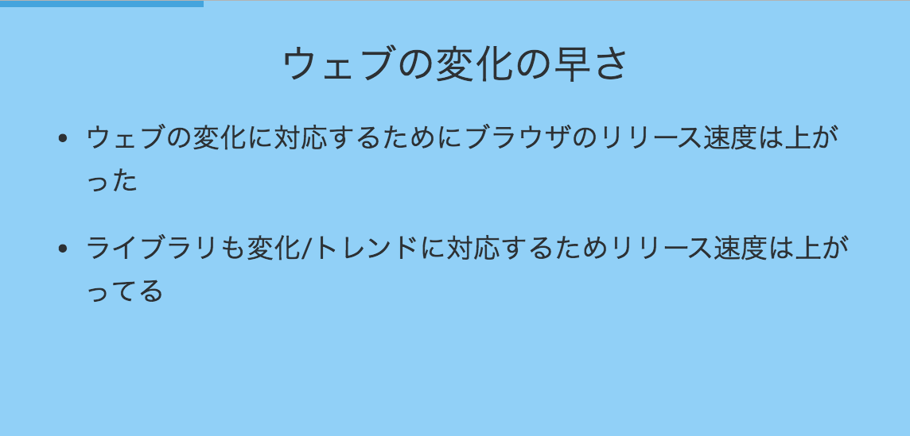
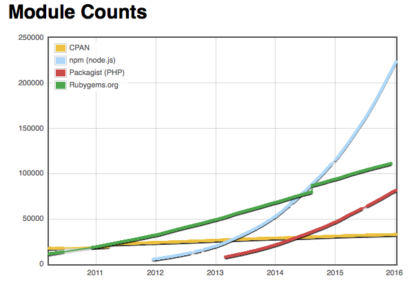
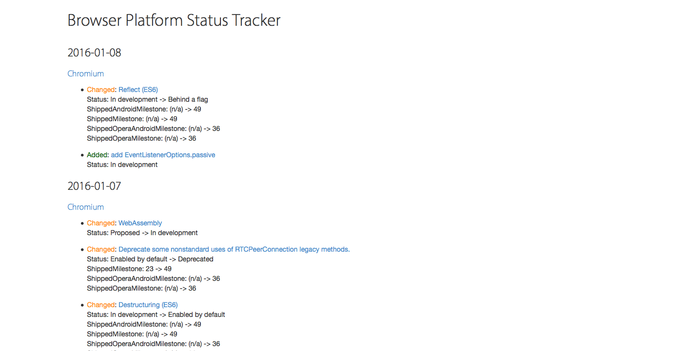
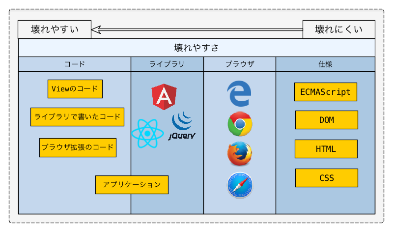
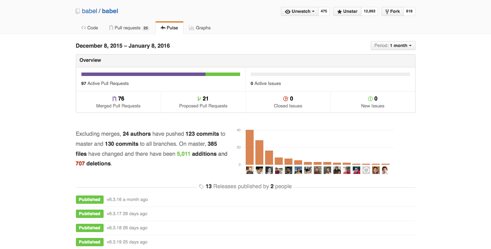
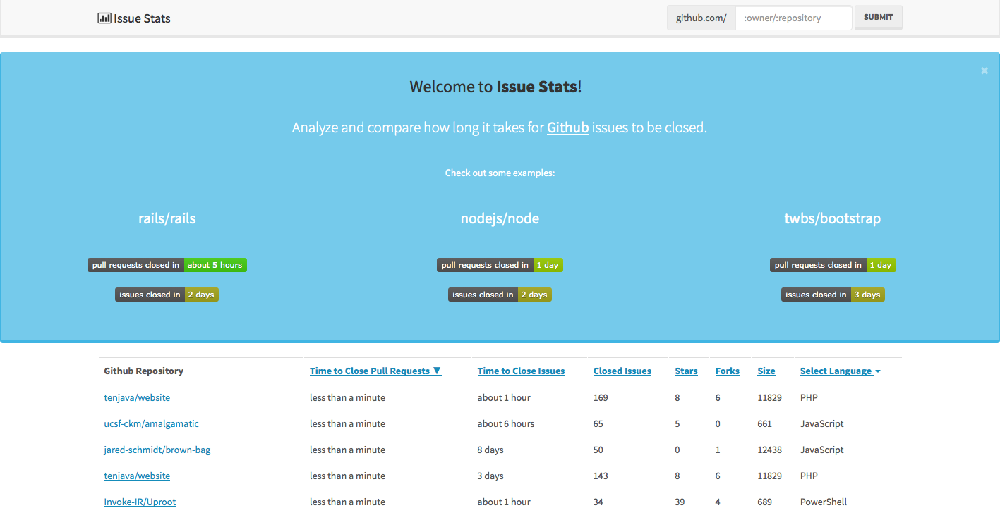
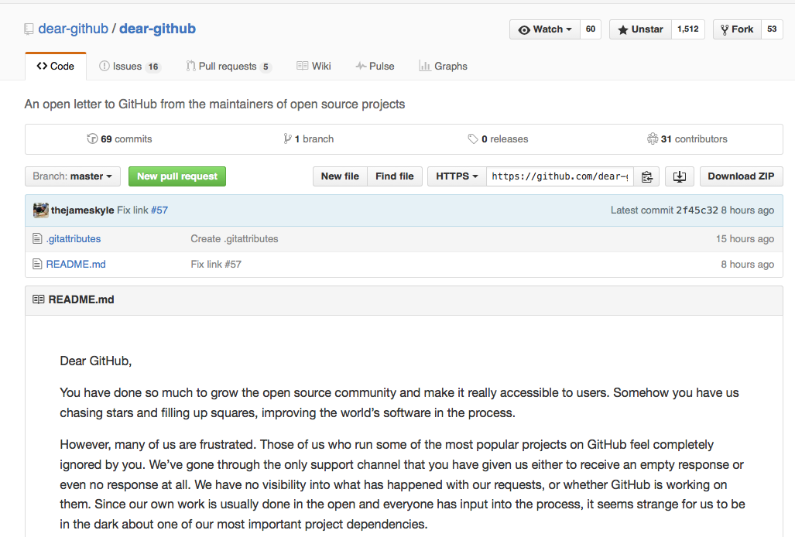

autoscale: true

# JavaScript情報ってなんだっけ?

### [JSer.info 5周年記念イベント](http://jser.connpass.com/event/24202/ "JSer.info 5周年記念イベント")


----

# アジェンダ

- 情報の定義
- JavaScript情報は欲しい、でも溢れてる
- 選択肢が多すぎる問題を切り分けする話
- ライブラリコミュニティの読み方

^ アジェンダとしては以下のような感じになっています。
JavaScriptの場合よっぽどエッジな事じゃない限り、基本的に何らかは検索すると出てくると思います。逆にここで出てくる情報が多すぎてノイズが多いとも言われます。
そういう時に何を基準に情報を分けていくのかという話をします。

----


# 最初に書いておくが答えはない

^ このスライドで何か新しい情報を得られたりはしないと思うので、若干退屈な内容になっていると思います。なので期待せずに聞きましょう

-----

# 「情報」って何?


^「情報」「情報」と連呼しているので、最初にここでの「情報」の定義についてお話します。

----

# 「情報」って何?


> 『知る』ということの実体化。われわれが、あるものについて『知る』ということは、何かしらを得たこと、何かを頭の中に取り込んだことである。その『何かしら』を、われわれは情報と呼ぶのである
> -- [高橋秀俊](https://ja.wikipedia.org/wiki/%E9%AB%98%E6%A9%8B%E7%A7%80%E4%BF%8A "高橋秀俊")

^ via [情報 (Information）](http://www.icit.jp/life-informatics/etc/information.html "情報 (Information）")
情報処理学会の元会長の高橋秀俊による定義です。

-----

# データ != 情報

- データ自体はデータでしかない
	- ただのバイト列のデータ
	- (人間が)データを解釈して情報となる
- 意味あるデータ = 情報
- 同じデータでも人によってそれが**情報**なのか?は異なる

^ データと情報というのは似たような言葉ですが、
ここでの定義としては、意味のあるデータが情報であるということにします。
誰にとって意味があるデータなのかは、やはり人によって違うので、同じデータでも人によってはそれは価値ある情報ではないかもしれません。

-----

# なんで情報が欲しいの?


^そもそも情報が欲しいのは何でかというと

----


# [fit] 何で情報が欲しいの?

- 新しい技術が面白そうだから
- 開発で楽をしたいから
- 話題だから
- **選択肢を持ちたいから** :anchor:

^ 以下のように人によって色々ですが、それを使うため/選択肢として扱えるためにしたいため**情報**が欲しいのだと思います。
本当に人によって違うので、ここではそういう趣旨で話を勧めます。しいのだと思います。


-----

# 情報って既に沢山あるのでは?


^ 能動的に情報を探したりする人は情報が逆に多すぎるのではという感じがしていると重います。
まさにその通り！

-----

# ありすぎて困る


^ データと情報は異なるもの。
なので言い換えるとデータはありすぎる。
その人が意味があると思ったデータ = 情報となります。
しかし、普通に検索すると何個も似たようなものがでてきたりして混乱するケースが多いと思います。そうして、でてきたものはその人が欲しがっているものなので意味がある情報ですが、「こっちがよい」や「あっちがよい」など相反する情報があるのが現状だと思います。
その際に、JavaScriptに慣れている人はなんとなく「どっちがいい」 または 「どっちもよくない」という判断ができるかもしれません。そうした判断はどういう情報でおこなわれているのかというのも今日の論点です。

-----

# 情報の整理が必要

^ 「どっちがいい」 または 「どっちもよくない」という判断をするためには情報の整理が必要になると思います。
何でそういう考えになるのかは、最近のJavaScriptの変化をちょっと見てみます。

-----

# 情報が整理されないと何が問題なってくるのか

## 少し過去を振り返る

-----

# 2011年 

> [世界のJavaScript情報を読もう](http://www.slideshare.net/efcl/javascript-6580879 "世界のJavaScript情報を読もう")

  - 古いものと最近のものが混ざって見つけにくい



^ JSer.infoを始めた年ですが、始めた理由として過去の情報と最近の情報が混ざってしまってるのをどうにかしたいというのが一つの理由でした。
新しい情報が欲しいのに過去の情報ばかりが出てきてしまうという状態がありました。

-----

# 2012年

> [世界のJavaScriptを読もう @ 2012](http://azu.github.io/slide/offline_study/javascript_world.html#slide1 "世界のJavaScriptを読もう @ 2012")

- 古いものと最近のものが混ざってる
- 最近のものを整理するWeekly、ニュースサイトが増えた



^ これは言い換えると世の中にJavaScriptのデータがあふれ始めたので、
それを整理して情報として届けようと言う試みが行われるようになったといえる。
いわゆるWeekly系というのは[JavaScript Weekly](http://javascriptweekly.com/ "JavaScript Weekly")のような週刊のメルマガです。
また[Echo JS](http://www.echojs.com/ "Echo JS")のようなニュースサイトも出てきました。
誰かが整理した情報を配信するので新しい情報に絞って取得出来るようになったといえます。

----

## [Meta Weekly](http://azu.github.io/Meta-Weekly/ "Meta Weekly")



^自分もそういうまとめをまとめようMeta-Weeklyというのを作った。

-----

# 古いものと最近のものが混ざってる

- 自然の摂理
- しょうがない

^ 新陳代謝がちゃんと行われている証拠。
つまりエコシステムが働いているということになると思います。
古い設計のライブラリは廃れて、新しい設計のライブラリが出てくるとかもこういう自然の流れだと思います。

-----

# 2014年

> [世界のJavaScriptを読もう @ 2014](http://azu.github.io/slide/jser200/javascript-2014.html "世界のJavaScriptを読もう @ 2014")

- 急速にライブラリの数が増えてきた
- ユーザーがライブラリの選択で悩むようになってきた
	- 現在に対する選択肢の増加



^ 2010年台からですがブラウザのRapid Releaseが一般的となり、それに伴いウェブ全体の進化が早くなった。
ライブラリなどもそれを追従するようにリリース速度が加速しています。
いわゆる情報も多くなった。価値がある情報とそうでない情報を一見するのが難しくなった。

-----

# [ライブラリの数の推移](http://www.modulecounts.com/)



-----


^ 2014年にはGemを上回り他の言語含めて一番モジュールが多くなりました。
2016年にはGemの二倍ぐらいまで増えていて、加速度的に増えています。

-----


# そもそも何でこんなにライブラリって多いの?


-----


# 色々な要因

- 単純にユーザーが多い
- 標準ライブラリがない
	- Node.jsもコアAPIは少ない
- UIKitのようなUIデザインの元が薄い
- 小さなライブラリを組み合わせて使うのが良いとされてる
- etc...

^ 単純にユーザーが多いというのはありますが、それ以上に標準ライブラリ的なものが少ないことにも要因はあります。
日付操作も`moment`などのライブラリを使わないとdate-formatすら難しいですし、i18nも`Intl`オブジェクトがありますがローカライズの用途を全てカバーできるAPIではありません。そのため[FormatJS](http://formatjs.io/ "FormatJS")のようなECMA i18n APIを使ったライブラリがひつようになるでしょう。
また、XHRとかコレクション操作とかそれぞれの機能に特化した小さなライブラリを組み合わせてアプリケーションを作るのがJavaScriptの世界だと良しとされていると思います。
Angular 2の発表の時に起きた[反発](https://gist.github.com/azu/df63f08e2aa82cb81b5e)で、この傾向はより一層広がった気がします。


----

# Node.js

## 少ないほうが豊かであるという考え方

> Less is more 
> @mikeal -- [Less is more · Issue #18 · nodejs/NG](https://github.com/nodejs/NG/issues/18 "Less is more · Issue #18 · nodejs/NG")

## ウェブの変化が激しいのは決められてないことが多い

> 決定版がないというのは、変化が早いということ
> @yosuke_furukawa -- [The Node.js Future | CodeLunch.fm](http://codelunch.fm/19/ "The Node.js Future | CodeLunch.fm")

^ エコシステムが主役。複雑な機能や便利機能はライブラリでやってもらう


----


# 2015年 - 去年

- 古いものと最近のものがまざってる
- 現在に対する候補が多い
- 未来に関する悩みが増えた :star:
- ブラウザの情報が整理された

^最近起きた新しい情報の混乱というと未来に関することで悩んでいる人が増えたということがあります。
これはJavaScriptの変化が早いというのを認識してる人が増えたことでもあります。

-----

# 未来に関する悩みって?


----

# 未来に関する悩み?


- 不確実な新しすぎるものが増えた
- Transpilerによって未来の仕様が身近になった

例えば、将来

- [ECMAScript Proposal](https://github.com/tc39/ecma262)の機能が全て使えるわけではない
- [cssnext](http://cssnext.io/ "cssnext")にある機能が全て使えるわけではない


^ まだ仕様が安定していないものもTranspilerを使えば、実際に動くコードとして扱えてしまうということが起きてきた。
変化が早いので仕様という安定したもの乗っかると安全だという考えがあるので、無理して**安定してない**仕様に乗っかる人が増えた印象です。

----

# 未来の悩みって今悩まなくてもいいのでは?


----

# 未来と現在の混同

- BabelがES6の仕様だと思ってる人がいる
- AngularJSやReduxのように不確定な仕様を推奨するものがある
- :rocket: 安定した仕様とそうでないものを見分ける必要がある

^ AngularJS2のようにDecoratorを前提とした書き方や、ReduxのチュートリアルにまだECMAScript Proposalでしかない記法が色々出てきているなどもの一旦だと言えます。

-----

# 安定した/してない仕様の見分け方は?


^ 先ほどから出てきている"安定しない仕様"とは何なのかという話をします。

-----

# 仕様の策定プロセスを知るのが近道


^ 安定しているかしていないかを知るには、仕様の策定プロセスを見るのが一番簡単です。

-----

# 仕様 - ECMAScript

- 大きく分類
- **Stable** - ECMAScript 20XX
	- ES6、ES2016... 1年ごとリリース
- **Unstable** - Proposal
	- 仕様のProposal、ドラフト

-----

# 仕様 - Proposal

- ES 2016からは機能毎のProposal
	- [ES.nextと策定プロセス | ECMAScriptとは何か？](http://azu.github.io/slide-what-is-ecmascript/slide/10.html "ES.nextと策定プロセス | ECMAScriptとは何か？")
- Proposalには5段階のStageがある
- Stage 4以外は基本的にUnstableと考える

-----

# 仕様 - Stage

- Stage 0 Strawman - アイデア
- Stage 0.5 :rocket: - Championが付きアイデア
- Stage 1 Proposal - 提案
- Stage 2 Draft - ドラフト
- Stage 3 Candidate- 仕様書と同じ形式
- Stage 4 Finished - 策定完了 => 仕様書へマージ

-----

## Stage 0.5 :rocket:

- ([公式用語](https://tc39.github.io/process-document/)ではない)
- [Stage 0 Proposals](https://github.com/tc39/ecma262/blob/master/stage0.md "Stage 0 Proposals")にはChampionが付いてるかどうかの違いがある
- Champion :rocket: : 仕様を最後まで進めるTC39のメンバー
- 例) BabelはChampion :rocket:ついてないStage 0は実装しない
	- [New plugin for pipeline operator proposal #3159](https://github.com/babel/babel/pull/3159#issuecomment-164370243 "New plugin for pipeline operator proposal #3159")


-----

# 仕様の策定プロセスまとめ

- ECMAScriptはProposalを見れば安定したものなのか分かる
	- [tc39/ecma262](https://github.com/tc39/ecma262 "tc39/ecma262")
- まだProposalなもの = 安定してない
- 仕様に入ったもの = 安定してる
- 仕様はGitHub上で管理されている


-----

# 仕様っていつブラウザでいつ使えるの?


-----

# ステータスページを見ればわかる


^ 先ほど言っていたようにブラウザの情報が整理されてきています。
どういうことかというとブラウザ公式で実装状況についてが特定のフォーマットで公開されてるようになったためです。(機械的に処理しやすい形で公開されています。)

----

# ステータスページ


- [azu/browser-javascript-resource](https://github.com/azu/browser-javascript-resource "azu/browser-javascript-resource")
	- 主要なブラウザ(エンジン)のステータスページが用意された！
- [status.modern.IE](https://status.modern.ie/)
- [Firefox Platform Status](https://platatus.herokuapp.com/ "Firefox Platform Status")
- [Chromium Dashboard](https://www.chromestatus.com/features "Chromium Dashboard")
- [WebKit Web Platform Status](http://www.webkit.org/status.html "WebKit Web Platform Status")

^ ステータスページには各ブラウザ(エンジン)別の実装状況や関連するIssueへのリンクが貼られています。大体のものはココ見れば解決すると思います。

----

# [Browser Platform Status Tracker](http://platformstatustracker.azurewebsites.net/ "Browser Platform Status Tracker")



^ [mayuki](https://github.com/mayuki "mayuki")さんによるプラットフォームステータスのDiffを見られるサイト。

----

# 話を戻して :back:


----

# (ライブラリ)選択肢が多いことはいいことなのでは?


----

# 基本はいいこと

- 選択肢が多い != 選択肢を持てる
- 状況に応じて選択できないと意味ない


^基本はいいことですが、情報と思われるものが多すぎて選択しにくくなってる。
背景にはウェブの変化加速しているため、陳腐化してしまうという恐怖心もある。

----

# ライブラリはどうやって選択するの?


------

# 必要なのは整理された情報


------



------

# ライブラリ/ツールの選択は難しい

- ライブラリの種類による
	- JavaScriptが扱えることが増えた分色々なコミュニティがある
	- 例えばフロントエンド、音声、サーバ、自然言語系(NLP) etc..
- 仕様のようにプロセスが一意ではない
- ライブラリごとのコミュニティがある

------

# [fit] そのライブラリ安定してる?


------

## ライブラリのバージョン種類

- ライブラリのバージョニングは基本Semver(例外あり)
- Suffixが付いてるのはUnstableなバージョン
	- β
	- α
	- RC
- 何もついてない(Stable)

^ sentimental versioningを採用してるライブラリもあります。

-----

### ライブラリのリリースバージョン

ライブラリバージョンの安定度かけ算(嘘)

> α * 0.1 + β * 0.3 + RC * Math.random() + (Version - 1)

```js
var α = 0;
var β = 0;
var RC = 1;
var Version = 1;
α * 0.1 + β * 0.3 + RC * Math.random() + (Version - 1)
```

^ RCがなぜ`Math.random()`なのかというと、Ember RC8、deku rc12のようにRCの数はあんまりあてにならないというジョークです。


------


# ライブラリ/ツールの選択は難しい

- 自分なりの基準を設けて、複数の情報を組み合わせて使う
- 少なくても死にそうなものは避けたい :skull:
- 後は状況に応じて選べるようにしよう

-----

# ライブラリの生死ってどうやって見るの?


------

# PULSE :heartpulse:


------


# ライブラリのPluse

- ライブラリがアクティブにメンテナンスされているか?
- 小さなライブラリはAPIがフリーズしてることがあるので例外
	- 小さなライブラリとは自分で書き直せるなという規模
- 大きなライブラリ/フレームワークはアクティブなのかは重要
	- 特にエコシステムを持つものは重要 :recycle:

^ JavaScriptのエコシステムは小さなライブラリはそれ以上やることがなくなるとアクティブには見えなくなるという問題があります。
なのでここでは例外としています。
逆にコードベース的に大きなライブラリ、色々なものから依存されてるようなライブラリがアクティブ化どうかは重要です。

------


# [GitHub Pulse](https://help.github.com/articles/about-pulse/ "Pulse")




^GitHub公式の1日/3日/1周間/1ヶ月でのオーバービュー

-----

# [Issue Stats](http://issuestats.com/ "Issue Stats")



^ リポジトリのIssueやPRが平均どれくらいで処理されているかを見られるサービス。

------
# Contributor(s) :warning:

------

# Contributor(s) :warning:


- 現在がアクティブでもContributorが1人(本人のみ)というケース
- コミットが止まる => プロジェクトが止まる
- 単一障害点(SPOF)

^ 例としては[vue.js](http://vuejs.org/ "vue.js")はこれになりますが、コミットが止まったらプロジェクトが終了するかはコミュニティ次第と言えます。

-----

#  単一障害点(SPOF)

- SPOFに対してどういう対策をしているかというのも一つの基準
- これに対する答えはアクティブなコントリビューターを増やす
- それのためにどういう工夫をしているかを見る

------

# FILE

- `LICENSE.md`
- `CONTRIBUTING.md`
	- ガイドラインがあるか
- `CODE_OF_CONDUCT.md`
	- 行動規範、ポリティカル・コレクトネス問題
- ORGANIZATION
	- リリースを出来る人が複数いるかどうか

^ コントリビュートしやすくしてるかというをぱっと見る方法として関連ファイルを見るという方法があります。
CONTRIBUTING.mdなどガイドラインがちゃんと書かれているかなど。
[Ruby - Contributor Code of Conductのメモ - Qiita](http://qiita.com/azu/items/1bc6dff4fa349f58855f "Ruby - Contributor Code of Conductのメモ - Qiita")
Triage Issueをしてコントリビュートしやすくしているかとか、
ORGANIZATIONの問題はパッケージ管理(npm)側にも問題があるので、まだまだ。


-----

# コミュニティの問題

- [Babel](https://babeljs.io/ "Babel")
	- [~2015 in review — Medium](https://medium.com/@sebmck/2015-in-review-51ac7035e272 "~2015 in review — Medium")
- [C3.js](https://github.com/masayuki0812/c3 "C3.js")
	- [Create an organisation? · Issue #1440 · masayuki0812/c3](https://github.com/masayuki0812/c3/issues/1440 "Create an organisation? · Issue #1440 · masayuki0812/c3")
- そのプロジェクトがContributeしやすくできてるかが大事


^ Babelは最近sebmckのコミットはかなり少なくなったけど、ちゃんと他のアクティブなコントリビューターが活動してる。それでも普通のプロジェクトよりかなり早い。
C3はメインのコミッターがいなくなってて、もう一人の管理権限持ってる人が管理できないスピードでIssueができてる。
C3にはプラグインのような仕組みがないため、コアに対して要望のIssueができてしまい捌けなくなってしまうため、そういうの解消するためにプラグインシステムは必要という話をしていた。

------

# プラグインアーキテクチャ

- ライブラリコアに全ての機能を持たせると、要望が全てIssueになる
	- Issueの処理ばかりになって開発に支障がでることがある
- 回避するためにプラグインアーキテクチャを持たせて分散
- [azu/JavaScript-Plugin-Architecture](https://github.com/azu/JavaScript-Plugin-Architecture "azu/JavaScript-Plugin-Architecture")

------

# [dear-github](https://github.com/dear-github/dear-github "dear-github")

>  An open letter to GitHub from the maintainers of open source projects



^ GitHub Issueへのフラストレーションについてのオープンレーター。
+1のコメントが邪魔、バージョン情報の入力項目(Babelはそういう問題があって[Phabricator](https://phabricator.babeljs.io/ "Phabricator")に移動した)とか、CONTRIBUTING.mdがただのリンクなので読まれない問題など

------

# じゃあ結局どうやって選択すればいいの?


^ ライブラリはコミュニティの問題も関係あるので一つ見て判断はしにくいと思います。
じゃあ実際どうやればいいのかというと

------

# 一つの情報でダメなら複数の情報で


^ 先ほども言ったように、一つの情報だけで判断しないで複数の情報から判断するのがいいと思います。
そのライブラリの設計はどうなのか、アクティブに活動してるのか、アクティブなコントリビューターがいるのか、ライセンスやコントリビュートのガイドラインとかを整備してるのか、バージョニングの付け方おかしくないのかなど色々な要素があります。
逆にそういった足りてないならそこについて貢献していくなどの方法も取ることができると思います。

----

# 結局、詳しい人に聞けばいいのでは?


^ 話をしていて面倒くさいと思ったと思います！
なので詳しい人に「これどう?」って聞いたほうが楽な気がします。

-----

# 正解

## 誰が何に興味を持っているかはそういう意味でも大事


^ まさに詳しい人に聞くというのは整理された情報が手に入りやすいので確実です。
しかし、JavaScriptは幅広いので、その詳しい人が誰なのか、誰が何について興味を持っているのかということを知っているとその辺がスムーズに動けると思います。


----

# 選択できても1年後には変わるんでしょ?


^ そうやって色々調べて結局1年後に変わってるんでしょ?という疑問があると思います。

-----

# はい

## 一度選んで終わりではない！


^ はい！

----

# [fit] JavaScriptのエコシステムへようこそ！

## :recycle::recycle::recycle:

^ この流れの速さがJavaScriptのエコシステムでもあるので、これを楽しめるようにしましょう！


----

# まとめ

- データが多いと選択は難しくなる
- 情報にも種類があるのでちゃんと区別を付ける
	- StableとUnstableからはじめてみる
- ライブラリの選択は難しい
	- コミュニティの問題も関連する
- 一つの情報ではなく複数の情報から判断しよう

-----

# 終わり
