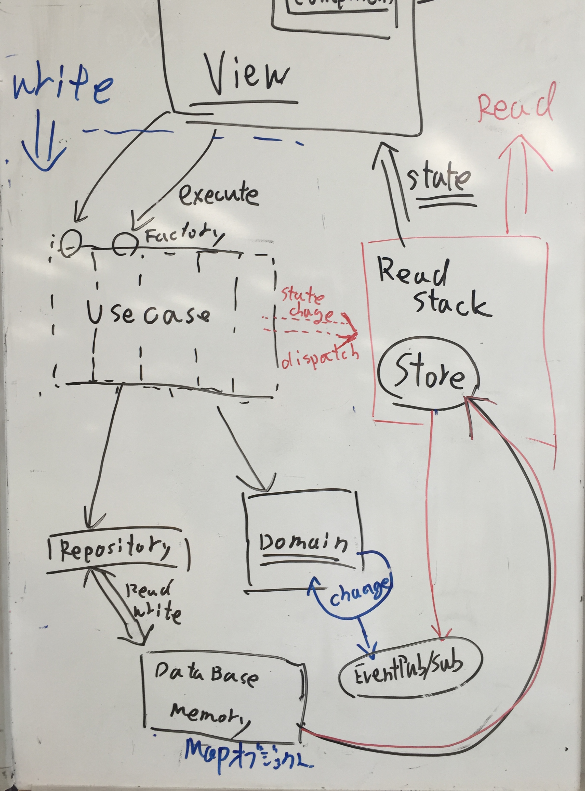

# JavaScriptのアーキテクチャ

----

## 概要

- DDD + CQRSベースなレイヤードアーキテクチャ
- イベントソーシングはやってない
- DTO(データ変換オブジェクト)はまだ入れてない
	- なのでDomainのインスタンスがViewにそのまま渡す(Read Only)
- テストが可能

----

----

## 実装

- [azu/presentation-annotator: viewing presentation and annotate.](https://github.com/azu/presentation-annotator "azu/presentation-annotator: viewing presentation and annotate.")

----

## 登場人

- View(React Component)
- Write Stack
	- UseCase
	- Repository
	- Domain
- Read Stack
	- Store
- DataBase(Memory)

-----

## View

- React Component
- CSS Architecture(別途)

-----

## Write Stack

- ViewからUseCaseを発行(Actionと類似)
- UseCaseと1対1のFactoryを持ってる
	- テストのためというのがメインだが薄いレイヤーがViewとUseCaseの間に欲しかった
	- FactoryがRepositoryのインスタンスをUseCaseに渡す(依存関係逆転の原則)

-----

## Write Stack

- UseCase
	- Repositoryから永続化されたDomainを取り出す
	- Domainモデルを使って操作する
	- Domainモデルを作ってRepositoryに保存する
- Domain
	- Domainモデル(EntityとValueObject)
	- ビジネスロジックのコア部分(UseCaseはこれを使う役)

-----

## Read Stack :arrow_right:

- Read Modelからなる層
	- 読み込み + 変換がメイン
	- 読み込みのみなので、インフラでありドメインでありアプリである
- Database
	- Write Stackで保存されているデータがある
	- Read Stackから取り出す

-----

## Read Stack :arrow_right:

- DataBaseから読み込んだデータをUIに向けて変換する
	- State, ViewModelに近い概念
- UIは必要になったらRead Stackからデータを取得する
	- 取得したデータを使ってUIを構築する

-----

## READ AND WRITE :left_right_arrow:

- WriteとReadの協調はどうやるの?
- Event Aggregator
	- シングルトンなEventEmitter
	- 差し替え可能なのでテスト可能に

-----

## 参考

- CQRS + ES
	- [CQRS+ESをAkka Persistenceを使って実装してみる。](http://www.slideshare.net/MatsushitaSatoshi/cqrsesakka-persistence)
	- [最新DDDアーキテクチャとAkkaでの実装ヒントについて // Speaker Deck](https://speakerdeck.com/j5ik2o/zui-xin-dddakitekutiyatoakkadefalseshi-zhuang-hintonituite)
- DDD クリーンアーキテクチャ
	- [DDD + Clean Architecture + UCDOM Essence版 // Speaker Deck](https://speakerdeck.com/yoskhdia/ddd-plus-clean-architecture-plus-ucdom-essenceban)
	- [Scalaで学ぶヘキサゴナルアーキテクチャ実践入門 // Speaker Deck](https://speakerdeck.com/kimutyam/scaladexue-buhekisagonaruakitekutiyashi-jian-ru-men)
- [レイヤー設計とか、オブジェクト指向とか、DDDとか、その辺 - まっつんの日記](http://mattun.hatenablog.com/entry/2014/07/19/135320)

----
## 参考 

- [[ Android ] – これからの「設計」の話をしよう – NET BIZ DIV. TECH BLOG](https://tech.recruit-mp.co.jp/mobile/android-architecture/)
- [CQRSの小さな演習(1) 現実の問題 - 考える場所](http://blog.fukuchiharuki.me/entry/2016/02/20/173233)

----

## 参考 MVVM

- [MVVMパターンとは？](http://www.slideboom.com/presentations/381148)
- [塹壕よりLivetとMVVM](http://www.slideshare.net/Posaune/livetmvvm)
- [MVVMのModelにまつわる誤解 - the sea of fertility](http://ugaya40.hateblo.jp/entry/model-mistake)
- [MVVMパターンの常識 ― 「M」「V」「VM」の役割とは？ － ＠IT](http://www.atmarkit.co.jp/fdotnet/chushin/greatblogentry_02/greatblogentry_02_01.html)
- [開発者が知っておくべき、6つのUIアーキテクチャ・パターン － ＠IT](http://www.atmarkit.co.jp/fdotnet/chushin/greatblogentry_10/greatblogentry_10_01.html)
