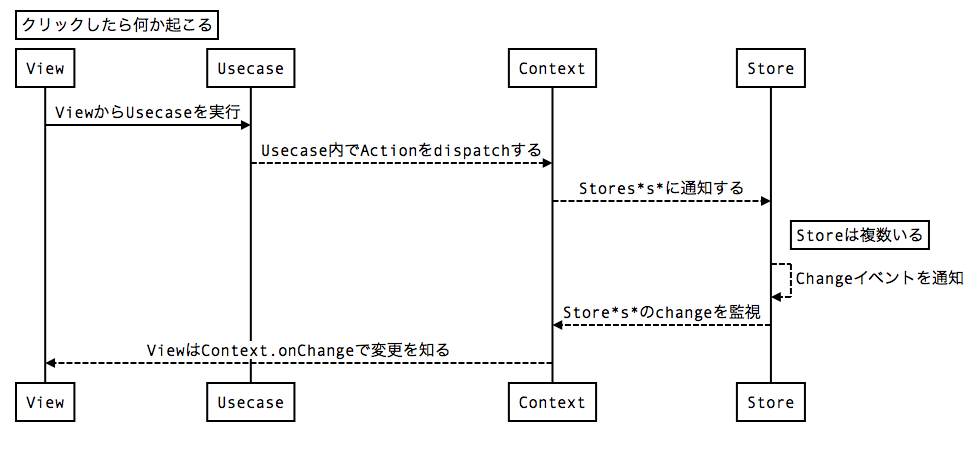
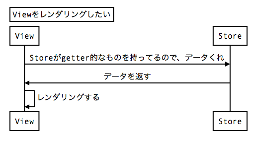
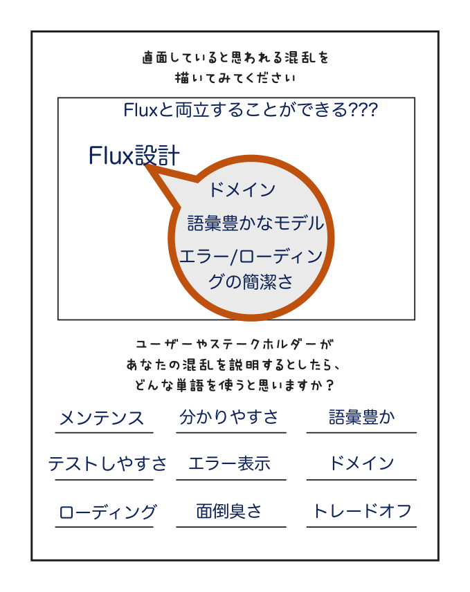
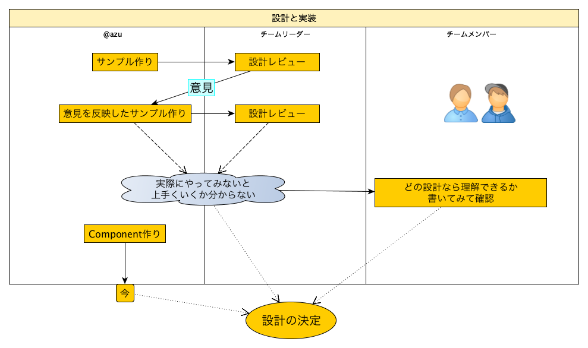
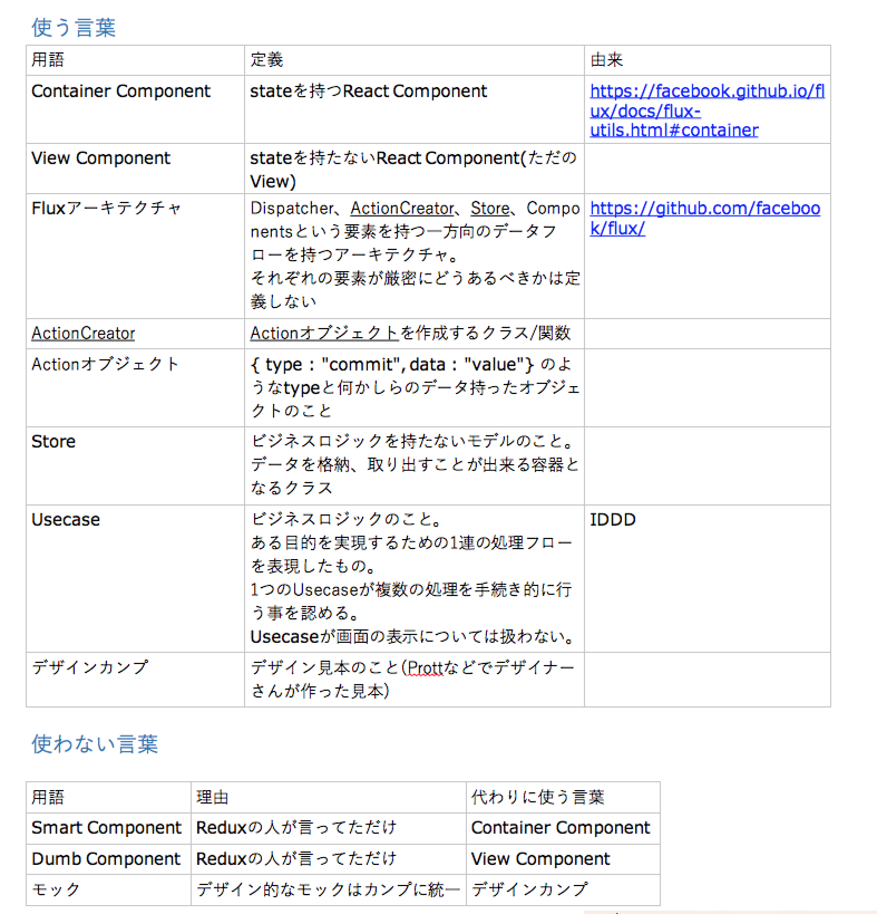

autoscale: true

# How to work as a Team

----

# 自己紹介


- Name : **azu**
- Twitter : @[azu_re](https://twitter.com/azu_re)
- Website: [Web scratch], [JSer.info]

[Web scratch]: http://efcl.info/ "Web scratch"
[JSer.info]: http://jser.info/ "JSer.info"

----

# 目的

- 新規でそこそこ複雑なウェブページを作る(アプリに近い)
- ある程度柔軟に拡張でき、メンテできるような設計にしたい
- 無難にReact + 何かでちゃんと設計して作っていきたい
- この設計部分をどう決めていくのかという話

----

# 現状

- チームにReact/Flux/Reduxを触ったことがない人が多い
- どれが(主にView以外の設計)ベストかは分からない
	- Flux的な部分の話

----

# ものごとは変わる。<br>混乱は変わらない

----

# 混乱の原因

- 情報過多
- 情報不足
- 適切でない情報
- 上記の組み合わせ！

via P21 [今日からはじめる情報設計](http://www.amazon.co.jp/dp/4802510012/ "今日からはじめる情報設計")

-----

# 情報の共有

- 情報不足 
	- そもそもReactなどを知らない人には知ってもらう必要がある
- Flux 何がいいのか分からない問題
	- :triangular_flag_on_post:  既存の実装でサンプルを作って見てもらう
	- どれがしっくりくるのかを聞く


----

## サンプルづくり

- サンプルのテーマ決め
	- 新しく作るページに必要な要素を簡単に盛り込む
	- タイトル、画像の切り替え、アニメーション、非同期でデータを読み込むなど
- テーマを決めらたら作る


-----


## サンプルづくり


- Flux Util
- Redux
- Fluxible
- material-flux
	- でそれぞれ作った
- View(React)は全て同じものを参照して、Viewと他はちゃんと分離出来ることも証明してみせた

----

# 作ったサンプルをみてもらう

- :thought_balloon: Action/ActionCreatorが謎い
	- ある処理をするので、`execute`を持つUsecaseクラスとしてみると親しみが湧く
- :thought_balloon: Storeって何? モデルではない?
	- モデルというよりはStateの入れ物に近い
	- Stateとわかるような名前にしてみるとか

----

## :triangular_flag_on_post: 意見を聞いて実装してみる


-----

## Usecase

- `execute`を持っているexecutableクラスっぽい

```js
class UseCase {
    // executeは暗黙的に呼ばれる
    execute(context){
        // dispatch
        context.dispatch(key, value);
    }
}
```

-----

## Usecaseの実行

```js
const stateStore = new StateStore();
const dispatcher = new Dispatcher();
// dispatcherとstoresを紐つけるContext
const appContext = new AppContext({
    dispatcher,
    stores: [stateStore]
});
// Usecaseの実行
context.execute(new UseCase({ data }));
```


- [API: Actions | Fluxible](http://fluxible.io/api/actions.html "API: Actions | Fluxible") と近い

-----




-----




-----

## また見てもらう

- まあまあ良さそう
- でもStoreはホントにただの入れ物っぽい
- Usecaseにロジックが集中しそう
- ドメインとかレイヤーをちゃんと考えるの課題
- ちゃんとこれでアプリの動くのかが不安
- [My thought about beyond flux](http://www.slideshare.net/saneyuki/my-thoughy-about-beyond-flux "My thought about beyond flux")

-----

# [fit] 現状の課題/混乱をまとめる

-----




----

# 行うことは知ること

>「知っている」だけでは十分ではありません。「多くを知りすぎている」ことでも、私たちはぐずぐずと手間取ることもありえます。 
> 実際に行うことよりも、知り続ける事を優先すると、ある時点から混乱がましてきます。

via P32 [今日からはじめる情報設計](http://www.amazon.co.jp/dp/4802510012/ "今日からはじめる情報設計")

----

# 手を動かさないと進まない

- ずっと頭で考えてても設計はうまくいかない
- 実際に作る/メンテするのはTeamなので全員が書かないと意味ない
- サンプルは作ってあるので、Teamの人にも自分なりに書いてもらう

----

## Teamの人にも書いてもらう間に

- ReactはComponent志向
- Componentとデータフローの設計は並行できる
- :triangular_flag_on_post:  Componentの開発を進めておく

-----





-----

# 作り始めて考える事

- 使う言葉
- 使わない言葉
- 要件(名詞 + 動詞)

-----



-----

# [fit] たたかいははじまったばかりだ