autoscale: true
theme: Plain Jane,5

# JSer.infoの作り方

----

# 去年のまとめ


- [JavaScript情報ってなんだっけ?](https://azu.github.io/slide/2016/jser5years/javascript-information.html "JavaScript情報ってなんだっけ?")
- 未来に関する悩みが増えた
- 情報の安定性を見る方法について
- コミュニティの問題が表面化
- 1つだけではなく複数の情報から判断しよう


----

# はじめに

- このスライドには再現性がありません
  - JSer.info 特有の考え方が多く含まれます
- 技術的な内容ではありません
- 各自、適当に見てね

----

# アジェンダ

- JSer.infoの作り方
- 記事公開までのワークフロー
- 継続的にやるために考えること

----

# テーマ

- 何か作る上で次のようなワークフローを辿る
  - 見る(Watch)
  - 調べる(Search)
  - 学ぶ(Learn)
  - 考える(Think)
  - 作る(Create)
  - 共有(Share)

----

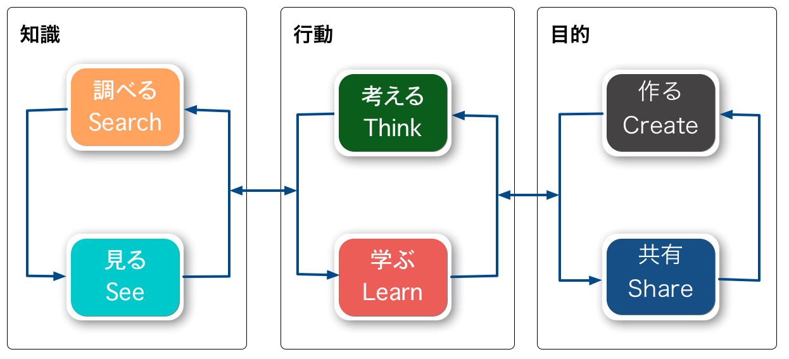

----

# 目的

- **知識**を元に**行動**することで**目的**を達成する
- 大体のものごとは同じようなフローを辿る
- JSer.infoにおける、このフローの詳細を見ていく話

----

# JSer.infoの場合

-----

## JSer.infoの目的

> なぜこのようなサイトを始めたのかというと、現在のインターネットは
> JavaScriptの情報が溢れていて自分の周りだけの情報で全てだと錯覚してしまうほど情報量だと思います。
> ...ある程度の内容に絞った情報を提供する場所が必要ではないかと考えました。
> 幸いにも私は情報を集めることが好きなので、そのような人間が少し整理した情報を提供することでより良い流れが作れるのではないかと思っています。
> 改めて、このサイトは言語問わないJavaScriptの情報を紹介するサイトです。しかし、真の目的はJavaScriptの情報を”紹介”ではなく”知ってもらう”事にあるため、継続的な活動が必要となるでしょう。
> -- [https://jser.info/about/](https://jser.info/about/)

^ 要約
- 情報が溢れてる
- 整理して発信しよう
- 真の目的はJavaScriptの情報を”紹介”ではなく”知ってもらう”事にあるため、継続的な活動が必要となる

---

# JSer.infoのゴール

- JSer.infoのゴール = 方向
- 「JavaScriptに興味がある人にもっとJSを知ってもらう」
- 「JavaScriptの情報を整理して伝える」
- 「JavaScriptの現状を正確に伝える」
- 「更新コストを小さくして、継続できる形を作る」

----

# JSer.infoのワークフロー

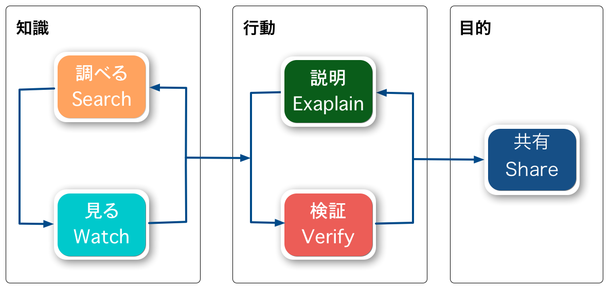

----

# JSer.infoのワークフロー


- 1つ1つの記事ごとに次のワークフローを通す
	1. 見る
	1. 調べる(省略可能)
	1. 検証(省略可能)
	1. 説明
	1. 共有


----

## 目的を満たすために

- JavaScriptの情報を整理して正確に伝えるために
- 誇張や誤った情報は避ける必要がある(Verify)
- また伝えるには言葉(文字)を使うので、嘘をつかないように説明する必要がある(Explain)
  - 人にとって「良い」という言葉の解釈が異なるので難しい
  - この問題に対してどのようなアプローチをとっているかについて

----

# 具体的にどう行動するか

## まずは情報がないと始まらない

----

# 見る(Watch)、調べる(Search)

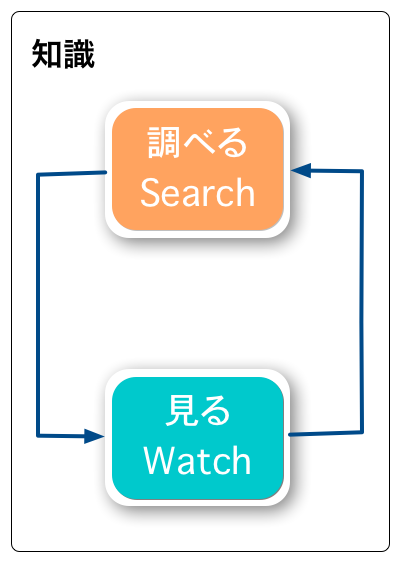

- どのプログラミング言語でも大体同じやり方が通じる
- どちらも"情報収集"
- 調べるは能動的、見るは受動的な情報収集
- [情報化社会を この先生きのこるためには / Layzie@Frontrend in Kanazawa // Speaker Deck](https://speakerdeck.com/layzie/layzie-at-frontrend-in-kanazawa "情報化社会を この先生きのこるためには / Layzie@Frontrend in Kanazawa // Speaker Deck")

^ 基本的に調べるは検索するので能動的な行動です。
見るが受動的なのは、どこかにアンテナを貼って受動的に集める行為であるからです。
見るためには調べるアンテナを貼る必要があるので、基本的に片方だけというのは実は難しいのかも。

----

# 見る(Watch)

- JSer.infoでは、とにかく情報を見る/気づくことが重要
- 気づくために色々なアンテナを貼る
- 「見る」で重要なのは、自分が見る所に集約すること
  - 見ない所に集めても結局見ない
  - 情報不足、情報過多は混乱を生む = 自分に合うバランスが必要
- @azu がもっと見るのはRSSリーダーとTwitter

----

## GitHubを見る

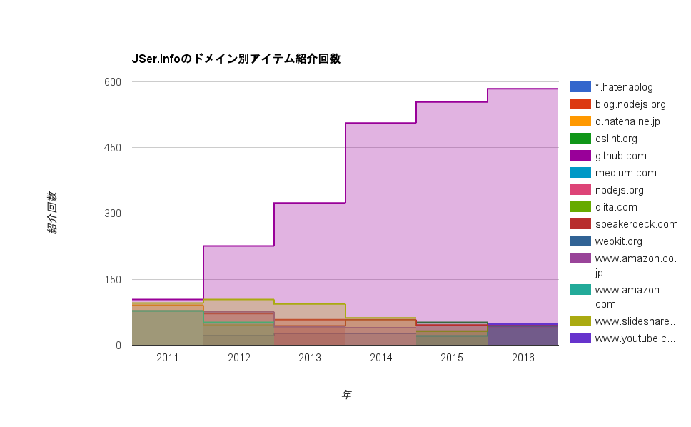

- GitHubは開発の基盤なので重要
- JSer.infoでも紹介数は年々増えている
- 新しいライブラリ、ドキュメント、リリース情報など
- Issue/Pull Request
- ECMAScriptの仕様策定の議論など

^ GitHubは紹介数をみても飛び抜けている = 重要

-----

## GitHubを見る

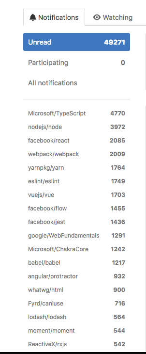

- しかし、GitHubのタイムライン(通知)は破綻してる
- そのため色々なツールやアプリなどを書いたり
- [GitHubでライブラリのリリースを見ていくためのツールや方法 | Web Scratch](http://efcl.info/2014/07/30/find-github-release/)
- [Githubのタイムラインや通知を見るアプリをnode-webkitで作った | Web Scratch](http://efcl.info/2014/0430/res3872/)

----

## GitHub

- リポジトリをWatch :watch:
  - アクティブに興味があるリポジトリをWatch
- リポジトリをStar :star:
  - 特に意味なくStarする
  - [starWatchker](https://starWatchker.so/ "starWatchker")で補足
- リポジトリのリリースをRSSで購読
  - Feedlyに溜め込む => IFTTT -> Twitterへ投げる

-----

## GitHubをTwitterで見る


- [AWS lambdaでGitHubのアクティビティをTwitterで読む用に投稿する | Web Scratch](http://efcl.info/2016/06/09/github-to-twitter-lambda/ "AWS lambdaでGitHubのアクティビティをTwitterで読む用に投稿する | Web Scratch")
- BotでGitHubの[Notification](https://github.com/notifications)(Watch)、[アクティビティ](https://github.com/)を流す
- 結果、Twitterで次の情報が見れる
  - Watch/アクティビティ(フォロワーが何をStarしたとか)/リポジトリのリリース情報

----

## 見逃したくない情報は何重にも出す :warning:

- RSSリーダーでキャッチする
- リポジトリのリリース情報はRSSにもTwitterにも流す
- あとで読むはPocketに入れる
  - [Pocket Expose](https://expocket.herokuapp.com/ "Pocket Expose")でPocketの中身がRSSで流れる
- それでもタブに溜め込みがち
  - [jser/ping](https://github.com/jser/ping "jser/ping")へ投げる
  - 該当のIssueはメールとRSSリーダーに通知される(流れにくい)

----

## RSSリーダー

- [LDR](http://reader.livedoor.com/reader/)を使ってる
- 現在の購読フィード数は 3212
- 購読するフィードは気にせず追加する
- 更新されなくなるフィードも多いため、結果的に帳尻は合う

----

# 「知る」まとめ

- 人によってやり方は様々
  - 自分が最も見る所に集約するのが簡単
- 情報は少なくても、多くても混乱する
  - 自分のニーズにあったやり方を作ることが大事
- 情報の意味については[JavaScript情報ってなんだっけ?](https://azu.github.io/slide/2016/jser5years/javascript-information.html "JavaScript情報ってなんだっけ?")を参照
- JSer.infoの目的の一つは多すぎる情報を整理することにある

----

# 調べる(Search)

-----

# 調べる(Search)

- 調べるは能動的な行動
- とりあえずググる
- とりあえずGitHub検索する
- とりあえずTwitter検索する
- とりあえず専門サイトを探す

----

## Google検索


- 英語、英単語で検索
- 日付を絞って検索
- URLを検索
- [Fix Google Search Options](https://greasyfork.org/ja/scripts/9230-fix-google-search-options "Fix Google Search Options")
- [情報化社会を この先生きのこるためには / Layzie@Frontrend in Kanazawa // Speaker Deck](https://speakerdeck.com/layzie/layzie-at-frontrend-in-kanazawa "情報化社会を この先生きのこるためには / Layzie@Frontrend in Kanazawa // Speaker Deck")


^ まあ普通に新しい情報は英語圏の方が多いので適当な英単語でググる方がヒットしやすい。
また、新しい情報は日付でフィルターするとノイズが少なく探しすい。
同じ理由でTwitterを良く検索する。
URLで検索は関連を検索する手法なのであとで。

----

## GitHub検索

- GitHubの検索オプションは充実
- 検索方法も充実
  - リポジトリ/コミット/ソースコード/Issue/PR
- [githubのissue, pull request 検索オプションをハックしてチートシート作った](https://engineer.blog.lancers.jp/2016/12/github_search_query_hack/ "githubのissue, pull request 検索オプションをハックしてチートシート作った")

----

## 関連を検索する

- URLで検索するというのは結構大事
  - 関連する/参照している情報にたどり着きやすい
- あるもの見つけて利用している「単語」を見つけてもう一度検索
  - 検索できる語彙をふやせる

----

## 例) テキストから感情を検出したい

1. テキストがポジティブ or ネガティブかを判定したい
2. `感情 判定` で検索
	- [単語感情極性対応表](http://www.lr.pi.titech.ac.jp/~takamura/pndic_ja.html "単語感情極性対応表")の辞書の存在を知る
3. URLでググる
  - [類似研究](http://www.cl.ecei.tohoku.ac.jp/index.php?Open%20Resources%2FJapanese%20Sentiment%20Polarity%20Dictionary)を見つける
- `感情極性` というキーワードがあるらしい
- ちょっと辞書が古そう(2005年 ~ 2008年)
- Word2Vecとか関係あるのでは(既存の知識から)
	- [最近の研究](http://repo.lib.hosei.ac.jp/bitstream/10114/12427/1/14R4103%E5%B8%82%E5%B7%9D%E7%A5%90%E5%A4%AA.pd)でも同様の辞書が採用されてた。現役っぽいことがわかった

----

## 相対は関連を検索して知る

- 見つけたものが古いものなのか(もっと新しいものがあるか)を知りたい場合
- "<見つけたもの> compare related alternative migrate move to insteadof"とかで検索する
- GitHubで検索するのが簡単な方法([コミットメッセージも検索](https://github.com/blog/2299-search-commit-messages)できる)
- 作る側も古いものを参照(リンク)していることは多い
- なぜなら
  - 古いものとくらべて作ったものがどう違うのかをREADMEに書いている
  - 比較を書くことで、作ったものにどういうメリットがあるかを明示したいから

----

# 専門の検索エンジンを知ると便利

- 単純な発見はGitHubとかGoogleで十分
- 比較やメタ情報を扱う場合は専門のサイトが強い
  - [Libraries.io](https://github.com/librariesio)
  - [npm trends](http://www.npmtrends.com/)
- どうやって専門のサイトを見つけるか?
  - GitHubで[awesome](https://github.com/sindresorhus/awesome "awesome") listから見つける
  - 昔ながらのディレクトリ検索 や 人に聞くのが有効な手段

----

# 知る -> 行動

^ いくら知識と知っていても行動しなれば意味がありません。

----

# :memo: 人は知りすぎていると動けなくなる

> 実際に行うことよりも、知り続けることを優先すると、ある時点から混乱が増してきます。
> -- [今日からはじめる情報設計](https://www.amazon.co.jp/dp/4802510012/ "今日からはじめる情報設計")

- 「知り続ける」だけだと、次の行動に手間を取るようになってしまう
  - 行動(変化)は今の知識を過去に追いやる行為であるため
- 類語: 選択肢が多すぎると、結局何も選べない [^p88]
- Input/Outputのバランス大事

^ 「なぜ」「なにを」「どうやって」は相互に関係しています。
そのため、「どうやって」である選択肢だけを知っていても、それは行動に移しにくいものとなっています。
その前に、なぜ -> なにを 考える必要があります。
あまりにも選択肢が多く進めなくなるときは、方向を決めて小さく進めることが大事
関連: [プログラミング言語標準化のパターン](https://gist.github.com/azu/47082cbcaf7cc7b2b2f2075afad1b025 "プログラミング言語標準化のパターン")


[^p88]: [今日からはじめる情報設計](https://www.amazon.co.jp/dp/4802510012/ "今日からはじめる情報設計") p88

----

# 行動


^ JSer.infoにおける行動として、検証とその説明をすることがメインとなっています。

-----

# 検証する(Verify)

- 「正しく」説明するには「検証」する必要がある
  - 紹介するものに誇張表現が含まれているかもしれない
- なぜ高速なのか、どういう仕組みなのか、どのような議論が行われたのかなど


-----


> The Mechanism is not the Mental Model
> -- [Dave Herman]


^ 直感と仕組みは必ずしも一致しない

-----


# なぜ検証する必要があるのか

- 必ずしも直感は正しくない
	- 未知の分野、規模が大きい場合など、直感は間違っていることがある
- 作者による説明(主張)が正しいとは限らない
- 例) 「jQuery-compatible API」と書かれている
  - 検証するとjQueryと同じような機能を持っているだけだった
  - 正しくは「jQuery-like API」

-----

# どうやって検証するのか

- ソースコードやIssueを読む
  - テストやサンプルコードを読む/動かす
- 実際に動かしてみると分かることもある
	  - [JavaScriptのトレンドを素振りして確認する方法 - Qiita](http://qiita.com/azu/items/bacd146ed2e26980b9b0 "JavaScriptのトレンドを素振りして確認する方法 - Qiita")
- パフォーマンス系は数値のマジックが多いので、必ずチェック
	  - 検証すると多くはエッジケースにおいての改善

----

# ソースコードをCloneして動かすSnippet

```zsh
ghq get "https://github.com/jser/jser.info.git" --update
ghq look "https://github.com/jser/jser.info.git"
yarn --pure-lockfile # no-lock file
```

- [motemen/ghq](https://github.com/motemen/ghq)を使ってclone
- [Yarn](https://yarnpkg.com/ "Yarn")使ってインストール[^shell]
  - 大体使われるライブラリは偏るのでキャッシュが効くYarnは効果的

[^shell]: [ghq+ghs](https://gist.github.com/azu/d526e212ca764b3dd029 "ghq+ghs")のzsh

-----

# 変更点を見つける


- 更新に対して一から見つけるのは時間の無駄
- 実際の**変更点**を見つけるのが時間短縮に繋がる
- [われわれは、いかにして変更点を追うか](https://azu.github.io/slide/cto/changelog.html "われわれは、いかにして変更点を追うか")
- CHANGELOG/ISSUE/PR/Commitsから実際のソースコードを探す

-----

## 変更点を見つける(要約)


1. CHANGELOG/リリースノートを見る
2. Issue/Pull Requestを見る
3. コミットを見る
4. ソースコードを見る

-----

# すべては検証できない

- 時間的な制約、コスト的な問題がある
- 不確実性が含まれるならJSer.infoにおいてはスルーする
  - JSer.infoの目的に反してしまうため諦める
- 諦めて後回しにしておくことで、誰かが解決してくれるかもしれない
	  - 苦痛を感じるならやるべきではない

-----


-----

# 説明する(Explain)

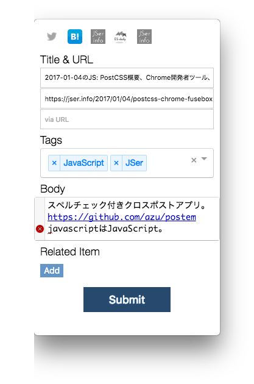

- 検証した結果を踏まえて「説明」する
  - タグ、説明、関連記事を[postem](https://github.com/azu/postem "postem")で書いて投稿
  - [jser/jser.info](https://github.com/jser/jser.info "jser/jser.info")にpushされる
- 「説明」には「言葉」を使うけど…
  - 「言葉」は人によって認識が異なる
  - 言葉の使い方によっても受け取り方はことなる

----

## 言葉は意図

- 言葉とは意図を表明するもの
- JSer.infoにおいては次の意図を持たせる言葉(遣い)を優先する
  - 「整理」「正確」「現状」「中立」「関連性」「客観的」
- 逆を言えば使わない言葉を決める
  - 実際に使わない言葉の方が役立つ(機械的に落とせるため)

----

## JSer.infoで使わない言葉

紹介するサイトもこの内容が強すぎるのは避ける

- 煽りすぎている言葉
- 貶める言葉
- 批判する言葉
- 主張が強すぎる言葉
- 決めつける言葉

----

## JSer.infoで具体的に使いたくない言葉

単語そのものというよりは言葉遣いという視点から捉え方が難しいことば

- is Dead
- 最強
- 熱い
- 常識
- 知らなそう
- これだけ知って(おけ|れば)
- これがベスト/最も優れた

----

## Actual case

- [Javascript Fatigue – Medium](https://medium.com/@ericclemmons/javascript-fatigue-48d4011b6fc4 "Javascript Fatigue – Medium")
- [Promise Cancellation Is Dead — Long Live Promise Cancellation! – Medium](https://medium.com/@benlesh/promise-cancellation-is-dead-long-live-promise-cancellation-c6601f1f5082 "Promise Cancellation Is Dead — Long Live Promise Cancellation! – Medium")
- [なぜ仮想DOMという概念が俺達の魂を震えさせるのか - Qiita](http://qiita.com/mizchi/items/4d25bc26def1719d52e6 "なぜ仮想DOMという概念が俺達の魂を震えさせるのか - Qiita")
- [Riot.js 2.0 を触ってみた — まだReactで消耗しているの? - Qiita](http://qiita.com/cognitom/items/fb1295f3f93911e9e92d "Riot.js 2.0 を触ってみた — まだReactで消耗しているの? - Qiita")

----

## :memo: Note: Actual problem

> We apologize to everyone we upset with the JSAwards idea. It was a poor idea and has ended. Let's promote new stuff and ideas instead! ❤️🎉
> -- [twitter.com/JavaScriptDaily](https://twitter.com/JavaScriptDaily/status/807338775009431558)

- [JSAwards](http://jsawards.org/)(JavaScript Weekly主催)が中止された問題
- [Awards in Open Source – Medium](https://medium.com/@thejameskyle/awards-in-open-source-35d21fc38f29#.cxdx9dh4k)

^ Best of Someoneを投票で決めるものであったけど、
ノミネートされている人は自己推薦ではなく基本他薦であるため、
ノミネートされることを望まない人も含んでいた。
そのため、いくつかネガティブな反応があり、結果を公開後にすぐキャンセルされた。

----

## JSer.infoで使う言葉

- 代替え方法/手段/ライブラリ
- 特徴
- 目的
- と比較して
- 良いところ/良くないところ
- 可能
- 現状/ステータス/開発中

----

## 意図としてのCODE OF CONDUCT

- CODE OF CONDUCTはその場所をどう扱ってほしいかの表明
  - 利用者に強制力はないが、ヒントとして表明できる
  - 関連: [契約プログラミング](https://ja.wikipedia.org/wiki/%E5%A5%91%E7%B4%84%E3%83%97%E3%83%AD%E3%82%B0%E3%83%A9%E3%83%9F%E3%83%B3%E3%82%B0 "契約プログラミング")
- [jser.info/CODE_OF_CONDUCT.md](https://github.com/jser/jser.info/blob/gh-pages/CODE_OF_CONDUCT.md "jser.info/CODE_OF_CONDUCT.md")
  - [Contributor Covenant](http://contributor-covenant.org/ "Contributor Covenant: A Code of Conduct for Open Source Projects")や[Open Code of Conduct](http://todogroup.org/opencodeofconduct/ "Open Code of Conduct")も基本的にそういう意図を表明しているもの
  - [Introducing GitHub Community Guidelines](https://github.com/blog/2267-introducing-github-community-guidelines "Introducing GitHub Community Guidelines")

^ 先ほどの避けたい言葉はあるいのCoCとも言えます。
JSer.infoはそのような中立的な場所として扱いたいという意志を表明しています。

----

> We recommend projects consider adopting a code of conduct that fits their community.
> -- [Followup: Open Code of Conduct // TODO: Talk openly, develop openly](http://todogroup.org/blog/followup-open-code-of-conduct/ "Followup: Open Code of Conduct // TODO: Talk openly, develop openly")

^ 基本的にCoCとかは場所などによって異なるものがあり、
一般化した概念というものはそこまでは多くありません。
コーディング規約みたいなものです。

----

> オープンソースプロジェクトに興味のあるひとは、自分の居心地のよいプロジェクトを探してみよう。
> -- [オープンソースプロジェクトとの距離のとりかた](https://www.allbsd.org/~hrs/blog/2017-01-13-how-to-join.html "オープンソースプロジェクトとの距離のとりかた")

----

## このイベントのCODE OF CONDUCT

- 公平な心をもって参加しましょう
- あるものをけなすような発言はぐっと抑えましょう
- 写真の撮影/アップロードなどは写ってる人に許可を貰ってから行いましょう

:arrow_heading_up: 上記に反しないような主張や議論は歓迎


----


# 「言葉」の難しさ

- 正しいことを言っても、正しくは伝わないことがある
	- 正しいことを言う != 正しく伝える
- 正しい事実だけではなく、正しく伝えることも大事
- 「使わない言葉」であげていたものは、正しく伝えるのが難しい言葉
  - 主観的な言葉とも言い換えることができる

^ [「正しい意見や指摘こそ、優しい言葉で伝えることが大事」結城浩さんの連ツイ - Togetterまとめ](https://togetter.com/li/1069037 "「正しい意見や指摘こそ、優しい言葉で伝えることが大事」結城浩さんの連ツイ - Togetterまとめ")
特に文字だと部分で読むことができちゃうのでより難しい。

----

## 言葉とツール

- 事実を正しく伝えるのは難しい
  - そこにはコミュニケーションが存在する
- 障壁を下げるには機械を通すなど
  - いわゆるLintを通す場合はそこには人間関係が介在しにくい
  - 文字通り機械的にやり取りできる
- 例) [textlint](https://github.com/textlint/textlint "textlint")で説明をチェックする

^ 言葉を伝える場合にもコミュニケーションという問題が別途存在しています。
人 + 人 のやり取りなので、言葉遣いだけではなく誰かというコンテキストが存在したり変数が多い。
そういう部分は機械的にチェックすることで、受け取り側も機械的に受け取れるという結果もあります。
つまり、問題が人ではなく機械に向きやすいので扱いやすいデザインとなる。

----

# ツールによる検査の利点

> 人手による文書のレビューはコードのレビュー以上に人間関係を悪くしてしまう恐れがあります。
> これに対して、自動検査ツールで結果を返すのは人ではなくツールですので執筆者は嫌がらせを疑う必要はありません。
> -- Takahiko Ito [^RedPen]

[^RedPen]: [文書執筆の指南書で解説されている問題点を RedPen で発見する - Qiita](http://qiita.com/takahi-i/items/a8b994ef17fd66fe6237 "文書執筆の指南書で解説されている問題点を RedPen で発見する - Qiita")

----

# JSer.infoにおいての機械的なチェック

- [textlint](https://github.com/textlint/textlint "textlint")で機械的なチェックが走ってる
- 機械的なチェックに引っかかったものは修正するか諦める
- 機械的に判断できるようにして、余計な時間を使わないように
  - 時間的なコストを削減するためにも、機械的なチェックは効果的


----

# JSer.infoの[感情極性値](http://www.lr.pi.titech.ac.jp/~takamura/pndic_ja.html "感情極性値")

- JSer.infoの説明に感情的な単語がどれぐらい使われてるか
- [単語感情極性対応表](http://www.lr.pi.titech.ac.jp/~takamura/pndic_ja.html "単語感情極性対応表")
  - 単語ごと`-1`から`+1`までの値がつけられた辞書データ
  - ネガティブに近いかポジティブに近いか
- 説明文の各単語の感情値の合計値から平均を出してみる

-----

## JSer.infoは中立的

- JSer.infoの意図は「中立」
- 0に近いほど目的に沿ってそう
  - ポジティブ、ネガティブのバランス
  - 記事ごとの説明文の感情極性値の平均を出してみる

----

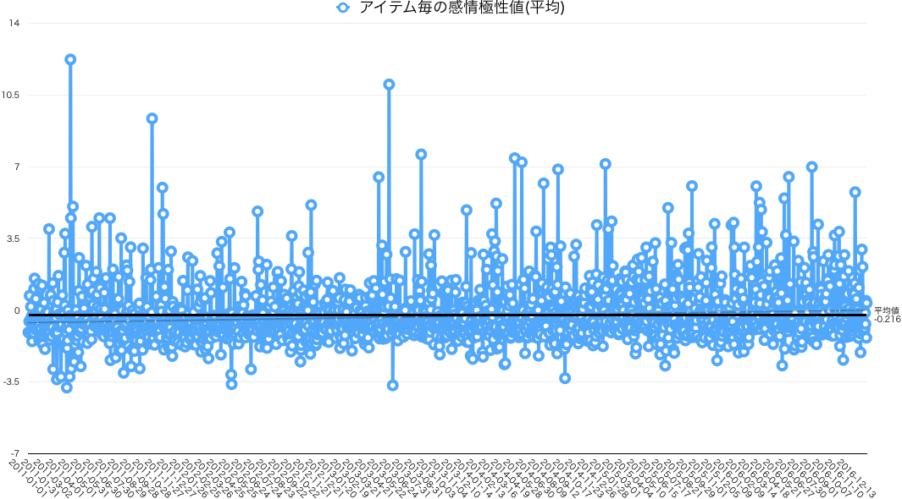


^ 平均は大体 -0.216 なので大体 0 に近い。
けど、ネガティブな方が単語数の有利があるので補正をかけている。
なのであんまり参考にはならない図

----

# 「説明」のまとめ

- 説明は場所/対象により正しさが異なる
- 注目を集めることは簡単だけど、事実を伝えることはより難しい
- JSer.infoでは 正しく説明 >= 正しい事実
  - 正しく説明できなさそうなら諦める[^1]
- 機械的なチェックを導入することで時間的に省略

[^1]: 正しい事実が分かっていて説明できないことは、専門外に多いので専門家に聞くのが良い

----

# 共有(Share)

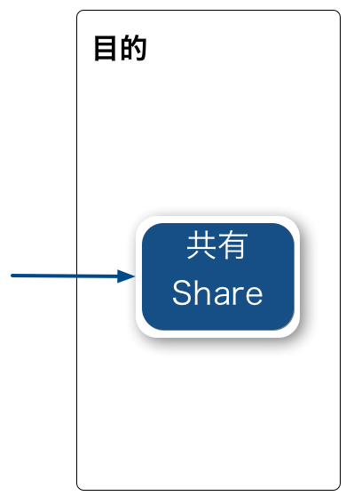

----

# 共有(Share)

- 一定数、紹介サイトが溜まったら共有する
- 一定数はBotが教えてくれる

----

## [jser/jser.info - Gitter](https://gitter.im/textlint-ja/textlint-ja "jser/jser.info - Gitter")の様子

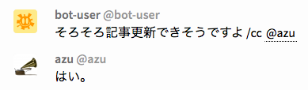


----

# 共有(Share)

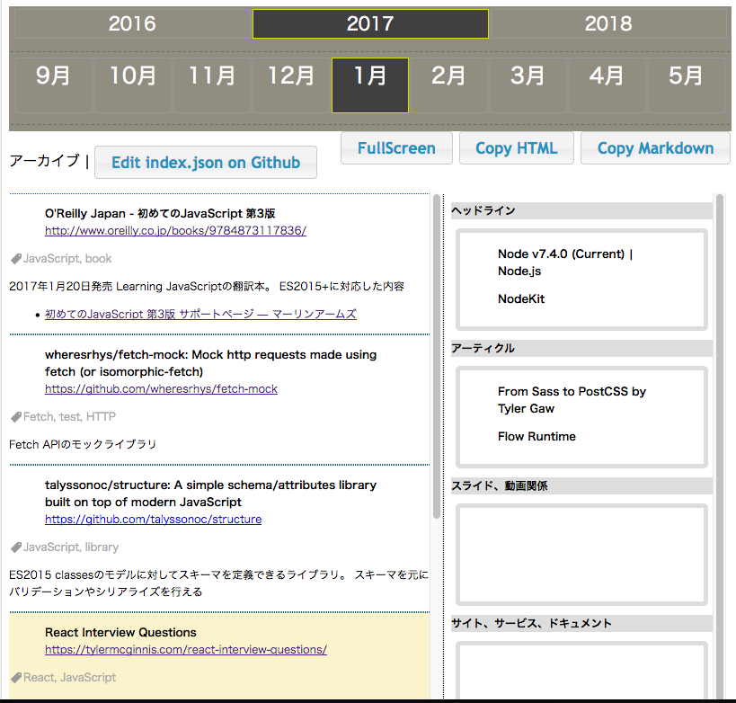

1. [JSer.infoのアーカイブ](https://jser.info/jser.info/ "JSer.infoのアーカイブ")から記事を選ぶ
2. [jser/jser.github.io](https://github.com/jser/jser.github.io "jser/jser.github.io")に記事を書く
  - Jekyllで動いてるので、Markdownを追加してヘッドラインを書く
3. 記事が公開される

----

# ----- ここまで -----

## これを繰り返せば JSer.info の完成

----


----

# 継続性

- JSer.infoの目標 :triangular_flag_on_post:
  - 「更新コストを小さくして、継続できる形を作る」

-----

# ゴール(Goal)

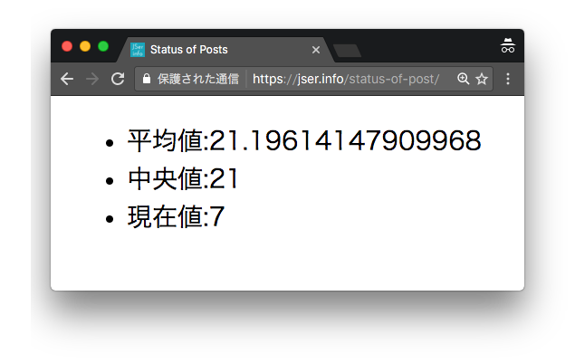

- 継続的に行動するには、ゴールはできるだけ短く連続的に設定する
  - 「JSer.infoは１週間に1度ぐらい投稿する」というのがゴール
- ゴールと進捗は同じぐらい大事な指標
- [jser.info/status-of-post/](https://jser.info/status-of-post/)で現在の進捗を見られる
  - 記事の紹介文書きまでは分散して行われる(まとめる = 記事化は週一)

----

# 短く連続性のあるゴール

- 一度に遠くのゴールを目指すより、短い目標をちょっとづつクリアした方が継続する

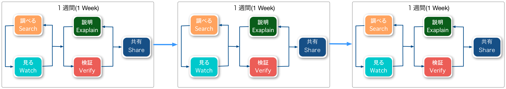

----

# 長すぎるゴールの問題

- そもそも解決するのが難しい
- どれくらいの期間で終わるのか予想しにくい
  - 直感的な見積もりは大体間違ってる

-----

## 不確実性のコーン [^見]


[^見]: [ソフトウェア見積り　人月の暗黙知を解き明かす](https://www.amazon.co.jp/dp/B00KR96M6K/ "ソフトウェア見積り　人月の暗黙知を解き明かす")

-----

# 直感と予想は一致しない

- 長期的なものを直感で予想するのは難しい
- 短い反復の方が、予想と実際の結果のバラつきは小さくなる
  - 計画実行の不確実性が減る
- 一度上手くいかなくても、失敗の誤差も小さいため取り戻しやすい

----

# 再開に必要なコストは大きい

- 一度やめると再開するコストが大きい
  - 上手く達成できなかったタイミングで停止してしまうことが多い
- 1週間区切りなら上手く行かない週は、次の週で取り戻せる(リセットできる)
  - 止まることは想定し、復旧することを前提にする
- 関連: [let it crashが生んだ誤解 - Qiita](http://qiita.com/soranoba/items/fce095f25c851dd34a6b "let it crashが生んだ誤解 - Qiita")

^ ごちゃごちゃ書いていますが、一度止めると再開が大変。
Let's it crash
「常にバグは起きうるのだから, その前提で復旧する為の方法を最初に考える思想」

-----

# 小さく作って小さく更新

- 一日で一週間分をまとめるのは無理
- 小さくコミットして小さく続ける(VCS)
- 1紹介記事 = 1コミット
  - 一度にまとめてやるのは心理的コストが高い
  - 分散的に更新したものが、結果的にマージされていればいい

----

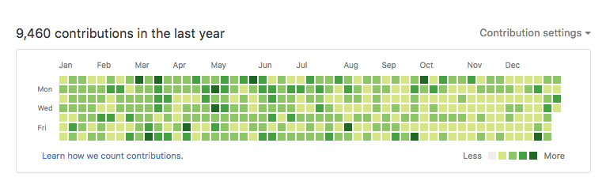

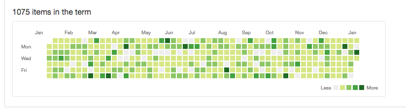

----

# 共有の位置づけ


- 情報収集は元からの趣味
- 共有をするのはおまけ
- JSer.infoの更新(共有)を停止しても、情報収集自体は継続される
  - 完全に停止はしないので、再開はしやすい

----

# イテレーションのコスト


- 無コストではないけど、そのコストは小さくするように努力する
- ワークフローはできるだけ一方通行で完了するようにする
  - Unidirection workflow
- [textlint](https://github.com/textlint/textlint "textlint")、CI、bot、API、投稿アプリ
  - その場その場で投稿の処理を行い、一つ一つのコストを小さくする

^ 先ほどからFluxで出てくる図形を使っているのは一方通行であるという暗喩してます。

----

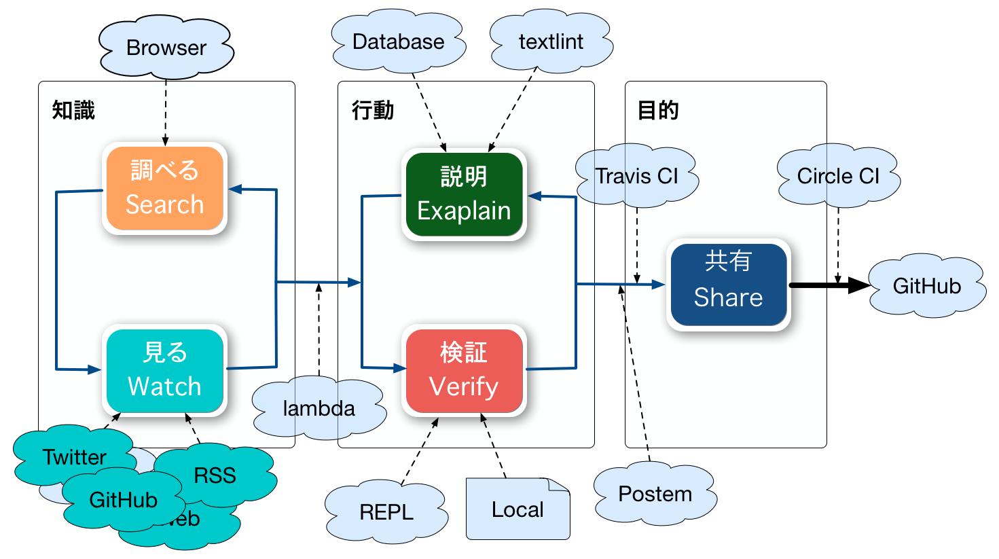

----

# あなたもJSer.infoをつくってみませんか?

- [jser/ping](https://github.com/jser/ping "jser/ping: Ping! your issue")にURLを投げる
  - 紹介するかは別として、とりあえず見ます。
- [jser/report](https://github.com/jser/report/issues "jser/report")にアイデアを提案する
  - より密度が高いレポート形式でやる方法を考えています。
- [jser/jser.github.io](https://github.com/jser/jser.github.io "jser/jser.github.io")に寄稿する
  - 寄稿する仕組みはないですが、それがJSer.infoらしいならやるべきです。
- [jser/jser.info - Gitter](https://gitter.im/jser/jser.info "jser/jser.info - Gitter")で議論をする

----

# まとめ

- その場における知識はそこまで重要じゃない
- 見るものは見る場所に集める
- 直感が正しくないときに、それを推し量る方法を持つ
- 自分の動けるスコープを決めて動くことが大事
- JSer.infoは1週間で小さな目標を達成出来るように動かしてる
  - 1つずつの紹介についてのタスクは細分化されている

^ 直感は正しくないことがあることを認めるべき。
見積もりにおいては、アートな見積もりとサイエンスな見積もりがある。
直感が正しくない場合に、数学的にその正しさを検証できるかは一つの壁。
短い距離を測るときはアートの方が短い時間で大体正確なものがでやすい。


----

# 参考 1


- [JSer.info 1年を迎えて](https://azu.github.io/slide/offline_study/jser_info.html#slide1)
- [世界のJavaScriptを読もう @ 2012](https://azu.github.io/slide/offline_study/javascript_world.html#slide1)
- [The Mechanism is not the Mental Model](https://thefeedbackloop.xyz/the-mechanism-is-not-the-mental-model/ "The Mechanism is not the Mental Model")
- [プログラミング言語標準化のパターン](https://gist.github.com/azu/47082cbcaf7cc7b2b2f2075afad1b025 "プログラミング言語標準化のパターン")
- [今日からはじめる情報設計](https://www.amazon.co.jp/dp/4802510012/ "今日からはじめる情報設計")
- [ソフトウェア見積り　人月の暗黙知を解き明かす](https://www.amazon.co.jp/dp/B00KR96M6K/ "ソフトウェア見積り　人月の暗黙知を解き明かす")


------

# 参考 2

- [textlint - pluggable linting tool for text and markdown](https://textlint.github.io/ "textlint - pluggable linting tool for text and markdown")
- [行動規範マナー動画 in ScalaMatsuri 2016 - YouTube](https://www.youtube.com/watch?v=lIfOQNTWdxI "行動規範マナー動画 in ScalaMatsuri 2016 - YouTube")
- [Open Resources/Japanese Sentiment Polarity Dictionary - 東北大学 乾・岡﨑研究室 / Communication Science Lab, Tohoku University](http://www.cl.ecei.tohoku.ac.jp/index.php?Open%20Resources%2FJapanese%20Sentiment%20Polarity%20Dictionary "Open Resources/Japanese Sentiment Polarity Dictionary - 東北大学 乾・岡﨑研究室 / Communication Science Lab, Tohoku University")
- [let it crashが生んだ誤解 - Qiita](http://qiita.com/soranoba/items/fce095f25c851dd34a6b "let it crashが生んだ誤解 - Qiita")
