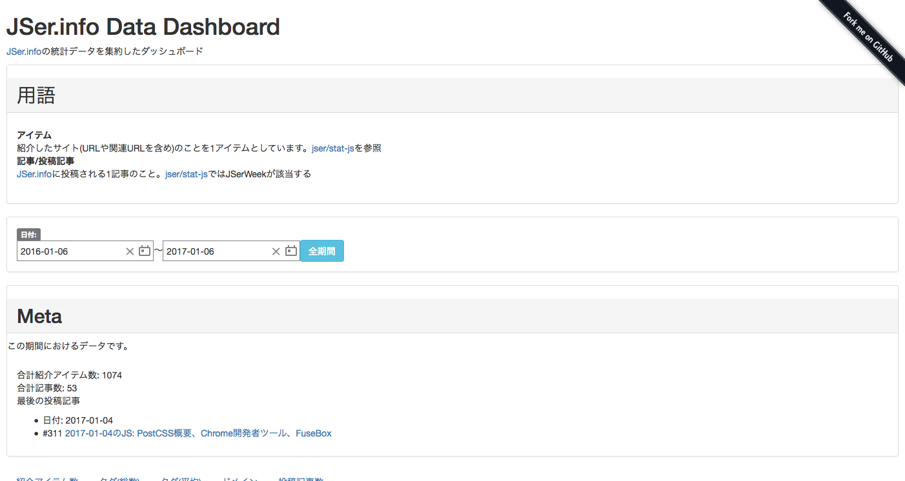

autoscale: true

# JSer.info 6周年イベント

----

# 自己紹介

- Name : **azu**
- Twitter : @[azu_re](https://twitter.com/azu_re)
- Website: [Web scratch], [JSer.info]

[Web scratch]: http://efcl.info/ "Web scratch"
[JSer.info]: http://jser.info/ "JSer.info"

----

# JSer.infoって何?

- JavaScriptについて週一で書くブログ
- 2011年1月16日開始
- 2017年1月16日で6周年(イマココ)

-----

# 紹介アイテム数の推移

----

----

-----

# [JSer.infoのデータセット](https://github.com/jser/source-data)

- JSer.infoで紹介した記事(アイテム)を入れた6000以上の[JSONデータ](https://github.com/jser/source-data)
	- タイトル/URL/タグ/説明/関連記事などが入ってる
- [jser/stat-js](https://github.com/jser/stat-js "jser/stat-js")
	- データセットを簡単に扱うためのライブラリ
	- JSer.infoの記事とアイテムの関連付けなどを行える
- MITライセンスで利用できる

^https://github.com/jser/source-data を直接使うよりはstat-jsを使うほうが楽だし確実

----

# [JSer.info Data Dashboard](https://jser.info/data-dashboard/ "JSer.info Data Dashboard")

-----

# [JSer.info Data Dashboard](https://jser.info/data-dashboard/ "JSer.info Data Dashboard")

- JSer.infoの投稿/紹介記事データの解析用ダッシュボード
- 年ごとタグの推移、アイテム数などいろんな視点でのデータ
- CSVでダウンロードできるようになっている(下処理済みのデータ)
- このスライドのために作った…

-----

# 話を戻して、Data Dashboardのデータを見ていく

-----

# 紹介ソースの推移

-----

## ドメイン別

-----

-----

## ドメイン別

- GitHubは圧倒的に増えている
- リリースノートを書くドメインは紹介されやすい傾向
	- [われわれは、いかにして変更点を追うか](http://azu.github.io/slide/cto/changelog.html "われわれは、いかにして変更点を追うか")
- ブログ系のソースとなるドメインは少し変化している
	- Qiita、Mediumなど

-----

## ブログ系のドメイン

-----

----

## QiitaとMedium

- [JSer.infoトレンド](https://jser.info/trends/#beginDate=2013-01-01&endDate=2017-01-1&keywords=Qiita&keywords=Medium)で見れる
- Qiitaが12月に伸びるのはアドベントカレンダーが要因

----

## ドメインの変化まとめ

- GitHub、Medium、Qiitaなどのプラットフォーム利用者は増えている
	- 自前のドメインとの見てもらいやすさの違いがある
	- フィードバック/通知/フォローなど
	- [Qiita、Medium、ブログ 使い分けコレクション](https://gist.github.com/azu/78c3c9ec42204f3be1fd73123a8588d0 "Qiita、Medium、ブログ 使い分けコレクション")
- プラットフォーム自身も変化する
	- [Renewing Medium’s focus](https://blog.medium.com/renewing-mediums-focus-98f374a960be "Renewing Medium’s focus")
	- [Contributionの算定基準も変わります - Qiita Blog](http://blog.qiita.com/post/153200849029/qiita-like-button "投稿記事やコメントに「いいね」できるようになりました（Contributionの算定基準も変わります）... - Qiita Blog")

-----
## プラットフォームのメリット・デメリット

- タグやグループと行った"個人"ではない単位でWatchできる
	- => "JavaScript"という情報が流れてきやすいのでWatchが簡単
- JSer.infoとしてプラットフォームを追うのは簡単
- しかし、情報の偏りが出やすいのでプラットフォーム以外も見る必要がある
	- 例) プラットフォーム上で目立つため乱暴な意見が出やすい傾向

----

## プラットフォーム以外のWatch

- プラットフォーム以外の利用者が周知する場合に利用する場所
	- SNS(Twitter)、SBM(はてなブックマーク)、HN系([Echo JS](http://www.echojs.com/ "Echo JS"))
- 個人のブログ/RSS/GitHub/動画サイト...
	- 人がいる所に情報はあるので見る場所は様々になる

----

# JSer.infoへの情報を投げる場所

----

# [jser/ping](https://github.com/jser/ping "jser/ping")

----

----

## 目的

- ユーザー投稿ができるようにしたい
	- (自己)推薦したい記事を投稿して欲しい
- [JSer.info Pull Request Form](https://jser.info/contributing/ "JSer.info Pull Request Form")は気軽じゃない
- [jser/ping](https://github.com/jser/ping "jser/ping")は匿名でも投稿できる気軽さを重視
	- URLを投げれば[Issue](https://github.com/jser/ping/issues)が立つ仕組み
	- ついでに[@jser_info](https://twitter.com/jser_info "@jser_info")にも投稿される

----

## サブ目的

- ストック場所
	- すぐに良し悪しを判断できない場合に、とりあえず投げておける場所
- API
	- [github.com/jser/ping#api](https://github.com/jser/ping#api)
	- APIとして動くものが欲しかった

-----

## ストックの例

- リリース待ち
	- [Rewrite Status · Issue #1090 · lhorie/mithril.js #40](https://github.com/jser/ping/issues/40 "Rewrite Status · Issue #1090 · lhorie/mithril.js #40")
- 連載もの扱い
	- 単発で良し悪しが判断できない
- 要議論
	- Opinion、修正を投げてみるなど

----

# [ECMAScript Daily](https://ecmascript-daily.github.io/ "ECMAScript Daily")

----

# [ECMAScript Daily](https://ecmascript-daily.github.io/ "ECMAScript Daily")

- ECMAScript情報サイト
- 去年開始したECMAScriptについて扱う情報サイト
- [ECMAScriptの情報サイトを始めて1年経った | Web Scratch](http://efcl.info/2016/12/31/ecmascript-daily/ "ECMAScriptの情報サイトを始めて1年経った | Web Scratch")

----

# [ECMAScript Daily](https://ecmascript-daily.github.io/ "ECMAScript Daily")

- [ECMAScript Daily](https://ecmascript-daily.github.io/ "ECMAScript Daily")もECMAScriptの情報を見ていてメモする場所が欲しかったのでサイト化した
- 習慣 => サイト化
- 恐らく唯一のECMAScript専門サイト…

-----

# 投稿フロー

1. 記事を読む
2. 投稿用クライアント([postem](https://github.com/azu/postem "postem"))でブクマ
   - [textlint](https://github.com/textlint/textlint "textlint")で自然言語のLint
3. 一週間ぐらい1、2を繰り返して紹介記事のデータを貯める
   - [編集用アプリ](https://github.com/jser/jser.info-editor)利用、[Gitterでbot](https://gitter.im/jser/jser.info)が投稿タイミングを通知
4. 貯めたアーカイブを整形
5. 整形した記事をコピペ、ヘッドラインを書く
   - Pull Request駆動 => CIが自動チェック
   - Atom+[linter-textlint](https://github.com/1000ch/linter-textlint "linter-textlint")でリアルタイムLint
6. 記事の完成

----

# 投稿フロー

- 基本的に[最初の頃](http://azu.github.io/slide/offline_study/jser_info.html#slide8)と大きくは変わってない
- ブクマ時に説明文を考える、関連を探す
- LintやCIなど自動チェック系
- 更新タイミングの通知
	- [Gitter](https://gitter.im/jser/jser.info)使いにくいのでslackにしたい感じもする
- 後戻りをできるだけ小さくするデザイン
	- 更新コストの最小化が目的

----

# 投稿フロー

- 投稿は分散的に行う
	- [Realtime JSer.info](https://realtime.jser.info/ "Realtime JSer.info")ではリアルタイムに見られる
	- 投稿時に詳細を設計してしまうのは、継続性のボトルネックになりやすい
- 記事化するときに結果統合性が成り立つように集約する
- => 詳しくは次のスライドで

----

# 今後

- トピックベースのレポートを書く方法を検証してる
	- 中期的な課題を解決したい
	- https://github.com/jser/report/issues
- 一番大事なのは時間的なコスト
	- 継続的にやるためにはどうやっても必要
- 今年何かを検証したい

-----

## 参考

- [JSer.infoの遊び方 - JSer.info](https://jser.info/2016/01/15/how-to-play-jser-info/)
- [JSer.info 300回目 && https化 && ユーザー投稿機能 - JSer.info](https://jser.info/2016/10/10/300posts/)
- GitHub Issueでやってるコミュニティ
	- [Issues · dyweb/weekly](https://github.com/dyweb/weekly/issues "Issues · dyweb/weekly")
