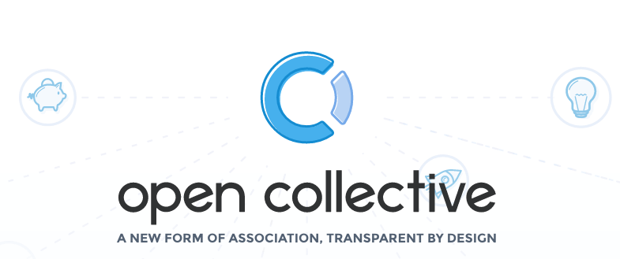
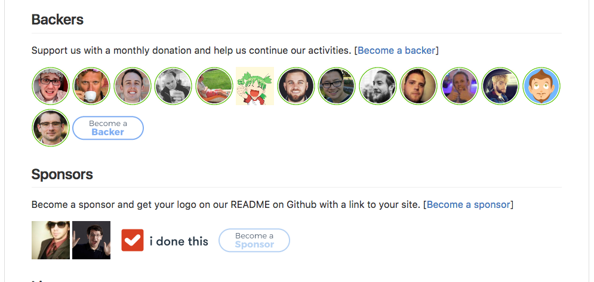
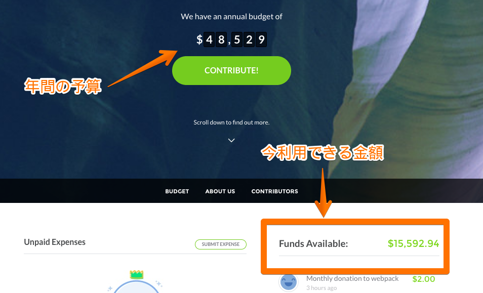
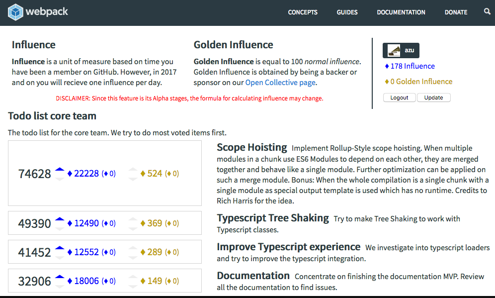

autoscale: true

# Open Collective

----

----

> An Open Collective is a group of people with a shared mission that operates in full transparency.
> -- [https://opencollective.com/faq](https://opencollective.com/faq)

----

# Donate

- 利用者は*backer*となってdonateすることができる
  - 月額:$2, $5, $10, $25, $50
  - 月額/年額/単発: 任意の金額
- 利用者は*sponsor*になることができる
  - 月額: $100~
  - sponsorはREADMEなどに掲載されリンクを張ってもらえる

^ Stripe and PayPalで支払い

----

[preact](https://github.com/developit/preact "preact")の例

----

# 透明性

----

^ 年間の予算を算出できる
月額のbackerやsponsorを含めたもの

----

## 透明性の仕組み

----

## Why open collective?

> Yet, once there is money involved, there is still no good solution. As a result, those communities tend to avoid dealing with money or just have one sponsor at a time to cover immediate expenses.
> -- [github.com/opencollective/opencollective](https://github.com/opencollective/opencollective "OpenCollective/OpenCollective")

----

## コミュニティとお金の問題

- 現状のコミュニティでお金を扱うのは避ける傾向がある
  - 法人格を作るのが面倒
  - オーバーヘッド大きい

----

# Open Collectiveの目的

> No legal entity, no bank account, no budget

> The emergence of cross-governments global services

----

# Definition of an Open Collective

> I define an Open Collective as a lightweight association that can collect and disperse money transparently without creating a legal entity.
> -- [A New Form of Association for the Internet Generation — part 2 – Open Collective – Medium](https://medium.com/open-collective/a-new-form-of-association-for-the-internet-generation-part-2-fe6d8415f444 "A New Form of Association for the Internet Generation — part 2 – Open Collective – Medium")

----

# ゴール

- コミュニティが自立出来るようなインフラを作ること
- 誰もがcontributors, backers, sponsorsになれるように
- [Moving beyond the charity framework – Open Collective – Medium](https://medium.com/open-collective/moving-beyond-the-charity-framework-b1191c33141 "Moving beyond the charity framework – Open Collective – Medium")

-----

# クラウドファンディングとの違い

----

# 採用してるプロジェクト

- webpack
- preact
- cyclejs
- babel(maybe)
- [Women Who Code (WWCode)](https://www.womenwhocode.com/ "Women Who Code (WWCode)")
- Apex
  - https://medium.com/@tjholowaychuk/150-m-for-me-d-haha-f7af946d2ee7

----

## webpack

- どういう仕組み

----

## Next in webpack

> The future: Open source projects creating incentives for sponsors
> -- [How Webpack raised $15,000 in 3 months](https://hackernoon.com/how-webpack-raised-15-000-in-3-months-and-the-future-of-open-source-cb2c9f68fffa "How Webpack raised $15,000 in 3 months, and the future of open source")

- webpackはスポンサーに対してインセンティブを提供してる
  - Office hours
  - On-site visit

----

## Influence

- [webpackのtodo list](https://webpack.js.org/vote/)への投票
- Open Collectiveでbackerになってると+100ポイント
  - バックエンドはlambda使ってる

-----

## badge

----

# Backerになる方法

----

# Open Collective利用費用

> 10% + credit card fees (usually 3% + $0.30/transaction)

----

## コミュニティはお金を手に入れることで何ができるか?

- 具体例

----
