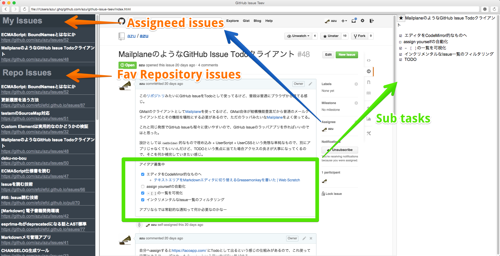
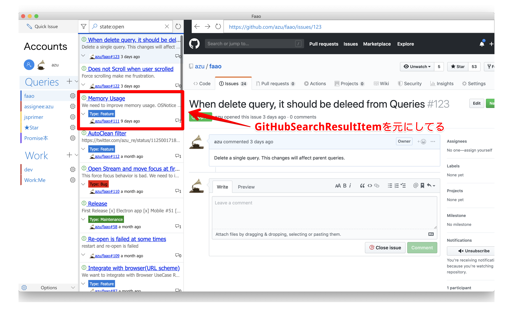
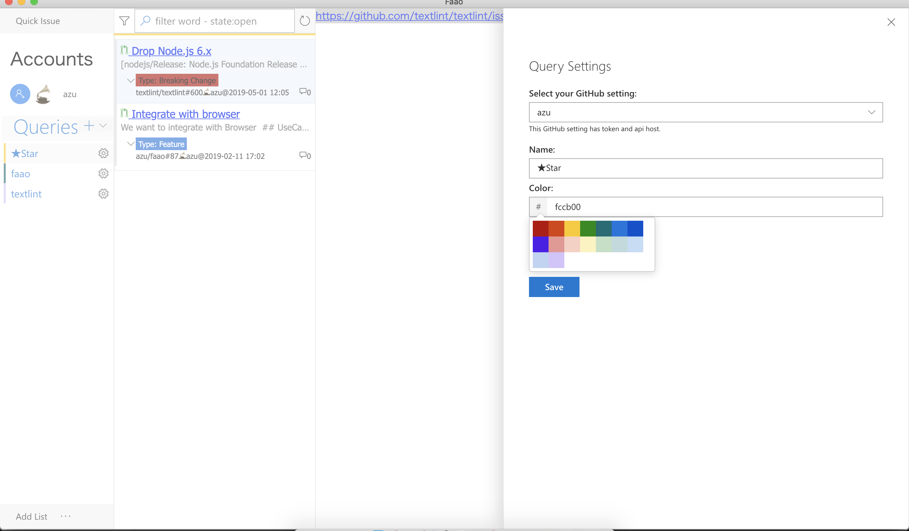
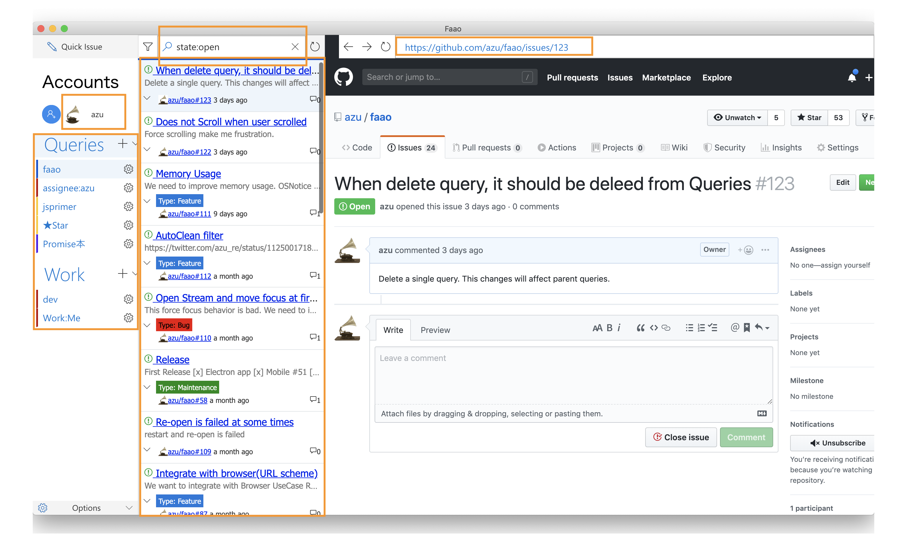
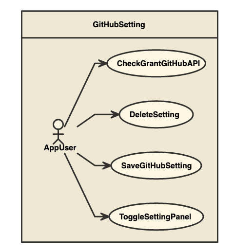
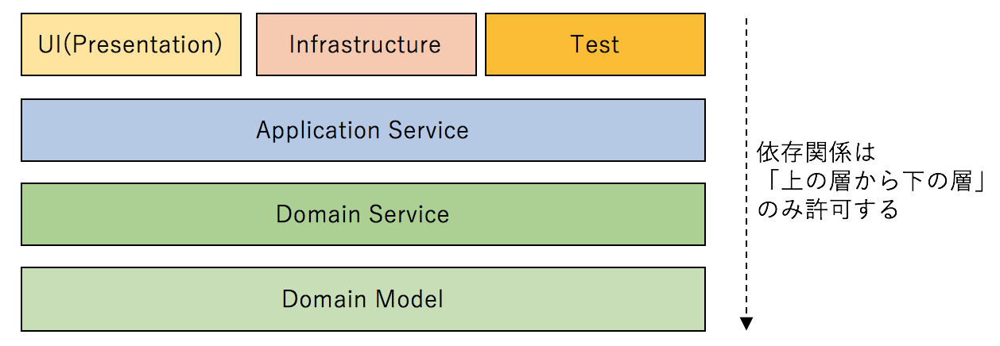
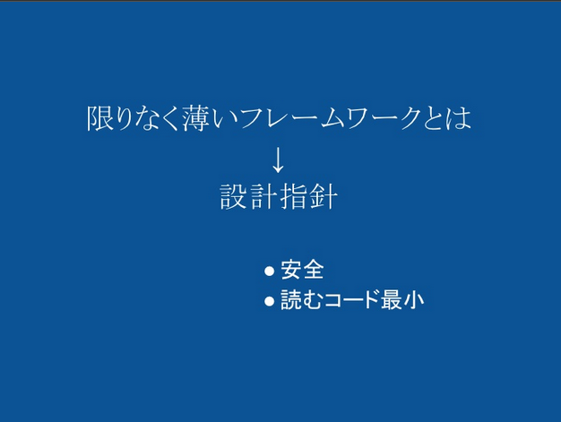
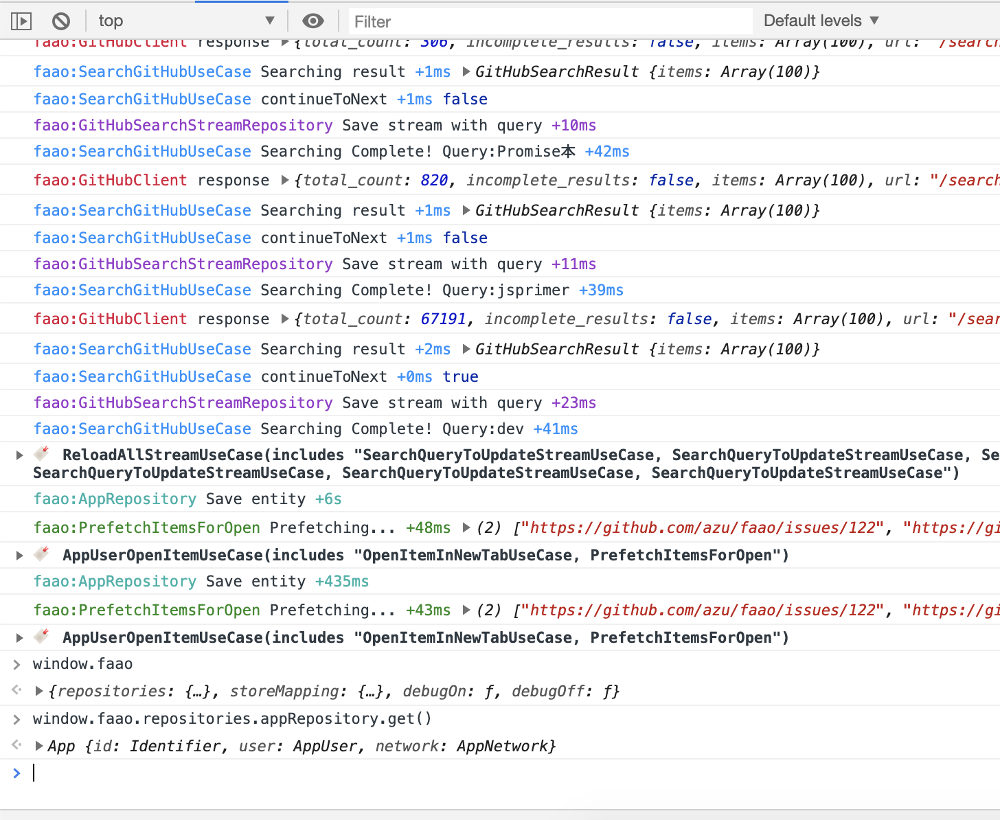

autoscale: true

# 考えながらクライアントサイドのウェブアプリケーションを作る話

----

# 自己紹介


- Name : **azu**
- Twitter : @[azu_re](https://twitter.com/azu_re)
- Website: [Web scratch], [JSer.info]

[Web scratch]: https://efcl.info/ "Web scratch"
[JSer.info]: https://jser.info/ "JSer.info"


----

## このスライドは<br>[Faao - ドメイン駆動設計で作るGitHub Issue Client -](https://azu.github.io/slide/2017/teppeis-sushi/client-side-ddd-on-github.html)<br>を改定したものです。

----

# 過去に作ったやつ

- [azu/GithubReader: Github Notifications Client for OS X](https://github.com/azu/GithubReader "azu/GithubReader: Github Notifications Client for OS X")
- [azu/github-reader: [node-webkit] GitHub client app - Viewer for Notifications and News Feed.](https://github.com/azu/github-reader "azu/github-reader: [node-webkit] GitHub client app - Viewer for Notifications and News Feed.")
- [azu/github-issue-teev: [NW.js] GitHub Issue Manager(Viewer)](https://github.com/azu/github-issue-teev "azu/github-issue-teev: [NW.js] GitHub Issue Manager(Viewer)")

-----


-----



-----

# [Faao](https://github.com/azu/faao)

-----


-----

# Faao - Feature

- Support Modern browser/mobile/Electron(recommenced)
- Support GitHub.com and GitHub Enterprise(GHE)
- Search Issue/Pull Request
      - [Search Syntax](https://help.github.com/articles/search-syntax/ "Search Syntax") is same with GitHub Search
- Mixed the result of search
      - e.g.) You can see the results of [Created](https://github.com/issues), [assigned](https://github.com/issues/assigned), [mentioned](https://github.com/issues/mentioned) as a single result
      - e.g.) You can see the results of `repo:azu/todo` on `github.com` and `repo:azu-ghe/todo` on GHE as a single result
- Support GitHub User Activity
- Quick to create issue
- Import/Export profile data

-----

# 目的

- OOSでGitHub Issueをちゃんと扱うものがない
- 技術的目的
    - Almin + TypeScript + DDD[^ドメイン駆動設計]である程度の規模のアプリケーションを作りたかった

[^ドメイン駆動設計]: レイヤー化とドメインモデル層を持つ設計や開発思想

-----

# 規模感(2019-06-04現在)

```
✈  cloc src
     239 text files.
     234 unique files.
       6 files ignored.

github.com/AlDanial/cloc v 1.80  T=1.06 s (219.4 files/s, 18371.8 lines/s)
-------------------------------------------------------------------------------
Language                     files          blank        comment           code
-------------------------------------------------------------------------------
TypeScript                     186           1009            584          10147
JSON                             9              1              0           6795
CSS                             36            135             61            769
Markdown                         2              3              0              6
-------------------------------------------------------------------------------
SUM:                           233           1148            645          17717
-------------------------------------------------------------------------------
````

----

# 作戦

- 「ちゃんと考えてちゃんとやる」
- 技術的ショーケースとしての意味合いを持つ
    - ちゃんとモデリングする
    - ちゃんとテストを書く
    - ちゃんとドキュメントを作る

----

# アジェンダ

- 前半: ドメインの関心事
- 後半: 技術的な関心事

----

# DDD（ドメイン駆動開発）

## ちゃんとモデリング[^モデル]をやる

[^モデル]: ここでいうモデルはEntityとかValue Objectを含めたドメイン上のモデルクラス

----

# Disclaimer

- DDD は答えではありません
	- ただしドメインの関心事は言語に依存しにくいという特徴がある
	- 設計で困ったときに考えること/実装が言語に依存しにくい
	- C#、Java、F#、Scalaなど別の言語での取り組みも参考にしやすい
	- 永続層は技術的な関心事なので言語によって結構違う(Repository)
- このスライドはクライアントサイドのアプリについてです
	- サーバにおけるDDDとは少し関心が異なる部分があります

----

# クライアントサイドでのDDD

- [faao/domain.md at master · azu/faao](https://github.com/azu/faao/blob/master/docs/domain.md "faao/domain.md at master · azu/faao")
- ドメインモデルの寿命が長い
    - 特に何かのサービスに対するクライアントアプリはずっと立ち上げっぱなし
	- ウェブサイトと異なりリロードしなくても動くように作る
- サーバ側の概念とクライアント側の概念は一致しないことがある
    - サーバ(GitHub)的にアカウントに対してGitHub APIのトークンが複数紐づく
    - クライアントからはTokenがあり、そのTokenに紐づくアカウントがいるように見える
      - クライアントからは、トークンがなければアカウントは分からない、アカウントだけ分かってもトークンがないと何もできない

----

## モデリング

- AppUser: アプリケーションのユーザー
- GitHubSetting: TokenやAPI hostなどを含んだセッション情報
- GitHubUser: GitHubのAPIを叩いた結果取得できるGitHubユーザー情報

多くの処理(ユースケース)は

> **AppUser**が**GitHubSetting**を使って 〜〜 する

のようになることが分かってくる

----

## 遠回りのモデリング

- 実際モデリングをしっかりやると進みが遅く感じる
    - 一つのモデルが大きくなりすぎないように気を配ったり
- 遠回りしてよかった場合もある
    - 安易なUI起因の値がドメインに流れてくるのを防げる

-----

## 遠回りの例


- GitHubSetting(Account)にアイコン画像を設定したいというIssue
- 安直にやるなら `GitHubSetting` へ `avatarImageURL` などを追加すれば終わり


```ts
interface GitHubSetting {
      id: Identifier<GitHubSetting>;
      token: string;
      apiHost: string;
      webHost: string;
      // ADD?
      avatarImageURL?: string;
}
```

----

## 遠回りの例 -> GitHubUser


- 後回しにしていて、GitHubUserの[Activity](https://github.com/azu/faao/issues/53 "Activity")を表示したいと思った
- このときに、`GitHubUser`というモデルが必要で、`avatarImageURL`はこの`GitHubUser`の`profile`に属するデータであると分かった
- 結果的に`GitHubSetting`に追加されたのは`GitHubUser`へのRelationship Id

```ts
interface GitHubSetting {
      id: Identifier<GitHubSetting>;
      token: string;
      apiHost: string;
      webHost: string;
      // Relationship
      gitHubUserId?: Identifier<GitHubUser>;
}
```

^ <http://www.nomnoml.com.s3-website-eu-west-1.amazonaws.com/#view/%0A%23direction%3A right%0A%23spacing%3A 50%0A%23padding%3A 20%0A[GitHubSetting|%0A [id]%0A [token]%0A [apiHost]%0A [gitHubUserId%3F] %0A]%0A[GitHubSetting] --> [GitHubUser]%0A[GitHubUser|%0A%09[id]%0A [profile| %0A %09[avatarImageURL]%0A ]%0A %0A]%0A>

----

# 遠回りのモデリング


- `GitHubSetting`と`GitHubUser`は想定するライフサイクルが異なった
- `GitHubSetting`で入力されたTokenを使って、`/user` APIを叩いて`GitHubUser`を作る
- 異なるライフサイクルを一つのモデルにまとめると破綻する未来が見えていた
- そのため、UIのためにいきなりモデルを変更するよりちゃんと必要なモデルを考える

----

# Star機能のモデリング

- 表示しているIssue/PRを :star: Starできる機能を実装しようとした
	- 目的: 今日作業するIssueをストックしてまとめて表示できる機能をつけたい！
- 表示しているIssueのデータは`GitHubSearchResultItem`を元にしている
	- 正確に言うと`GitHubSearchResultItem`がViewModelを作りそれを元に表示を作る

----



----

# Star機能のモデリング

- `GitHubSearchResultItem` (Value Object) に `isStared` を追加すればOK?

```diff
export class GitHubSearchResultItem {
    id: Identifier<GitHubSearchResultItem>;
    body: string;
    html_url: string;
    number: number;
    title: string;
	// ...
+   isStared: boolean;
}
```


----

# Star機能のモデリング

> `GitHubSearchResultItem` に `isStared` を追加すればOK?

- No
	- User が `GitHubSearchResultItem` を Star する ということは
	- Faaoには複数のSearchResultがあり、特定のSearchResultItemをStarしたいわけじゃない
	- ユーザーはそのGitHubSearchResultItemに対応するIssue/PRをStarしたい
	- => つまり GitHubSearchResultItemのidなりを記憶しておきたい
	- さらにいえば、GitHubSearchResultItemをスナップショットとして保存するのではなく、そのGitHubSearchResultItemに相当するItemの最新の状態を一覧したい
	- => これは保存したStarのIDをまとめて検索したいと言い換えできる

----

# Star機能のモデリング

- [Add Faao Query by azu · Pull Request #91 · azu/faao](https://github.com/azu/faao/pull/91)
- 新しい種類のQueryとしてモデルを作り実装した
	- Starすると、そのQueryの検索パラメータにIssueのIDを追加する
	- UnStarすると、そのQueryの検索パラメータにIssueのIDを削除する
- Star済み一覧を表示する = StarのQueryで検索する
	- 常にStarしたIssueの最新の状態が表示できる

----



----

# ドメインモデル -> 永続化

----

# Faaoで永続化してる部分

----



----

# 永続化

- 検索履歴
- 検索クエリ
- 検索結果など
- 大体のモデルが永続化可能な形になってる
	- オフラインでも表示できるため

----

# [fit] ドメインモデルは永続化(技術的制約)を知らずに済むか

[Patterns, Principles, and Practices of Domain-Driven Design](https://www.amazon.com/dp/1118714709/ "Patterns, Principles, and Practices of Domain-Driven Design")より

- 妥協なしで行う
    - NHibernate[^読]やEntity Frameworkなどのデータモデルとのマッピングできるものを使う
    - モデルをそのままJSONなどにシリアライズして保存できるデータストアを使う
- 妥協ありで行う
    - リポジトリからデータを引くときに、Entityに対して外から値を指しながら復元させる
    - Mementoパターン - Entityのスナップショットとデータモデルをマッピング(今これ)

[^読]: えぬはいばーねいと

-----


^ マッピングできるタイプ

-----


^ JSONをそのまま保存できるもの + 妥協あり(ドメインが知っている)

-----


^ Mementoパターンでのスナップショット

----

# 妥協あり/なしの永続化

- ドメインは軽く永続化されることを意識する必要はある
- constructorでincrement idをしていると不整合を生むので駄目
	- constructorでちゃんと`{ id }` なども受け取れるようにする
	- モデルの初期化は面倒になっていくのでFactoryが初期化を担当する


```js
// 駄目なケース
let id = 0;
class User {
   constructor(){
      this.id = id++
   }
}
```


-----

## どちらにしてもドメインは軽くは永続化を意識する

- `{id}`をconstructorで受け取れるようにする
- 永続化を考える場合は、constructor(初期化)に副作用を持たせてはいけない
	- 初期化処理に副作用をもたせると、初期化フローごとに別々の実装が必要

```js
// OKなケース
class User {
   constructor({ id }){
      this.id = id;
   }
}
```


----
# スナップショットからの復元


- 今採用してるパターン
- 妥協ありパターンの一種である[TypeScript: Working with JSON · Choly's Blog](http://choly.ca/post/typescript-json/ "TypeScript: Working with JSON · Choly&#39;s Blog")(Entityに対して外から値を指しながら復元させる)に比べると少し安全で何とか手で書いていけるレベル
- しかしスナップショットが現在のモデルと一致してるとは限らない
- スナップショットのバージョニングなどが必要となっていく
	- フレームワークになってないとそろそろ面倒

----

# Repository

- インメモリで終わる or データが常にサーバにある場合のRepositoryは単純なMap
- モデルの永続化を考えだしたときに大変になるのは、Repository
- モデルも永続化は全く意識はしてない場合、後から概念/構造に変更が出て大変となる
	- 影響度: 概念 > 構造 > 実装...
- ついでに永続化するとIndexedDBなどを使うの非同期処理がやってくる
	- [Faaoの実装](https://github.com/azu/faao/tree/master/src/infra/repository)では初期化と保存のみを非同期にして、Readは同期にした
	- Readを非同期にするとStoreも非同期にする必要がでてきて面倒そうだった

----

# UseCase

----

# UseCase

- アプリケーションのドメインを使い、やりたい処理の流れを書くところ
- このアプリのユースケースは
	- GitHubSettingのtoken情報とGitHub APIを使って検索
	- GitHubSettingの作成、保存 などなど
- ユースケースの再利用性
	- 基本的にはしない、拡張ユースケースは使う
	- [UseCaseの再利用性 - yoskhdia’s diary](http://yoskhdia.hatenablog.com/entry/2016/10/18/152624 "UseCaseの再利用性 - yoskhdia’s diary")

----

# ユースケース図



- Faaoのユースケースはコードから自動生成される
	- [Faao - UseCase architecture](https://azu.github.io/faao/meta/use-case.html "Faao - UseCase architecture")
- このユースケース図はアプリの全てを表すわけではないけどモデルの整合性の参考にできる

> 一点、注意が必要なのは、ユースケース記述とユースケース図は異なるということです。 このガイドラインはユースケース記述のガイドラインです。
> [UseCaseの再利用性 - yoskhdia’s diary](http://yoskhdia.hatenablog.com/entry/2016/10/18/152624 "UseCaseの再利用性 - yoskhdia’s diary")

----

# ルールとドキュメント

----

# [Living Documentation](https://leanpub.com/livingdocumentation "Living Documentation by… by Cyrille Martraire [PDF/iPad/Kindle]")


- Living Documentation by design, with Domain-Driven Design
- <https://leanpub.com/livingdocumentation> $0〜$40で購入


-----


# 知識の共有

KnowledgeにはGenericなものとSpecificなものがある。
会社やチーム、プロダクトにおけるSpecificな知識には次のような問題が生まれやすい

- アクセスできない
- 古すぎる
- フラグメント化してる
- 暗黙的になってる
- 理解できない
- 書かれてない


-----

## Living Documentation

- これらの問題をLivingなドキュメントで解決するアプローチ
- ドキュメントもコードと同じ速度で成長する
- 良いドキュメントには良い設計が必要
- 良いドキュメントには自動化が必要
- 推測、憶測をドキュメント化しない

-----

#LivingDocumentationのコア原則

- Reliable - 信頼性の高いドキュメント
	- single source of truth
	- reconciliation mechanism - ソースが複数の場所にありテストで保証す
- Low-Effort
- Collaborative
	- Conversations over Documentations
	- アクセスできる場所に知識は置く
- Insightful
	- 意図を残す


-----

## 具体的な問題と対策

- ガイドラインを決めてもそれを自動で守れないと意味がない
	- ツールで検証する
	- コードで検証する
- 更新されない構成図
	- Living Diagram - コードから図を生成するなど
- 更新されないユビキタス言語

-----

# 守られないルールは価値がない

-----

# 守られないルールは価値がない

- 最も良いドキュメントはno document
- 必要となった時(ツールがエラーと言った時)に初めて見ることができればいい
	- ESLintがよくできている理由
- [eslint](https://github.com/eslint/eslint "eslint"), [prettier](https://github.com/prettier/prettier "prettier"), [stylelint](https://github.com/stylelint/stylelint "stylelint"), webpack([case-sensitive-paths-webpack-plugin](https://www.npmjs.com/package/case-sensitive-paths-webpack-plugin "case-sensitive-paths-webpack-plugin"))などなど

-----

# [fit] 例) ルール: ドメインのコードはインフラ(repository)を参照してはいけない

[dependency-cruiser](https://github.com/sverweij/dependency-cruiser "dependency-cruiser")を使ってルールをコード化し[依存関係を自動チェック](https://github.com/azu/faao/pull/62)する


```json
{
  "forbidden": [
    {
      "name": "domain-not-to-depend-on-infra",
      "comment": "Don't allow dependencies from domain to infra",
      "severity": "error",
      "from": { "path": "^src/domain" },
      "to":   { "path": "^src/infra"  }
	}
}
```

----

## 補足: オニオンアーキテクチャ



[\[DDD\]ドメイン駆動 + オニオンアーキテクチャ概略 - Qiita](https://qiita.com/little_hand_s/items/2040fba15d90b93fc124)より引用

-----


# 破れないルールは価値を鈍化させる

-----


# 破れないルールは価値を鈍化させる


- ルールには例外がつきもの
- そのため、原則が守れないと崩壊してしまうルールよりは、例外を規定することで原則を守れるルールの方がよい。
- 厳密に守りたいルールは、ホワイトリストで例外ルールを管理できた方がいい
	- 例) `eslint-disable`で指定した部分だけ原則を無視できるようにする

-----

# Living Documentation

# Living Diagram

-----

# ユースケース図のLiving Diagram


- [Faao - UseCase architecture](https://azu.github.io/faao/meta/use-case.html "Faao - UseCase architecture") に全てのユースケース図が自動生成される
- Faaoの[ソースコード](https://github.com/azu/faao/tree/master/src/use-case)から自動生成
- ファイルからuse-caseを抽出、Text to UMLの[nomnoml](https://github.com/skanaar/nomnoml "nomnoml")が食べられる書式にして変換
- [almin](https://github.com/almin/almin "almin")のUseCaseは拡張ユースケースを表現できる
	- ユースケースが別のユースケースを呼び出す
	- [UseCaseの再利用性 - yoskhdia’s diary](http://yoskhdia.hatenablog.com/entry/2016/10/18/152624 "UseCaseの再利用性 - yoskhdia’s diary")

-----

# Living Diagramの使いみち

- おかしなアクターを見つけることができる
	- 「名詞（主語） - 動詞 - 名詞（目的語）」(en)
	- 誰? がおかしいときがある。システムである場合など
- おかしなユースケースを見つけることができる
- 例外処理が抜けているかを見ることができる
	- ユースケースは処理の流れを書く
	- そのため、省かれた処理を見つけ適切にキャッチすると多くのバグが解決できる

-----

# 2/3のバグはカバレッジを上げると見つかる

- 適切なエラーハンドリングが行われるか、例外を無視してないかをテストしていくことで、全体の2/3のバグが発見できる(データ集約型分散システムの論文)


>  A majority of the production failures (77%) can be reproduced by a unit test.
> -- [Simple testing can prevent most critical failures | the morning paper](https://blog.acolyer.org/2016/10/06/simple-testing-can-prevent-most-critical-failures/ "Simple testing can prevent most critical failures | the morning paper")

-----

# [fit] Living Documentationはドキュメンテーションをコード化する

- Living Documentationとはドキュメントがコードと共に成長できるようにする戦略

詳しくは本を読んで

- [Living Documentation by… by Cyrille Martraire [PDF/iPad/Kindle]](https://leanpub.com/livingdocumentation)
- [Living Documentation by design, with Domain-Driven Designを読んだ | Web Scratch](http://efcl.info/2017/05/12/Living-Documentation-DDD/)


-----

# 技術的な関心事

-----

# [Almin](https://github.com/almin/almin "Almin")


-----

# [Almin](https://github.com/almin/almin "Almin")

- TypeScriptで書き直した
- Alminはフレームワークだが、今回のドメインやRepositoryは自分で書くところなので手出しはしない
- あくまで思考を手助けする(そういう風にかけるというドキュメントがある)

-----




[ぼくのかんがえたさいきょうのうぇぶあぷりけーしょんふれーむわーく - YAPC Asia 2011](https://www.slideshare.net/cho45/yapc-asia-2011 "ぼくのかんがえたさいきょうのうぇぶあぷりけーしょんふれーむわーく - YAPC Asia 2011")

-----

# TypeScript

- まあ普通
- DDDみたいにドメインちゃんと書くなら型ないとつらいよ
	- 型あってもつらいけど

----

# Electronでウェブサイトを先読み

- Electronの`<webview>`は先読みができない
- `BrowserView`を複数作り非表示にして内容だけ先読みする
	- 表示するタイミングになったら表にだす``BrowserView`を変更する
	- Electron 5から1つの`BrowserWindow`が複数の`BrowserView`を表示できるようになった
	- <https://electronjs.org/docs/api/browser-window#winaddbrowserviewbrowserview-experimental>
	- Slackアプリも`<webview>`ではなく`BrowserView`を使ってる
	- 参考: [Slackデスクトップは3.0でBrowserViewに移行した](https://www.infoq.com/jp/news/2017/12/slack-browser-view-3/)
- 実装: [ViewPool.ts](https://github.com/azu/faao/blob/master/main-src/ViewPool.ts)

----


----

# メタテスト

- テストケースを生成するテストコード
- [azu/large-scale-javascript: 複雑なJavaScriptアプリケーションを作るために考えること](https://github.com/azu/large-scale-javascript "azu/large-scale-javascript: 複雑なJavaScriptアプリケーションを作るために考えること")
- 特定のクラスやディレクトリに対してルールを守ってるかのテスト
- StoreがちゃんとStoreGroupに登録されてるか、初期Stateを返せてるかなど
- コードを書くと勝手にテストが増えて便利 :star:

----

```js
import assert from 'assert';
import glob from 'glob';
import path from 'path';
import interopRequire from 'interop-require';
const srcDir = path.join(__dirname, '../src/');
const useCaseFiles = glob.sync(`${srcDir}/js/use-case/**/*UseCase.js`);
describe('MetaUseCase testing', () => {
  useCaseFiles.forEach((filePath) => {
    // UseCaseはファイル名と同じUseCaseクラスを定義している
    const UseCaseName = path.basename(filePath, '.js');
    // ES6 modules と CommonJSどちらでも読めるように
    const UseCaseModule = interopRequire(filePath) || require(filePath);
    describe(`${UseCaseName}`, () => {
      it('UseCaseファイルはクラスをexportsしてる', () => {
        assert(UseCaseModule, `UseCaseファイルはexportsしてる: ${filePath}`);
      });
      it('UseCaseファイルはファイル名と同名のUseCaseを持つ', () => {
        const UseCase = UseCaseModule[UseCaseName];
        assert(typeof UseCase === 'function', 'UseCaseクラスが存在する');
      });
    });
  });
});
```


----

# GraphQL


- GitHub API v4はGraphQL
- Star機能の実装にはGraphQLを使った
- GraphQLを使うことで、A,B,C,Dなど複数のissueの詳細情報をまとめて取得できる
	- REST APIではIssueの数だけAPIを叩かないといけない(n+1)
	- 検索結果は通常の検索結果と同じ `GitHubSearchResultItem`(value obejct)として保存される

-----

# Philosophy

-----

# Debuggablity - 状態



- アプリケーションには様々な状態が存在する
- 全てはどこからでも現在の状態を見れるようになってないと不便
	- 簡単に `window.faao` に参照突き刺しておけばいい(逆にそうではないものは`window`にいるべきじゃない)
- Repository
- Store/State
- ViewのState

-----

# Debuggablity - データ

- 永続化したデータはいつでもメモリデータベースに切り替えできた方が良い
- テストの度に永続化したデータが消えるとテストしにくい
- Faaoでは[Storage.ts](https://github.com/azu/faao/blob/master/src/infra/repository/Storage.ts "Storage.ts")でいつでもメモリデータモードに入ることができる
	- [localForage](https://github.com/localForage/localForage "localForage")を使って動的にdriverを切り返す
	- データは元からメモリ上に載っていて、書き込み時にデータベースへアクセスする作りにしたため

----

# Debuggability - イベント


- Stateとイベントを見比べる
- [almin-logger](https://github.com/almin/almin/tree/master/packages/almin-logger "almin-logger")や[almin-devtools](https://github.com/almin/almin-devtools "almin-devtools")でUseCaseの実行を確認する
- イベントを見ることは大事
	- Webの世界はイベント駆動
	- DOMには色々なイベントがそれはブラウザによっても違う
	- [video-events-debugger](https://github.com/azu/video-events-debugger "video-events-debugger")

----

# 死んでも復活できるようにする

- デスクトップアプリやモバイルアプリはクライアントにDBがある
	- オフラインでも動くようにするため
- マイグレーションが抜けてたりデータがおかしくなると真っ白になって死ぬ
- SPA時代にはよくあることなので、消えてもいいキャッシュを消す仕組みを備える
- 緊急脱出装置: ウェブサイトなら[Clear-Site-Data](https://developer.mozilla.org/ja/docs/Web/HTTP/Headers/Clear-Site-Data)
- クッキーbombやストレージが壊れてLocalStorageにアクセスできなくて例外が発生するといった問題解決に役立つ(実際壊れる)

----

# まとめ

- ちゃんとやるにはちゃんとやる必要がある
- コードと共にテストやドキュメントも成長する
- それらは自動化されている部分もあればルール化されている部分もある
- モデリングをちゃんと行い、モデルから自動的にドキュメントが生成され、ドキュメントとしてみた時のモデルとしての不整合を検証する

----

# 参考

- [azu/large-scale-javascript: 複雑なJavaScriptアプリケーションを作るために考えること](https://github.com/azu/large-scale-javascript "azu/large-scale-javascript: 複雑なJavaScriptアプリケーションを作るために考えること")
- [Patterns, Principles, and Practices of Domain-Driven Design 1st Edition](https://www.amazon.com/Professional-Domain-Driven-Design-Patterns/dp/1118714709/ "Patterns, Principles, and Practices of Domain-Driven Design 1st Edition")
- [ユースケース駆動開発実践ガイド](http://www.shoeisha.co.jp/book/detail/9784798114453 "ユースケース駆動開発実践ガイド")
- [Living Documentation by… by Cyrille Martraire [PDF/iPad/Kindle]](https://leanpub.com/livingdocumentation)
- [ボトムアップドメイン駆動設計 │ nrslib](https://nrslib.com/bottomup-ddd/)
- [ビジネス・マネー](http://gihyo.jp/book/genre?g=%E3%83%93%E3%82%B8%E3%83%8D%E3%82%B9%E3%83%BB%E3%83%9E%E3%83%8D%E3%83%BC)