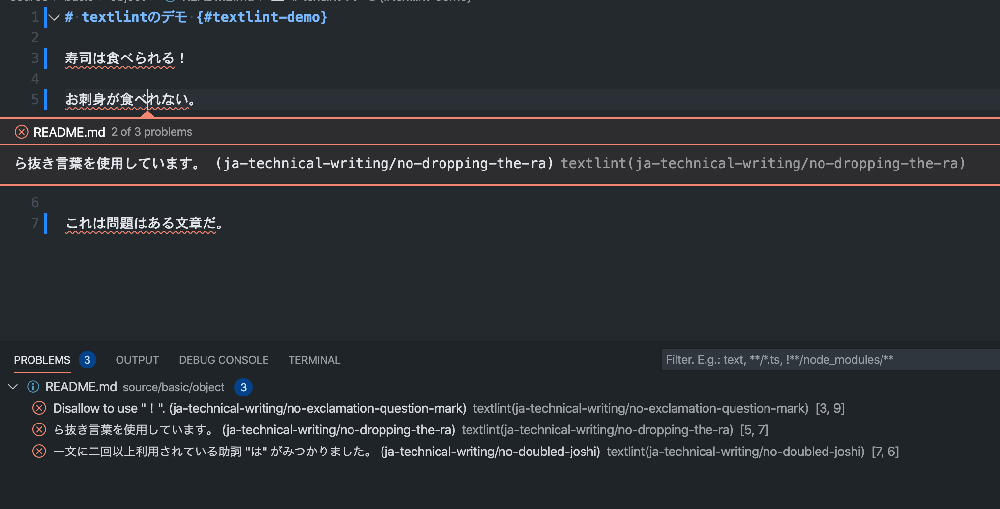
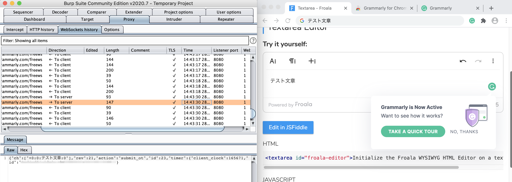
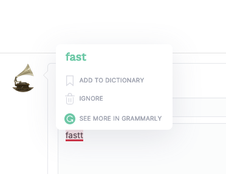
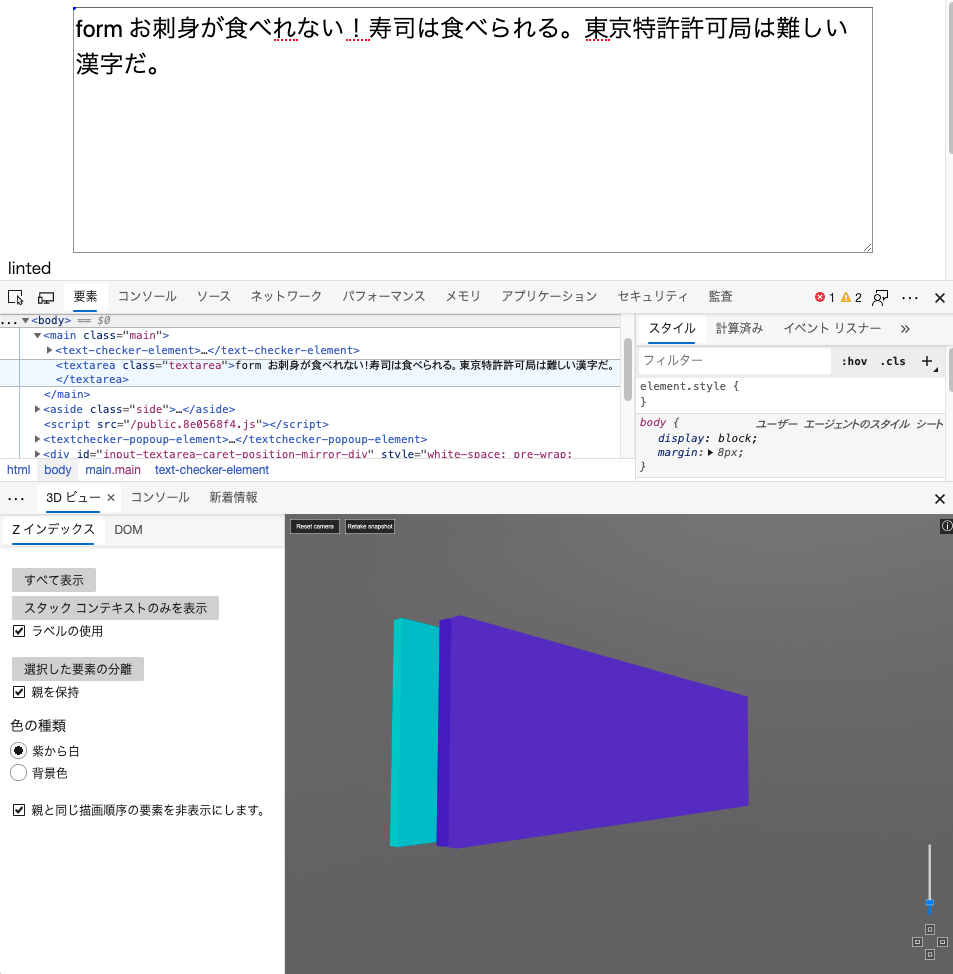
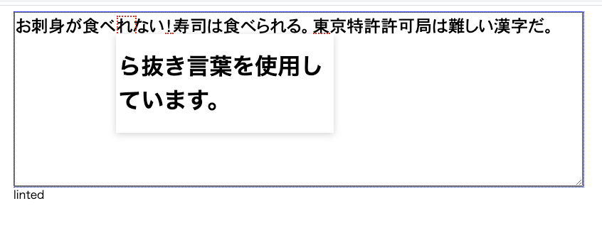
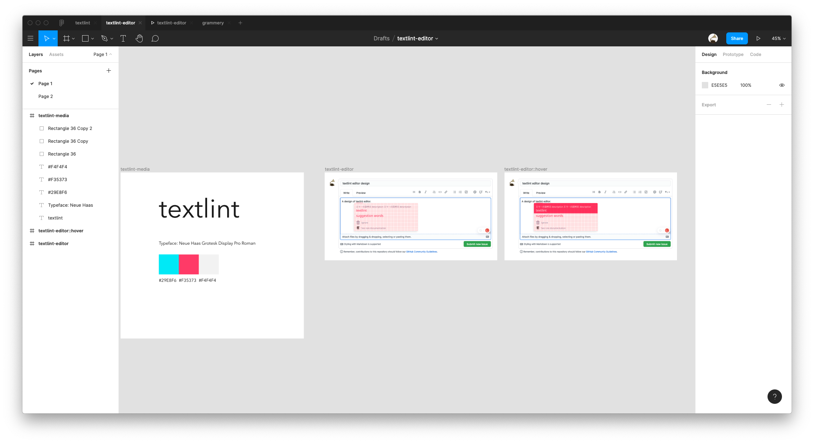
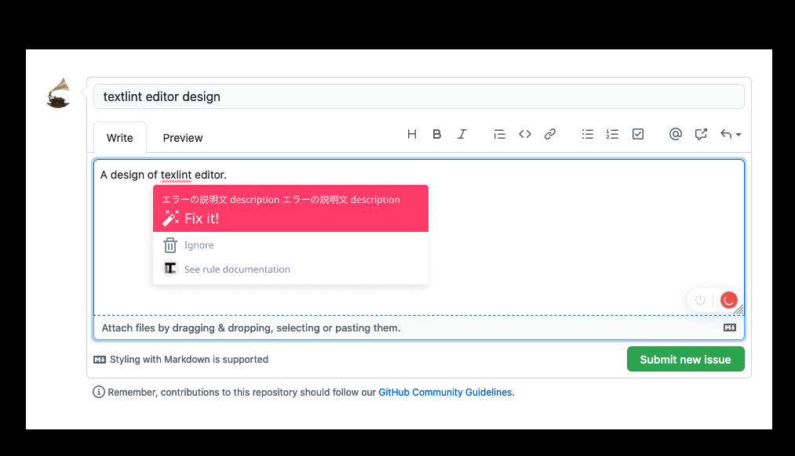

autoscale: true

# textlint editor - ブラウザでも動くPrivacy Firstの文章校正ツールを作る話 

----

# 自己紹介


- Name : **azu**
- Twitter : @[azu_re](https://twitter.com/azu_re)
- Website: [Web scratch], [JSer.info]

[Web scratch]: http://efcl.info/ "Web scratch"
[JSer.info]: http://jser.info/ "JSer.info"

---

# テーマ

- [textlint](https://github.com/textlint/textlint)
- Privacy Firstな校正ツールを作る
- サーバにデータを送らずに、ローカルで文章のチェックをする

---

# textlintとは?

---

# [textlint](https://github.com/textlint/textlint)

- [textlint](https://github.com/textlint/textlint)JavaScriptで書かれた文章のLintツール
    - ESLintの文章版
- Markdown、Re:View、HTMLなど文章構造をパースしてからチェックする
    - 一般的なスペルチェッカーは構造を見ないので誤検知する
- [200弱ぐらいのルール](https://www.npmjs.com/search?q=textlint-rule)がある
    - [Collection of textlint rule · textlint/textlint Wiki](https://www.npmjs.com/package/textlint-rule-ng-word)
    - 日本語、英語、言語に依存しないルールなど
    - [textlint入門 (全11回) - プログラミングならドットインストール](https://dotinstall.com/lessons/basic_textlint)

----



----

## textlintのユースケース

- [Angular](https://github.com/angular/angular-ja)、[React](https://github.com/reactjs/ja.reactjs.org)、[Vue](https://github.com/vuejs/jp.vuejs.org)、[Nuxt.js](https://github.com/vuejs-jp/ja.docs.nuxtjs), [Next.js](https://github.com/Nextjs-ja-translation/Nextjs-ja-translation-docs)、[Gatsby](https://github.com/gatsbyjs/gatsby-ja)の公式ドキュメントの翻訳など
- 書籍: [JavaScript Primer](https://github.com/asciidwango/js-primer)、[Pythonクローリング&スクレイピング](http://d.hatena.ne.jp/keyword/%A5%B9%A5%AF%A5%EC%A5%A4%A5%D4%A5%F3%A5%B0)、[RustPrimer](https://github.com/rustcc/RustPrimer)、[SurviveJS - Webpack](https://github.com/survivejs/webpack-book)
- [VuePress](https://github.com/vuejs/vuepress)、[Cypress](https://github.com/cypress-io/cypress-documentation)、[日本マイクロソフト Azure Identity](https://github.com/jpazureid/blog)、[OWASP Cheat Sheet Series](https://github.com/OWASP/CheatSheetSeries)

---

# 文章に対するCI

- 文章に対するContinuous Integration(CI)を持ち込む
    - Continuous Writingするためのツール
    - [asciidwango/js-primer: JavaScript Primer - 迷わないための入門書](https://github.com/asciidwango/js-primer)とかで使ってる
    - 長期間書いていると人間のほうが変わってるので質が一定に保てない
    - jsprimerは5年ぐらい書いている
- そのためどちらかというと技術的な用途がメイン

----

# Easy的な使い方

- 今までもtextlintをラップしたものはあった
- [文書校正ツール textlint の Chrome 拡張を作った - もなでぃっく](http://io-monad.hatenablog.com/entry/2016/03/14/225800)
- [テキスト校正くん - Visual Studio Marketplace](https://marketplace.visualstudio.com/items?itemName=ICS.japanese-proofreading)

---

# [textlint/editor](https://github.com/textlint/editor)

---

# 目的

- Privacy Firstな[grammarly](https://grammarly.com/)を作る
- grammarlyのブラウザ拡張が便利だった
- → 今回作ったもの: [textlint/editor: textlint editor project.](https://github.com/textlint/editor)

----

# [grammarly](https://grammarly.com/)


---

# grammarlyの問題

- textareaに入力した文字が全てサーバに送られる仕組み 




---

# 類似するツール

- [grammarly](https://grammarly.com/)
- [Microsoft エディター](https://www.microsoft.com/ja-jp/microsoft-365/microsoft-editor)
- どちらもオフラインでは動かない、サーバに通信してその結果を表示する

---

# サーバに入力文字を送ることで起きる問題

- [DeepLでNetflix?の字幕を学習してる問題](https://twitter.com/_mi_co_n_/status/1283078591568216065)
- [Baisu IME ログ情報送信](https://ja.wikipedia.org/wiki/Baidu_IME#%E3%83%AD%E3%82%B0%E6%83%85%E5%A0%B1%E9%80%81%E4%BF%A1)問題

----

## DeepLの学習


- `-Now,`を翻訳するとNetflixっぽい字幕がでてくる
- [DeepL利用規約(無料版)](https://www.deepl.com/ja/pro-license#free)は入力データは全てDeepLのものとなる
    - 無料版のデータは学習に使うため保持することが記載されていた
    - [DeepL翻訳で機密は保持される？セキュリティは？ | ブログ | 株式会社ヒューマンサイエンス](https://www.science.co.jp/nmt/blog/21127/)

----

# Privacy Firstな校正ツールを作る

- [textlint](https://github.com/textlint/textlint)はJavaScriptで書かれている
- 基本的にルールもJavaScriptで書かれている
- そのため、オフラインでも動作する
- サーバにデータを送る必要がない

---

# textlintをブラウザで動かす

- 目標: [grammarly](https://grammarly.com/)のtextlint版を作る
- textlintは基本的にはNode.jsで動かしている
- ブラウザで動かすには依存を色々解決するものが立ち

----

# 5日でプロトタイピング

- ここから本題 20min
- 5日でtextlint editorを作る
- ブラウザでtextlintを動かす
- ブラウザ拡張であらゆるサイトでtextlintでのチェックを使えるようにする

----

# 1日目

----

# 1日目



- grammery的なUIを作るプロトタイピング
- あらゆるサイトで動かないと行けないのでWeb Componentsでコンポーネント作成
- → textareaに重ねるようにして要素を置くことで、一部に下線が出るようにするコンポーネント作る

---

# DEMO: <https://twitter.com/azu_re/status/1286309148758482945>

---


----



----

# 2日目

----

# 2日目

- 作ったUIにtextlintを組み込んでまずは実証
- 既存の[textlint-browser-runner](https://github.com/mobilusoss/textlint-browser-runner)を使ってintegration
- → あらゆるtextlintルールをどうbundleをどうするか考える
- → 動いた

---

# textlintのbrowser版はなんでビルドが必要?

- textlintはすべてがpluggable
- textlintのルールを個人に合わせる仕組みが必要
- 同じ人でもルールは文章によって違う

---

# 2日目: textlintのbundleをどうするか?

- 方法
    - 全部入りのbundleを作る
    - 全部オンラインロード
    - ルールだけをパッケージするか

---

# 2日目: bundle prototype

- 全部入りのbundleを作る
    - [@zeit/ncc](https://www.npmjs.com/package/@zeit/ncc)でbundle
    - → うごいた
    - webpackでも動くのは過去からわかってる
- 全部オンラインロード
    - PikaCDN, Skypackを使ってルールを読み込む
    - → ローカルでのビルドが不要というのが大きなメリット

----

# textlintのbrowser版はなんでビルドが必要?

- [Skypack](https://www.skypack.dev/)との格闘
- CDNでのビルド済みファイルの利用
    - [mizchi/uniroll](https://github.com/mizchi/uniroll)でのビルド
        - importしたモジュールをCDNからロードするようにしてビルドする
    - [Rename Pika to skypack by azu · Pull Request #10 · mizchi/uniroll](https://github.com/mizchi/uniroll/pull/10)
    - [Support "module" field by azu · Pull Request #690 · textlint/textlint](https://github.com/textlint/textlint/pull/690)
- いくつか対応してunirollでtextlintが動いた！
    - <https://twitter.com/azu_re/status/1286657627032678400>

----

# 3日目

----

# npm CDNの問題

- skypackでは`require("pkg/file")`がtranspileされない仕様
    - `pkg`モジュールの相対パスの`file.js`を読み込む仕組み
- [Lookup a Package File](https://docs.skypack.dev/lookup-urls/lookup-urls#lookup-a-package-file)
    - そのため direct requireしてるライブラリがどこかにあると動かない
    - 回避するためにはライブラリガワがbundleファイルを配布してくれないとできない
    - [feat: use microbundle for distribution by azu · Pull Request #15 · textlint/textlint-util-to-string](https://github.com/textlint/textlint-util-to-string/pull/15)
- → 現実的にあらゆるルールで担保するのは難しい
    - 断念

---

# webpack as a service

- nccやwebpackでtextlintはビルドできる
- → webpack as a serviceを考える
    - [codesandbox](https://codesandbox.io/)を使えば、webpackでビルドしたファイルをブラウザだけで取得できそうな予感がした
    - どちらにしてもだいたいの人は配布されたファイルを使うだけでいい
    - 高度な使い方をする人は自分のtextlintrcを持っているはず → node環境がある
    - → つまり textlint + textlintrcからbundleを作成できるコンパイラーを書けば解決できそう

---

# [@textlint/compiler](https://github.com/textlint/editor/tree/master/packages/%40textlint/compiler)

- textlintのルールは仕組み的にdynamic requireで解決している(textlintが依存を知らないため)
    - ESLintなど多くのルールをもつツールはだいたい同じ仕組み
    - dllみたいなもの = ルール
- [@textlint/compiler](https://github.com/textlint/editor/tree/master/packages/%40textlint/compiler)を作成する
    - webpackに優しいコードを出力する

----

# [@textlint/compiler](https://github.com/textlint/editor/tree/master/packages/%40textlint/compiler)

- このルールをcompilerがコンパイルしやすいように、静的な形に整形するlinkerを書く
- `.textlintrc`(設定ファイル) → staticな`require`に変換するlinker
    - 実体は[config loader](https://twitter.com/azu_re/status/1286952957754273793) + code generator
    - <https://twitter.com/azu_re/status/1286952957754273793>
- コンパイルの処理自体ははwebpackに生成したコードを投げる

----

# 4日目

----

# リアルタイムLint

- ブラウザで動くなら入力ごとのLintしたい
- web workerの対応
    - 入力文字における処理はWebWorkerなど別スレッドで行うのが基本
    - コメント入力はレイテンシーに弱い 許されるのは 5ms以内ぐらい
    - webworkerに対応したtextlintを作成する
    - `@textlint/kernel`(コア)はpure jsで書かれているので、postmessageのラッパーを書くだけで解決
    - [`target: self`で解決](https://twitter.com/azu_re/status/1287015063870562305)

---

# kuromoji.jsの辞書解決

- textlintのルールでは一部のルールがkuromoji.jsでの形態素解析を使ってる
- この辞書が圧縮して20mbぐらいある(無圧縮は100mb)
- この辞書を毎回ロードしててる大変
- worker内でキャッシュ、同時に取得した時に1回の取得にまとめる必要がる

---

# kuromoji.jsの辞書ハック

```js
// InMemory Cache
const dictionaryDeferred = new Deferred();
const urlMap = new Map();
BrowserDictionaryLoader.prototype.loadArrayBuffer = async function (url, callback) {
    // https://github.com/takuyaa/kuromoji.js/issues/37
    const fixedURL = url.replace("https:/", "https://");
    const cachedDictBuffer = await dictionaryStorage.get(fixedURL);
    if (cachedDictBuffer) {
        // console.log("return cache", cachedDictBuffer);
        return callback(null, cachedDictBuffer);
    }
    // Suppress multiple request to same url at same time
    if (urlMap.has(fixedURL)) {
        return urlMap.get(fixedURL).promise.then(result => {
            callback(null, result);
        }).catch(error => {
            callback(error);
        });
    }
    const deferred = new Deferred();
    urlMap.set(fixedURL, deferred);
    fetch(fixedURL).then(function (response) {
        if (!response.ok){
            return callback(response.statusText, null);
        }
        response.arrayBuffer().then(function (arraybuffer) {
            var gz = new zlib.Zlib.Gunzip(new Uint8Array(arraybuffer));
            var typed_array = gz.decompress();
            return dictionaryStorage.set(fixedURL, typed_array.buffer).then(() => {
                // console.log("cached", fixedURL);
                deferred.resolve(typed_array.buffer);
                callback(null, typed_array.buffer);
            });
        });
    }).catch(function (exception) {
        deferred.reject(exception);
        callback(exception, null);
    });
};
```

----

# 辞書ハック

- [prototype hackをしてる](https://github.com/textlint/editor/blob/master/packages/%40textlint/compiler/src/CodeGenerator/worker-codegen.ts)
- ちゃんと解決するにはkuromoji.js自体をイジる必要がありそう
- dictionary loaderを外から使えるようにしないとダメそう
- forkしかないのかも

----

# ここまで



- ブラウザでIntegrations
    - 1日目に作ったUI
    - 2日目は仮説検証 → 断念
    - 3-4日目に[@textlint/compiler](https://github.com/textlint/editor/tree/master/packages/%40textlint/compiler)で生成したtextlint bundleを読み込む
    - [統合して動かすデモ](https://twitter.com/azu_re/status/1287332379422420993)

---

# 5日目

- ブラウザ拡張を作る
- web extension firefox + chromeとかに対応する
- [WebExtension Toolbox](https://github.com/webextension-toolbox/webextension-toolbox)を採用
- メンテにちょっと不安感あるけど、configを減らして運用でカバー ejectable

----

# Chrome拡張での検証

- [x] WebWorkerをBackground Pageで動かす
- [x] Content Scriptsで1日目のUIをあらゆるサイトにInject
    - Content ScriptsでWeb Componentがうごかない！！！
    - これ絶対Chromeおかしい！！！
    - [390807 \- Content scripts can't define custom elements \- chromium](https://bugs.chromium.org/p/chromium/issues/detail?id=390807)
    - [`import '@webcomponents/custom-elements'`を使うことで回避](https://github.com/textlint/editor/blob/f730051ca2e1237947100ec62072b4ae39a2d8e0/packages/webextension/app/scripts/contentScript.ts#L1-L2)
    - WebComponentをWebComponentのpolyfillで動かすことで回避
- UI → Content Scripts → Background Pages → WebWorker(textlit)
    - Lintに成功

----

# デザインを書く



- デザインを描いていく
- figmaでいくかデザインのパターンを書く
- <https://www.figma.com/file/9kRm0Cr869zbdACytRE74R/textlint-editor?node-id=0%3A1>

----



----

# デザインを実装する

- Figmaで書いたデザインを実装する
- [textchecker-element](https://github.com/textlint/editor/tree/f730051ca2e1237947100ec62072b4ae39a2d8e0/packages/textchecker-element)
- ひとまず完成！

----

# textlint editor

## <https://textlint-editor.netlify.app/>

----

# デモ: <https://twitter.com/azu_re/status/1288038759192174593>

----


----

# まとめ

- UIはWebComponents
- コアは最初からPure JavaScriptで書いておく
    - ちょっとしたNodeライブラリならwebpackでなんとかできる
- skypackのCDNはRollup系なのできれいなビルドができる
    - キレイじゃないライブラリは使えない
    - Node.js exportsとかがこれからくるので、きれいな方法がまだ定義されていない
- textlint + ルールを一つにbundleしてオフライン校正ツールが動いた!

---

# これから

- Collaboratorを募集！
    - Repository: [textlint/editor: textlint editor project.](https://github.com/textlint/editor)
    - Gitter: <https://gitter.im/textlint-ja/textlint-ja>
- ブラウザで動けば大体のところで動く
    - サイトに組み込みしやすい、サーバ側に遅れたデータを管理しなくていい単語
    - → 同じ仕組みでウェブサイトに組み込みができる

---

# これから

- frontend
    - suggest対応
    - ignore対応
    - see document対応
- compiler
    - codesandboxでコンパイルしたものを配布するテンプレート
- performance
    - 今はlintが10msぐらい、文字数に応じて線形的に処理が増える
    - ちゃんと考えるなら差分処理が必要だけど、文章にはコンテキストがあるので制限がある
    - WebWorkerのおかげでUIにはlatencyは少ないので、1sぐらいならOK
    - 現実的にtextareで10kbレベルの文章を書く人は少なくて、ファイルを分けるからなんとかなる
    - DOMの最適化が必要。表示してるエリア飲みに情報を表示するなどの最適化が必須
- 拡張
    - Chrome拡張にtextlint bundleを更新する仕組みを作る
    - textlint.jsをダウンロードしてChrome拡張で使うものを切り替え → Workerを再起動
    - storeの公開がめんどうくさいのでどうする?
- ルール: まだ動かないルールもあるはず

---

# おわり

- 現在はprototypeができた段階、ちゃんと使えるものにする必要がある
- 興味がある人はCollaboratorとして参加してください。
- Summary Issue: <https://github.com/textlint/editor/issues/4>
- [textlint/editor: textlint editor project.](https://github.com/textlint/editor)