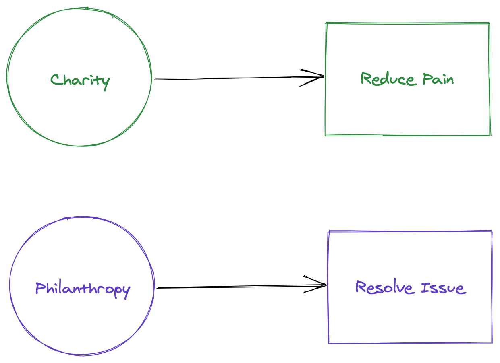
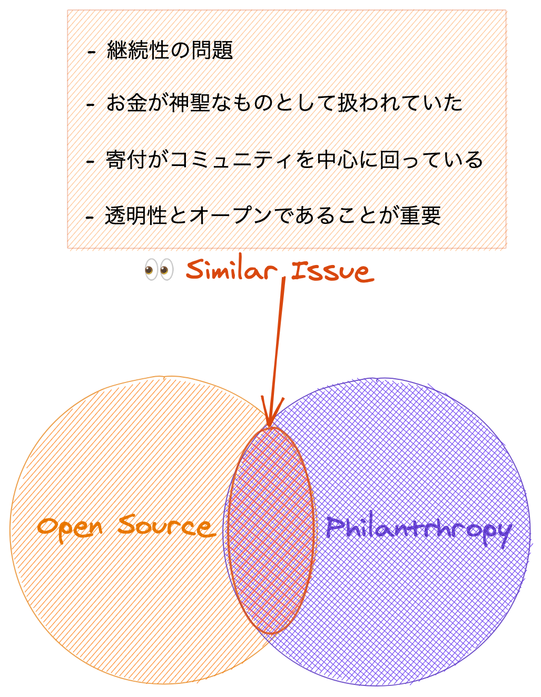
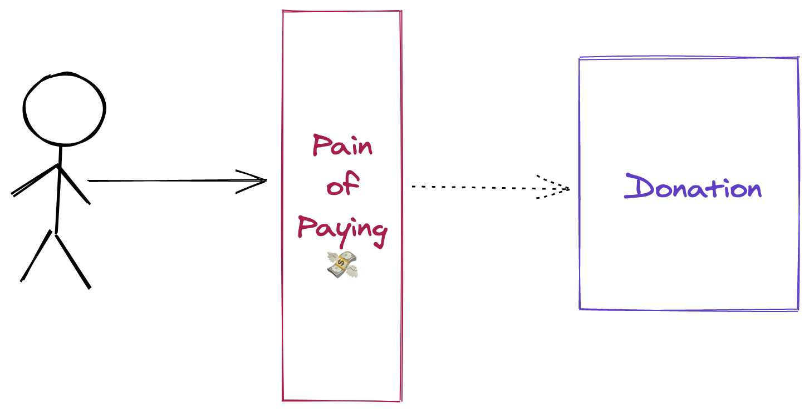
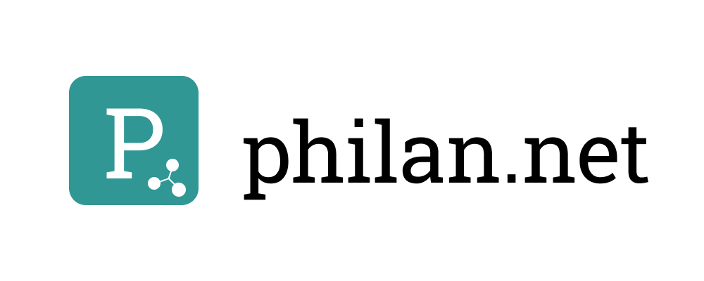
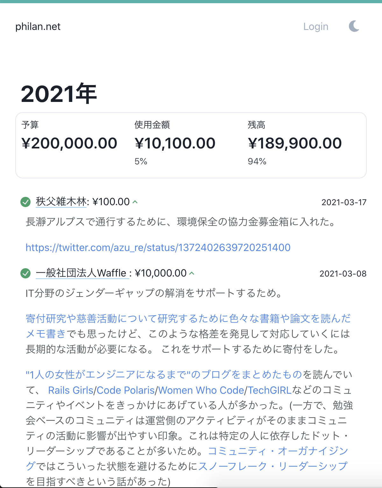
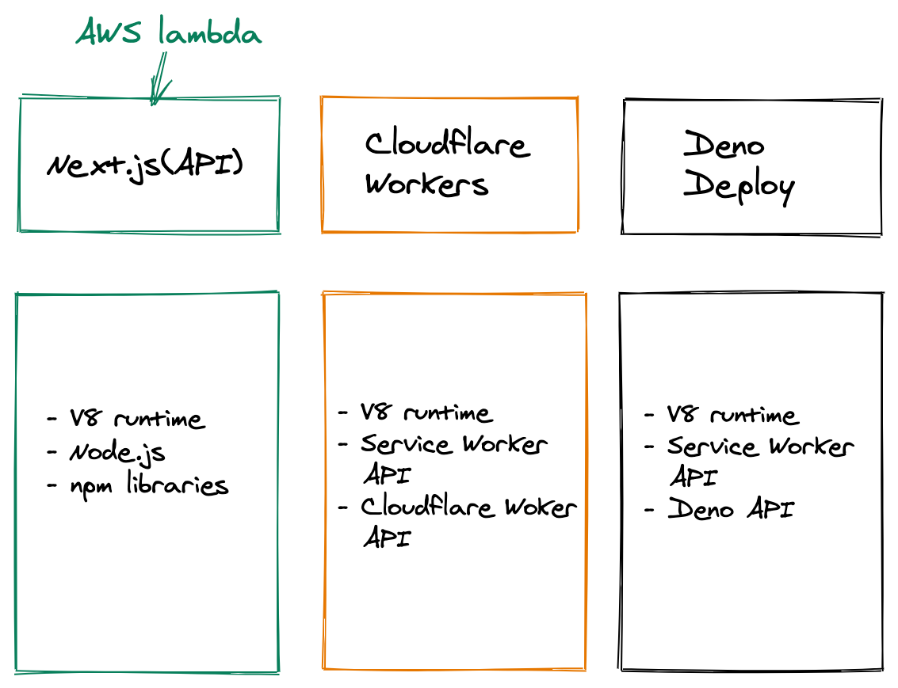
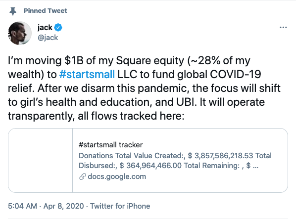
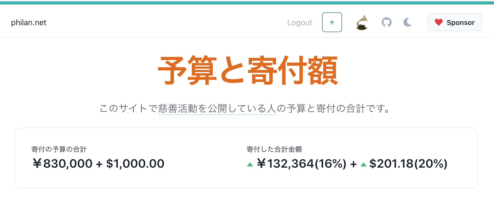
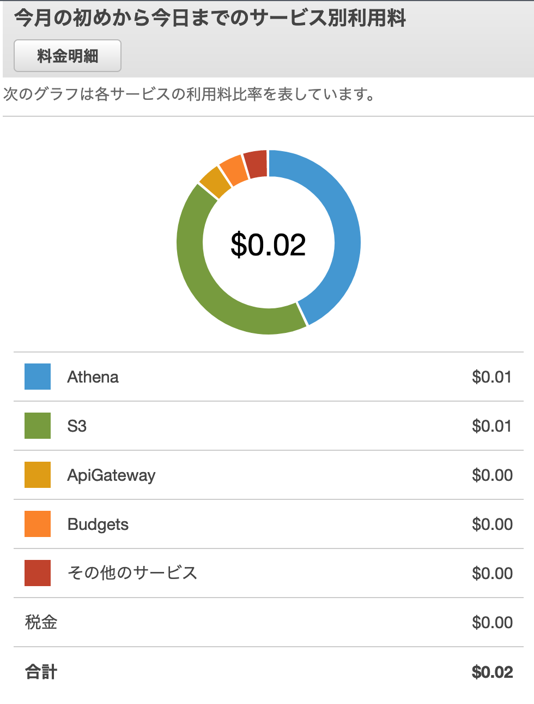

autoscale:true

# オープンソースと慈善活動と寄付と

## [fit] 寄付するために寄付管理プラットフォームを作る話

---

# 自己紹介

- Name : **azu**
- Twitter : @[azu_re](https://twitter.com/azu_re)
- Website: [Web scratch], [JSer.info]

[Web scratch]: http://efcl.info/ "Web scratch"
[JSer.info]: http://jser.info/ "JSer.info"

----

## Disclaimer

- この資料は自分用にまとめたものです
- 寄付、慈善活動が良いか悪いかについて議論しません
- まだ学問のように体系がしっかりしているわけでもないので、現時点の解釈が多く入ります
  - それっぽい事実はあるけどあくまでそれっぽいだけ

----

## アウトライン

- 寄付/慈善活動について勉強していた
- オープンソースの課題との類似性が高そうと思った
- オープンソースでの重要性として透明性を認識していて、寄付に関しても透明性が重要視されている
- また寄付を躊躇する問題は予算のプレコミットメントで解決できるかも
- [philan.net](https://philan.net/) つくってみた
- 課題が見えてきた

----

# 慈善活動への興味

- 最近、寄付研究とかファンドレイジング[^Fundraising]というような分野があるのを知った
- 慈善活動や寄付について調べるのに色々な書籍や論文を読んで、寄付をするための仕組みを作るなどした
- 詳しい経緯は次の記事にまとめた
- [寄付研究や慈善活動について研究するために色々な書籍や論文を読んだメモ書き | Web Scratch](https://efcl.info/2021/02/19/donation-philanthropy-study/)

[^Fundraising]: NPOなどで寄付などの活動のための資金を集めること、またはそれを仕事にする人

----

# 慈善活動について

- 慈善活動は大きく分けて2つに分類されている(ことが多い)
- Charity: Reduce Pain
  - 緊急性の高い問題に対して、その問題の影響を小さく軽減するためにする即時的なアプローチ
- Philanthropy: Resolve Issue
  - 問題の根本原因を特定し、その原因を解決することで社会問題を解消する目的のアプローチ

---

## CharityとPhilanthropy

> 例: ある地域が干ばつに見舞われて水が不足している

- Charity的なアプローチ
  - 水を届ける
- Philanthropy的なアプローチ
  - 水が不足しないように井戸を掘る
  - 雪止め水を山から引いて川を作る

---

## CharityとPhilanthropy

> 例: 特定のコンポーネントに負荷が集まりやすい設計になっており、アクセスが集中してサービスが落ちてしまった[^ex]

- Charity的なアプローチ
  - 暫定的なパッチを当てて落ちないようにする
  - お金を払ってサーバをより性能が高いマシンにする
- Philanthropy的なアプローチ
  - サーバが落ちないよう(パフォーマンスがでるよう)に設計を見直して修正する
  - 負荷が高くなったら自動的にスケールするように設定する

[^ex]: それぞれのアプローチにそれっぽい例を当てはめただけなので、実際の意味合いとは関係がない例です

---

## CharityとPhilanthropy

- 個人的に今まで「慈善活動」や「寄付」をCharityの読み方をしていた
- 同じ「慈善活動」を意味する言葉でもアプローチの違いがあることを知った
- 実際に問題の解決にはどちらのアプローチも必要
  - Charityは即時的に影響を軽減する
  - Philanthropyは根本的な問題を解決するが時間がかかる

^ 個人的な思考としては、問題解決にはどちらもセットだが、Philanthropy的なアプローチに時間を使いたい(というよりは時間が必要)
- あるバグがあったときに、FAQというドキュメントで回避する
- だけでおわりではなく、バグ自体を修正することに時間を使う

---

## Philanthropyとオープンソース

### オープンソースで見る問題と似たような話があるなーと思った [^open source]

[^open source]: ここでのオープンソースはOSIの[オープンソースの定義](https://ja.wikipedia.org/wiki/%E3%82%AA%E3%83%BC%E3%83%97%E3%83%B3%E3%82%BD%E3%83%BC%E3%82%B9%E3%81%AE%E5%AE%9A%E7%BE%A9)を参照

---

## Philanthropyとオープンソース

- 継続性の問題
  - オープンソースは属人性がある [^GitHub, 2015]
  - 寄付のみではなく、助成金や事業収益で継続している慈善団体が多い [^NPO, 2017]
- お金が神聖視されていた
  - 近年では{慈善活動,オープンソース}でも利益を得る事自体は問題ないという意見を見ることが増えた[^要出典]
  - 慈善活動では得た利益を社会へ還元するのが目的[^Bill Drayton, 1987]
  - その過程で利益を使って人を雇うなどは、還元する価値を最大化するための活動と捉えられる

[^GitHub, 2015]: [npmの93%のモジュールはメンテナが1人 @ 2014、GitHubで人気のあるプロジェクトの2/3はメンテナが1~2人 @ 2015](https://increment.com/open-source/the-rise-of-few-maintainer-projects/)

[^NPO, 2017]: [NPOの収益のうち寄付金の割合は20%にも満たない](https://www.npo-homepage.go.jp/uploads/h29_houjin_houkoku.pdf)

[^Bill Drayton, 1987]: 1987年Bill Draytonが社会起業家という概念を持ち込みこの傾向が強くなったと考えられる - [Pragmatic Philanthropy](https://www.palgrave.com/gp/book/9789811071188)

^  1987年にBill Draytonが健全な管理、透明性のある会計、戦略など基本的なビジネスの信条をNPOにも持ち込んだ。
営利組織は利益の最大化だが、非営利組織は社会への還元の最大化が目的。この社会への還元の過程において利益を発生させないというのは問題を難しくして動きにくくする。その目的から逸れない限り、利益を得るのは妥当で、その利益で優秀な人を雇って、その社会問題を解決するという話。
NPOは、助成金などのフローであるお金に制限されている部分があり、利益はストックして(社会問題に対して)自由に使えるお金を持つという話。
^ 強いて言うなら <https://opensource.guide/getting-paid/> とか、こういうドキュメントなども見かけることが増えた。

----

## Philanthropyとオープンソース

- 寄付とコミュニティ
  - オープンソースに寄付する人は開発者が中心[^要出典]
  - 慈善活動する動機は個人的な経験と紐付いていることが多い [^Miller＆Ratner、1998]
  - 一方で、個人的な経験と紐付かないことに対しての慈善活動や寄付は躊躇する[^Ratner＆Miller、2001]
  - → 特定のカテゴリの慈善活動に関連する人は特定のカテゴリに関係する人が中心となる傾向

[^Deborah A.Small 2007]: <https://www.sciencedirect.com/science/article/abs/pii/S0749597806000057>

[^Miller＆Ratner、1998]: [Self-interest is overestimated](https://www.researchgate.net/publication/344629108_Self-interest_is_overestimated_Two_successful_pre-registered_replications_and_extensions_of_Miller_and_Ratner_1998)

[^Ratner＆Miller、2001]: [The norm of self-interest and its effects on social action](https://pubmed.ncbi.nlm.nih.gov/11474725/)

----

## Philanthropyとオープンソース

- 透明性とオープンであること
  - オープンソースはソースコードがOSIライセンスされているという意味もあるが、プロセスがオープンであることも重要視されている[^tantek, 2012] [^aturon, 2018]
  - 寄付をしない理由として「寄付先への不信感」「寄付金の使い方が不明瞭」などの不信が主要な理由となっている　[^中島, 2019]

[^tantek, 2012]: [Conclusion](https://tantek.com/presentations/2012/01/open-web/#slide126) of [Open Standards Stories & Practices](https://tantek.com/presentations/2012/01/open-web/)

[^aturon, 2018]: RustのRFCプロセスについて - [aturon.log: listening and trust](https://aturon.github.io/tech/2018/05/25/listening-part-1/)

[^中島, 2019]: [寄付に関する動機の構造](https://core.ac.uk/download/pdf/228068334.pdf)

[^要出典]: 出典がありません。ただの想像です。

----

# 信頼と透明性

- 個人的には、オープンソースでは信頼と透明性が重要だと考えている
  - プロセスが公開されてなくてもオープンソースではある
  - しかし、信頼できるものはプロセスもオープンである傾向がある[^RFC]
- 慈善活動においても信頼と透明性が重要
  - 特定の場所へ寄付しない理由としては、信頼と透明性が主な理由としてあがる
  - 信頼の欠如(Trust Deficit)が歴史的に発生していて、アジア圏の寄付文化に影響がでていた[^Pragmatic Philanthropy, 2018]

[^RFC]: Rust, React, Angular, Vueなど著名なプロジェクト、ECMAScriptなどもオープンなプロセスを持っている

[^Pragmatic Philanthropy, 2018]: [Pragmatic Philanthropy](https://www.palgrave.com/gp/book/9789811071188)はアジア圏の寄付文化についてまとめた書籍

----

# 似てるけど違うもの

- オープンソースとPhilanthropyは同じものではない
- しかし、似ているところがある
- もっと詳しく知っておくことで、オープンソース活動にもいかせそう

----

# 似てるのでもっと知りたい

- 個人的にオープンソース活動はずっとやっている[^azu, 2020]
- 慈善活動について調べていると色々な話題につながっていて面白い
- 慈善活動についてもっと知りたい
- → シンプルに寄付を実践してみることで継続的に学ぶ

[^azu, 2020]: 今年のオープンソース活動振り返り [2014](https://efcl.info/2014/12/31/oss-in-2014/),[2015](https://efcl.info/2015/12/31/oss-in-2015/),[2016](https://efcl.info/2016/12/31/oss-in-2016/),[2017](https://efcl.info/2017/12/30/oss-in-2017/),[2018](https://efcl.info/2018/12/31/oss-in-2018/),[2019](https://efcl.info/2019/12/31/oss-in-2019/),[2020](https://efcl.info/2020/12/31/open-source-in-2020/)

----

# なぜ知りたいか

- 自分自身もGitHub Sponsorsでいろいろな人にサポートされている[^厳密には寄付ではない]
  - [Sponsor @azu on GitHub Sponsors](https://github.com/sponsors/azu)
- 個人だけではなく企業からスポンサードされている
  - [GitHub Sponsorsを使って「企業」として寄付をした話 - Cybozu Inside Out | サイボウズエンジニアのブログ](https://blog.cybozu.io/entry/2021/03/19/110000)
- オープンソース活動における支援の形としての寄付について興味があった

[^厳密には寄付ではない]: 取得した収入は、寄付や贈与ではなく雑所得して扱っている。[azu/github-sponsors-tax: GitHub Sponsorsの確定申告手順](https://github.com/azu/github-sponsors-tax)にまとめた 

----

# 寄付の実践

----

# 寄付を実践する際の課題

- 寄付は難しい
  - お金を手放さないといけないという苦痛
  - どこへ寄付すればいいかという選択の難しさ
  - 寄付したことによる結果の確認方法(レスポンス)
- 寄付をするときに発生する課題がある

----

# お金を手放す苦痛の緩和

- 人は何か対価を得られる(長期的)と分かっていても、お金を手放すという行為(短期的)に苦痛を感じる[^Pain of paying]
- お金を手放す苦痛を緩和するには、事前に予算を決めておくプレコミットメントが有効[^The Science of Giving, 2011]
- → 寄付するお金の予算を管理するツールを作ってみれば寄付がしやすくなるかも

[^Pain of paying]: [Pain of paying - Wikipedia](https://en.wikipedia.org/wiki/Pain_of_paying#Other_Theories_on_Payment_Methods)

[^Wertenbroch, 1998]: [Consumption Self-Control by Rationing Purchase Quantities of Virtue and Vice](https://pubsonline.informs.org/doi/abs/10.1287/mksc.17.4.317)

[^The Science of Giving, 2011]: [The Science of Giving: Experimental Approaches to the Study of Charity](https://www.amazon.co.jp/dp/B004QM9VT4/)

^ 寄付をしやすくするには知覚する利益を大きくする方法と、知覚する不利益を小さくする方法がある。
お金を手放すという知覚する不利益によって、寄付をするという行為が阻害される可能性を研究した研究がある。
Zellermayer (1996)、Prelec and Loewenstein’s (1998)、
長期的に利他的に慈善活動をしたいという目標があるときに、
寄付という行為は短期的な苦痛(お金を手放す)を発生させてしまうため長期的な目標を阻害してしまう。
この[Pain of paying](https://en.wikipedia.org/wiki/Pain_of_paying)は現金と小切手が高く、クレカや携帯での決算は薄くなる
また、事前に使う予算を決定しておくことでこの苦痛を緩和できる。
できれば、お金を手に入れる前に事前コミットメントをしておくのが良い(手に入れてからだと曖昧になる)

<!-- In sum, there are many reasons to believe that precommitment should be able to increase charitable donations: several psychological processes should reduce the impact of the pain of paying at a later point in time, various precommitment strategies are already frequently used by charitable organizations, and an empirical study that directly examined the impact of precommitment found convincing evidence of its beneficial effect. Indeed, we predict that people should generally be more likely to donate to charities when they are more removed from the actual donation. However, there may be boundary conditions for this effect, and even times when it may backfire. In particular, precommitment may only be effective when donors are more distant from the money being donated rather than simply more distant from the act of donating. That is, asking people to delay donating money that they already have (as is common with pledges) may result in decreased rather than increased donations. ( 寄付から遠い人ほどプレコミットメントが有効。近い人に先延ばし的な寄付の予約は逆効果) -->

----

# 寄付するお金の予算を管理する

----

---

# [philan.net](https://philan.net/)

- 寄付の予算を決めて、寄付の内容(寄付先/金額/日付/理由)を記録するサービス
- 記録したデータは各自のGoogle SpreadSheetに保存される
  - [philan.net](https://philan.net/)が潰れてもデータが残る ♻️

----

----

# [philan.net](https://philan.net/)の主な目的

- 寄付の予算を事前に決めることで、寄付するときに苦痛を減らす
- 寄付する側、寄付される側どちらも透明性が重要であるため、寄付の透明性を公開で作ってみよう的な仕組み[^why]
- Philanthropyは長期的に行う必要があるので、開発しながら学ぶ

[^why]: philan.netの寄付のメモ欄が"Why?"となっているのはこれが理由

----

# [philan.net](https://philan.net/)の構成

> [Next.js](https://nextjs.org/) + [Cloudflare Workers KV](https://www.cloudflare.com/ja-jp/products/workers-kv/) + [Googleスプレットシート](https://www.google.com/intl/ja_jp/sheets/about/)

----

# Why? Next.js

- Performance
  - SSG/SSR/ISR/CSRを使い分け[^note]
- Easy to Develop
  - Lambda/Cloudflare Workesに比べてserverlessのAPI開発が楽
  - Deployがgit pushだけなので2分でVercelにデプロイできる

[^note]: SSGはデプロイ時、SSRは一貫性、ISRはN分以内に反映されれば良い結果整合性(ユーザーコンテンツ)、CSRはプレビュー時

----

# Why? Next.js, Not Clouflare Workers

- [VercelはLambda](https://vercel.com/docs/serverless-functions/introduction)なのでNode.jsの資産が使える
  - セッション管理、認証、Google APIクライアントなどを一から書かなくていい
- [Cloudflare Workers](https://workers.cloudflare.com/)は早いがNode.jsの資産が使えない
  - Node.jsのAPIに依存したモジュールは使えない
- [Deno Deploy](https://deno.com/deploy)はCloudflare Workers Compatible API
  - しかし、Denoの[エコシステム](https://deno.land/x)が使える所に差が出てくる

----

# Why? [Cloudflare Workers KV](https://www.cloudflare.com/ja-jp/products/workers-kv/)

- [Cloudflare Workers KV](https://www.cloudflare.com/ja-jp/products/workers-kv/)はCloudflareのCDNをKVSとして使える(結果整合性)
- 頻繁に書き込む必要はないが、すばやく頻繁に読み取る必要があるユースケースに適している
- 特別 Workers KV を使ってる理由はない(面白そうだったから)
  - 最初はCloudflare Workers上で開発していた名残

----

# Why? [Googleスプレットシート](https://www.google.com/intl/ja_jp/sheets/about/)

- 寄付の記録はユーザー自身のものであることを明確にするため
  - SpreadSheetそのものを編集できる[^schema]
  - [philan.net](https://philan.net/)が消えてもデータが残る
- Twitter/Squareの[@jack](https://twitter.com/jack/status/1247616214769086465)も[SpreadSheetで寄付を管理](https://docs.google.com/spreadsheets/d/1-eGxq2mMoEGwgSpNVL5j2sa6ToojZUZ-Zun8h2oBAR4/edit#gid=0)している

[^schema]: [Definition of SpreadSheet Schema · Issue #22 · azu/philan.net](https://github.com/azu/philan.net/issues/22)

----

# Spreadsheet is not Database

> [Spreadsheets aren't databases—stop using them like one | Zapier](https://zapier.com/blog/database-vs-spreadsheet/)

- ロックフリーな書き込み方法が一種類しかない
  - `spreadsheets.append`のみが同時書き込み可能だが、formatなどを指定できない[^issue]
- バージョン管理はあるが、[APIでrevertができない](https://stackoverflow.com/questions/60149716/restoring-specific-version-of-spreadsheet-using-the-google-api)
  - マイグレーションがアプリのDBみたいな慎重さが必要
- [GOOGLEFINANCE](https://support.google.com/docs/answer/3093281?hl=en)関数が通貨換算ができるが、結構失敗する

[^issue]: <https://issuetracker.google.com/issues/36760568>

^ マイグレーションするために、バックアップツール、シートにコピーしてからマイグレーションし、失敗したらシートを消してrevertする処理などを書いている。APIでrevertができればどれだけ楽になるか

----

# philan.net における Spreadsheet

- 1ユーザー1SpreadSheet
  - これじゃない場合は基本的にSpreadSheetだと崩壊する
- 1 Spreadsheetにはデータの数にも限界がある(個人の記録なら限界には行かない前提)
- データはすべて取るしかない、フィルターして取るなどができない
- 1 SpreadSheetでは1種類のものごとに関係するデータのみを扱う

----

# [S3](https://aws.amazon.com/jp/s3/) + [Athena](https://aws.amazon.com/jp/athena/?whats-new-cards.sort-by=item.additionalFields.postDateTime&whats-new-cards.sort-order=desc) 

- 寄付の記録を追加するときに、統計処理用の公開データをS3に書き込んでいる
- S3に集めた公開データをAthenaを使って分析する
- サイト全体の統計データを出すのに利用している

---

----

# その他

- UI: [Chakra UI](https://chakra-ui.com/)
- アクセス解析: [Cloudflare Web Analytics](https://www.cloudflare.com/web-analytics/)
  - Cookieなどを使わない
- Logging: [Logflare](https://logflare.app/)
  - Vercelには永続ログの仕組みがない
- Domain: [Google Domains](https://domains.google.com/registrar?hl=ja)

----

# [philan.net](https://philan.net/)の詳細

- [寄付をするために、寄付の予算と寄付の記録をSpreadSheetベースでつける philan.net というサービスを作った | Web Scratch](https://efcl.info/2021/03/10/philan.net/)
- [Next.js + Vercel + Cloudflare Workers KV + Googleスプレットシートで寄付管理サービスを作った | Web Scratch](https://efcl.info/2021/03/12/next.js-vercel-cloudflare-workers-kv/)

-----

# サイドプロジェクトとServerless

- [Why serverless fits side-projects perfectly | Swizec Teller](https://swizec.com/blog/why-serverless-fits-side-projects-perfectly)
- Serverlessはコストが安い、つまり長期的に続けられる
  - 基本的なコストはだいたいDatabaseに依存する
  - [Jamstack](https://jamstack.org/)で使える[Free for developers](https://free-for.dev/)なサービスが多い[^caution]
- JSer.infoでも長期的に続けるために更新コストの最小化している
  - コストを小さくすることにはコストをかける
  - [JSer.info 10周年: JavaScript情報の集め方、書き方、まとめ方](https://jser.info/2021/01/16/jser-10th/)

[^caution]: Freeだから使うというよりは、原理的に安くなるアーキテクチャを設計するほうが重要

----

# philan.netのコスト

- ドメイン代: $14/year
- Vercel: $0 [^rate limit]
- SpreadSheet: $0
- Cloudflare: $0
- AWS: $0.02/month
- → Total: $15/year (2021-03現在の想定)

[^rate limit]: rate limitには達しない想定。<https://efcl.info/2021/03/12/next.js-vercel-cloudflare-workers-kv/>を参照

----

# 寄付する動機構造

- 自分はCharityよりもPhilanthropyに動機を寄せている
- Philanthropyは長期的な活動(水不足のために川を作るような話)
- 継続的に開発することで、継続的に学べる環境を作ることが目的
- 継続的に寄付するために[philan.net](https://philan.net/)を作った
- [azu/philan.net: Public Donation Management tool for Philanthropist.](https://github.com/azu/philan.net)
  - 開発そのものもオープンソースで公開してやっている

----

# まとめ

- 慈善活動について調べていると歴史、行動経済学、心理学、会社、企業、NPO、投資、資本主義、社会問題、コミュニティ、マネージメント、テクノロジーになど色々の話が出てくる(社会って感じ)
- 自分の興味であるオープンでも近い課題があるので、学ぶために色々やってみることにした
- まずは寄付するために寄付を管理する[philan.net](https://philan.net/)を作った

----

# 字余り

----

# 寄付の課題: 寄付先が分からない

- [SOLIO](https://solio.me/)
  - カテゴリを選ぶだけで寄付できるという性質を持っている
  - [寄付するジャンルを選ぶ３つの理由　solioのユーザーさんに聞いてみた｜solio｜note](https://note.com/solio/n/n330e285d4451)
- [philan.net/knowledge.md at main · azu/philan.net](https://github.com/azu/philan.net/blob/main/docs/ja/knowledge.md)
- [Discussions · azu/philan.net](https://github.com/azu/philan.net/discussions/categories/%E5%AF%84%E4%BB%98%E3%81%AE%E6%83%85%E5%A0%B1)

----

# お金以外の寄付

- モノの寄付
  - [Brand Pledge | 洋服・ブランド品寄付サービス](https://brand-pledge.jp/)
- [プロボノ - Wikipedia](https://ja.wikipedia.org/wiki/%E3%83%97%E3%83%AD%E3%83%9C%E3%83%8E)
  - [サービスグラント - 「プロボノ」 経験やスキルを活かしたボランティアを始めよう](https://www.servicegrant.or.jp/)

----

# 参考文献 0

- [寄付研究や慈善活動について研究するために色々な書籍や論文を読んだメモ書き | Web Scratch](https://efcl.info/2021/02/19/donation-philanthropy-study/) にまとめてある

----

# 参考文献 1

- [寄付の魅力｜渡邉文隆 | ファンドレイザー｜note](https://note.com/fwatanabe/n/n3a809181f8e6)
- [Microsoft Word - JEPS2019_1_TAKAHASHIetal - JEPS2019_1_TAKAHASHIetal.pdf](http://jepa.jp/wp-content/uploads/2019/10/JEPS2019_1_TAKAHASHIetal.pdf)
- [ResearchFund3.0 - 研究費のイマを言語化し、ミライを予想する - Key Session - YouTube](https://www.youtube.com/watch?v=EbcTYv2ws1U)
- 🌟 [寄付をしてみよう、と思ったら読む本 (日本経済新聞出版) | 渋澤健, 鵜尾雅隆 | ビジネス・経済 | Kindleストア | Amazon](https://www.amazon.co.jp/dp/B07KZMKKHK/)
- [Amazon | Just Giving: Why Philanthropy Is Failing Democracy and How It Can Do Better | Reich, Rob | Social Philosophy](https://www.amazon.co.jp/dp/069118349X/)
- 🌟 [Pragmatic Philanthropy - Asian Charity Explained | Ruth A. Shapiro | Palgrave Macmillan](https://www.palgrave.com/gp/book/9789811071188)
- [経済的な豊かさと寄付の心理的効用の関連](https://www.jstage.jst.go.jp/article/janpora/16/1/16_57/_article/-char/ja/)
- [コミュニティ・オーガナイジング――ほしい未来をみんなで創る５つのステップ | 鎌田華乃子 | NGO・NPO | Kindleストア | Amazon](https://www.amazon.co.jp/dp/B08M3NHFZJ/)

----

# 参考文献 2

- [Amazon.com: Charity and Philanthropy For Dummies eBook: Muth, Karl T., Lindenmayer, Michael T. S., Kluge, John: Kindle Store](https://www.amazon.com/dp/B00HTLCL32/)
- [Why Philanthropy Matters | Princeton University Press](https://press.princeton.edu/books/hardcover/9780691148625/why-philanthropy-matters)
- [非営利団体の資金調達ハンドブック | 徳永 洋子 | NGO・NPO | Kindleストア | Amazon](https://www.amazon.co.jp/dp/B08D94MWYF/)
- 🌟 [The Science of Giving: Experimental Approaches to the Study of Charity (The Society for Judgment and Decision Making Series)](https://www.amazon.com/dp/B004QM9VT4/)
- 🌟 [WORK DESIGN(ワークデザイン):行動経済学でジェンダー格差を克服する | イリス・ボネット, 大竹 文雄(解説), 池村 千秋 |本 | 通販 | Amazon](https://www.amazon.co.jp/dp/4757123590/)
- [「社会を変える」を仕事にする ― 社会起業家という生き方 | 駒崎弘樹 | NGO・NPO | Kindleストア | Amazon](https://www.amazon.co.jp/dp/B00VE1P84C/)
- [ロックフェラー回顧録](https://www.amazon.co.jp/dp/4105056514/)
- [企業と社会―サステナビリティ時代の経営学](https://www.amazon.co.jp/dp/4502331015/)
- [The Charitable Giving Market is Efficient After All](https://ssir.org/articles/entry/the_charitable_giving_market_is_efficient_after_all)
- 🌟 [NPO会計道/税理士 脇坂誠也 - YouTube](https://www.youtube.com/channel/UCpUlfipj3uh63yTirqimGAg)
- [日本の寄付研究アーカイブ　|　日本ファンドレイジング協会](https://jfra.jp/research/archive/)
