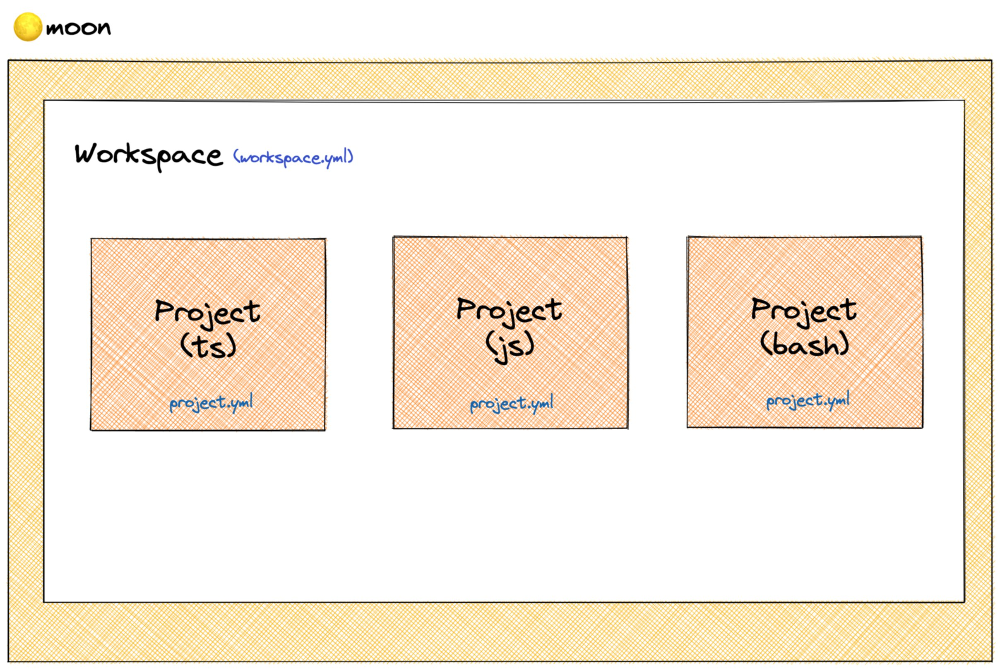
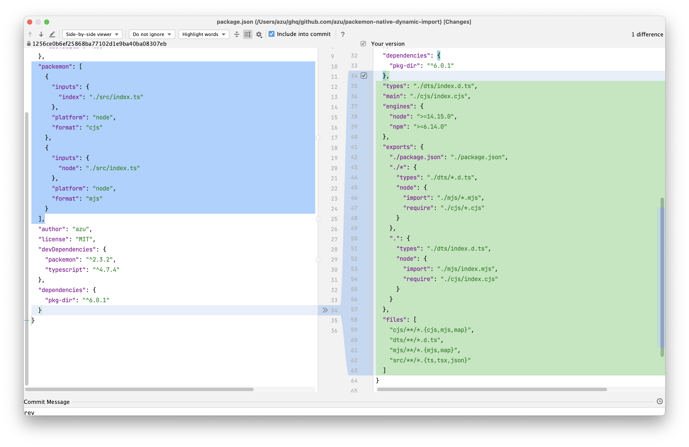

autoscale: true

# 🌕 moonでのmonorepo管理とpackemonでのCJS/ESMのdual package

---

# 🌕 [moon](https://moonrepo.dev/)

- 一貫性を持ったmonorepo管理ツール for JavaScript
- ハッシュを使ったファイルキャッシュ
- プロジェクトのパッケージ間の依存関係の分析とタスク実行
- Node.js/npmパッケージマネージャーのバージョン管理と一貫性
- TypeScriptのProject Referendcesの一貫性

---

## 比較

- [Nx](https://nx.dev/): The Framework + Pluginで拡張する
  - [Lerna](https://github.com/lerna/lerna): Nx傘下、ライブラリ公開向け
- [Turborepo](https://turborepo.org/): タスク実行の最適化をする
- [moon](https://moonrepo.dev/): monorepoでの一貫性を提供する
  - [Packemon](https://packemon.dev/): moonと同じ作者。ESM/CJSのライブラリ公開向け

---

## 比較(言語)

- [Nx](https://nx.dev/): TypeScript + C++[^1]
- [Turborepo](https://turborepo.org/): GoLang
- [moon](https://moonrepo.dev/): Rust 🦀


[^1]: Ref [Nx and Turborepo](https://github.com/nrwl/nx/blob/master/docs/shared/guides/turbo-and-nx.md)

---

# 🌕 [moon](https://moonrepo.dev/)

- 将来的なカバー範囲の予想
  - Nx >= 🌕 [moon](https://moonrepo.dev/) > Turborepo
- Moonでは、Remote caching/分散ビルドはこれから
- Moonは、プラグインというよりはコマンドなので、拡張性はNxの方が高そう

---

# 🌕 [moon](https://moonrepo.dev/)の特徴

- 一貫性
- Node.jsやnpmといった実行環境に関してもmoonで管理できる
  - [Volta](https://volta.sh/)に近い仕組み

---

# 🌕 [moon](https://moonrepo.dev/)のStructure

- Workspace: monorepoのルートのこと
  - チーム開発なら1つのチームがいるスペース
  - WorkspaceのNodeやパッケージマネージャーの環境を統一できる
- Project: 各Packagesのこと
  - client/server/commonみたいなパッケージなど
  - Project間の依存関係を管理して、常に同期できる

---



<!-- https://excalidraw.com/#json=lClSanznuad6OVV9O6hze,rSRNRuiJTfs6bEUEiHk_cg -->

---

# 🌕 [moon](https://moonrepo.dev/) 使い方のイメージ 1

- [.moon/workspace.yml](https://moonrepo.dev/docs/config/workspace)にワークスペースの設定を定義する
  - どのディレクトリをProjectにするか
  - Node/npm/TypeScript/VSC(git)などの共通設定
- [.moon/project.yml](https://moonrepo.dev/docs/config/global-project)にプロジェクトの共通タスクを定義する
  - [npm run-scriptからmigrate](https://moonrepo.dev/docs/commands/migrate/from-package-json)もできる
- `<プロジェクト>/project.yml`にプロジェクト固有のタスクを設定する

---

# 🌕 [moon](https://moonrepo.dev/) 使い方のイメージ 2

- `moon run <プロジェクト名>:<タスク名>` でタスクを実行できる
  - `client`の`build`を実行するなら`moon run client:build`
  - `moon run :build` で全てのプロジェクトの`build`を実行できる(`lerna run <script>`相当)
- 実行するタスクとそのプロジェクトがものは自動で実行される
  - プロジェクト([dependsOn](https://moonrepo.dev/docs/config/project#dependson))とタスク([deps](https://moonrepo.dev/docs/config/project#deps))に依存を定義できる
  - タスクの入力ファイルと出力ファイルに関しても依存を定義できる

---

# 🌕 [moon](https://moonrepo.dev/) 使い方のイメージ 3

- `moon run` でタスクを実行する前に、workspaceの定義と実行してる環境が一致するかをチェックしてる
  - 一致してないなら環境を一致させる[moon sync](https://moonrepo.dev/docs/commands/sync)が自動的に叩かれる
  - Node/npmのバージョン、TSの[Project References](https://www.typescriptlang.org/docs/handbook/project-references.html)の依存関係、ローカルのキャッシュの状態などが意識せずに合うように同期される
  - チーム開発での環境のばらつきが抑えられて一貫性が保てる

---

# 🌕 [moon](https://moonrepo.dev/)の特徴

- 意識しなくても常に`moon sync`が行われている
  - workspaceのNode.jsやnpmのバージョンを変更したら、自動的にバイナリがダウンロードされるし`.nvmrc`とかに同期される([syncVersionManagerConfig](https://moonrepo.dev/docs/config/workspace#syncversionmanagerconfig))
  - workspaceにprojectを増やしたら、TSの[Project References](https://www.typescriptlang.org/docs/handbook/project-references.html)が自動的に更新される([syncProjectWorkspaceDependencies](https://moonrepo.dev/docs/config/workspace#syncprojectworkspacedependencies))
  - Project間の依存は、package.jsonにも反映される([syncProjectReferences](https://moonrepo.dev/docs/config/workspace#syncprojectreferences))
- チーム開発で「変更入れたので、ローカルでこのコマンド実行しておいてください」みたいのが減る

----

# 🌕 [moon](https://moonrepo.dev/)の面白いポイント

- `moon ci`というCI向けのコマンドが用意されている
  - [Continuous integration | moon](https://moonrepo.dev/docs/guides/ci)
- project.ymlのタスクの定義に基づき、自動的にタスクが実行される
  - タスク側に `runInCI: false` となければとりあえず実行される

---

## 比較

- [Nx](https://nx.dev/): 全部入り、プラグインで拡張
- [Turborepo](https://turborepo.org/): シンプル、npm run-scriptの拡張レイヤー
- 🌕 [moon](https://moonrepo.dev/): 体験の一貫性

---

# 🔥 [Packemon](https://packemon.dev/)

----

# [Packemon](https://packemon.dev/)

- 🌕 [moon](https://moonrepo.dev/)と作者は同じ
- ESM/CJSのdual packageに対応したライブラリを公開する用途のbundler/build tool
  - Babel/rollupをいい感じにまとめて、package.jsonの設定も自動的に修正される

----

# [Packemon](https://packemon.dev/)の特徴

- `package.json`の`packemon`フィールドに出力形式を設定する と
- → 自動的に `main`/`exports`/`types`/`type`/`engines`など公開するための設定が追加される

----

```json
  "packemon": [
    {
      "inputs": {
        "index": "./src/index.ts"
      },
      "platform": "node",
      "format": "cjs"
    },
    {
      "inputs": {
        "node": "./src/index.ts"
      },
      "platform": "node",
      "format": "mjs"
    }
  ],
```

---

```json
  "types": "./dts/index.d.ts",
  "main": "./cjs/index.cjs",
  "engines": {
    "node": ">=14.15.0",
    "npm": ">=6.14.0"
  },
  "exports": {
    "./package.json": "./package.json",
    "./*": {
      "types": "./dts/*.d.ts",
      "node": {
        "import": "./mjs/*.mjs",
        "require": "./cjs/*.cjs"
      }
    },
    ".": {
      "types": "./dts/index.d.ts",
      "node": {
        "import": "./mjs/index.mjs",
        "require": "./cjs/index.cjs"
      }
    }
  },
  "files": [
    "cjs/**/*.{cjs,mjs,map}",
    "dts/**/*.d.ts",
    "mjs/**/*.{mjs,map}",
    "src/**/*.{ts,tsx,json}"
  ]
```

----



---

## Packemon: その他

- Babelを使ったCJS <-> MJSのinterop変換が実装されている
  - [Features & optimizations | Packemon](https://packemon.dev/docs/features#automatic-mjs-wrappers-for-cjs-inputs)
- [index-wrapper.mjs](https://packemon.dev/docs/features#presets)というCJSをMJSとしてラップして、[Dual package hazard](https://nodejs.org/api/packages.html#dual-package-hazard)を回避時する実装も持っている
  - requireとimportで別のファイルを読み込むと、insteanceofがコケる問題の回避


---


# 作ったもの

- [azu/file-cache: Node.js library that provide a cache for file metadata or file content.](https://github.com/azu/file-cache)
  - 🌕 [moon](https://moonrepo.dev/)と[Packemon](https://packemon.dev/)を使い、MJSとCJSのdual packageとして公開している


---

# まとめ

- 🌕 [moon](https://moonrepo.dev/)と[Packemon](https://packemon.dev/)
  - どちらもあまり意識せずにtsconfig.jsonやpackage.jsonと設定の一貫性を保ち、間違いを減らしてくれる
  - 一方で、抜け穴的な回避策が狭くなるので、理想と現実のギャップをどこまで埋められるかが体験に響きやすい
  - どちらもかなり現実のユースケースから作られていて、違和感がある動作は少ない(ただ、バグはまだある)
