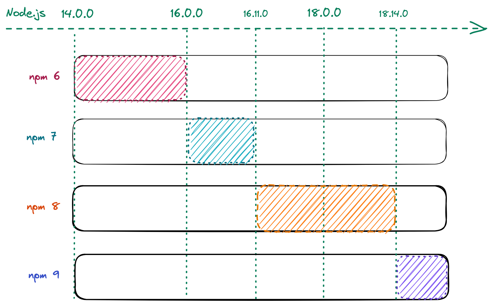
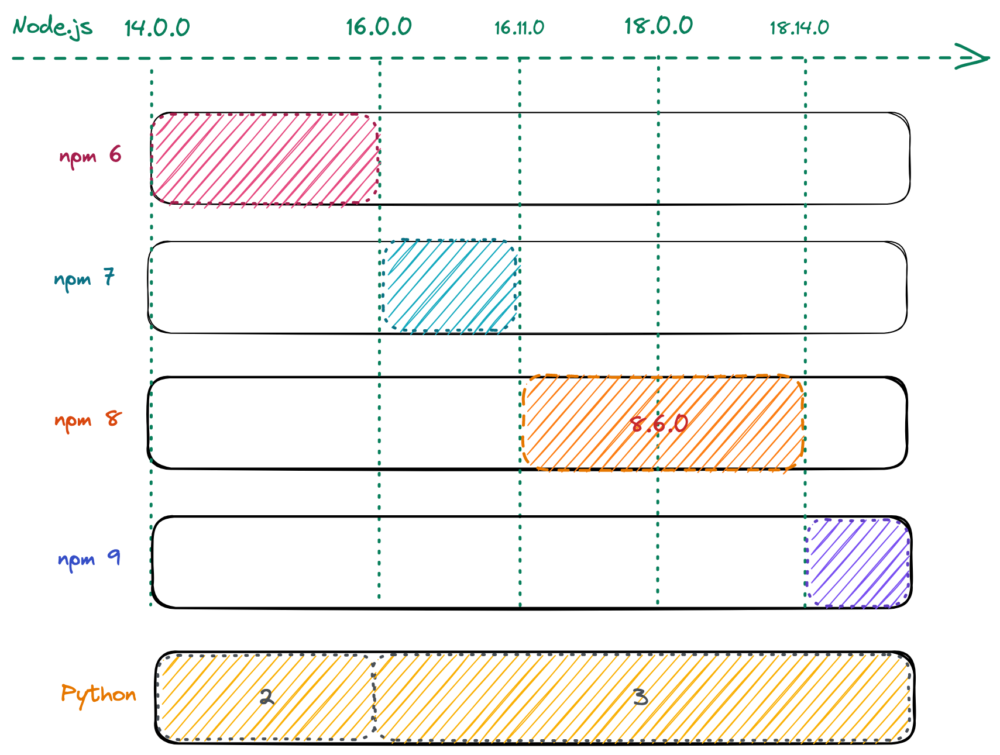
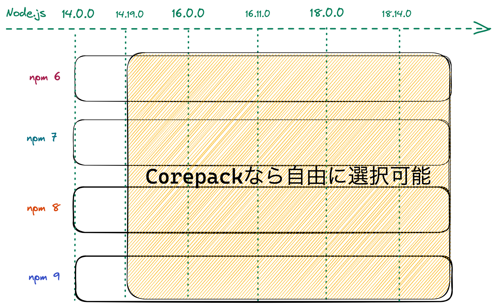

autoscale: true

# Corepackを使ってNode.jsをアップデートする ⬆️⬆️

----

# 自己紹介


- Name : **azu**
- Twitter : @[azu_re](https://twitter.com/azu_re)
- Website: [Web scratch], [JSer.info]

[Web scratch]: http://efcl.info/ "Web scratch"
[JSer.info]: http://jser.info/ "JSer.info"

----

# サマリ

- Node.jsのバージョンアップは面倒だけど
  - ほとんどのBREAKING CHANGEはライブラリにある
- npmのバージョンアップは面倒
  - npm 6とnpm 7とnpm 9では`package-lock.json`のフォーマットが異なる
  - npm 6とnpm 8(8.6.0)では`peerDependencies`の扱いが異なる
- corepackはnpmパッケージ管理ツールのバージョン管理ツール
  - 現代はnpm 6,7,8,9、yarn 1,2,3、 pnpmが混在する時代

---



---

# どうやって"Node.js"のバージョンを上げるか

- まとめてあげるには、アプリケーションは大きくなりすぎた
- 問題を分解する
- Node.js / パッケージマネージャー(npm) / ライブラリの問題を分解して考える
- これに役立つのがcorepack

---

# Node.jsとパッケージマネージャーとライブラリの問題を分解する

---

# まずは問題を洗い出す

- 何も考えずにNode 18に上げる
- ライブラリの問題の9割ぐらいはインストール時にわかる
  - Runtimeレベルの問題は、Node.jsの問題
  - ここは基本的には問題が起きにくい(DeprecatedなAPIの削除やFetch APIの追加などが主)
- 大量にハマるので、インストールしてテストが動くまでごちゃごちゃする
- 見つかった問題を分解していく

---

# 問題の分解

- OSの問題
- Native Addonの問題
- `peerDependencies`の問題
- Node.js Runtimeの問題

---

# OSの問題

---

# OSの問題

- Node.js 18はglibc 2.28+を利用する
- Ubuntu 18.04では動かないため、Ubuntu 20.04+が必要
- そのため、Node.js 18にアップデートする場合はUbuntu 18.04は避ける

---

## CIとOS

- CIサービスが提供する環境で、Node.js 18を含むバージョンを使う
  - Circle CI: [ubuntu-2004:2023.02.1 or ubuntu-2204:2023.02.1](https://discuss.circleci.com/t/linux-machine-executor-2023-q1/47191)
  - GitHub Actions: [Ubuntu 22.04](https://github.com/actions/runner-images/blob/main/images/linux/Ubuntu2204-Readme.md) or [Ubuntu 20.04](https://github.com/actions/runner-images/blob/main/images/linux/Ubuntu2004-Readme.md)
- より良い方法は、Node.jsバージョンを指定して使うこと
  - Circle CI: [cimg/node](https://circleci.com/developer/ja/images/image/cimg/node)
  - GitHub Actions: [setup-node](https://github.com/actions/setup-node)

---

## DockerとOS

- 公式のイメージがあるのでそれを利用するだけ問題ない
- [node - Official Image | Docker Hub](https://hub.docker.com/_/node)

---

# OSの問題まとめ

- UbuntuならUbuntu 20.04+が必要
- CIではできるだけNode.jsバージョンを指定できる方法を使う
- Dockerでは[node - Official Image](https://hub.docker.com/_/node)を使う

---

# Native Addonの問題

---

# Node.jsとPython(gyp)

- Node.jsには[C++ addons](https://nodejs.org/api/addons.html)(native addon)という仕組みがある
- [fsevents](https://github.com/fsevents/fsevents)や[node-sass](https://www.npmjs.com/package/node-sass)など著名なライブラリが使ってる
- C++で書いてNode.jsにバインディングを提供できるので、高速な処理に使われる
- Node.js <-> C++ は Node-API という抽象レイヤーがある
- Node.jsをアップデートすると問題が起きやすい

---

# gyp ERR! 

```
gyp ERR! 
gyp ERR! 
gyp ERR! 
gyp ERR! 
gyp ERR! 
gyp ERR! 
gyp ERR! 
gyp ERR! 
gyp ERR!
```

---

# gyp ERR! 

- Node.jsではNative Addonのrebuildには[node-gyp](https://github.com/nodejs/node-gyp)というツールを使う
- [node-gyp](https://github.com/nodejs/node-gyp)はPythonに依存しており、Native AddonのrebuildにはPythonが必要
- Node.js 14まではPython 2が利用可能で、Python 16以降はPython 3が必要になる

---



---

# apk add python

- つまり、Node.jsでは、OS内にPythonをインストールする場合は、Python 3が必要
- `apk add python`ではPython 2がインストールされるので、`python3`へと変更がいる

```
RUN apk --no-cache add python3 make g++
```

---

# gyp ERR! の対応

- 基本的には古いバージョンのライブラリだと起きやすい問題
- (ライブラリが更新されていれば)ライブラリのバージョンを上げることで、大体修正されている

---

# GCPライブラリとgRPC

- 古いGCPのクライアントライブラリは[`grpc`](https://www.npmjs.com/package/grpc)を利用していた
  - [@google-cloud/pubsub](https://github.com/googleapis/nodejs-pubsub)、[@google-cloud/spanner](https://github.com/googleapis/nodejs-spanner)など
- `grpc`はNative Addonのパッケージ
  - インストール時にNode.jsバージョンに合わせたプレビルドのバイナリをダウンロード(当然Node.js 18用は存在しない)
  - なければ、ローカルでgypを使ってrebuildする
- 最近のバージョンでは[@grpc/grpc-js](https://www.npmjs.com/package/@grpc/grpc-js)を利用している
  - JSの実装なので、gypの問題は起きない!
- → Node.js 18では、GCPライブラリは[@grpc/grpc-js](https://www.npmjs.com/package/@grpc/grpc-js)を使ってるバージョンまでアップデートが必要

---

# バイナリを利用するライブラリ(Optional Depencies)

- [esbuild](https://esbuild.github.io/)や[Rome](https://github.com/rome/tools)などバイナリを使うツールも増えている
- これらはOptional Dependenciesで、アーキテクチャ別のプレビルドしたバイナリをパッケージとして用意している
- パッケージインストール時にバイナリをインストールしている[^napi-rs]
- インストール時にビルドをしなくて済むのがメリット
- 問題が起きた時は、ライブラリのバージョンを上げることで、大体修正されている

[^napi-rs]: [Rust + Node-APIでクロスプラットフォーム向けnpmパッケージを公開する - 別にしんどくないブログ](https://shisama.hatenablog.com/entry/2021/12/03/054437)

---

# Native Addonの問題のまとめ

- 残念ながら対応方法は、Native Addonを使うパッケージをアップデートすることがほとんど
- マイナーなNative Addonは回避方法がなくなるので、避けるべき
- gyp ERR! が出た場合は、大体古いパッケージを使っていることが多い
- 最近のライブラリは、アーキテクチャ別にプレビルドしたバイナリを配ってることが多い
- ライブラリのREADMEなどに対応してるNode.jsのバージョンが書かれているのでよく読む

---

# `peerDependencies`の問題

---

# `peerDependencies`の問題

- [Node v18.0.0](https://nodejs.org/en/blog/release/v18.0.0)では、[npm v8.6.0](https://github.com/npm/cli/releases/tag/v8.6.0)が同梱された
- [npm v8.6.0](https://github.com/npm/cli/releases/tag/v8.6.0)には、`peerDependencies`に指定されたライブラリとバージョンが一致していない場合に、インストールエラーになるBREAKING CHANGEが含まれる
- [[BUG] non-previosly seen peer-dependency errors popping up in 8.6.0 · Issue #4664 · npm/cli](https://github.com/npm/cli/issues/4664)

---

```
$ npm i
npm ERR! code ERESOLVE
npm ERR! ERESOLVE could not resolve
npm ERR! 
npm ERR! While resolving: @shiftcoders/dynamo-easy@7.1.0
npm ERR! Found: tslib@2.3.0
npm ERR! node_modules/tslib
npm ERR!   tslib@"^2.1.0" from the root project
npm ERR!   tslib@"^2.0.0" from @aws-sdk/abort-controller@3.20.0
npm ERR!   node_modules/@aws-sdk/abort-controller
npm ERR!     @aws-sdk/abort-controller@"3.20.0" from @aws-sdk/node-http-handler@3.21.0
npm ERR!     node_modules/@aws-sdk/node-http-handler
npm ERR!       @aws-sdk/node-http-handler@"3.21.0" from @aws-sdk/client-sso@3.21.0
npm ERR!       node_modules/@aws-sdk/client-sso
npm ERR!         @aws-sdk/client-sso@"3.21.0" from @aws-sdk/credential-provider-sso@3.21.0
npm ERR!         node_modules/@aws-sdk/credential-provider-sso
npm ERR!       1 more (@aws-sdk/client-sts)
npm ERR!   46 more (@aws-sdk/client-sso, @aws-sdk/client-sts, ...)
npm ERR! 
npm ERR! Could not resolve dependency:
npm ERR! peer tslib@"^1.10.0" from @shiftcoders/dynamo-easy@7.1.0
npm ERR! node_modules/@shiftcoders/dynamo-easy
npm ERR!   dev @shiftcoders/dynamo-easy@"^7.1.0" from the root project
npm ERR! 
npm ERR! Conflicting peer dependency: tslib@1.14.1
npm ERR! node_modules/tslib
npm ERR!   peer tslib@"^1.10.0" from @shiftcoders/dynamo-easy@7.1.0
npm ERR!   node_modules/@shiftcoders/dynamo-easy
npm ERR!     dev @shiftcoders/dynamo-easy@"^7.1.0" from the root project
npm ERR! 
npm ERR! Fix the upstream dependency conflict, or retry
npm ERR! this command with --force, or --legacy-peer-deps
npm ERR! to accept an incorrect (and potentially broken) dependency resolution.
npm ERR! 
```

---

# `peerDependencies`の問題の対応方法

1. ライブラりをアップデートする
  - ライブラリ側の`peerDependencies`のバージョン指定が間違っていることがほとんど
2. `npm i --legacy-peer-deps` で古いnpmの挙動を再現する
  - [`--legacy-peer-deps`](https://docs.npmjs.com/cli/v8/using-npm/config?v=true#legacy-peer-deps)というワークアラウンド用のオプションがある
3. npm 8.3+ の[overrides](https://docs.npmjs.com/cli/v8/configuring-npm/package-json#overrides)で無理やり上書きする 
  - 使う側からライブラリが依存してるパッケージバージョンを書き換える[^参考]
4. [Corepack](https://nodejs.org/api/corepack.html)を使って、Node.jsとnpmのアップデートを分ける

[^参考]: [colorsなどのnpmパッケージに悪意あるコードが含まれている問題について](https://zenn.dev/azu/articles/d56615b2e11ad1)

---

# [Corepack](https://nodejs.org/api/corepack.html)

- [Corepack](https://nodejs.org/api/corepack.html)を使うと、プロジェクト(`package.json`)ごとに利用するパッケージマネージャーとバージョンを指定できる
- `package.json`の`packageManager`に パッケージマネージャーとバージョンを指定する
  - npm と yarn と pnpm に対応している

```
├── a/ ここでは npm i で npm@6.5.0 が使われる
|   └── package.json (`"packageManager": "npm@6.5.0"`)
│    
└── b/ ここでは npm i で npm@8.6.0 が使われる
    └── package.json (`"packageManager": "npm@8.6.0"`)
```

----

# [Corepack](https://nodejs.org/api/corepack.html)で何が嬉しいか


- `npm`はNode.jsに同梱されているため、Node.jsバージョンアップで`npm`のバージョンも上がる
- Corepackを使うことで、Node.jsのバージョンアップと`npm`のバージョンアップを切り離せる
- プロジェクト(`package.json`)ごとに、パッケージマネージャーを指定できるので、複数のバージョンが混在できる
- チーム内で、それぞれのnpmバージョンが違うと、installするだけで`package-lock.json`が更新されてしまう

----



----

# [Corepack](https://nodejs.org/api/corepack.html)で`peerDependencies`の問題を回避

- `peerDependencies`が厳密にチェックされるのは npm 8.6.0+
- Corepackを使うと、Node.js 18に上げても、npm 6のままにできる
- npmの問題は、npmのアップデートだけに絞ってできる 
- → 一度に解決しないといけない問題を減らせる

----

# [Corepack](https://nodejs.org/api/corepack.html)の使い方

- [Node v14.19.0](https://nodejs.org/en/blog/release/v14.19.0)、16.x, 18.x に `corepack` コマンドが含まれる
- まだExperimentalという扱いなので、デフォルトは無効になっている
- 有効化する方法は `cprepack enable` するだけ
- `npm`を叩いた時に、インストールされてない`npm`バージョンなら自動的にダウンロードもしてくれるのでバージョンを意識しなくなる

```shell
$ corepack enable npm yarn pnpm # npm, yarn, pnpmのバイナリをcorepackのラッパーに差し替える
```

---

# [Corepack](https://nodejs.org/api/corepack.html)の罠

- デフォルトで有効ではない
- Node.jsのバージョンアップでデフォルト値(無効)に戻ってしまう
  - `make install`などで `corepack enable` を実行するなどが必要
  - Dockerfileで有効化する必要がある
  - `RUN corepack enable npm yarn pnpm` を足す必要がある 
- Node.jsバージョン管理ツールが対応してない場合がある
  - [voltaは`packageManager`フィールドを無視する](https://github.com/volta-cli/volta/issues/987)

---

# Corepack in Dockerfile example

```Dockerfile
# --------------> build stage
FROM node:18.16.0-alpine AS builder
WORKDIR /usr/src/app
COPY ./ ./
RUN corepack enable npm yarn pnpm # corepackを有効化
RUN npm ci && npm run build
# --------------> production stage
FROM node:18.16.0-alpine
WORKDIR /usr/src/app
COPY --from=builder /usr/src/app/dist ./dist
COPY ./package*.json ./
RUN corepack enable npm yarn pnpm # corepackを有効化
RUN npm ci --production
USER node
EXPOSE 8080
CMD npm start
```

---

# `peerDependencies`の問題

- `peerDependencies`の根本的な問題解決は、ライブラリをアップデートするしかない
- [`--legacy-peer-deps`](https://docs.npmjs.com/cli/v8/using-npm/config?v=true#legacy-peer-deps)、[overrides](https://docs.npmjs.com/cli/v8/configuring-npm/package-json#overrides)のワークアラウンドがある
- [Corepack](https://nodejs.org/api/corepack.html)はNode.jsのバージョンとnpmのバージョンを切り離せる
  - 各自のnpmバージョンのずれを防ぐ意味でも[Corepack](https://nodejs.org/api/corepack.html)に価値がある

---

# Node.js Runtimeの問題

----

# Node.js Runtimeの問題

- Node.jsのアップデートでNode.jsのAPIが変更されることがある
- が、基本的にこれが問題になるケースは、ライブラリに比べると少ない
- Node.jsのリリースノートを読んで、該当するものがあるかをチェックしていくだけ

----

## Node.js 16のBREAKING CHANGES

- [Node v16.0.0 (Current) | Node.js](https://nodejs.org/en/blog/release/v16.0.0)で削除されたAPI
- [x] `process.binding` の削除
- [x] `process.config` の削除
- [x] `fs.rmdir(dir, { recursive: true })`の削除

---

## UnhandledRejectionの挙動変更

- Node.js 15+からUnahanded Rejectionが発生するとプロセスが終了する
- Node.js 14ではプロセスは終了せずに `(node:1660) UnhandledPromiseRejectionWarning` のワーニングが出るだけ
- [Node.js v15ではunhandled rejectionでプロセスがエラー終了する](https://zenn.dev/kimamula/articles/b32d11d52c2b7a733119)
- [Node.jsでUnhandled Rejectionsのときにexis statusが0となる問題を回避する | Web Scratch](https://efcl.info/2020/03/20/node-unhandled-rejections-exit-status/)
- e.g <https://github.com/azu/test-unhandled/actions/runs/4794774814>

---

## UnhandledRejection

```js
// => キャッチしてないので、Unahanded Rejectionが発生する
new Promise(() => {
	throw new Error("tttthrow"); 
});

setTimeout(() => console.log("こんにちは!!!!"), 1000);
```

---

## UnhandledRejection の結果 in Node.js 14

```shell
$ node index.js
(node:1660) UnhandledPromiseRejectionWarning: Error: tttthrow
    at /home/runner/work/test-unhandled/test-unhandled/index.js:2:8
    at new Promise (<anonymous>)
    at Object.<anonymous> (/home/runner/work/test-unhandled/test-unhandled/index.js:1:1)
    at Module._compile (internal/modules/cjs/loader.js:1114:14)
    at Object.Module._extensions..js (internal/modules/cjs/loader.js:1143:10)
    at Module.load (internal/modules/cjs/loader.js:979:32)
    at Function.Module._load (internal/modules/cjs/loader.js:819:12)
    at Function.executeUserEntryPoint [as runMain] (internal/modules/run_main.js:75:12)
    at internal/main/run_main_module.js:17:47
こんにちは!!!! # <-- プロセスはエラーで終了しないので、最後まで処理が実行される
$ echo $?
0
```

---

## UnhandledRejection の結果 in Node.js 16+

```shell
$ node index.js
/home/runner/work/test-unhandled/test-unhandled/index.js:2
	throw new Error("tttthrow")
	      ^

Error: tttthrow
    at /home/runner/work/test-unhandled/test-unhandled/index.js:2:8
    at new Promise (<anonymous>)
    at Object.<anonymous> (/home/runner/work/test-unhandled/test-unhandled/index.js:1:1)
    at Module._compile (node:internal/modules/cjs/loader:1196:14)
    at Object.Module._extensions..js (node:internal/modules/cjs/loader:1250:10)
    at Module.load (node:internal/modules/cjs/loader:1074:32)
    at Function.Module._load (node:internal/modules/cjs/loader:909:12)
    at Function.executeUserEntryPoint [as runMain] (node:internal/modules/run_main:81:12)
    at node:internal/main/run_main_module:22:47
Error: Process completed with exit code 1.
$ echo $?
1 # エラーで途中で処理が止まる
```

---

## UnhandledRejectionの挙動の変更の対応

- [node --unhandled-rejections=warn](https://nodejs.org/api/cli.html#cli_unhandled_rejections_mode)を指定して14の挙動に戻す
- Promiseのキャッチ忘れがあるので、ちゃんとキャッチするように修正する
- GlobalにUnhandledRejectionをキャッチする処理を追加する

```js
process.on('unhandledRejection', (reason, p) => {
  console.log('Unhandled Rejection at:', p, 'reason:', reason); 
  // process.exitを呼ばなければ、Node 14と同じくログが出るだけ済む
});
```

---

## Node.js 18のBREAKING CHANGES

- [Node v18.0.0 (Current) | Node.js](https://nodejs.org/en/blog/release/v18.0.0)で変更されたAPI
- [x] `dns.lookup`の削除
- [x] `tls.parseCertString`の削除
- [x] Fetch APIの追加
- [x] `server.headersTimeout`が60秒に変更
  - [http: refactor headersTimeout and requestTimeout logic by ShogunPanda · Pull Request #41263 · nodejs/node](https://github.com/nodejs/node/pull/41263)
- [x] `server.requestTimeout`が5分に変更
  - 元々は `0` で無限

----

# 追加されたAPIで壊れることもある

- [Node v18.0.0 (Current) | Node.js](https://nodejs.org/en/blog/release/v18.0.0)でFetch APIが追加された
- `ReferenceError: AbortSignal is not defined` というエラーがJestで発生するようになる
  - おそらくFeature Detectのコードが誤検知を起こすようになった
- [&quot;ReferenceError: AbortSignal is not defined&quot; during jest execution · Issue #1557 · nodejs/undici](https://github.com/nodejs/undici/issues/1557)
- これはJestを29までアップデートすると治る

----

# Node.js Runtimeの問題のまとめ

- あんまり多くはないので、リリースノートを読んで、コードを検索
- Fetch APIの追加で壊れるライブラリはあるのでアップデートが必要なこともある

----

# まとめ

----

# まとめ - 分解した問題

- OSの問題 → コントロールできる
- Native Addonの問題 → コントロールできない
- `peerDependencies`の問題 → コントロールが難しい
- Node.js Runtimeの問題 → コントロールできる

----

# まとめ - 問題の対応

- OSの問題 → 修正しよう
- Native Addonの問題 → ライブラリをアップデートしよう
- `peerDependencies`の問題 →
  -  ライブラリをアップデート or [Corepack](https://nodejs.org/api/corepack.html)を使おう
- Node.js Runtimeの問題 → 修正しよう


