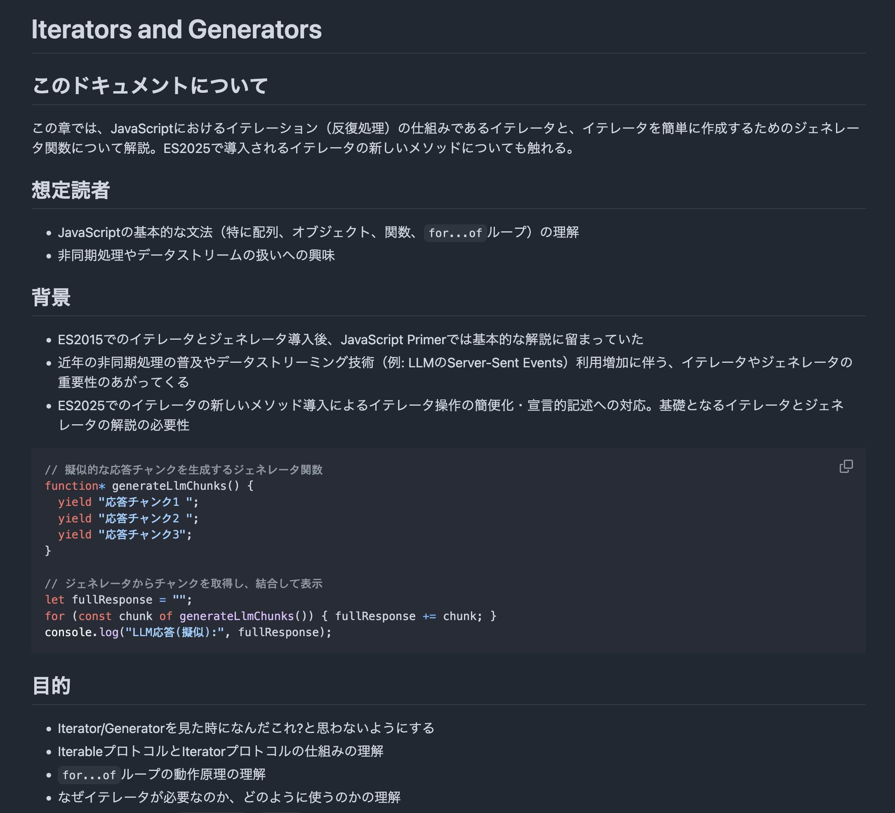
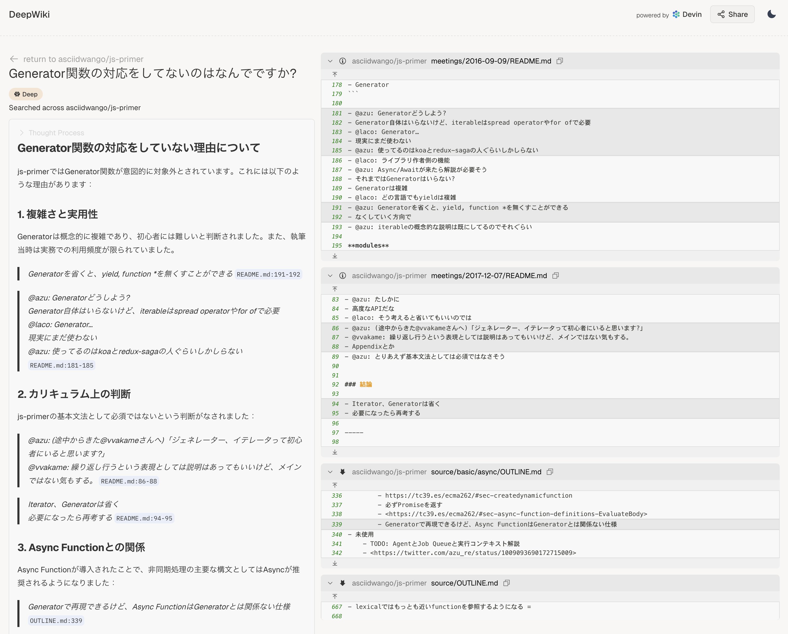
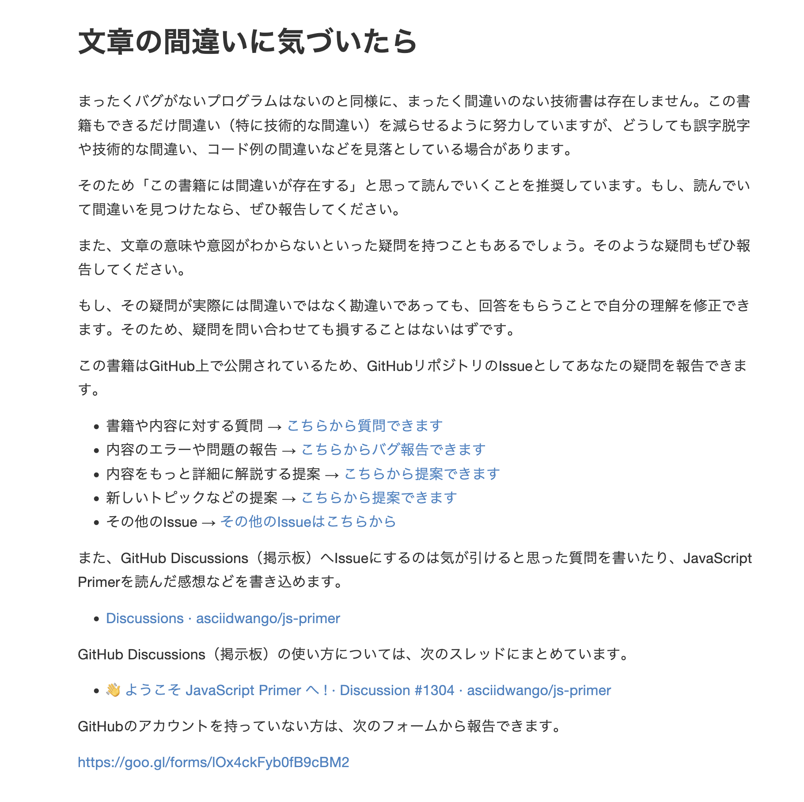
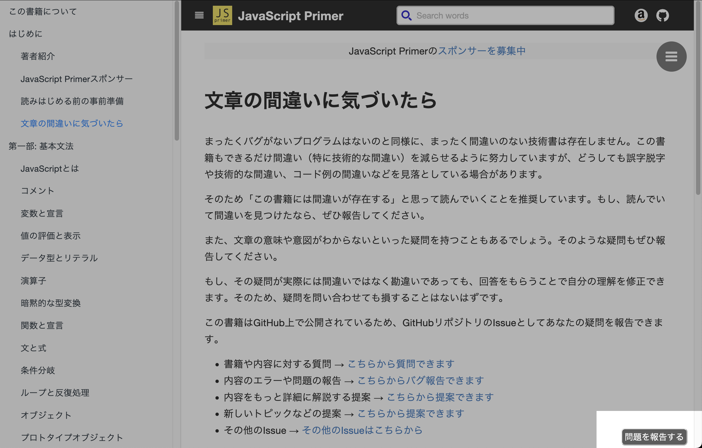
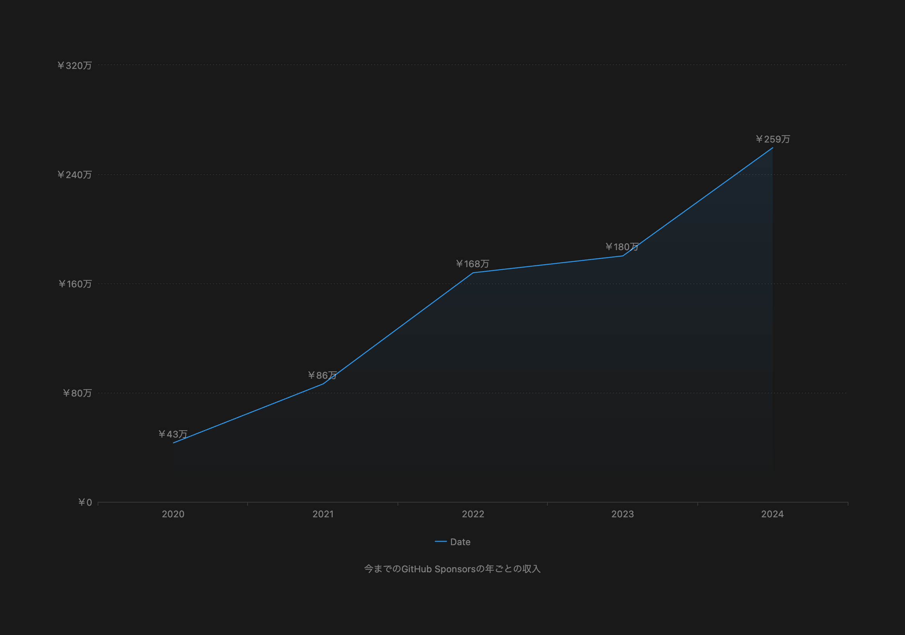
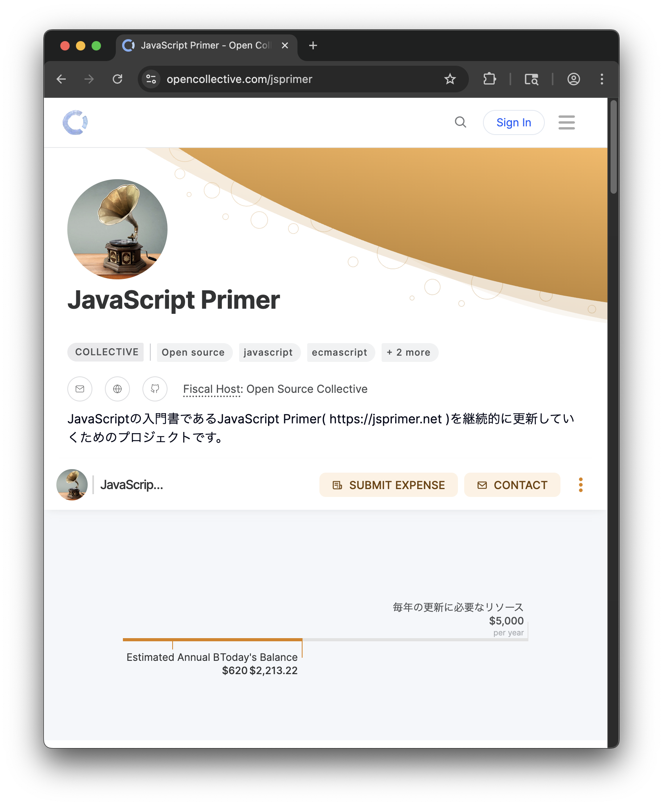
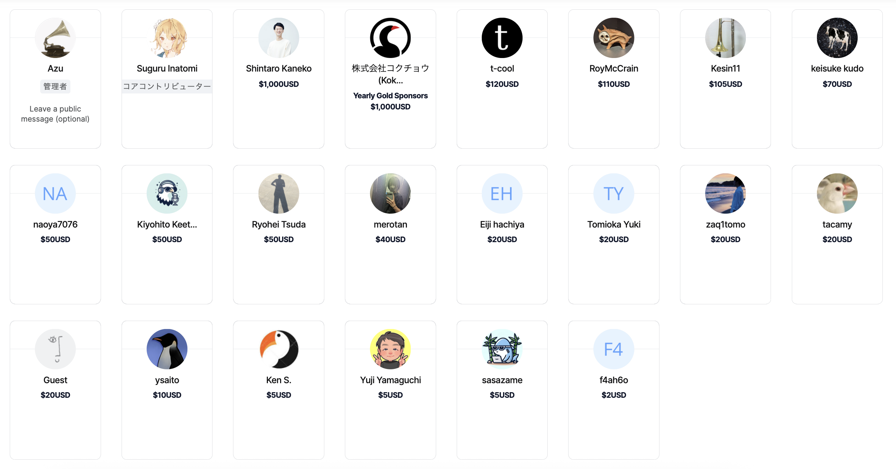
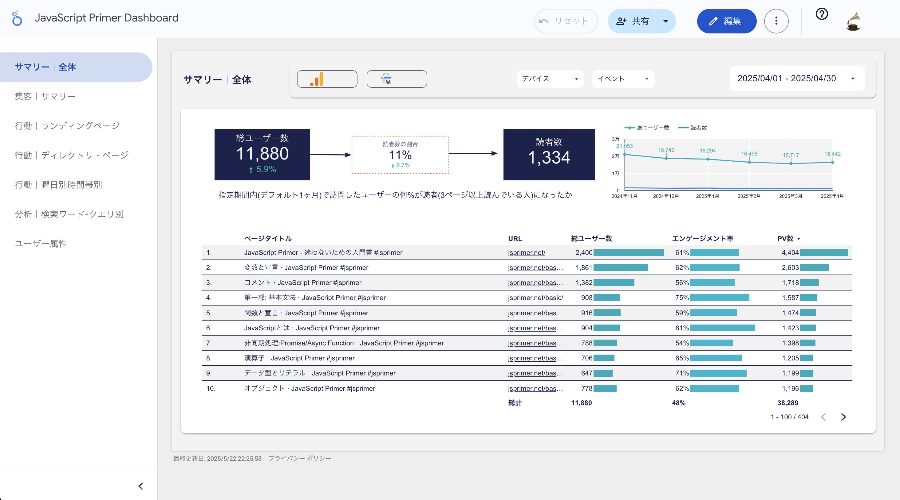
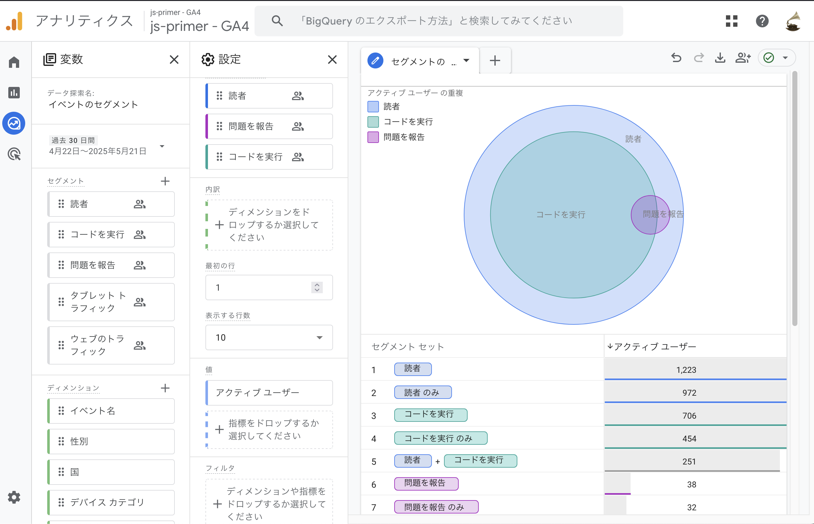

autoscale: true
slidenumbers: true

# 技術書をソフトウェア開発する

## jsprimer の 10 年から学ぶ継続的メンテナンスの技術

---

# 自己紹介


- Name : **azu**
- Twitter : @[azu_re](https://x.com/azu_re)
- Website: [Web scratch](https://efcl.info/), [JSer.info](https://jser.info/)
- Open Source: textlint, secretlint, HontKit

---

# JavaScript Primer (jsprimer) とは


- 約 10 年、6 つのメジャーバージョンを経て更新され続けている JavaScript 入門書
- 書籍版 ([amazon.co.jp/dp/4048931105](https://www.amazon.co.jp/dp/4048931105/)) も販売中
- ウェブ版 ([jsprimer.net](https://jsprimer.net/)) は無料で公開
- GitHub: [asciidwango/js-primer](https://github.com/asciidwango/js-primer)
- 書籍版とウェブ版の内容に違いはなく、オープンソースで開発中

---

## 簡単年表

| ECMAScript | jsprimer                   |
| ---------- | -------------------------- |
| 2015       | 開発開始                   |
| 2016       | ウェブで公開               |
| ...        | ...                        |
| 2019       | v1 / 書籍の第 1 版リリース |

---

## 簡単年表

| ECMAScript | jsprimer                   |
| ---------- | -------------------------- |
| 2020       | v2                         |
| 2021       | v3                         |
| 2022       | v4 / 書籍の第 2 版リリース |
| 2023       | v5                         |
| 2024       | v6                         |
| 2025       | v7                         |

---

# 本日のテーマ

- **Why:** なぜ jsprimer は始まり、更新され続けるのか？
- **How:** どうやって更新を実現しているのか？
- **Learn:** 技術書を「ソフトウェア開発」することから得られる知見
- **Future:** これからの jsprimer の展望

---

# [fit] なぜ、TSKaigi で JavaScript の話をするのか？


---

# TSKaigi のミッション

## 学び、繋がり、”型”を破ろう

---

# なぜ TSKaigi で JavaScript の話をするのか？

## TypeScript と JavaScript の関係性

- TSKaigi のミッション: 「学び、繋がり、”型”を破ろう」
- TypeScript から「型」を取り除くと JavaScript になる
- JavaScript を学ぶことは、TypeScript の理解を深めることに繋がる

---

# [fit] `$ node --experimental-strip-types`

---

<!-- erasableSyntaxOnlyについて扱ってるセッション

https://2025.tskaigi.org/talks/yamanoku
https://2025.tskaigi.org/talks/makky12

-->

- [ts-blank-space](https://bloomberg.github.io/ts-blank-space/)で発見された
- TypeScript の Design Goal として JavaScript と非互換な機能や変更を入れることはしないようになっています
  - [https://github.com/Microsoft/TypeScript/wiki/TypeScript-Design-Goals](https://github.com/Microsoft/TypeScript/wiki/TypeScript-Design-Goals)
- TypeScript の `erasableSyntaxOnly` や Node.js の `--experimental-strip-types` フラグなどもあり、TypeScript ファイルを JavaScript として直接実行できるようになってきた

---


---


---


---

# TypeScript から型を取り除けば JavaScript

---

# TSKaigi 2025

## TypeScript から 型(の話)を<br>取り除けば JavaScript(の話)が<br>できるカンファレンス

---

# [fit] `$ tskaigi --experimental-strip-types`

---

# Why: なぜ jsprimer は書かれたのか?

---

## 時代背景 (2015 年頃)

- ECMAScript 2015 (ES6) の登場
- JavaScript の大きな転換期
- ES2015 ベースの現代的な入門書が不足
- 「これ読んでおいて！」と渡せる現代的な書籍が必要

---

# jsprimer の目的

「書き方」「作り方」「学び方」の 3 つの原則に基づく設計

- **書き方**: 基本文法を体系的に学ぶ
- **作り方**: 学んだ知識で実際にアプリを作る
- **学び方**: JavaScript の変化に対応できる素養を身につける

---

# Why: なぜ JSPrimer は更新され続けるのか？

---

# JavaScript は "Living Standard"

- JavaScript の仕様である ECMAScript は毎年更新
- 実行環境 (ブラウザ, Node.js) も進化

---

> 変化に対応できる基礎を身につけるため、書籍自体が変化に対応し続ける必要がある
>
> -- [JavaScript Primer 改訂 2 版をリリースしました！/JavaScript Primer はなぜ更新され続けるのか？ | Web Scratch](https://efcl.info/2023/06/09/jsprimer-v2/)

---

# 生きてるものの宿命

> 依存がない静的なコードは時間で変化はしにくい、依存があるアクティブなコードは、コードが変わらなくても依存関係である周りが変化します。そのため 5 年間触っていないコードが、最新の環境ではそのままは動かないのはこれが理由です。
>
> -- [Working in Public](https://press.stripe.com/working-in-public)

---

# 技術書の宿命

- JavaScript 周りのエコシステムは変化し続ける
- エコシステムを扱った書籍は、ものすごい速さで古くなる

---

# コードの状態と時間経過の課題

- コードには「静的状態」と「アクティブ状態」がある
  - 静的状態: 依存がなく、時間が経っても内容が変わらない
  - アクティブ状態: 外部のライブラリや環境に依存し、周囲の変化に影響される
- アクティブなコードは、依存先のバージョンアップなどで「ズレ」が生じ、動かなくなるリスクが高い
- 動かすには、コードや依存の更新、または当時の環境を再現する必要がある
- 価値を保つには、継続的なメンテナンスが不可欠

---

# 書籍もコードと同じ

- 書籍も「静的状態」と「アクティブ状態」がある
  - 静的状態: 依存がなく、時間が経っても内容が変わらない
  - アクティブ状態: 外部のライブラリや環境に依存し、周囲の変化に影響される
- 書籍が何にも依存してないことはほぼない
  - → アクティブ状態であるが、いかに依存を綺麗に保つがメンテナンス的に重要

---

# ECMAScript のアクティブな状態と静的な状態

- ECMAScript ではアクティブな状態と静的な状態を使い分けている
- アクティブな仕様:
  - <https://tc39.es/ecma262> 常に最新のものとして公開される
  - Living Standard
- 静的な仕様:
  - <https://ecma-international.org/technical-committees/tc39/>
  - ECMA のサイトで毎年スナップショット公開される
  - 1 年に一度更新される

---

# 静的な書籍版とアクティブなウェブ版

- ECMAScript 仕様のモデルに真似る:
- **Living Standard**: ウェブ版 ([jsprimer.net](https://jsprimer.net/))
  - 常に最新版を維持
  - GitHub で共同編集
- **Snapshot**: 書籍版
  - 安定版として時々リリース
  - 読みやすさに特化した最適化

---

# Why: なぜ静的なスナップショットを作るか

- 読みやすさ
- 読んでいる途中で内容が変わらないようにするため

---

# How: どうやって更新を実現しているのか？

---

# 1. 変化を前提とした設計

- **スコープ管理:** 「目的ではないこと」を明確化し、**依存**を減らす。
  - ライブラリ解説ではなく、基礎的な言語機能にフォーカス
  - 依存関係の少ないコードを重視
  - [本書の目的 · Issue #103 · asciidwango/js-primer](https://github.com/asciidwango/js-primer/issues/103)


---

# 2. 読みやすさを優先する

- 書きやすさよりも、読みやすさを重視
- 更新を継続的に行うには、何度も読む必要がある
- 書くより読む回数の方が多い
- 読むコストを下げる工夫 (構成、表現統一)

^ 圧倒的に読む回数の方が多い
^ 今回の ES2025 の対応でも一度全部読み直して何を削るかを考えた
^ 何度も読むためには、読みやすさを重視する必要がある
^ コードもこれは基本的に同じになると思う
^ 今は、書きやすさは圧倒的に有利になってきているけど、レビューをしていくことで、どこまで削れるかが大事になる

---

# 既知の言葉で未知を説明する

- 既知な情報から未知な情報へと書く[^known-new contract]

> 「"known-new contract"とは、読者がすでに知っていること（以前に提示された情報）を最初に提示してから新しい情報を導入することで、書き手が文章間の結束をどのように達成するかを説明するために使われる言語学的概念である。議論を構築するにしても、情景を描写するにしても、概念を分析するにしても、ある文章から次の文章へと論理的に進行することが重要である。明確な文から文への進行は、読者の集中力を維持し、推論のパターンを容易に追うことを可能にする。」

[^known-new contract]: 英語だと"known-new contract"という概念が近いもの。[既知から未知に書く](https://note.com/logicalskill/n/n77ff3391a74d)から引用

---

# 既知から未知へ

具体的な例をいくつか挙げてみます。

- jsprimer という書籍は前から後ろに順番に読んでいく構造
- 未知の言葉がいきなり出てこないように、既知 -> 未知の順となるように説明
- コードを書いていくときに、関数の定義をしてから利用
  - JS は hoisting があるので、実行的にはこれは回避できしまう
  - 一方でファイルが膨れたといにメインが下にあるのが嫌という人もいるが、それはエントリーを分ければいい
  - これが問題になるのは React コンポーネントみたいな、同じファイルに

```js
// 数字の文字列を二つ受け取り、合計を返す関数
function sumNumStrings(a, b) {
  const aNumber = safeParseInt(a);
  const bNumber = safeParseInt(b);
  return aNumber + bNumber;
}

// 数値の文字列を受け取り数値を返す関数

function safeParseInt(numStr) {
  const num = parseInt(numStr, 10);
  if (Number.isNaN(num)) {
    throw new Error(`${numStr} is not a number`);
  }
  return num;
}
```

よりも

```js
// 数値の文字列を受け取り数値を返す関数
function safeParseInt(numStr) {
  const num = parseInt(numStr, 10);
  if (Number.isNaN(num)) {
    throw new Error(`${numStr} is not a number`);
  }
  return num;
}

// 数字の文字列を二つ受け取り、合計を返す関数
function sumNumStrings(a, b) {
  const aNumber = safeParseInt(a);
  const bNumber = safeParseInt(b);
  return aNumber + bNumber;
}
```

の方が既知 → 未知となる

- 人間のコンテキスト小さいので、章をまたぐとすぐに未知となってしまう言葉が出てくる。このような場合、章が変わるたびに重要なものは未知であるという前提で毎回説明する

このようなパターンをそれぞれ図にしていきたいです

# 既知 から 未知 へ

[.column]

```js
// 数値の文字列を受け取り数値を返す関数
function safeParseInt(numStr) {
  const num = parseInt(numStr, 10);
  if (Number.isNaN(num)) {
    throw new Error(`${numStr} is not a number`);
  }
  return num;
}
// 数字の文字列を二つ受け取り、合計を返す関数
function sumNumStrings(a, b) {
  const aNumber = safeParseInt(a);
  const bNumber = safeParseInt(b);
  return aNumber + bNumber;
}
```

[.column]

```markdown
次のコードでは、数値の文字列を二つ受け取り、合計を返す関数を定義しています。

{{コード}}

この関数は、数値の文字列を受け取り、数値に変換する `safeParseInt` 関数を使用しています。
`safeParseInt` 関数は、数値の文字列を受け取り、数値に変換します。もし変換できない場合は、エラーをスローします。
```

---

# 3. テスト

- **ドキュメントの自動テスト:**
  - `textlint`: 文章校正、表現統一
  - `power-doctest`: サンプルコードの動作検証
- **CI/CD での継続的なテスト:** GitHub Actions でテストを自動化し、品質を維持
  - サンプルコードの検証、Integration Test の実装
- **読みやすさ分析:** `textstat` による文章の複雑さの可視化

---

# [textlint](https://textlint.org/)

- [textlint](https://textlint.org/)は、自然言語の文章を校正するためのツール
- ESLint の自然言語向けの Linter
- 技術書むけのルールをベースに、辞書や書籍独自のルールを実装している
  - <https://github.com/asciidwango/js-primer/blob/master/.textlintrc.js>
- [Maintainer Month: なぜ textlint を作ったか | Web Scratch](https://efcl.info/2022/06/29/why-create-textlint/)

^ textlint は機械学習のツールが来ても結局はプロフェッショナルルールが消えることはないという前提で書かれている。
^ これは機械学習の結果は確率的な話なので９ 9%の精度だと問題があって、Lint に求められるのは確率とはことなるものがある
^ AI を使ってても、ESLint などを併用しているように、AI を使ってても、textlint は併用していくと思う

---

# textlint を使うことで書きやすくする

- textlint は読みやすさのためのルールが色々とある
- 一方でルール決めることで書きやすさが上がる
- 特に LLM など、全ての単語を人間が書いてるわけじゃない
- こういった統一性を担保するのが Linter の役割であるので、読みやすさと書きやすさをあげてくれる

^ 一般的にいうならガードレール的なもの。慣れてくると Lint にかからないように人間は描けるようになってくる

---

# 書籍独自のルール

- [fix: prototype を表すのに # を使わないようにする](https://github.com/asciidwango/js-primer/pull/1382)
- [静的メソッドの表記統一 と textlint ルールの追加 #1797](https://github.com/asciidwango/js-primer/pull/1797)
- 表記揺れなども textlint のルールとして書いて吸収している

---

# power-doctest

- 書籍におけるサンプルコードは動くのが正解なコード、エラーになることが正解のコードがある
- どちらも実行してその結果が期待通りかを確認するテストが必要
- [power-doctest](https://github.com/azu/power-doctest)は、文章の中にあるコードをテストする

---

[.column]

## 元の文章

次のコードは、数値の文字列を二つ受け取り、合計を返す関数を定義しています。

```js
const sum = (a, b) => a + b;
console.log(sum(1, 2)); // => 3
```

[.column]

## [fit] power-doctest による変換

- コードを抽出して、Assertion に変換してテストとして実行する

```js
const sum = (a, b) => a + b;
assert.strictEqual(sum(1, 2), 3);
```

---

[.column]

## 元の文章

変数名に数字を含めることはできますが、変数名を数字から開始することはできません。
これは変数名と数値が区別できなくなってしまうためです。

\<!-- doctest:SyntaxError -->

```js
let 1st; // NG: 数字から始まっている
let 123; // NG: 数字のみで構成されている
```

[.column]

## [fit] power-doctest によるテスト

- コードブロックを抽出して、実行した結果の期待値をコメントから取得
- 実行した結果が `SyntaxError` になることを確認する

---

# textstat での可視化

- 文章を書いていくと、巨大になって流れが難しくなる
- フローを分析するようなツールが必要
- → textstat を書いて文章の依存関係や文字数を可視化した
- [章ごとのページ量を可視化する · Issue #554 · asciidwango/js-primer](https://github.com/asciidwango/js-primer/issues/554)

---


---


---

# textstateを見てやっていること

- 順序が重要な書籍なので、滑らかに量を増やしていく
- 急に増やすとそこで諦めて止まる人が出てきてしまう
- 既知を使って未知を説明するには流れが重要
- リンクリストを見て、未知が先に出てこないかを確認してる

---

# 4. 変化の追従プロセス


- Issue でタスク管理し対応していく
  - [ES2025 の対応 · Issue #1778 · asciidwango/js-primer](https://github.com/asciidwango/js-primer/issues/1778)
- ECMAScript は毎年のリリーススケジュールが決まっているので合わせたサイクル

---

# ES2025 の対応の流れ

1. Issue を立てる
2. どの Proposal を対応するかを決める
3. リポジトリで ES2025 が動くかをツールのアップデート

- eslint, power-doctest などはパーサが E2025 の構文に対応してるかをチェック

3. 改めて読み直して何を削るかを決める(ここで読み直してる)
4. 書く

---

# ES2025 で対応する Issue

- [import attributes](https://github.com/asciidwango/js-primer/issues/1783)
- [ES2020: Dynamic Import](https://github.com/asciidwango/js-primer/issues/1792) (読み直していて増えた)
- [`RegExp.escape`](https://github.com/asciidwango/js-primer/issues/1781)
- [Set Methods for JavaScript)](https://github.com/asciidwango/js-primer/issues/1784)
- [Iterator Helpers](https://github.com/asciidwango/js-primer/issues/1782)

---

# 大きな変更への対応



- ドキュメントに対する Design Doc (OUTLINE.md) を書く
  - 例: Iterator Helpers 対応
    ([#1782](https://github.com/asciidwango/js-primer/issues/1782), [OUTLINE](https://github.com/asciidwango/js-primer/blob/master/source/basic/iterator-generator/OUTLINE.md))
- 大きな変更は与える影響範囲が広い、または書く量が多い
  - 書いているうちに目的がずれてくる
  - 最初に目的、目的ではないこと、アウトラインを決めておいてずれにくくする

^ この OUTLINE.md は実際のページを書いた後は更新しない。
^ スナップショット的なものなので、記録して残しておく。RFC, Proposal, Design Doc と言われてるものと性質は大体同じ

---

# 5. オープンソースとしての開発

- 書籍として出版予定のものとして書いていた
- ただし、最初からオープンソースとして公開しながら開発した
- すべての意思決定が GitHub 上にある
- すべての議事録が GitHub 上にある
- すべての文章/コードが GitHub 上にある

---

# Deep Wiki



- [Deep Wiki で検索してる例](https://deepwiki.com/search/relevantcontextthis-query-was_92783dff-53f2-4acf-9e51-7c04a2aa720a)
- 議事録が全てリポジトリにあるため

---

# 6. コミュニティ

- jsprimer はオープンソースのプロジェクト
- 今までで[100 人以上のコントリビューター](https://github.com/asciidwango/js-primer/graphs/contributors)がいる

---

# コミュニティの力

- Contribute のハードルをどれだけ下げられるか
  - [文章の間違いに気づいたら · JavaScript Primer #jsprimer](https://jsprimer.net/intro/feedback/)
  - 明確な [Contribution Guide](https://github.com/asciidwango/js-primer/blob/master/CONTRIBUTING.md)
  - 初めて GitHub 使う人も多いので、ブラウザだけで修正できる方法の案内をする
  - 繰り返す

---

# [fit] 誰でも Contribute できるように Contribute する

- CONTRIBUTING.md は誰もが読むわけじゃない
- 読まなくても Contribute できるようにする
- 右下のボタンから、今見てるページの Issue を立てられる
- ここからコミュニケーションを初めて、PR を作ってもらうところまでサポートする

---

# [fit] 文章の間違いに気づいたら



- バグがない書籍はない
- バグを見つけたら、すぐに報告してもらう
- 文章の間違いを見つけたら、右下のボタンから報告してもらう

---



---

# 目的: 変化に対応できるようにする

- なんでこんなことをしているのか
- jsprimer は変化に対応できるようにするために、jsprimer を変化させ続ける
- 現在のソフトウェアの変化の中心にはオープンソースがある
- そのため、オープンソースに関わってもらうことで変化に対応できるようにする

---

# 7. 経済的支援モデル

- 書籍: [JavaScript Primer 改訂 2 版 迷わないための入門書](https://www.amazon.co.jp/dp/4048931105)
- [Sponsor @azu on GitHub Sponsors](https://github.com/sponsors/azu)
- [Open Collective - jsprimer](https://opencollective.com/jsprimer)

---

# 書籍


- 書籍版 ([amazon.co.jp/dp/4048931105](https://www.amazon.co.jp/dp/4048931105/)) も販売中

---

# GitHub Sponsors



- [Sponsor @azu on GitHub Sponsors](https://github.com/sponsors/azu) でスポンサーを募集している
- 毎年収支も公開している
  - [GitHub Sponsorsの募集を始めてから2年が経ったので振り返る | Web Scratch](https://efcl.info/2021/10/01/github-sponsors/)
  - [GitHub Sponsorsの収入 @ 2022 | Web Scratch](https://efcl.info/2022/12/22/github-sponsors-report/)
  - [GitHub Sponsorsの収入 @ 2023 | Web Scratch](https://efcl.info/2023/12/25/github-sponsors-report/)
  - [オープンソース活動の振り返り/GitHub Sponsorsの収入まとめ @ 2024 | Web Scratch](https://efcl.info/2024/12/31/open-source-in-2024/)

---

# プロジェクトの経済モデル

---

# JavaScript Primer のコスト

- 1 年ごとに 1 度メジャーアップデートしている
- メジャーアップデートには大体 30 日分ぐらいの労力がかかる
- このコストの試算は 2,882 円 x 8 時間 x 30 日 = 大体 70 万円/Year [^avg]
  - 詳細: [JavaScript Primer 改訂 2 版をリリースしました！/JavaScript Primer はなぜ更新され続けるのか？](https://efcl.info/2023/06/09/jsprimer-v2/)
- このコストを補う仕組みを Open Collective で作る

[^avg]: 2,882 円は全国のプログラマの平均時給: [出典](https://shigoto.mhlw.go.jp/Occupation/Detail?occupationId=313)

---

# [Open Collective](https://opencollective.com)



- 継続的な更新を支えるための資金調達プラットフォーム
- 個人や企業がプロジェクトを支援可能
- 支援金は透明性を持って管理され、プロジェクトの維持や貢献者への還元に使用

---

# 支援の方法

1. **単発支援**: 自由な金額で支援
2. **定期支援**: 毎月または毎年の定額支援
3. **企業スポンサー**: ロゴ掲載や特典付きの支援プラン

全部募集中！

---

# 支援金の使い道

- jsprimer には[Contributing Expenses Policy](https://github.com/asciidwango/js-primer/blob/master/CONTRIBUTING_EXPENSE.md)がある
- ContributeしてもらったタスクのPointに応じして、Open Collectiveの予算から支払っている
- Contributing Expenses Policyには、計算プロセス、請求プロセス、支払いプロセスが書かれている

---

| Point | Description                                |
| ----- | ------------------------------------------ |
| 0     | 些細な変更                                 |
| 1     | 2 よりは簡単                               |
| 2     | 大体 1 日分やると終わる想定                |
| 3     | 2 よりは難しい                             |
| 5     | かなり難しい                               |
| 8     | 難易度がとても高いので、できる人は限られる |

---

# 具体例: Contributing Expenses Policy

- [JavaScript Primer - Open Collective](https://opencollective.com/jsprimer)の年間の予算は$620.00 USD(2025-05-22)
- 年間の更新コストは30日で、Pointに直すと 60 Pointが年間必要なコスト
- 1 Pointあたりのコストは$10.33
- なので、2Pointのタスクは大体$20ぐらいを支払える

---

- Contributing Expenses Policyにこの計算ツールも入ってます

```js
const yearlyEstimatedBudget = 620; // Open Collectiveの推定年間予算($ドル)
const yearlyWorkloadPoints = 60; // 1年間のPoints
const onePointCost = yearlyEstimatedBudget / yearlyWorkloadPoints;
console.log({ onePointCost }); // => $10.333333333333334

const costOfPoint = 2; /// 2 Points
const cost = onePointCost * costOfPoint;
console.log({ cost }); // => $20.666666666666668
```

---

# 詳細情報

- jsprimer の Open Collective ページ
  - <https://opencollective.com/jsprimer>
- JavaScript Primer スポンサーの目的や特典などの紹介ページ
  - <https://jsprimer.net/intro/sponsors/>

---

# Thanks to Sponsors



---

# メトリクス分析

- [JavaScript Primer スポンサー · JavaScript Primer #jsprimer](https://jsprimer.net/intro/sponsors/)でダッシュボードを公開している
- [JavaScript Primer Dashboard › サマリー｜全体](https://lookerstudio.google.com/u/0/reporting/5079dfdf-681c-4db7-a216-77c842fdae45/page/p_ajx9imd6zc)

---



---



---

# アウトカム設計

- "変化に対応できる人"(jsprimerの目的) という定義を分解していき、次のようなアウトカムに分解できる
  1. 知識を得る → 読者数
  2. 試行錯誤できる → コードを実行している人の数
  3. コントリビュートできる → 　 Issue 報告ボタンを押した人の数
- メトリクスを計測して、どれだけの人が変化に対応できるようになったかを計測しながら改善していく

---

# 技術書をソフトウェア開発する

---

## 技術的なメンテナンス基盤の構築

- 自動テスト・CI による品質担保
- バージョン管理による変更の追跡
- Issue と Pull Request による透明性の高い開発
- 外部からの貢献を促す環境整備

---

## 変化に強い設計思想の採用

- 依存関係を最小化する設計
- 構成の見直しと再構築
- 目的と範囲の明確化
- 「読みやすさ」を中心とした設計

---

## 継続的な改善サイクルの確立

- 読者/ユーザーからのフィードバック収集
- 定期的な更新スケジュール
- メトリクスによる改善点の可視化
- コミュニティベースの運営モデル

---

# まとめ

## 真面目に技術書書くのと

## 真面目にソフトウェア開発するのは同じ！
