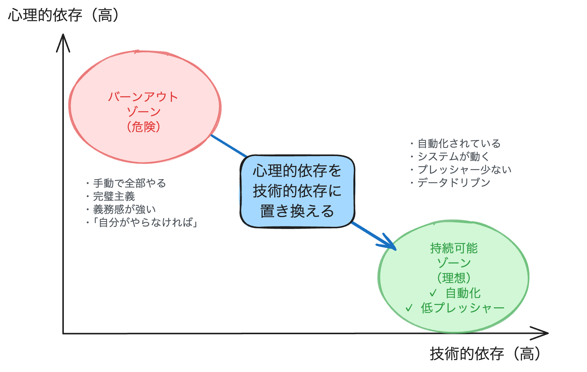
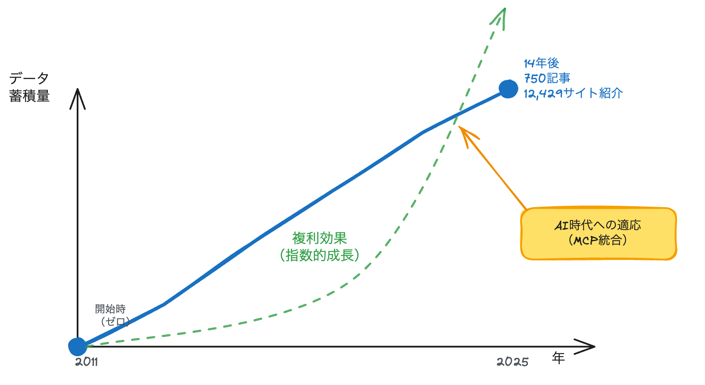
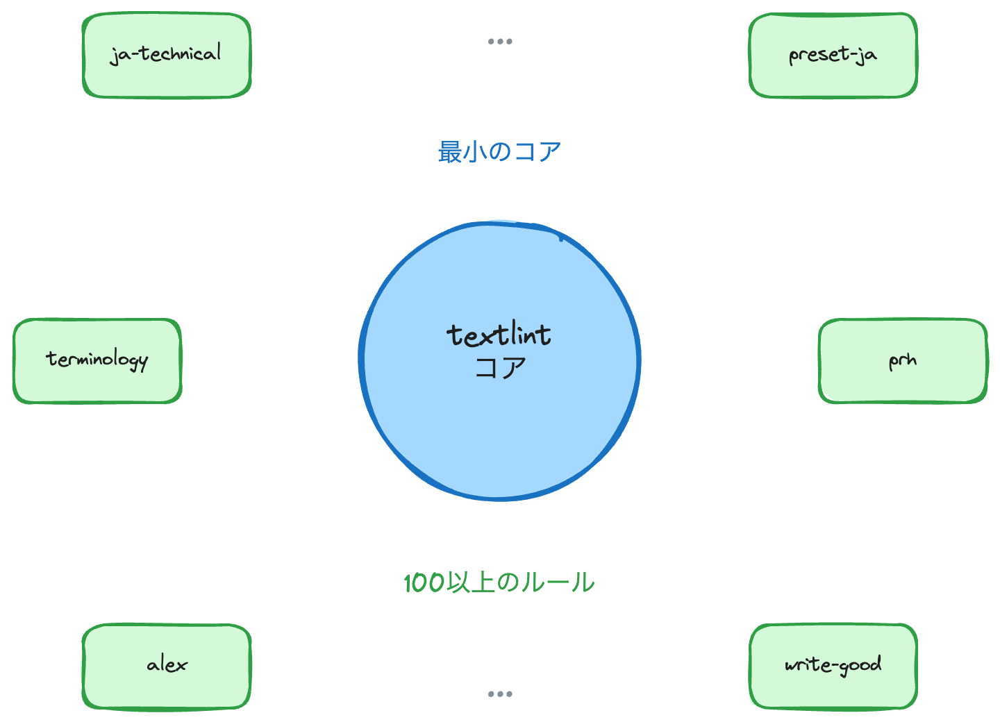

footer: YAPC::Fukuoka 2025 - azu
slidenumbers: true
build-lists: true
autoscale: true
theme: Plain Jane, 1

# [fit] **読む技術・書く技術・伝える技術**

## 15年続けて分かった持続可能なオープンソース開発

<br/>
<br/>
<br/>

**azu** (@azu_re)
YAPC::Fukuoka 2025

---

# 自己紹介


**azu**

- GitHub: @azu
- 2011年から14年間オープンソース活動を継続
- 3つのプロジェクトを運営中

---

# 今日話したいこと

**技術を使って、持続可能性を実現する**

14年間JSer.infoを続け
11年間textlintを続け
9年間jsprimerを続けてきた

その方法をお話しします

---

# 3つのプロジェクトのタイムライン

<!-- 3つのプロジェクト（JSer.info, textlint, jsprimer）の開始時期と継続期間を示すタイムライン -->


---

# それぞれのテーマ

- **JSer.info**: 読む技術（情報収集と発信）
- **textlint**: 書く技術（品質の自動化）
- **jsprimer**: 伝える技術（協働と設計）

## **問い**: なぜ15年も続けられたのか？

---

# これらのプロジェクトの特徴

**一つのアウトプットでは目的が達成できない**

- JSer.info: 継続的な情報発信でエコシステムを把握
- textlint: あらゆる言語のlint、ルールとエコシステムの構築
- jsprimer: JavaScriptの進化に追従し続ける

ある程度長くやらないと達成できない目的

---

# 長期的な目的を持っている

これらのプロジェクトは
**作ったもの**（アウトプット）ではなく
**実際の影響**（アウトカム）を目指している


---

# アウトプット vs アウトカム

> アウトカムが評価されるまでには時間がかかる

[.column]
## **アウトプット**
作ったもの
（記事、ツール、書籍）

[.column]
## **アウトカム**
実際の影響・成果
（信頼、エコシステム、教育）

> この抽象的な区別がOSSで特に重要になる理由を次で具体化します。

---

# オープンソースにおけるアウトカム

**時間をかけて現れるもの**
- ツールの普及と影響
- コミュニティの形成
- 知識の蓄積と共有
- エコシステムの成長

これらはすべて、時間をかけないと現れない

---

# 多くのオープンソースプロジェクトの現実

成功の裏側には、同じ期間を走り切れない多数のプロジェクトがあります。

<!-- オープンソースプロジェクトのモチベーション曲線：熱意→継続→疲労→バーンアウトの流れ -->


- 数年で更新が止まる
- メンテナーの燃え尽き
- 心理的負担の増大

**なぜ燃え尽きるのか？**
→ 心理的プレッシャーの蓄積

> このギャップを埋める鍵が『持続可能性の設計』です。

[.quote: #000000, alignment(center), line-height(1.2), text-scale(1.0), Avenir Next Bold]


---

# 持続可能性が必要な理由

<!-- 持続可能性のループ：継続→時間の経過→アウトカムの顕在化→価値の認識→設計や技術で支える→継続 -->


---

# **問い**： どうやって15年間、燃え尽きずに継続できたのか？

---

# [fit] **テーマ**

## [fit] 技術的依存を増やし
## [fit] 心理的依存を減らす


---

# 技術的依存とは

**定義**：
- 自動化できる部分は自動化する
- ツールや(エコ)システムを育てる
- 再現可能なプロセスを構築する

**特徴**：
- スケールする
- 疲れにくい
- 他者も利用できる

---

# 心理的依存とは

**定義**：
- 「自分がやらなければ」というプレッシャー
- 完璧主義
- 義務感

**特徴**：
- スケールしない
- 疲れやすい
- 燃え尽きにつながる

---

# [fit] なぜこのバランスが重要か


<!-- 技術的依存と心理的依存の2軸グラフ：右下（技術的依存高、心理的依存低）が持続可能ゾーン -->


**技術的依存が高い**
→ 長期的に継続できる

**心理的依存が高い**
→ バーンアウトのリスク

---

# 今日の構成

1. **JSer.info** - 読む技術
   → データドリブン、効率性vs効果性

2. **textlint** - 書く技術
   → No core rules、エコシステム

3. **jsprimer** - 伝える技術
   → Living Standard、既知→未知

---

[.hide-footer]

# [fit] Part 1
# [fit] **読む技術**
## JSer.info

---

# JSer.info の目的

<!-- JSer.infoのウェブサイトスクリーンショット：週刊で記事を紹介している様子 -->


> 整理されたデータである「情報」を伝えること

**2011年1月16日創刊**

- 750記事、14年継続
- 12,429サイト紹介
- 一度も欠かさず週刊配信

---

# 情報収集システムの全体像

<!-- JSer.infoの情報収集フロー：3600RSSフィード→自動収集→人間キュレーション→自動公開 -->


**なぜ完全自動化しないのか？**
→ 効率性より効果性を優先

---

# 情報のレイヤー分類

<!-- 新しい情報という視点で技術情報を階層化：Awareness層、Interest層、Comparison層 -->


**3つのレイヤーから情報を収集**：
- Awareness層: 新規公開直後の情報（GitHub中心）
- Interest層: トレンドと話題性（SNS、アグリゲーション）
- Comparison層: 比較検討された実践的情報（書籍、メディア）

> 出典: [JSer.info 10周年](https://jser.info/2021/01/16/jser-10th/)

---

# 情報収集の具体的な方法

**RSSリーダーを基盤に約3,600フィード**：
- GitHub（全体の30-40%）
  - Trending、リポジトリ新着、リリース情報
- 日次・週次ニュース
  - JavaScript Weekly、Node Weekly
- アグリゲーション
  - daily.dev、Echo JS、はてなブックマーク
- 個別ブログ・サイト
  - Qiita、Medium、dev.to

**受動的収集の利点**: フィードは更新されるものに収束

---

# 効率性と効果性の使い分け

[.column]
## **効率性**
受動的収集（自動化）
- RSSベースの自動収集
- 特定の企業やOrganizationを監視
- フィード数は収束する

[.column]
## **効果性**
情報の質を重視
- 曖昧なもの（トレンド）より明確なもの（日付）
- 検索結果より構造化されたソース
- 網ではなく槍を使う

**JSer.infoは効率性（自動化）と効果性（人間の判断）を組み合わせる**

---

# データドリブンな公開基準


[.column]
## ❌ **従来**
「毎週月曜日に公開」
→ 書けない週のプレッシャー

[.column]
## ✅ **JSer.info**
「13記事集まったら公開」
→ 品質でリリース判断

**結果**: 14年間の継続

---

# 退屈な部分だけ自動化

**自動化するもの**：
- 3,600フィードの収集（退屈）
- カテゴリ分類（退屈）
- GitHub Actions公開（退屈）

**手動で残すもの**：
- 価値判断（本質）
- 文脈の理解（本質）

---

# JSer.info Policy

> **「技術的な嘘はつかない」**

**使わない言葉**：
"is Dead"、最強、熱い

**慎重に扱う情報**：
ベンチマーク数値（マイクロベンチマークは文脈次第で誤解を招く）

**使う言葉**：
代替方法、特徴、比較

感情極性値 -0.216（ほぼ中立）

---

# 「紹介」ではなく「知ってもらう」


[.column]
## **紹介**
情報を提示して終わり

[.column]
## **知ってもらう**
読者が元サイトにアクセス
JavaScriptエコシステム全体を理解

**JSer.infoは目的地ではなく、導線**

---

# 技術的依存を育てる - 複利効果

<!-- 14年間のデータセット蓄積の指数的成長グラフ：750記事、12,429サイト紹介 -->


**14年間継続の結果**：
- 14年分のデータ蓄積
- 構造化されたJSON
- AI時代への適応（MCP統合）

複利効果：過去の蓄積が未来の価値を生む

---

# 複利効果の具体例

- **2014年：textlint統合**
- JSer.info記事の品質管理に使用
- 使っているから改善する、改善したから使い続ける
- **2015年: Datasetと統計ライブラリを公開**
- データセットをプログラムから利用可能に
- **2015年: JSer.info Trends**
- 14年分のタグデータからトレンド可視化
- エコシステムの変化を追跡
- **2022年: Product Name API**
- 12,429サイトのデータからプロダクト名を検索
- **2022年: [JSer.info Watch List](https://jser.info/watch-list/)公開**
- 情報源をまとめたRSSを公開
- **2025年：JSer.info MCP Server**
- 14年分のデータセットをClaude Desktopから検索可能に
- AIがJavaScript情報の文脈を理解して回答

**もし途中で辞めていたら、これらは存在しなかった**

---

# JSer.infoまとめ

**技術的依存を増やした**：
- データ基準（13記事で公開判断）
- 局所自動化（3,600フィード収集、GitHub Actions）
- 蓄積再利用（14年分のJSON、MCP統合）

**心理的依存を減らした**：
- 週次固定締切（毎週月曜のプレッシャー）
- 完璧主義（品質より継続）

---

[.hide-footer]

# [fit] Part 2
# [fit] **書く技術**
## textlint

---

# 読むから書くへの移行

読む技術の洞察が書く技術の改善をどう促したかを次で示します。

**きっかけ**：
- JSer.infoで情報を読み続けていた
- 「読むだけでは物足りない」
- 「自分でも書いてみよう」

**2014年3月**：Promise本の執筆開始

---

# 書くことで気づいたこと

> **書くと、読む量が増える**

**なぜ？**
- 調べる（情報を読む）
- 検証する（ドキュメントを読む）
- 自分が書いたものを読み返す

書くことは、読むことの延長

---

# 書く中で見つけた課題

**Promise本執筆時の問題**：
- 表記揺れが気になる
- 「JavaScript」vs「Javascript」
- 「コールバック」vs「callback」

**解決策**：ツールを作ろう

---

# textlint誕生の5日間

<!-- 2014年12月24-30日の5日間でtextlintを作成したタイムライン -->


**5日間で作った理由**：
自分の問題を解決したかった

「使うものを作る/使うために作る」

---

# textlintの本質

> 「自然言語には正解がないため、
> 拡張の柔軟性を持つこと」

**コア原則**：
- 検証できることだけを自動化
- ルールの透明性
- 説明可能性

---

# No core rules戦略


[.column]
## ❌ **従来のLinter**
インストール → デフォルトルール
→ すぐ使える

[.column]
## ✅ **textlint**
インストール → 何も起きない
→ ルール選択

「楽に使える」より「適切に使える」

---

# 最小コア、豊かなエコシステム

<!-- textlintコア（最小）と周辺エコシステム（100以上のルール）の関係図 -->


**結果**：
週85,000ダウンロード
100以上のコミュニティルール

---

# AI時代への適応 - MCP統合

**2025年1月：textlint v14.8.0**

```bash
npx textlint --mcp
```

- AIアシスタントから直接呼び出し可能
- VS Code、Cursor、Claude Code統合

11年前のツールが、AI時代でも価値を持つ

---

# AIベースライン時代の品質管理


**textlint-rule-preset-ai-writing**：
AI生成文章の不自然さを検出

[.column]
## **従来（〜2022年）**
人間には負担が大きい

[.column]
## **AI時代（2023年〜）**
AIは瞬時に適用可能
一貫性の自動維持

---

# textlintまとめ

**技術的依存を増やした**：
- AST拡張（構文解析ベース）
- ルール分離（100以上のエコシステム）
- MCP適応（AI時代への統合）

**心理的依存を減らした**：
- 全対応期待（No core rules戦略）
- コア肥大化懸念（エコシステムに委ねる）

---

[.hide-footer]

# [fit] Part 3
# [fit] **伝える技術**
## JavaScript Primer

---

# 書くから伝えるへの移行

書く過程で浮かび上がった『読者視点』が、伝える技術の枠組みを生みました。

**転換点**：
- 個人で書く → 相手に伝える
- 一人で書く → 共著で書く
- **「読者」を強く意識する瞬間**

**2016年**：JavaScript Primer開発開始

---

# jsprimerの本質

**3つを継続的に提供**：
1. **書き方**：基本文法などのJavaScriptの書き方
2. **作り方**：アプリケーションの作り方
3. **学び方**：JavaScriptの進化を自分で知る学び方

**JavaScriptのアンカー（基準点）**

---

# Living Standard戦略

<!-- Living Standard（継続的更新）vs Snapshot（固定版）の比較図 -->


**教科書もLiving Standardであるべき**

- v6.0.0：ES2024対応（2024年）
- v7.0.0：ES2025対応（2025年）

---

# Design Doc

```
各章/
├── README.md（本文）
├── OUTLINE.md（設計文書）
└── 議論の履歴（Issue/PR/Meeting Notes）
```

**OUTLINE.mdの役割**：
- なぜこの章が必要か
- 何を学ぶか
- どう教えるか

**すべての議論を公開**：
- Issue/PRでの議論
- Meeting Notesも公開

---

# AI活用 - Iterator Helpers章

<!-- Design Doc（設計文書）→ AI生成 → レビュー のワークフロー図 -->


**文章の「最初の一歩」は重い**
→ このボトルネックをAIで軽減

2025年時点での持続可能性の進化

---

# 既知→未知の原則


[.column]
## ❌ **著者視点**
「これを覚えろ」

[.column]
## ✅ **読者視点**
「あなたが知っているXは、
実はY」

**読者の現在地から出発**

---

# 自動テストによる品質保証

<!-- 3層の品質チェック：構文チェック、リンクチェック、コード実行テストの階層図 -->


すべてCI/CDで自動実行

使っているから続く、続いているから使う

---

# 技術から人へ - 持続可能性の課題

**技術的依存で解決できたこと**：
- 品質保証の自動化（CI/CD）
- Living Standardによる継続更新
- Design Docによる設計の明確化
- Sandpackによる貢献障壁の低下

---

# 技術だけでは解決できない

<!-- 技術的解決 vs 人的課題の対比図：技術で解決できることとできないことの境界 -->


**技術的依存では解決できないこと**：
- 継続的な労力（年間30日分）
- コミュニティの維持・活性化
- モチベーションの維持

**→ だから経済とコミュニティの設計が必要**

---

# 透明な経済モデル

[.column]

**年間コスト試算**：
- 約30日分の労力
- 約70万円相当

[.column]

**収入源**：
1. 書籍売上
2. Open Collective
3. GitHub Sponsors

---

# Open Collective

<!-- Open Collectiveのダッシュボード：透明な収支管理、プロジェクト単位の資金管理 -->


**具体例**：<https://opencollective.com/jsprimer>

**仕組み**：
- プロジェクト単位の資金管理
- 企業向けスポンサー特典
- 透明な収支公開

---

# Fibonacci報酬システム

```
タスク複雑度：1, 2, 3, 5, 8ポイント
1ポイント = 約$7
（目安：2ポイント ≒ 1日分の作業）

年間想定：60ポイント分の作業
```

**仕組みの特徴**：
- 貢献度の可視化
- 金銭的還元の仕組み化
- コントリビューター参加の促進

---

# 100人以上のコントリビューター

**どうやって？**

- ハードルを下げる
  - OUTLINE.mdで方向性明確化
  - Sandpackでブラウザ完結

- 透明性を保つ
  - すべての議論をGitHub上で
  - Meeting Notesも公開
  - 判断理由の記録

---

# jsprimerまとめ

**技術的依存を増やした**：
- 継続仕様（Living Standard、ES2025対応）
- 自動品質（CI/CD、3層チェック）
- 設計文書（OUTLINE.md、AI活用）
- 経済透明化（Fibonacci報酬、Open Collective）

**心理的依存を減らした**：
- 一度で完成要求（継続更新前提）
- 単独著者責任（100人以上のコントリビューター）

---

[.hide-footer]

# [fit] Part 4
# [fit] **循環の技術**
## 複利効果と段階的発展

---

# 各プロジェクトの重点配分

<!-- 3つのプロジェクトごとの「読む・書く・伝える」のバランス図：重点は異なるが全てを含む -->


---

# 段階的な発展

```
2011: JSer.info
  読むことから始まった
     ↓
2014: textlint
  書くことで読む量が増える体感
     ↓
2015: JavaScript Primer
  伝えることで読む・書くの質が上がる
```

**自然な進化、意図的な設計ではない**

---

# オープンソースの4つのモデル

| モデル | ユーザー | 貢献者 | 特徴 |
| --- | --- | --- | --- |
| TOYS | Low | Low | サイドプロジェクト |
| STADIUMS | High | Low | 集中型メンテナンス |
| CLUBS | Low | High | 重複コミュニティ |
| FEDERATIONS | High | High | 複雑なガバナンス |

出典: [Working in Public](https://press.stripe.com/working-in-public)

---

# 4つのモデルの図


---


---

# プロジェクトはToysから始まる


> それぞれ異なるモデルへと発展

---

# JSer.info: Toysモデルを維持

**最適な規模を保つ設計**：
- データドリブンな公開（GitHub Actionsによる自動化）
- 人間の判断を排除
- 心理的プレッシャーを発生させない設計

**安定した規模を維持することで、心理的負荷を排除**

---

# textlint: Stadiumsモデル

**週85,000ダウンロード、少数のメンテナー**：
- No core rules戦略
- コアを最小化、エコシステムへ委譲
- 100以上のルールをコミュニティが作成

**技術的依存は高いが、心理的依存を下げる設計**

---

# jsprimer: Clubsモデル

**100人以上のコントリビューター**：
- Living Standard（常に更新）
- Design Docで貢献のハードルを下げる
- ユーザーと貢献者が重複するコミュニティ

**貢献しやすい構造で心理的負荷を分散**

---

# 各モデルでの心理的負荷への対応


**モデルごとに異なる戦略で持続可能性を確保**

---

# 複利効果①データセット蓄積

**JSer.info**：
- 14年分のデータセット
- AI時代のサマライズ

**textlint**：
- 100以上のルール
- エコシステムの成長

**jsprimer**：
- Sandpack統合

---

# 複利効果③相互強化のループ

<!-- 3つのプロジェクトの相互強化ループ：読む→書く→伝える→読むの質向上 -->


**プロジェクト間の循環**：
読む → 書く → 伝える → 読むの質向上

---

# リスク - 技術的依存の連鎖

**どれか一つが止まると全部止まる可能性**

これは受け入れているリスク
トレードオフの認識

**ただし...**

技術的依存は心理的依存と異なり、代替可能性が高い
ツールが止まっても別のツールに置き換えられる

---

# リスクに対する設計上の緩衝

**リスクは残るが影響度を小さく保つ設計**：

- **再起性**: 復旧手順と自動化により中断から再開しやすい
- **分散**: No core / コントリビューター拡張で責任集中を回避
- **透明性**: 設計文書と経済公開で意思決定の負担を軽減

→ リスクは残るが影響度を小さく保つ設計で継続性を確保

---

# [fit] **技術的依存と心理的依存**

[.column]
## 技術的依存 ✓

- スケールする
- 疲れにくい
- 複利効果を生む
- 自動化できる
- **交換可能・差し替え可能**
- **持続がし易い**

[.column]
## 心理的依存 ✗

- スケールしない
- 疲れる
- バーンアウトを生む
- 自動化できない
- **コントロールが難しい**
- **持続が難しい**


---

# 具体例①JSer.info

**データドリブン公開**：
- 「毎週月曜」というプレッシャー排除
- データ量で判断
- 復旧可能性の向上

心理的依存を技術的依存に置き換え

---

# 具体例②textlint

**No core rules**：
- 「全てに対応する」プレッシャー排除
- エコシステムに委ねる
- 持続可能なメンテナンス

責任をコミュニティに分散

---

# 経済的持続可能性 - GitHub Sponsors

**2019年10月から開始**

105人以上のスポンサー
約¥2.59M/年（$17,300）

複数のプロジェクトを横断的に支援

---

# GitHub Sponsorsの成長

<!-- 2019年から2024年までのスポンサー収入の成長グラフ：$0→$17,300/年 -->


```
2019年10月：$0（開始）
2024年：約¥2.59M/年（$17,300）
```

**なぜ成長できたのか？**

---

# GitHub Sponsorsの設計思想

**Tier設計**：
- ✨ Supporter：$1/月
- ☕ Coffee：$5/月
- 🌐 Domain：$10/月
- 📖 Book：$30/月

**特典は最小限**：
責任感・義務感を作らない

---

# 具体例③GitHub Sponsors

**見返りを用意しない**：
- 即時利益より長期関係
- 変に義務を作るとプレッシャーになる
- 健全な支援関係

義務感を作らない設計

---

# Public Writing as Future Asset

<!-- 15年間の公開執筆の循環：読む→書く→伝える→読むの質向上、そして複利効果 -->


**この循環こそが「書くことは読むことである」の実証**

---

[.hide-footer]

# [fit] まとめ

---

# 12の設計原則

[.column]
**読む技術（JSer.info）**：
1. データドリブンな公開基準 [技術]
2. 退屈な部分だけ自動化 [技術]
3. 小さなイテレーション [技術]

**書く技術（textlint）**：
4. デフォルトルールなし戦略 [心理]
5. 最小コア、豊かなエコシステム [技術]
6. 検証可能なことを自動化 [技術]
7. 最小限の依存関係 [心理]

[.column]
**伝える技術（jsprimer）**：
8. Living Standard戦略 [心理]
9. 既知→未知の原則 [心理]
10. 自動テストによる品質保証 [技術]
11. 透明な経済モデル [心理]
12. 使って改善する循環 [技術/心理/循環]

##### [fit] **[技術]**: 技術的依存を育てる (1,2,3,5,6,10,12)
##### [fit] **[心理]**: 心理的依存を減らす (4,7,8,9,11,12)

---

# 続けることで複利が生まれる

- データセット蓄積
- エコシステム成長
- AI時代への適応力
- プロジェクト間の相互強化

**そのための設計原則**：
- **技術的依存を積極的に育てる** → スケールする、疲れにくい、複利効果
- **心理的依存を意識的に減らす** → バーンアウト回避、長期継続

---

# ありがとうございました


- JSer.info: <https://jser.info/>
- textlint: <https://textlint.org/>
- JavaScript Primer: <https://jsprimer.net/>
- GitHub: <https://github.com/azu>

---