footer: YAPC::Fukuoka 2025 - azu
slidenumbers: true
autoscale: true
theme: Plain Jane, 1

# [fit] **読む技術・書く技術・伝える技術**

## 15年続けて分かった持続可能なオープンソース開発

<br/>
<br/>
<br/>

**azu** (@azu_re)
YAPC::Fukuoka 2025

---

# 自己紹介


**azu**

- GitHub: [@azu](https://github.com/azu)
- X/Twitter: [@azu_re](https://x.com/azu_re)
- 2010年から15年間オープンソース開発

---

# 今日話したいこと

15年間オープンソース活動のうち

- 2011年-: [JSer.info](https://jser.info/): JavaScriptの毎週更新の情報ブログ
- 2014年-: [textlint](https://textlint.org): 自然言語のLinter
- 2016年-: [JavaScript Primer](https://jsprimer.net/): JavaScript入門書

---

# 3つのプロジェクトのタイムライン

<!-- 3つのプロジェクト（JSer.info, textlint, jsprimer）の開始時期と継続期間を示すタイムライン -->
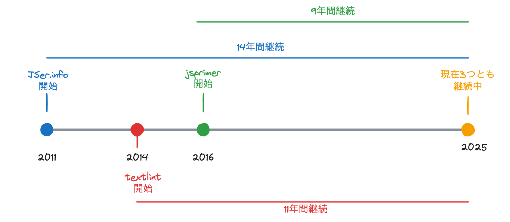

---

# **問い**: なぜ15年も続けているか？

---

# これらのプロジェクトの特徴

**作ったもの（アウトプット）ではなく実際の影響（アウトカム）を目指している**

[.column]
## **アウトプット**
作ったもの
（記事、ツール、書籍）

[.column]
## **アウトカム**
実際の影響・成果
（信頼、エコシステム、教育）

**アウトカムは評価されるまで時間がかかる**
→ だから持続可能性が必要

---

# 持続可能性のループ

<!-- 持続可能性のループ：継続→時間の経過→アウトカムの顕在化→価値の認識→設計や技術で支える→継続 -->
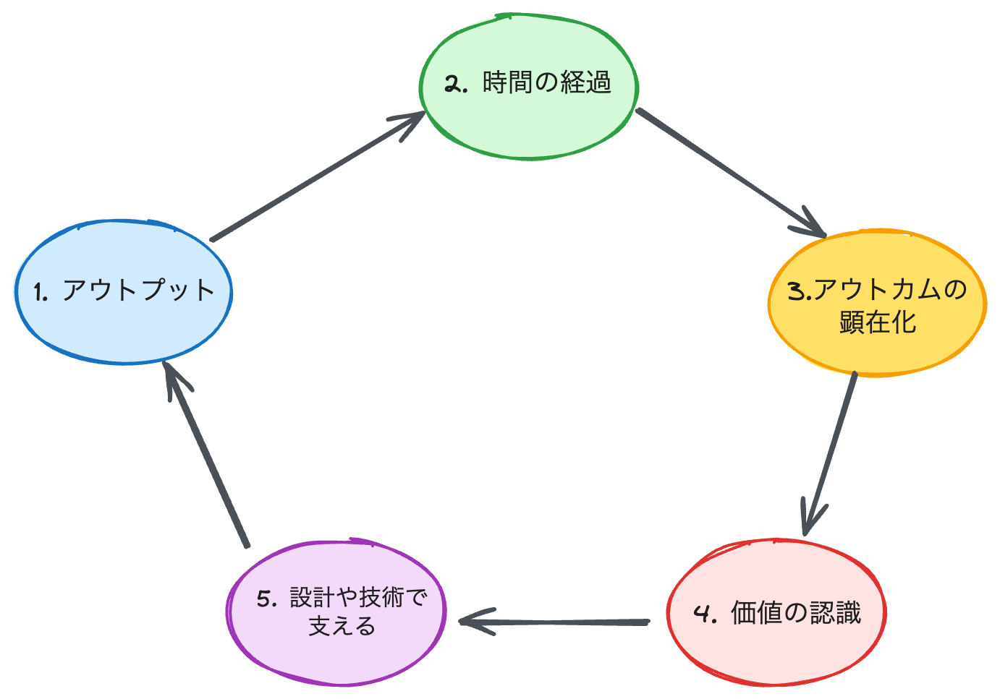

---

# 多くのオープンソースプロジェクトの現実

<!-- オープンソースプロジェクトのモチベーション曲線：熱意→継続→疲労→バーンアウトの流れ -->
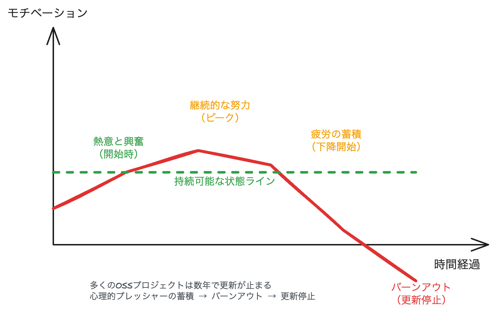

- 数年で更新が止まる
- メンテナーの燃え尽き
- 心理的負荷の増大

**なぜ燃え尽きるのか？**

---

# 実例: Meta-Weekly

[Meta-Weekly](https://azu.github.io/Meta-Weekly/): 毎週更新ブログをまとめたサイト


---

# Burnout: 期待と現実のギャップ

> Burnout is the experience of being pulled between expectation and reality at work.
>
> — Jonathan Malesic, [The End of Burnout](https://www.ucpress.edu/books/the-end-of-burnout/paper)

---

# 期待と現実のギャップ

[.column]
## 期待
- 「自分がやらなければ」
- 「全てに対応すべき」
- 「常に最新に保つべき」

[.column]
## 現実
- 時間がない
- 対応できない
- 追いつけない

**→ このギャップがBurnoutを引き起こす**

---

# Burnoutは真偽値ではない

**Burnoutは真偽値ではなく、複数の状態の組み合わせで現れる**

<!-- バーンアウトのスペクトラム：5つのプロファイルと3つの次元の組み合わせ -->

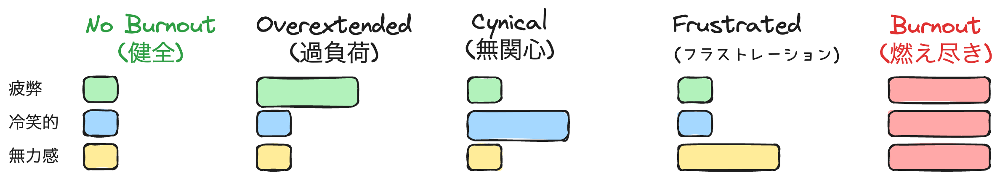

^ バーンアウトには3つの次元がある: 疲弊（Exhaustion）、シニシズム（Cynicism/他者を問題として捉える）、無力感（Ineffectiveness/達成感の低下）
^ 5つのプロファイル: 健全、過負荷（疲弊のみ高）、シニカル（シニシズムのみ高）、徒労感（無力感のみ高）、完全燃焼（全て高）
^ 労働者の約50%がこのスペクトラムのどこかに位置している
^ 心理的負荷が増えると、これらの次元のスコアが上がり、バーンアウトへと進行する

---

# どうやって15年間、燃え尽きずに継続できたのか？

---

# [fit] **テーマ**

## [fit] 技術的依存を増やし
## [fit] 心理的負荷を減らす

^ これを JSer.info、textlint、jsprimer の3つのプロジェクトでの話を紹介する

---

# 技術的依存とは

**定義**：
- 自動化できる部分は自動化する
- ツールや(エコ)システムを育てる
- 再現可能なプロセスを構築する

**特徴**：
- スケールする
- 疲れにくい
- 他者も利用できる

---

# 心理的負荷とは

**定義**：
- 「自分がやらなければ」というプレッシャー
- 完璧主義
- 義務感

**特徴**：
- スケールしない
- 疲れやすい
- 燃え尽き(Burnout)につながる
- ゼロにはできない

---

# 心理的負荷と技術的依存

<!-- 技術的依存と心理的負荷の2軸グラフ：右上（技術的依存高、心理的負荷低）が持続可能ゾーン -->


---

# [fit] 心理的負荷を技術的依存に転換する

**前提：心理的負荷をゼロにはできない**
→ でも、技術的依存に変換できる部分は存在する

[.column]

**心理的負荷の特徴**
- コントロールが難しい
- スケールしない
- バーンアウトリスク

[.column]

**技術的依存の特徴**
- コントロールしやすい
- スケールしやすい
- 設計次第で明確化できる


---

# 今日のテーマ: 心理的負荷と技術的依存

1. **JSer.info** - 読む技術
   → データドリブン、退屈な部分の自動化

2. **textlint** - 書く技術
   → No core rules、エコシステム

3. **jsprimer** - 伝える技術
   → Living Standard、既知→未知

---

[.hide-footer]

# [fit] Part 1
# [fit] **読む技術**
## JSer.info

---

# JSer.info の目的

<!-- JSer.infoのウェブサイトスクリーンショット：週刊で記事を紹介している様子 -->
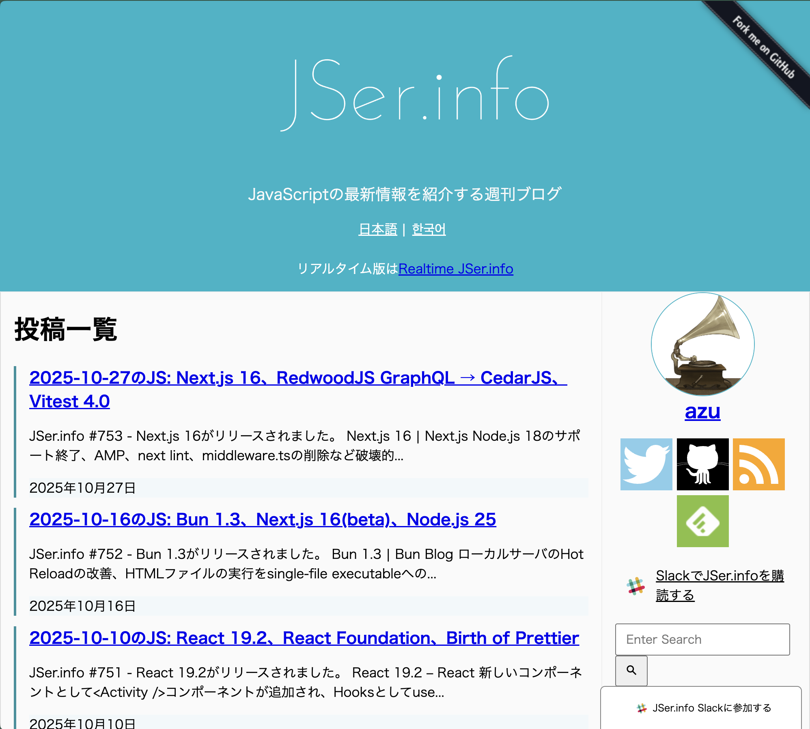

> 整理されたデータである「情報」を伝えること

**2011年1月16日創刊**

- 750記事、14年継続
- 12,429サイト紹介
- 一度も欠かさず週刊配信

---

# 情報収集システムの全体像

<!-- JSer.infoの情報収集フロー：3600RSSフィード→自動収集→人間キュレーション→自動公開 -->
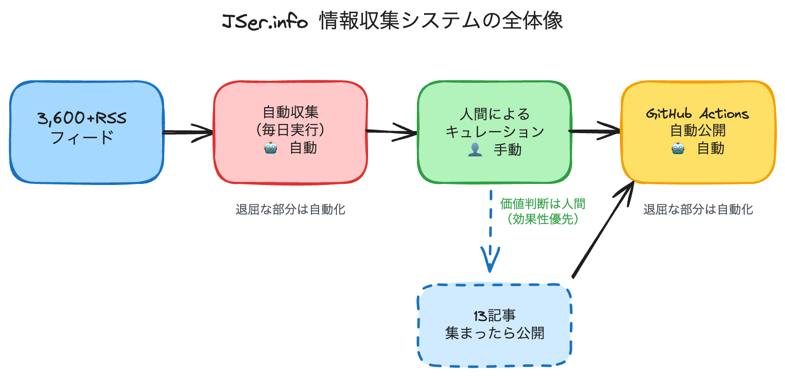

---

# ① 情報源：どこから集めるか

[.column]

<!-- 新しい情報という視点で技術情報を階層化：Awareness層、Interest層、Comparison層 -->
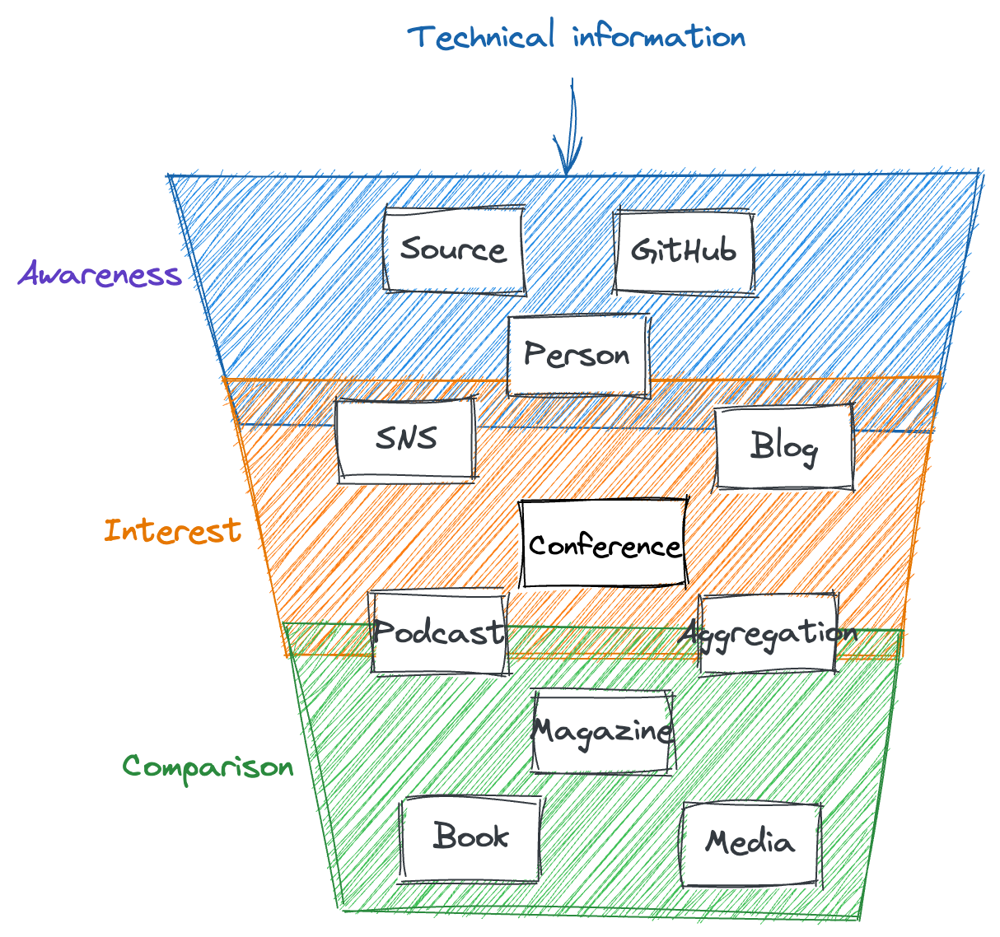

[.column]

**3つのレイヤーから情報を収集**：

- Awareness層: 新規公開直後の情報（GitHub中心）
- Interest層: トレンドと話題性（SNS、記事）
- Comparison層: 比較検討された実践的情報（書籍、メディア）

詳細は[JSer.info 10周年記事](https://jser.info/2021/01/16/jser-10th/)を参照


^ 情報というとざっくりしているので主に3つの層に分類しています
^ JSer.infoの紹介記事のカテゴリもこの流れに沿っていています
^ 上から新しい情報となることが多い、下に行くほど濃度が高い情報になります


---

# ② 収集： 3500+RSSフィードを自動収集

[.column]
**RSS**
- 技術ブログ約2,000サイト
- Inoreaderで一元管理
- [JSer.info Watch List](https://jser.info/watch-list/)で情報源を公開

[.column]
**GitHub**
- 1500+リポジトリをWatch
- [watch-rss](https://github.com/azu/watch-rss)でRSS化
- [github-search-rss](https://github.com/azu/github-search-rss)で検索結果をRSS化

---

# ③ 判断：人間がキュレーション

RSSを[Irodr](https://irodr.netlify.app/)（LDR風リーダー）で読んで判断

**なぜ人間が判断？**
→ 目的は「紹介」ではなく「知ってもらう」こと

**人間が判断する価値**
- 単なるリンク集ではなく、文脈を説明/整理/なぜ興味深いかを伝える
- 読者はAIではなく、人間だから
- 増やすのではなく、少なくすること

---

# 判断基準: [JSer.info Policy](https://jser.info/policy/)

> 一例: **「技術的な嘘はつかない」**

**使わない言葉**：
- "is Dead"、最強、熱い、魂が震える

**慎重に扱う情報**：
- ベンチマーク数値（マイクロベンチマークは難しい）

---

# [fit] ④ 公開： 紹介サイトをまとめた記事を公開

---

[.hide-footer]

<!-- JSer.info更新フローの自動化前 2011年ごろ -->
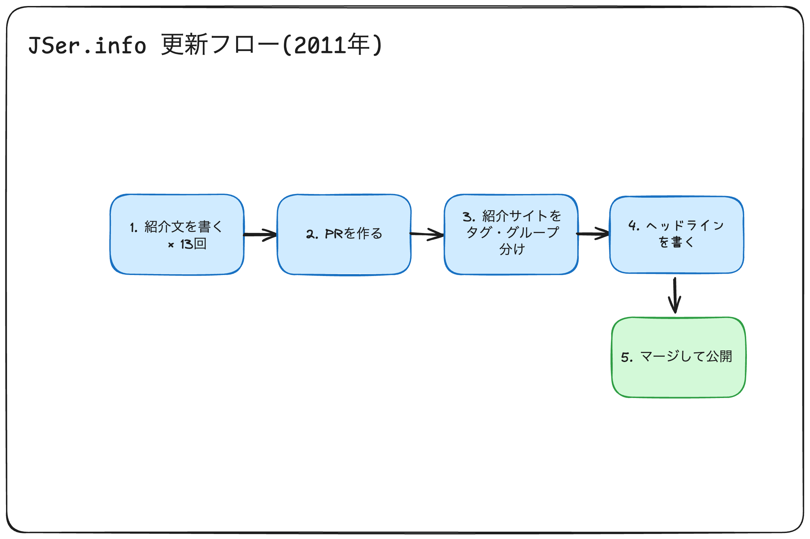

^ JSer.info 2011年ごろの更新フロー

---

[.hide-footer]

<!-- JSer.info更新フローと自動化の進化：2025年ゴロの自動化の様子 -->
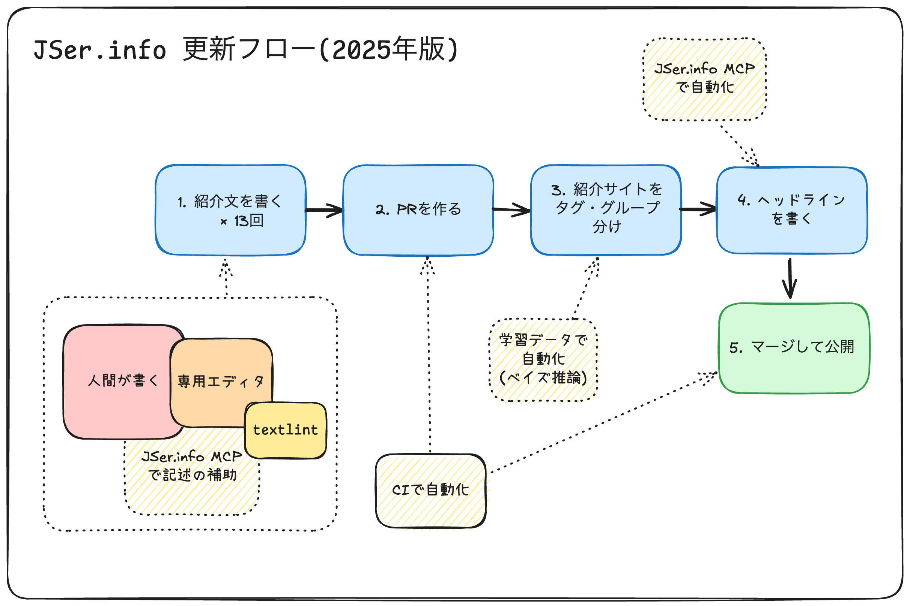

^ JSer.info 2025年ごろの更新フロー

---

# 自動化の詳細

✓ **紹介文を書く**
  - 専用エディタ(Postem) (2019〜)
  - MCP執筆補助 (2025〜)

✓ **PRを作る**
  - GitHub Actions (2019〜)

✓ **タグ・グループ分け**
  - タグ推論 (2023〜)
  - グループ学習 (2020〜)
  - ヘッドラインをAIで書く (2025〜)

**段階的に自動化を進めて継続性を確保**

---

# JSer.infoでは人は情報の整理に集中する


1. 見る
2. 調べる
3. 検証する
4. 説明文を書く

---

# データドリブンな公開基準

[.column]
## ❌ **従来**
「毎週月曜日に公開」
→ 書けない週のプレッシャー

[.column]
## ✅ **JSer.info**
「13記事集まったら公開」
→ 品質でリリース判断

**結果**: 14年間の継続

---

# エポックメイキング

- 振り返って一番大きかったのは、日付ベースではなく記事数ベースの公開基準にしたこと
- この13記事という基準は初めてから4-5年ぐらい経って、中央値を見るとここに安定していたことに気づいた
- この発見で心理的なプレッシャーが大きく軽減できて続いたと感じている
- <https://github.com/jser/status-of-post>
- <https://jser.info/status-of-post/>

^ その13記事っていうのは、始めてから4、5年ぐらい経って初めて、なんか13記事、毎週13記事ぐらいだなって感じになって、ちょうど安定したんですけど
^ この一回更新を止めた時にやっぱ復旧するのはめちゃくちゃ難しいんですね。ダイエットとかもそうだけど
^ 一回なんかやめてしまうと、そこをずっとやめてしまうんで、その、なんか、やめた後にすぐ復旧できるっていうのが13記事っていう基準だとやりやすい

---

# 続けていく中で改善された

**技術的依存は、継続によって育つ**

[.column]

```
1. 継続する
     ↓
2. データが蓄積
     ↓
3. 自動化の材料が増える
     ↓
4. 自動化が進む
```

[.column]

```
     ↓
5. 作業が楽になる
     ↓
6. 続けやすくなる
     ↓
1. 継続する（最初に戻る）
```

^ [「データ無い！ 腹立つ！ 推論する！」から 「データ無い！ 腹立つ！ データを作る」へ チームでデータを作り、育てられるようにするまで / How can we create, use, and maintain data ourselves? - Speaker Deck](https://speakerdeck.com/moznion/how-can-we-create-use-and-maintain-data-ourselves)でデータがないと自動化できない。データがないとわからないという話がありましたが、それと同じ話で、データが蓄積すると自動化ができるようになります。

<!-- # 複利効果の具体例

- **2014年：textlint統合**
- JSer.info記事の品質管理に使用
- 使っているから改善する、改善したから使い続ける
- **2015年: Datasetと統計ライブラリを公開**
- データセットをプログラムから利用可能に
- **2015年: JSer.info Trends**
- 14年分のタグデータからトレンド可視化
- エコシステムの変化を追跡
- **2022年: Product Name API**
- 12,429サイトのデータからプロダクト名を検索
- **2022年: [JSer.info Watch List](https://jser.info/watch-list/)公開**
- 情報源をまとめたRSSを公開
- **2025年：JSer.info MCP Server**
- 14年分のデータセットをClaude Desktopから検索可能に
- AIがJavaScript情報の文脈を理解して回答
- Postemでの執筆補助に活用

**もし途中で辞めていたら、これらは存在しなかった**
 -->


---

# JSer.infoまとめ

**技術的依存を増やした**：
- データ基準（13記事で公開判断）
- 退屈な部分の自動化（収集、PR作成、分類）
- 継続による技術的依存の改善（蓄積 → 自動化 → 継続）

**心理的負荷を減らした**：
- 週次固定締切（毎週月曜のプレッシャー）を廃止
- JSer.info Policyを作り、基準を明確化

---

[.hide-footer]

# [fit] Part 2
# [fit] **書く技術**
## textlint

---

# 読むから書くへの移行

> 読む → **書く**

**きっかけ**：
- JSer.infoで情報を読み続けていた
- 「読むだけでは物足りない」
- 「自分でも書いてみよう」

**2014年3月**：[JavaScript Promise本](https://azu.github.io/promises-book/)の執筆開始

---

# 書くことで気づいたこと

> **書くと、読む量が増える**

**なぜ？**
- 調べる（情報を読む）
- 検証する（ドキュメントを読む）
- 自分が書いたものを読み返す

書くことは、読むことの延長

---

# 書く中で見つけた課題

**[JavaScript Promise本](https://azu.github.io/promises-book/)執筆時の問題**：
- 表記揺れが気になる
- 「JavaScript」vs「Javascript」
- 「コールバック」vs「callback」

**解決策**：ツールを作ろう

---

# textlint

- 自然言語(日本語や英語など)に対するLinter
- MarkdownやHTMLなどのマークアップ言語に対応している
- ビルトインのルールは0
- 利用できるルールは200以上ある
- CI/CDに組み込める自然言語のチェッカー(表記揺れ、スペルチェック、誤用、読みやすさのチェックなど)

---

# textlintの考え方

> 「自然言語には正解がないため、
> 拡張の柔軟性を持つこと」

**コア原則**：
- ルールをコアで持たない
- プラグインで拡張できるようにする

---

# No core rules戦略

「楽に使える」より「適切に使える」

[.column]
**従来のLinter**
インストール 
→ デフォルトルール
→ すぐ使える

[.column]
**textlint**
インストール 
→ 何も起きない
→ ルール選択

---

# コアとルールの分離

- ESLint/RuboCop/Pylintなどはコアにルールを持っている
- コアにルールを持つとルールのIssueもコアに集まる = 心理的負担が集中する
- コアでやらないことではっきりさせることで、責任を分離できる
- そもそもあらゆる自然言語に対応したルールをコアに持つことは不可能
- [textlint - Linterの作り方](https://azu.github.io/slide/2022/lint-night/textlint.html)

^ 考え方的には、絵文字言語というような未知の言語が出てきた時にtextlintはそれに対応できるという目的を持って設計しています。

<!-- 

---

# 目的のための仮想言語:<br>絵文字言語

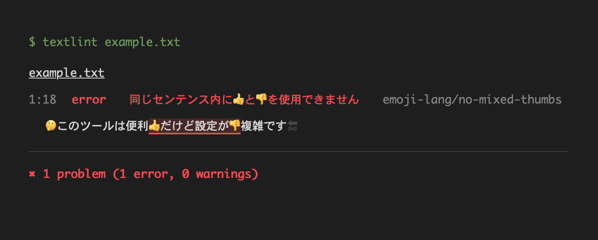

絵文字言語では3つのルールがあります。

1. センテンスは任意の絵文字で始めないと行けません
2. 1つのセンテンス内に👍と👎を書いてはいけません
3. センテンスは必ず🔚で終わります。

こういう言語が出てきた時にもtextlintは対応できるアーキテクチャにする -->

---


# コアとルールの分離の結果

- ルールは200以上
- エディタの拡張や言語サポートもコアから分離
- 責務が分散するとメンテナンスも分散される
- コアから切り離せると、ルールの追加とかはやりやすくなる
- <-> 一方で、ルールが個人に紐づくとメンテナンスが止まる確率は高くなる
- → ルールをOrganizationに集めるなど、緩いまとまりを持ったコミュニティを作ることでバランスをとっている

---

# コアのフォーカスとエコシステムの拡充

- プラガブルの弱点は、ユーザーがプラグインを選択しないといけない点
- 人間が選択するのは大変
  - ルールによって求める文章の質が異なるので、目的に合ったルールを選ぶのが難しい
- 改善するにはエコシステムの拡充が重要になっていく
  - エディタの拡張、手軽に使えるような仕組み(Easy)
  - コアでやると、メンテナンスが大変になるので、できるだけ外部化を維持していた
- 改善するべきかをずっと耐えてコアにフォーカスしていたら、ユーザーが変化した

---

# 11年続けたらAIがユーザーになった

- 2023年以降、AIがユーザーになることで難しさが変化
- 人間にとっては選択が難しいが、AIがベースラインを上げる
- それによってコアでやるべき方向性を変えた
- 人間とAIを繋ぎやすくする方向へ

---

# textlintのMCP対応

**2025年1月：textlint v14.8.0でMCPサーバー対応**

```bash
npx textlint --mcp
```

- AI Agentがtextlintを使えるように
- AIがtextlintでチェックして修正できるようになったが、AI固有のエラーも増えた

---

# [fit] AI固有のエラー

## [fit] ✅ ❌ 🚀 🎯 🔥 💡 ⚡ 🌟

^ AIは絵文字を多用する傾向がある

---

# [@textlint-ja/textlint-rule-preset-ai-writing](https://github.com/textlint-ja/textlint-rule-preset-ai-writing)

AI特有の文章構造を検出するtextlintルールセット

- **絵文字の多用** - ✅ ❌ 🚀 🎯🔥
- **過剰表現** - 革命的、民主化、大幅な改善、非常に重要
- **強調構文の多用** - 太字、斜体、下線
- **コロンの直後にブロック要素が続く英語的なパターン:**

---

# AIベースライン時代の品質管理

[.column]
## **従来（〜2022年）**

- [テクニカルライティングのルール](https://github.com/textlint-ja/textlint-rule-preset-ja-technical-writing)などは文章を書くのに慣れてないユーザーにとっては難しい
- → 意識して書かないとエラーを避けるのは難しい

[.column]
## **AI時代（2023年〜）**
- AIはルールのエラーメッセージを理解して瞬時に修正できる
→ 人間は書くことに集中できる
- 一方で、新しいAI固有のエラーが増える
→ [textlint-rule-preset-ai-writing](https://github.com/textlint-ja/textlint-rule-preset-ai-writing)を作成

---

# AIも人間もエラーメッセージを読めるように

- Linterはエラーが発生した時にエラーメッセージをドキュメントとして提供する
- 人間もAIもエラーメッセージを読んで理解し、修正する
- エラーメッセージの質が重要になる

---

# エラーメッセージの改善

- 自然言語は不定な部分が多い。実装に落とすのも工夫が必要
- それ以上に、エラーとなった場合のメッセージが難しい
- 例えば「xxxは冗長な表現です」というルールがあった場合に、なぜ冗長なのか？どう直せば良いのか？を説明するのが難しい
- また、人間は柔軟すぎてメッセージの質を評価しづらい

---

# [fit] こんちには みさなん おんげき ですか？
# [fit] わしたは げんき です

^ 人間は自然言語をパターンで認識するので、間違っていても読めてしまう

---

# 人間は柔軟すぎて、文章の質を評価しづらい

- 人間は自然言語をパターンで認識するのでなんか読めてしまう
- 人間は文章の質を数値として評価することが難しい
- そのため、人間がエラーメッセージの質を上げるには量が必要
- 量が必要だと、過剰な負担になる

---

# エラーメッセージの LLM as a Judge

- 技術的に改善するにはエラーメッセージの質を数値で評価したい
- LLM as a Judgeでエラーメッセージの質を評価する仕組みを作成中[^promptfoo]
- エラーメッセージの質をLLMで評価し、スコアを元に改善を繰り返す
- 技術的改善を回しやすくする

[^promptfoo]: <https://www.promptfoo.dev/>で実装している

---

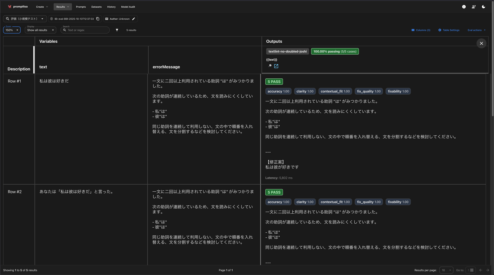

---

# textlintまとめ

**技術的依存を増やした**：
- プラガブルアーキテクチャ
- MCP適応/AIの活用

**心理的負荷を減らした**：
- コアとルールの分離 = 心理的負荷の分散
- コアにフォーカスし続けて、エコシステムを外部化
- エラーメッセージの改善とLLM as a Judgeの実装

---

[.hide-footer]

# [fit] Part 3
# [fit] **伝える技術**
## JavaScript Primer

---

# 書くから伝えるへの移行

> 読む → 書く → **伝える**

**転換点**：
- 個人で書く → 相手に伝える
- 一人で書く → 共著で書く
- **「読者」を強く意識する瞬間**

**2016年**：[JavaScript Primer](https://jsprimer.net/)開発開始

---

# JavaScript Primer (jsprimer) とは


- 2016年から執筆、6 つのメジャーバージョンを経て更新され続けている JavaScript 入門書
- 書籍版 ([amazon.co.jp/dp/4048931105](https://www.amazon.co.jp/dp/4048931105/)) も販売中
- ウェブ版 ([jsprimer.net](https://jsprimer.net/)) は無料で公開
- GitHub: [asciidwango/js-primer](https://github.com/asciidwango/js-primer)
- 書籍版とウェブ版の内容に違いはなく、オープンソースで開発中

---

# jsprimerの目的

**目的:新しくJavaScriptを学ぶ人が迷わないようにするための入門書**

1. **書き方**：基本文法などのJavaScriptの書き方
2. **作り方**：アプリケーションの作り方
3. **学び方**：JavaScriptの進化を自分で知る学び方


---

# 目的を達成するためにとった戦略

- Living Standard戦略
- Design Doc（設計文書）
- 既知→未知の原則
- 自動テストによる品質保証

---

# Living Standard戦略

**リリースサイクルもECMAScript仕様策定プロセスを模倣**

[.column]
**ウェブ版** ([jsprimer.net](https://jsprimer.net/))
- 常に最新版を維持
- Living Standard
- ECMAScript仕様と同様に継続更新

[.column]
**書籍版**
- 安定版として時々リリース
- Snapshot
- ES2024のようなリリース

**効果**: 完成しないと公開できないという心理的負担を減らす

---

# Design Doc

- 書籍のような文章を書くにも設計が必要
- 書籍は章ごとに分かれているので、各章ごとにDesign Docを作成
- これによって、章の方向性を明確化し、書きやすくなる

----

# jsprimerのDesign Doc構成

[.column]

```
各章/
  ├── README.md（本文）
  ├── OUTLINE.md（設計文書）
meeting-notes/
  └── YYYY-MM-DD.md（ミーティング記録）

```

[.column]

**OUTLINE.mdの役割**：
- なぜこの章が必要か
- 何を学ぶか
- どう教えるか

**すべての議論を公開**：
- Issue/PRでの議論
- Meeting Notesも記録して公開

---

# Design Docの活用

- Design Docがあることで書いてる途中でブレにくい
- 章の目的が明確なので、書き始めるハードルが下がる
- それでも、章の最初の一歩は重い
- → そこでAIを活用して最初の一歩を軽減

---

# Design Doc → AI生成 → レビュー

- Design Docを元にAIにドラフトを生成させる
- [textlint-rule-preset-ai-writing](https://github.com/textlint-ja/textlint-rule-preset-ai-writing)でAIらしい表現を検出してAIが修正
- 人間がレビューして修正
- 大まかなイメージは作成でき、最初の一歩が格段に楽に
- 実際に書いた章: [イテレータとジェネレータ](https://jsprimer.net/basic/iterator-generator/)

---

# 書籍のレビュー

- 原則: 既知→未知
- textlintで表記揺れや誤用をチェック
- 自動テストでコード例の動作をチェック
- [TSKaigi 2025で「技術書をソフトウェア開発する」という発表をしました | Web Scratch](https://efcl.info/2025/05/24/tskaigi-2025-jsprimer/)

---

# 既知の言葉で未知を説明する

[.column]
## 未知→既知の例
1. **Promise**は**非同期処理**を扱うオブジェクトです
2. **非同期処理**とは、処理の完了を待たずに次へ進むものです
3. **Promise**は、その状態や結果を表現します

[.column]
## 既知→未知の例
1. 今まで書いていたコードは、処理が終わるまで待ってから次に進みます。これを同期処理と呼びます
2. 一方で処理の完了を待たずに次の処理に進むこともできます。これを**非同期処理**と呼びます
3. この**非同期処理**の状態や結果を表現するのが**Promise**です

---

# 自動テストによる品質保証

8種類のテストを組み合わせて品質を保証

[.column]

**文章の自動テスト**
- textlint: 文章の品質チェック
- ESLint: JavaScriptコードの品質チェック

[.column]

**コードの自動テスト**
- Doctest: コード例の出力検証
- Unit Tests: Mochaによるテスト実行
- Executable Code: サンプルコードの実行確認

---

# Doctestによるコード例の検証

Markdown内のコード例を実際に実行して検証

```javascript
// コメントで期待値を記述
const result = 1 + 1;
console.log(result); // => 2
```

**特徴**:
- ドキュメントと実装の乖離を防ぐ
- リファクタリング時の安全性を確保

---

# CI/CDでの自動実行

すべてのテストはPull Requestごとに自動実行

- GitHub ActionsまたはNetlifyでビルド
- textlint、ESLint、Doctestなど全テストを実行
- プレビュー環境で実際のレンダリングを確認

使っているから続く、続いているから使う


---

# 技術から人へ - 持続可能性の課題

**技術的依存で解決できたこと**：
- 品質保証の自動化（CI/CD）
- Living Standardによる継続更新
- Design Docによる設計の明確化

---

# 技術だけでは解決できない

<!-- 技術的解決 vs 人的課題の対比図：技術で解決できることとできないことの境界 -->
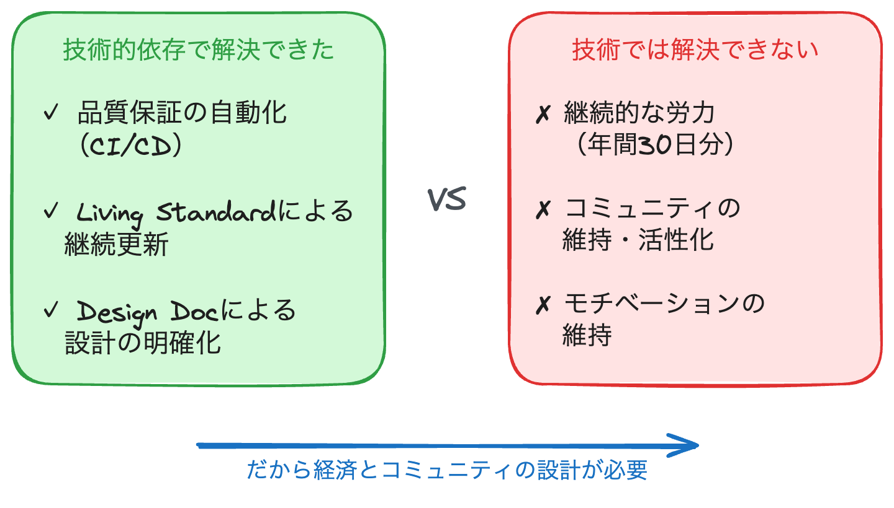

<!-- 
**技術的依存では解決できないこと**：
- 継続的な労力（年間30日分）
- コミュニティの維持・活性化
- モチベーションの維持

**→ だから経済とコミュニティの設計が必要** -->

---

# なぜコントリビューターを増やすのか？

**目的はJavaScriptの変化に対応できるようにすること**

- JavaScriptは毎年更新される仕様
- 今時オープンソースソフトウェアを使わない開発はほぼない
- オープンソースへコミットすることも学びの1つ

**著者を増やすことで、変化への対応と心理的負荷を分散**

---

# 透明な経済モデル

[.column]

**年間コスト試算**：
- 約30日分の労力
- 約70万円相当[^wage]

[.column]

**収入源**：

1. 書籍売上
2. Open Collective
3. GitHub Sponsors

[^wage]: 東京のエンジニアの平均賃金から算出

---

# Open Collective

<!-- Open Collectiveのダッシュボード：透明な収支管理、プロジェクト単位の資金管理 -->

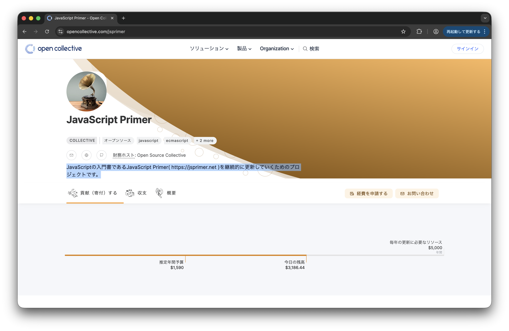

**具体例**：<https://opencollective.com/jsprimer>

**仕組み**：
- プロジェクト単位の資金管理
- 企業向けスポンサー特典
- 透明な収支公開

---

# [Fibonacci報酬システム](https://github.com/asciidwango/js-primer/blob/master/CONTRIBUTING_EXPENSE.md)

```
年間想定：60ポイント分の作業（目安：2ポイント ≒ 1日分の作業）
タスク複雑度：1, 2, 3, 5, 8ポイント
1ポイント = 約$7(2025年の予算$ / 60ポイント)
```

**仕組みの特徴**：
- 金銭的還元の仕組み化
- 報酬を受け取る代わりに、別のオープンソースへ寄付することも可能

---

# 100人以上のコントリビューター

**どうやって？**

- ハードルを下げる
  - 軽い修正もやりやすくする: [文章の間違いに気づいたら ](https://jsprimer.net/intro/feedback/)
  - ブラウザで編集可能にする
  - [Contribution Guide](https://github.com/asciidwango/js-primer/blob/master/CONTRIBUTING.md)を整備する
- 透明性を保つ
  - すべての議論をGitHub上で
  - Meeting Notesも公開
  - 判断理由の記録

---

# 具体例: ES2025対応

1. **[Meta Issue](https://github.com/asciidwango/js-primer/issues/1778)で方針決定** → ES2025の新機能7個の対応方針を決定
2. **[ブログ](https://efcl.info/2025/04/25/jsprimer-es2025-proposal/)で募集** → コントリビューター募集
3. **[Discussion](https://github.com/asciidwango/js-primer/discussions/1789)で認識合わせ** → 役割分担
4. **個別Issueで並行作業** → 1機能 = 1人 = 1Issue ([#1783](https://github.com/asciidwango/js-primer/issues/1783)、[#1788](https://github.com/asciidwango/js-primer/issues/1788) など7機能)
5. **PRレビュー** → textlint/DocTestで自動チェック済み、人間は読みやすさに集中
6. **結果**: [v7.0.0リリース](https://efcl.info/2025/08/18/jsprimer-v7/)

---

# jsprimerまとめ

**技術的依存を増やした**：
- 継続仕様（Living Standard、ES2025対応）
- 自動品質（CI/CD、3層チェック）
- 設計文書（OUTLINE.md、AI活用）
- 経済透明化（Fibonacci報酬、Open Collective）

**心理的負荷を減らした**：
- 一度で完成要求（継続更新前提）
- 著者を増やす（100人以上のコントリビューター）

---

[.hide-footer]

# [fit] Part 4
# [fit] **循環の技術**
## 段階的発展と相互強化

---

# 各プロジェクトの重点配分

<!-- 3つのプロジェクトごとの「読む・書く・伝える」のバランス図：重点は異なるが全てを含む -->
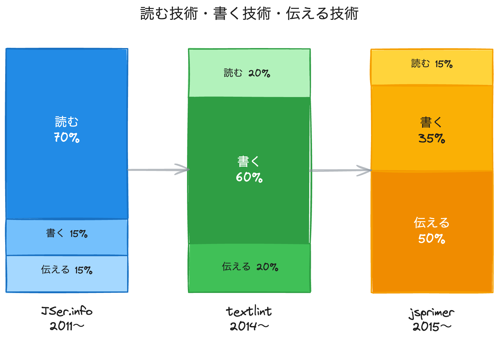

---

# 段階的な発展

```
2011: JSer.info
  読むことから始まった
     ↓
2014: textlint
  書くことで読む量が増える体感
     ↓
2015: JavaScript Primer
  伝えることで読む・書くの質が上がる
```

---

# オープンソースではあるがやり方が違う

- JSer.info/textlint/JavaScript Primerはどれもオープンソース
- しかし、それぞれのプロジェクトはやり方が異なる

---

# オープンソースの4つのモデル

| モデル | ユーザー | 貢献者 | 特徴 |
| --- | --- | --- | --- |
| TOYS | Low | Low | サイドプロジェクト |
| STADIUMS | High | Low | 集中型メンテナンス |
| CLUBS | Low | High | 重複コミュニティ |
| FEDERATIONS | High | High | 複雑なガバナンス |

出典: [Working in Public](https://press.stripe.com/working-in-public)

---

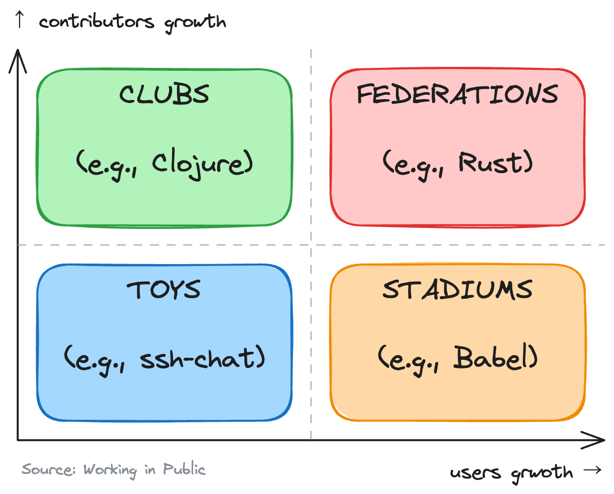

---

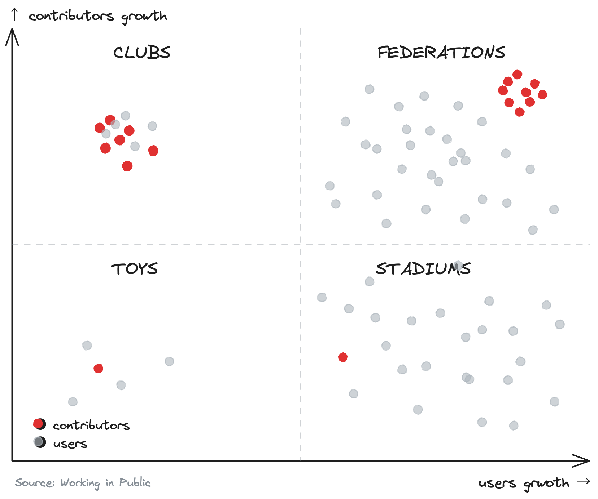

---

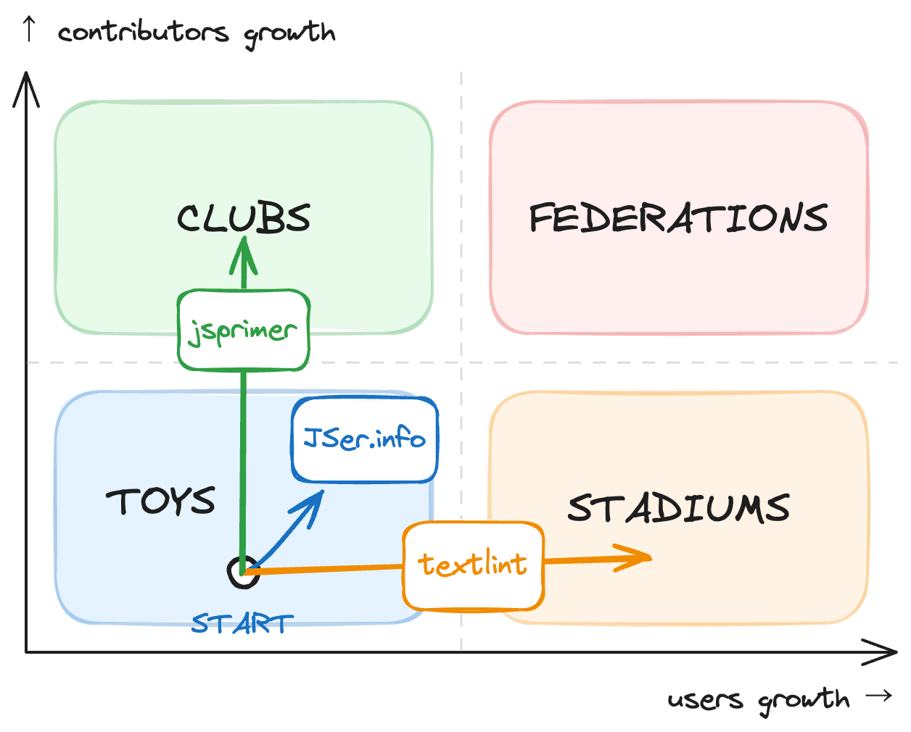

---

<!-- この説明は文章として書いてるだけなので飛ばしたいな -->

# JSer.info: Toysモデルを維持

**最適な規模を保つ設計**：
- データドリブンな公開（GitHub Actionsによる自動化）
- 趣味であるから続けるという範囲に保つ
- 心理的プレッシャーを発生させない設計

**安定した規模を維持することで、心理的負荷を排除**

---

# textlint: Stadiumsモデル

**週85,000ダウンロード、少数のメンテナー**：
- No core rules戦略
- コアを最小化しフォーカス、エコシステムへ委譲
- 200以上のルールをコミュニティが作成

**技術的依存は高いが、心理的負荷を下げる設計**

---

# jsprimer: Clubsモデル

**100人以上のコントリビューター**：
- Living Standard（常に更新）
- Design Docで貢献のハードルを下げる
- ユーザーと貢献者が重複するコミュニティ

**貢献しやすい構造で心理的負荷を分散**

---

<!-- # 各モデルでの心理的負荷への対応 -->

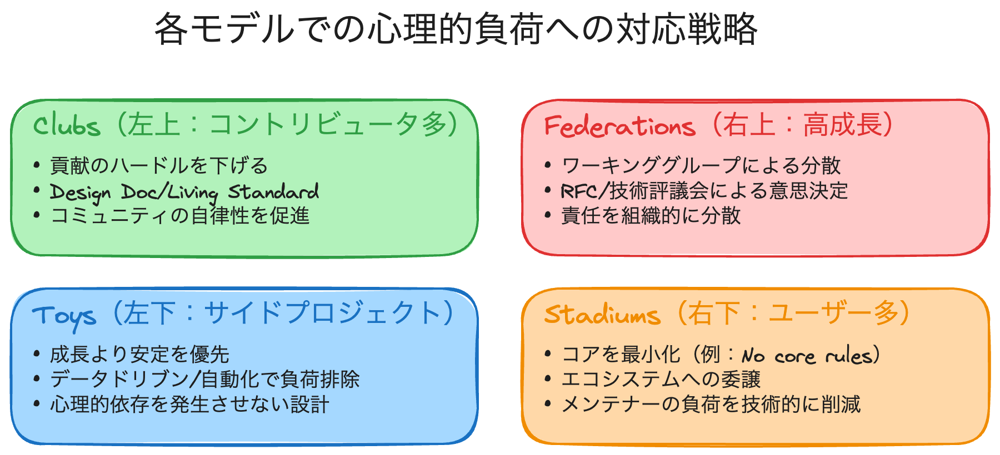

^ モデルごとに異なる戦略で持続可能性を確保

---

# 技術依存ループ

<!-- 3つのプロジェクトの相互強化ループ：読む→書く→伝える→読むの質向上 -->
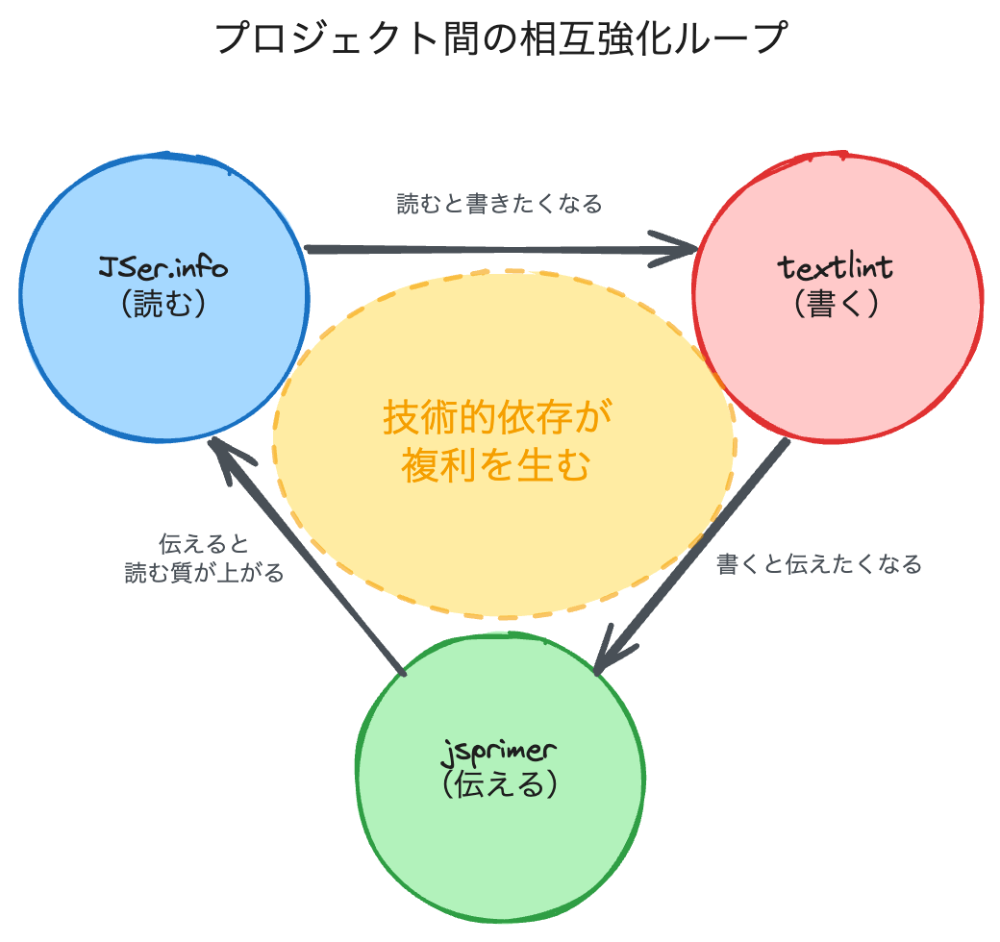

^ **プロジェクト間の循環**：
^ 読む → 書く → 伝える → 読むの質向上

---

# リスク - 技術的依存の連鎖

**どれか一つが止まると全部止まる可能性**

これは受け入れているリスク
トレードオフの認識

**ただし...**

技術的依存は心理的負荷と異なり、代替可能性が高い
ツールが止まっても別のツールに置き換えられる


---

# [fit] **心理的負荷と技術的依存**

[.column]
## 心理的負荷 ✗

- スケールしない
- 疲れる
- バーンアウトを生む
- 自動化できない
- **コントロールが難しい**
- **持続が難しい**

[.column]
## 技術的依存 ✓

- スケールする
- 疲れにくい
- 継続で改善しやすくなる
- 自動化できる
- **交換可能・差し替え可能**
- **持続がし易い**

---

[.hide-footer]

# [fit] まとめ

---

# 12の設計原則

[.column]
**読む技術（JSer.info）**：
1. データドリブンな公開基準 [技術]
2. 退屈な部分だけ自動化 [技術]
3. 小さなイテレーション [技術]

**書く技術（textlint）**：
4. デフォルトルールなし戦略 [心理]
5. 最小コア、豊かなエコシステム [技術]
6. 検証可能なことを自動化 [技術]
7. 最小限の依存関係 [心理]

[.column]
**伝える技術（jsprimer）**：
8. Living Standard戦略 [心理]
9. 既知→未知の原則 [心理]
10. 自動テストによる品質保証 [技術]
11. 透明な経済モデル [心理]
12. 使って改善する循環 [技術/心理/循環]

##### **[技術]**: 技術的依存を育てる (1,2,3,5,6,10,12)
##### **[心理]**: 心理的負荷を減らす (4,7,8,9,11,12)

---

# 続けることで改善が加速する

- データセット蓄積 → 自動化促進
- エコシステム成長 → 対応範囲拡大
- AI時代への適応力 → 新技術との統合
- プロジェクト間の相互強化 → 学びの循環

**そのための設計原則**：
- **技術的依存を積極的に育てる** → スケールする、疲れにくい、改善が加速する
- **心理的負荷を意識的に減らす** → バーンアウト回避、長期継続

---

# Public Writing as Future Asset

**この発表準備プロセス自体が「読む→書く→伝える」の実証**

[.column]

15年間publicに書き続けた:
- GitHubのコミット・Issue・PR
- ブログ記事・書籍
- スライド・ドキュメント

[.column]

それをAIが読んで:
- 過去の判断理由を理解
- パターンを発見
- 新しい視点で構造化

**→ 自分が読んで新たな気づきを得る**

Publicの過去が、未来の価値を生む

---

# 続けることでより良くできる！

---

# ありがとうございました


- JSer.info: <https://jser.info/>
- textlint: <https://textlint.org/>
- JavaScript Primer: <https://jsprimer.net/>
- GitHub: <https://github.com/azu>

---

# Apnnedix

---

# RSSリーダ

- [Inoreader](https://www.inoreader.com/): RSSリーダサービス
- [irodr](https://irodr.netlify.app/): LDR風RSSリーダをフロントエンドとして自作
- Iroreaderの値上げが不安になったきたので、バックエンドも含むRuri Readerを作っている

---


---

# 読むための工夫

- ベンチマークは動かす
- DeepWikiを使いアーキテクチャを理解する
- Issueを作って対応を見る

---

# GitHub Sponsorsと心理的負荷

- GitHub Sponsorsには見返りをなくした
- 見返りを用意すると心理的負荷が高くなる可能性がある
- 短期的な関係ではなく長期的な関係を重視するため
- <https://efcl.info/2021/10/01/github-sponsors/>

---

# GitHub SponsorsのTier設計

**[@azu](https://github.com/azu)のTier設計**： 

- ✨ Supporter：$1/月
- ☕ Coffee：$5/月
- 🌐 Domain：$10/月
- 📖 Book：$30/月
- 💚 JSer.info：$100/月
- ❤️ Open Source：$300/月

---

# GitHub Sponsors

- 金額が大きくなってもほぼ行動に影響がなくなると感じたら小さな見返りを設定する
- e.g.
  - JSer.info は長期間続けて、内向的なプロジェクトなので外的要因がほぼ影響しない
  - jsprimer はサイクルを増せるようになって、より外部のContributorを増やすために設定
  - 自分のためではなく、他者のためというマインドだと行動はしやすい
  - Ref. Work Design

---

# 持続することがなぜ大事?

- アウトカムを達成するには、まず持続することが前提にある
- この方法がいいというわけではない
- 引き継ぐ難易度が結局高いという問題がまだ未解決
- サプライチェーンの問題もあり、難易度がかえって上がっている

---

# 参考文献・リンク集
**YAPC::Fukuoka 2025 - 読む技術・書く技術・伝える技術**

---

## プロジェクト公式サイト

----

### JSer.info
- **[公式サイト](https://jser.info/)**
- **[About](https://jser.info/about/)**
- **[Policy](https://jser.info/policy/)**
- **[データセット](https://github.com/jser/dataset)**

----

### textlint
- **[公式サイト](https://textlint.github.io/)**
- **[GitHub](https://github.com/textlint/textlint)**
- **[npm](https://www.npmjs.com/package/textlint)**
- **[ルール集](https://github.com/textlint/textlint/wiki/Collection-of-textlint-rule)**

---

### JavaScript Primer
- **[公式サイト](https://jsprimer.net/)**
- **[GitHub](https://github.com/asciidwango/js-primer)**
- **[Open Collective](https://opencollective.com/jsprimer)**

---

## 関連ツール・プロジェクト

---

### 情報収集ツール
- **[Irodr (RSSリーダー)](https://github.com/azu/irodr)**
- **[Postem (公開ツール)](https://github.com/azu/postem)**
- **[ECMAScript Daily](https://ecmascript-daily.github.io/)**

----

### 文章品質ツール
- **[textlint-rule-preset-ai-writing](https://github.com/textlint-ja/textlint-rule-preset-ai-writing)**
- **[secretlint](https://github.com/secretlint/secretlint)**
- **[power-doctest](https://github.com/azu/power-doctest)**
- **[textstat](https://github.com/textlint/textstat)**

----

### 書籍・ドキュメント関連
- **[HonKit](https://github.com/honkit/honkit)**
- **[JavaScript Promise本](https://azu.github.io/promises-book/)**
- **[Sandpack](https://sandpack.codesandbox.io/)**

---

## 関連する記事・発表資料

----

### JSer.info関連
- **[JSer.info 10周年](https://jser.info/2021/01/16/jser-10th/)**
- **[JSer.info 6年を振り返る](https://jser.info/2017/01/15/jser-info-6years/)**
- **[JSer.info 5年 - JavaScript情報とは](https://azu.github.io/slide/2016/jser5years/javascript-information.html)**

----

### textlint関連
- **[textlint誕生の経緯](https://efcl.info/2014/12/30/textlint/)**
- **[なぜtextlintを作ったのか](https://efcl.info/2022/06/29/why-create-textlint/)**
- **[textlint v14.8.0 (MCP対応)](https://efcl.info/2025/06/12/textlint-v14.8.0/)**

----

### JavaScript Primer関連
- **[jsprimer v2リリース](https://efcl.info/2023/06/09/jsprimer-v2/)**
- **[jsprimer v7リリース](https://efcl.info/2025/08/18/jsprimer-v7/)**
- **[jsprimerを出版](https://efcl.info/2020/04/27/jsprimer/)**
- **[TSKaigiでの発表](https://efcl.info/2025/05/24/tskaigi-2025-jsprimer/)**
- **[TSKaigiスライド](https://azu.github.io/slide/2025/tskaigi/jsprimer.html)**

----

### その他の振り返り記事
- **[GitHub Sponsors振り返り](https://efcl.info/2021/10/01/github-sponsors/)**
- **[2020年のOSS活動](https://efcl.info/2020/12/31/open-source-in-2020/)**

---

## 技術仕様・プロトコル

- **[Model Context Protocol (MCP)](https://modelcontextprotocol.io/)**
- **[CommonMark](https://commonmark.org/)**
- **[TC39 (ECMAScript標準化)](https://tc39.es/)**

---

## 個人リンク

- **[GitHub](https://github.com/azu)**
- **[ブログ (Web Scratch)](https://efcl.info/)**
- **[過去の発表資料](https://azu.github.io/slide/)**
- **[npm プロフィール](https://www.npmjs.com/~azu)**
- **[GitHub Sponsors](https://github.com/sponsors/azu)**

---

## 関連書籍

---

### 継続すること・公開すること (Austin Kleon 3部作)

- **[Keep Going: 10 Ways to Stay Creative in Good Times and Bad](https://austinkleon.com/keepgoing/)** - Austin Kleon
  - 創作活動を継続するための10の方法
  
- **[Steal Like an Artist: 10 Things Nobody Told You About Being Creative](https://austinkleon.com/steal/)** - Austin Kleon
  - クリエイティブな活動の始め方
  
- **[Show Your Work!: 10 Ways to Share Your Creativity and Get Discovered](https://austinkleon.com/show-your-work/)** - Austin Kleon
  - 作品を公開し、オーディエンスを見つける方法

----

### オープンソース開発・持続可能性

- **[Working in Public: The Making and Maintenance of Open Source Software](https://press.stripe.com/working-in-public)** - Nadia Eghbal
  - OSS開発の持続可能性と見えない労働について。現代のOSS開発の実態を深く掘り下げた必読書
  - [Amazon](https://www.amazon.co.jp/dp/0578675862)

- **[Roads and Bridges: The Unseen Labor Behind Our Digital Infrastructure](https://www.fordfoundation.org/work/learning/research-reports/roads-and-bridges-the-unseen-labor-behind-our-digital-infrastructure/)** - Nadia Eghbal
  - デジタルインフラを支える見えない労働についての報告書
  - [PDF無料公開](https://www.fordfoundation.org/media/2976/roads-and-bridges-the-unseen-labor-behind-our-digital-infrastructure.pdf)

---

### 燃え尽き症候群・心理的プレッシャー

- **[The End of Burnout: Why Work Drains Us and How to Build Better Lives](https://www.ucpress.edu/book/9780520393509/the-end-of-burnout)** - Jonathan Malesic
  - バーンアウトの構造的要因と対処法。心理的プレッシャーを排除する設計に関連

----

### アウトカム志向・長期的視点

- **[寄付研究や慈善活動について研究するために色々な書籍や論文を読んだメモ書き](https://efcl.info/2021/02/19/donation-philanthropy-study/)** - azu
  - アウトプットとアウトカムの違い、長期的視点の重要性についての研究ノート

- **[インパクト投資入門 (日経文庫)](https://www.nikkeibook.com/book/95650)** - 須藤奈応
  - アウトプットではなくアウトカムを重視する考え方。10-20年の長期視点の重要性

----

#### エーザイの熱帯病治療薬事例（アウトカムの時間軸を示す実例）

- **[IMPACT STARTUP SUMMIT 2025](https://impact-startup.or.jp/summit/2025)**
  - エーザイのインパクト会計の事例が紹介された
  - 2014-2018年: 熱帯病治療薬16億錠以上を無償配布(コスト約24億円)
  - 2025年(約10年後): 社会的インパクト7兆円相当と評価、PBRに反映
  - 「評価される場面に到達するには、まず生き残る必要がある」を示す事例

- **[エーザイ サステナビリティレポート](https://www.eisai.co.jp/sustainability/)**
  - NTD(顧みられない熱帯病)への取り組みの詳細

----

### 文章・コミュニケーション

- **[パラグラフ・ライティング](https://www.amazon.co.jp/dp/4826901453)**
  - 論理的な文章構成の基本。jsprimerの文章設計に関連

- **[技術広報入門 ー テックブログから始めるエンジニアカルチャーのつくり方 ー](https://nextpublishing.jp/book/17622.html)**
  - 技術情報の発信と文化醸成

- **[開発者とアーキテクトのためのコミュニケーションガイド ―パターンで学ぶ情報伝達術](https://www.oreilly.co.jp/books/9784814400478/)**

----

### JavaScript

- **[JavaScript Primer　迷わないための入門書](https://jsprimer.net/)** - Suguru Inatomi, azu
  - 発表者自身による JavaScript 入門書
  - [Amazon](https://www.amazon.co.jp/dp/4048930737)

---