footer: OSS開発者は今何をするべきか？ソフトウェアサプライチェーン侵害対策を考える - azu
slidenumbers: true
autoscale: true
theme: Plain Jane, 1

# [fit] **Hardening npm Publishing**

## サプライチェーン侵害から公開フローを守る

<br/>
<br/>

azu (`@azu_re`)
2026-06-23 / OSS開発者は今何をするべきか？

^ flatt主催の勉強会。OSS開発者の視点でサプライチェーン侵害対策を考える回。

---

# 自己紹介


- Name : azu
- X/Twitter : [`@azu_re`](https://x.com/azu_re)
- Website : [Web scratch](https://efcl.info/), [JSer.info](https://jser.info/)
- Open Source : textlint / secretlint / HonKit など
- npmに公開しているパッケージは数百個

^ パッケージ数が多いほど、公開フローを段階ごとに制御する意味が大きくなる。

---

# なぜ今、公開フローを守るのか

- npmは依存が深く、1つのパッケージ侵害が広い範囲に波及する
- 攻撃の起点がメンテナのトークンやCI/CDに移ってきている
- 脆弱性のあるGitHub ActionsのWorkflowなどが起点となるケースが増えている
- 自分のパッケージが踏み台になる前提で守る

^ ライブラリ作者は攻撃者にとって価値が高い。利用者全員に配れてしまうから。

---

# この発表の目的

- 改ざんをゼロにする話ではない
- 侵害されても、悪いpackageがregistryへ出る前に止める
- PRとかの中身が安全かなどを保証する話は主題にしない

^ SLSAのBuild L3はbuild中の改ざんに強くする話。この発表はそれとは少し違い、公開フローの途中で止める話。build中に悪性コードが混ざり、それを人が気づかずApproveしてしまう問題は残る。そこは成果物検証、monitoring、より強いbuild isolationの領域で、今回の中心ではない。

---

# 問題: 公開フローのどこを守るか

- 攻撃者は、1箇所のインジェクトで全部抜けるなら一番弱い部分を狙う
- 1つの対策だけで公開フロー全体は守れない
- ローカルから公開までの経路を段階ごとに守る必要がある
- どこかが破られても、最終的な公開までには止めることが目的

^ 本質は最小権限と手順。特別に難しいことはしていない。段階ごとに確認点を置く。

---

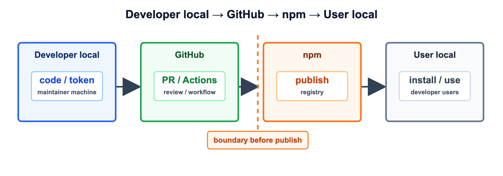


^ 左のLocalは開発者の手元、右のLocalは利用者の手元。手元の変更がGitHubに入り、npmにpublishされ、利用者がinstallして使う。ここでの目的は「完全に混入を防ぐ」ではなく「混入や侵害が起きても publish / use へ進む前に止める」こと。

---

# 公開までのレイヤー

1. ローカル: Token管理
1. GitHub: Actions（PR / Environments / Deployment protection）
1. npm: staged publishing

^ この順に、攻撃者目線で「ここを抜かれたら？」を考えながら制御点を置いていく。

---

# 1. ローカルのToken管理

---

# 生のcredentialをローカルに置かない

- 第一前提は、ローカルの情報を抜かれても公開権限できない
- ローカルファイルに生のcredentialを保存しない
- 1Password/Bitwardenなど多要素認証をしないと取り出せないところへ保存する
- 使う時も、強いトークンをローカルに常駐させない

^ 最近の攻撃はローカルから始まることが多い。まずローカルに強い公開権限を残さない。
^ 使う時も、生の情報をtmpとかに保存するのではなく、プロセスを落としたらメモリからも消えるようにするとかの仕組みが必要

---

# GitHub

## Personal Access Token

---


# GitHub: classic PATを常用しない

- classic PAT(Personal Access Token)は強すぎる権限
- 使うとしてもローカル限定。CIでは使わない
- 常用はfine-grained PATにして、リポジトリと権限を絞る
- fine-grainedはリソースオーナーに紐づくので多少手間だが許容する

^ Classicは使わない、ファイングレインドトークンをつあう
^ CIで強い権限が要る場面は、GitHub Appやworkflow側に寄せられる。

---

# fine-grained PATは用途ごとに分ける

- 1つの強いトークンを使い回さず、用途ごとに発行する
- アクセスレベルを最小にする（read-only / 必要な操作だけ）
- 対象を絞る（特定リポジトリ / public のみ）
- 漏れても影響範囲がそのトークンの用途に限定される

📝 自分の場合は、read-onlyのトークンしか発行していない

^ ファイングレインドトークン
^ 1つ漏れても全部は取られない。用途名を付けておくと棚卸ししやすい。

---

# 課題: Checks APIがfine-grained未対応

- Checks APIがfine-grained PATに対応していない
- これが直れば、常用トークンから強いclassicをほぼ消せる

参考: [github.com/orgs/community/discussions/129512](https://github.com/orgs/community/discussions/129512)

^ 数少ない「classicを消し切れない」理由。早く直してほしいところ。

---

# npm 

## npmのアクセストークン管理

---

# npm: アクセストークンを0個にする

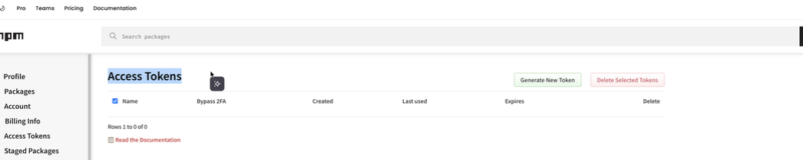

^ npmアクセストークンは0個。新規追加時だけ一時発行してすぐ消す。

---

# 2. トークンレス npm

## OIDC Trusted Publishing

---

# OIDC Trusted Publishingとは

- 個人に紐づく長期的なトークンをやめ、short-livedでworkflow固有のトークンでパッケージを公開する仕組み
- npmとGitHub ActionsがOIDCでToken Exchangeする
- 「特定リポジトリの特定workflowからの実行」をnpmが確認できる
- npm 11.5.1以上が必要

参考: [efcl.info/2025/09/07/npm-oidc/](https://efcl.info/2025/09/07/npm-oidc/)

^ 共有credentialなしで公開できる。トークンをCIに置かなくてよくなる。

---

# npmjs.comでTrusted Publisherを登録

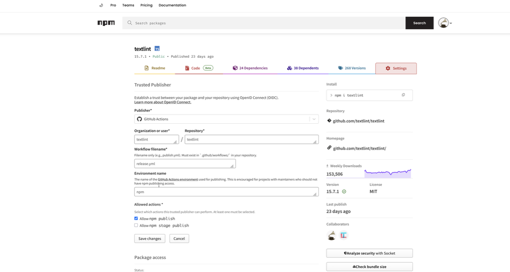

^ Organization / Repository / Workflowファイル名 / Environment名を指定する。

---

# npmjs.comでTrusted Publisherの動き

1. GitHub Actionsがnpmに対してOIDC tokenを要求する
1. npmjs.comがOIDC tokenのclaimを確認し、設定されたTrusted Publisher登録と照合する
1. 登録と一致すれば、tokenを発行してGitHub Actionsに返す
1. GitHub Actionsがそのtokenを使って `npm publish` する

----

# workflow側の最小構成

```yaml
permissions:
  contents: write
  id-token: write   # OIDC

steps:
  - uses: actions/setup-node@v5
    with:
      registry-url: 'https://registry.npmjs.org'
  - run: npm publish --access public
```

^ OIDC公開時はprovenanceが自動で付く。idトークンの権限だけ与える。

---

# provenanceで来歴を残す

- OIDCでの公開ではprovenance（来歴の署名）が自動付与される
- どのリポジトリのどのworkflowでビルドされたかを証明できる
- npm provenanceはpackageとworkflowを結びつける証拠になる
- ただしbuild中に何が起きたかまでは保証しない

^ SLSA用語ではBuild L2相当。package digestとrepo/workflow/refを結びつける証拠であって、build中に攻撃者コードが動いた場合までは防げない。細かい補足: private repositoryでもTrusted Publishing(OIDC)は使えるが、npm provenanceは生成されない。provenance自動生成は、Trusted Publishing、public repository、public package の組み合わせが条件。

---

# 3. GitHub Actions の構成

## Rulesets / Environments / Deployment protection

---

# リリースフローの流れ

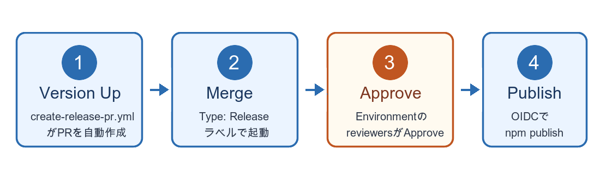

^ 4ステップ。Step 3のApproveだけが人手で確認する箇所。次の画面で実物を見る。

---

# Step 1: Version Up PR

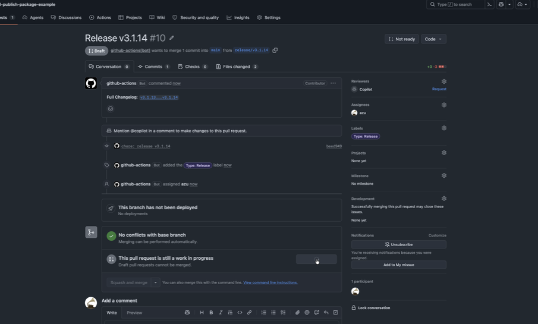

^ create-release-pr.yml がバージョンを上げるPRを自動作成。Type: Release ラベルが付く。

---

# Step 2: Merge Release PR

- Release PRをレビューしてマージする
- mainに入ったrelease commitだけがpublish候補になる
- まだnpm publishは走らない
- Approveして初めて`release` jobが動作する

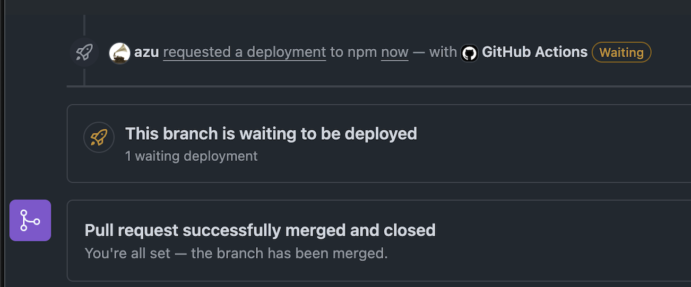

^ Step 2はマージ。ここではまだ公開しない。PRレビューとmainへの取り込みでsource側を確認し、Step 3のEnvironment Approveでpublish権限へ進める。

---

# Step 3: Approve Deployment

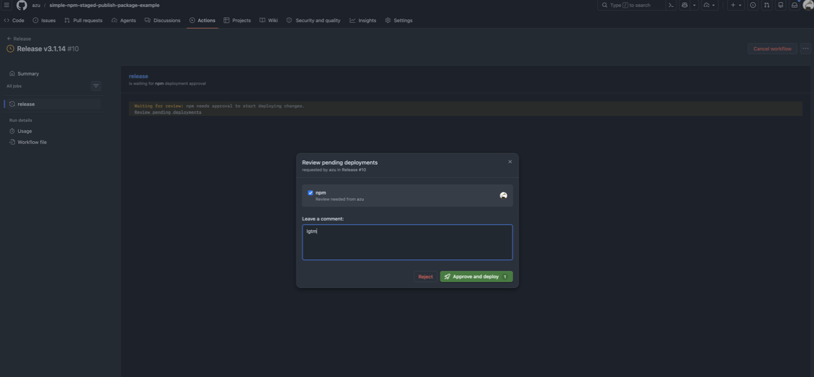

^ マージ後、Review pending deploymentsでApproveして初めてpublishが走る。Approveしなければ止まる。

---

# Step 4: Publish to npm

- Approve後に`release` jobが開始
- OIDCでnpmとtoken exchangeする
- npm publishまたはnpm stage publishを実行する
- provenance付きでregistryへ公開される

^ Step 4で初めてnpm側に公開する。Approve前はpublish権限へ進めない。staged publishingを使う場合は、ここでstage publishしてnpm側のApprove待ちにする。

---

# provenanceだけでは足りない

- provenanceで「どこから出たか」は分かる
- でも「作る途中で何が混ざったか」は分からない
- 悪いpackageにも正しい署名が付くことがある
- だからpublishに進む前に別のApproveを求める

参考: [Mini Shai-Hulud: Where SLSA’s Boundaries Fall](https://slsa.dev/blog/2026/05/mini-shai-hulud-what-slsa-can-and-cannot-do)

^ ここからフローの説明から「なぜこの形にするか」へ切り替える。provenanceは『改ざんされていない成果物』の保証ではない。正確には、package digestとrepo/workflow/refを結びつける証拠。build環境が汚染されていれば、その汚染されたbuildの結果にもvalid provenanceが付く。本文では「出どころは分かるが、作る途中までは見ない」と言う。ここから、provenanceとは別にpublishへ進むためのApproveを求める話へつなげる。

---

# 事例: OIDCだけでは止まらない

- workflow改変でOIDC credentialを取得
- credentialをログへ出して持ち出す
- GitHub write権限がnpm publish権限へ広がる
- 境界にEnvironment Approveを置く

参考: [GMO Flatt Security Blog](https://blog.flatt.tech/entry/bitwarden_compromise)

^ Bitwarden CLIはTrusted Publishingを使っていた。悪性 2026.4.0 も `_npmUser` は GitHub Actions / OIDC だが、provenance attestation は欠落していた。攻撃者はworkflow内でGitHub ActionsのOIDC tokenをnpmの短期credentialへ交換し、それをログ経由で持ち出していた。長期npm tokenを消しても、workflow変更権限がpublish権限へ広がる点は別の問題。ここが権限カスケード。Environmentのrequired reviewersを入れると、workflowを変えただけではpublishへ進めない。

---

# EnvironmentでApproveとrefを制御する

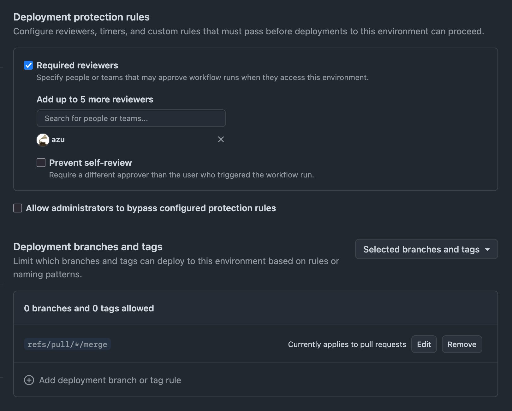

^ 上はrequired reviewers、下はDeployment branches and tags。Environmentは「誰がApproveするか」と「どの `GITHUB_REF` からdeployできるか」を見る。npm Environmentでは `refs/pull/*/merge` だけを許可し、さらにApproveしないとjobが続行しない。

---

# merge refだけを許可する

- GitHubがPR用のmerge refを作る
- 許可するrefは `refs/pull/*/merge` のみ
- Approveするまで`release` jobは開始しないようにできる

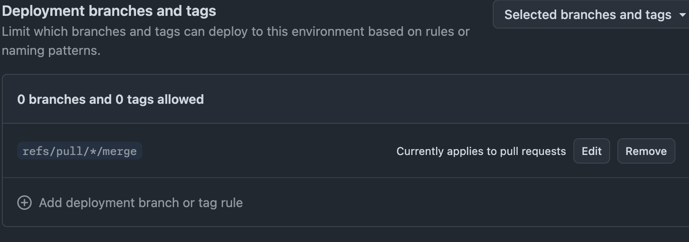

参考: [GitHub Docs](https://docs.github.com/en/actions/reference/workflows-and-actions/deployments-and-environments#deployment-branches-and-tags) / [GitHub Changelog](https://github.blog/changelog/2025-11-07-actions-pull_request_target-and-environment-branch-protections-changes/)

^ `refs/pull/<n>/merge` は普通のbranchではなく、PRごとにGitHubが作る一時的なread-only ref。ユーザーが自由に作れるrefではない。ユーザーが同名branchを作っても `refs/heads/pull/...` であり、`refs/pull/...` にはならない。Environmentのbranch/tag ruleはworkflow runの `GITHUB_REF` を見る。`pull_request` 系では `refs/pull/<n>/merge` が評価されるので、npm Environmentには `refs/pull/*/merge` だけを許可する。これは単体でworkflow改変を止めるものではなく、PR/review、Environmentのref制限、required reviewersのApproveを組み合わせる話。

---

# コンテンツ改変だけではpublishへ進ませない

- npmのTrusted Publisherはworkflowファイル名とEnvironment名を確認する
- Environmentは `refs/pull/*/merge` だけ許可する
- Environmentはrequired reviewersのApproveも必要
- workflowファイル名一致だけではOIDC交換まで進めない

^ workflow改変そのものをEnvironmentが止めるわけではない。Trusted Publisherのworkflow file制限、Environment名、Environmentのref制限、required reviewersのApproveを組み合わせる。直接pushや任意branchからの実行では npm Environment を通れない。PRのmerge refだけを許可し、最後にApproveを要求する。

---

# Environment名をnpm側と一致させる

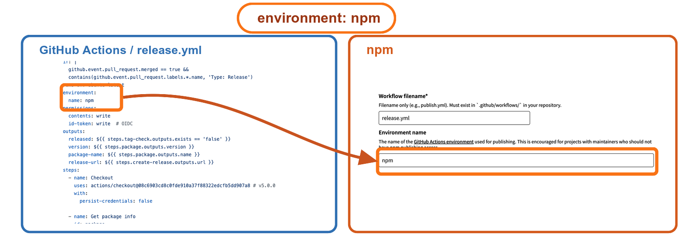

^ `release.yml` の `environment: npm` はGitHub ActionsのEnvironment名。npm Trusted Publisherにも同じEnvironment nameとして `npm` を登録する。npmはOIDC tokenのclaimに含まれるrepository、workflow file、environmentを見て、登録されたTrusted Publisherと一致するとtoken exchangeする。workflowファイル名だけではなく、Environment名一致と、Environment側のApprove/ref制限まで通って初めてpublishへ進める。

---

# 4. npm staged publishing

---

# 公開前にApprove stepを追加する

- npm publish は直接公開、npm stage publish はApprove待ちにする
- OIDC設定で publish と stage publish のどちらを許可するか選べる
- stage publishのみ許可にすると、直接公開は拒否される
- npm 11.15.0以上 / Node 22.14.0以上、OIDC時のみ利用可

参考: [docs.npmjs.com/staged-publishing](https://docs.npmjs.com/staged-publishing)

^ OIDCの「リポジトリ権限を持っただけで公開できる」問題を緩和する最後のレイヤー。

---

# staged publishingのフロー

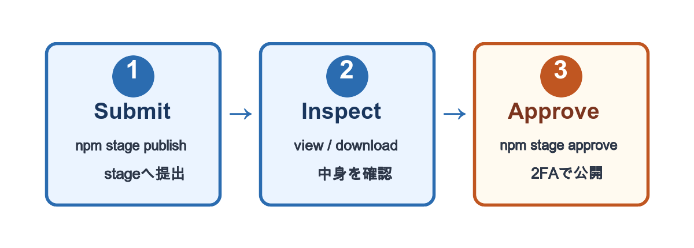

^ stage publishでステージング領域に提出し、view/downloadで中身を確認し、approveで公開する。approveには必ずsecurity key（MFA）が入る。stage publish自体は2FA不要。

---

# Staged PackagesのApprove画面

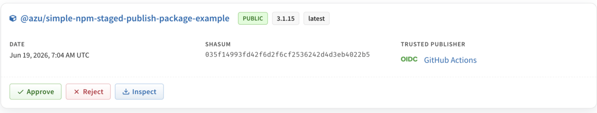

^ Trusted PublisherがOIDC / GitHub Actionsと表示される。ここで中身を見てからApprove。security keyを挿してApproveする。

---

# staged publishingの課題

- Approveが1パッケージずつしかできない
- monorepo（40個一括）だと現実的でない
- CLIからapproveするにはnpmトークンが要る
- npm / GitHubのどちらか一方はtokenlessに寄せる

^ `npm stage approve` をCLIから自動化するにはnpmトークンが要る。つまり、approveを自動化するとnpm側に長期credentialが戻ってくる。トークンが流出すると突破されうるので、npmトークン0個に寄せる。

---

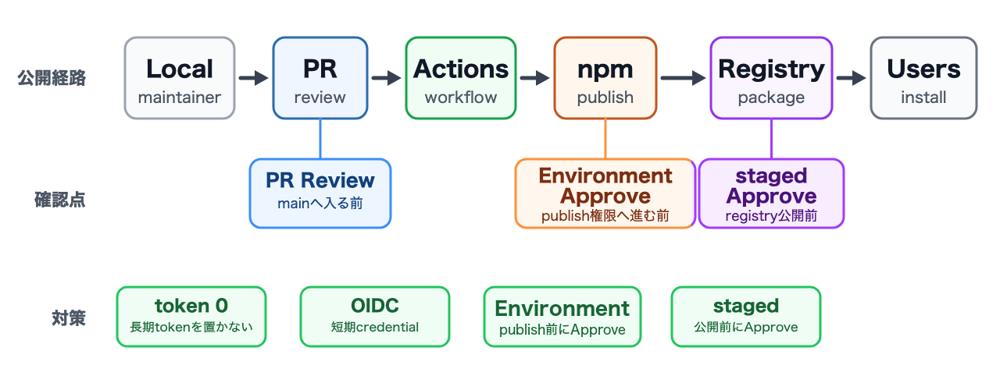

^ ここまでの話を一枚にまとめる。細部ではなく、LocalからUsersまでの公開経路、確認を入れる場所、この発表で扱った対策だけを見る。この発表の中心は、侵害をゼロにすることではなく、悪いpackageがregistryへ出る前に止めること。

---

# まとめ

---

# 公開フローを段階ごとに制御する

1. ローカル: 強い権限を常駐させない
1. Actions: PR + Environment + Approve
1. staged publishing: registry公開前にApprove

^ 単独で完結する解決策はない。publish地点に複数の緩和策を置く。provenanceだけでなく、隔離の考え方とApproveを組み合わせる。目的は侵害をゼロにすることではなく、侵害後に悪いpackageがregistryへ出る経路を細くすること。

---

# AIエージェント時代も同じ

- 全権限を1つの主体/環境に集めない
- AIが全部の権限を持っているなら、攻撃者はAIを狙うだけ
- 最小権限と権限分離はやる必要がある

^ 自動化とAIは別物。最小権限とApproveという原則は変わらない。

---

# 参考リンク

- npm OIDC: [efcl.info/2025/09/07/npm-oidc/](https://efcl.info/2025/09/07/npm-oidc/)
- 公開例: [github.com/azu/simple-oidc-example-package](https://github.com/azu/simple-oidc-example-package)
- staged例: [github.com/azu/simple-npm-staged-publish-package-example](https://github.com/azu/simple-npm-staged-publish-package-example)
- Bitwarden CLI侵害: [GMO Flatt Security Blog](https://blog.flatt.tech/entry/bitwarden_compromise)
- TanStack侵害(cache poisoning): [tanstack.com/blog/npm-supply-chain-compromise-postmortem](https://tanstack.com/blog/npm-supply-chain-compromise-postmortem)
- Mini Shai-Hulud(SLSAの境界): [slsa.dev/blog/2026/05/mini-shai-hulud-what-slsa-can-and-cannot-do](https://slsa.dev/blog/2026/05/mini-shai-hulud-what-slsa-can-and-cannot-do)
- npm staged publishing: [docs.npmjs.com/staged-publishing](https://docs.npmjs.com/staged-publishing)
- GitHub changelog: [`pull_request_target` and environment branch protections](https://github.blog/changelog/2025-11-07-actions-pull_request_target-and-environment-branch-protections-changes/)

---

# [fit] ありがとうございました

---

# その他

---

# Require 2FA and disallow tokens

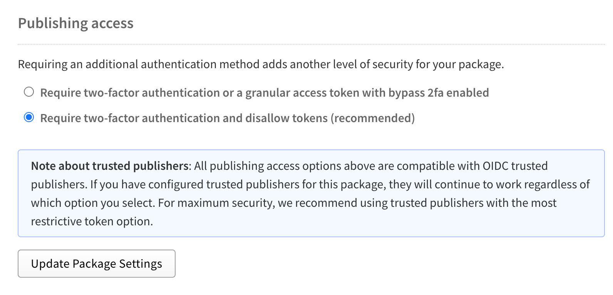

^ npmのPublishing accessで「Require two-factor authentication and disallow tokens」を選ぶ。token publishは閉じるが、Trusted Publisher(OIDC)はこの設定でも動く。ただし、publish権限を持つmaintainerのinteractive publishまで禁止する設定ではない。公開経路をCIに寄せるには、npm側でpublish権限を持つ人を最小化し、メンテナはGitHub側のPR/Approveへ寄せる。

---

# Require 2FA and disallow tokens

- npm TRusted Publisherとセットで設定する
- これを設定すると、npmのアクセストークンでのpublishができなくなる
- OIDCでないとpublishできない状態にする = CIからの公開に寄せられる

---

# Cache Poisoning

- Release Workflowではキャッシュを使わない
- Cache Poisoning攻撃を防ぐため

---