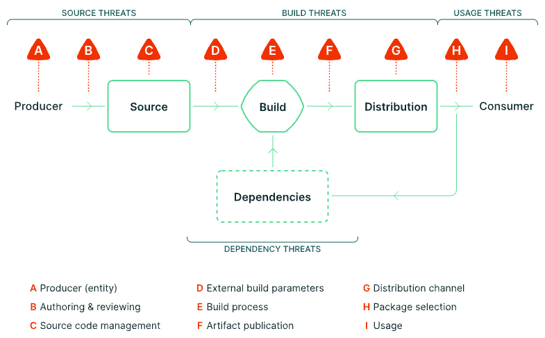

footer: OSS開発者は今何をするべきか？ソフトウェアサプライチェーン侵害対策を考える - azu
slidenumbers: true
autoscale: true
theme: Plain Jane, 1

# [fit] **Hardening npm Publishing**

## サプライチェーン侵害から公開フローを守る

<br/>
<br/>

azu (`@azu_re`)
2026-06-23 / OSS開発者は今何をするべきか？

^ flatt主催の勉強会。OSS開発者の視点でサプライチェーン侵害対策を考える回。

---

# 自己紹介


- Name : azu
- X/Twitter : [`@azu_re`](https://x.com/azu_re)
- Website : [Web scratch](https://efcl.info/), [JSer.info](https://jser.info/)
- Open Source : textlint / secretlint / HonKit など
- npmに公開しているパッケージは数百個

^ パッケージ数が多いほど、公開フローを段階ごとに制御する意味が大きくなる。

---

# なぜ今、公開フローを守るのか

- npmは依存が深く、1つのパッケージ侵害が広い範囲に波及する
- 攻撃の起点がメンテナのトークンやCI/CDに移ってきている
- OIDCトークンの窃取、不正なworkflow、infostealerが実際に起きている
- 自分のパッケージが踏み台になる前提で守る

^ ライブラリ作者は攻撃者にとって価値が高い。利用者全員に配れてしまうから。

---

# この発表の目的

- 改ざんをゼロにする話ではない
- 侵害されても、悪いpackageがregistryへ出る前に止める
- コードの中身を保証する話は主題にしない

^ SLSAのBuild L3はbuild中の改ざんに強くする話。この発表はそれとは少し違い、公開フローの途中で止める話。build中に悪性コードが混ざり、それを人が気づかずApproveしてしまう問題は残る。そこは成果物検証、monitoring、より強いbuild isolationの領域で、今回の中心ではない。

---

# 問い: 公開フローのどこを守るか

- 攻撃者は、1箇所のインジェクトで全部抜けるなら一番弱い部分を狙う
- 1つの対策だけで公開フロー全体は守れない
- ローカルから公開までの経路を段階ごとに制御する
- どこかが破られても、別の段階で検出・制限する

^ 本質は最小権限と手順。特別に難しいことはしていない。段階ごとに確認点を置く。

---


^ 左のLocalは開発者の手元、右のLocalは利用者の手元。手元の変更がGitHubに入り、npmにpublishされ、利用者がinstallして使う。ここでの目的は「完全に混入を防ぐ」ではなく「混入や侵害が起きても publish / use へ進む前に止める」こと。

---

# 公開までのレイヤー

1. ローカルのToken管理
1. トークンレスnpm（OIDC Trusted Publishing）
1. GitHub Actions（Rulesets / Environments / Deployment protection）
1. OIDCと権限昇格への対策
1. npm staged publishing

^ この順に、攻撃者目線で「ここを抜かれたら？」を考えながら制御点を置いていく。

---

# 1. ローカルのToken管理

---

# 生のcredentialをローカルに置かない

- 第一前提は、ローカルを抜かれても公開権限が漏れないこと
- ローカルファイルにcredentialを保存しない
- 1Password/Bitwardenなど多要素認証をしないと取り出せないところへ保存する
- 強いトークンをローカルに常駐させない

^ 最近の攻撃はローカルから始まることが多い。まずローカルに強い公開権限を残さない。

---

# GitHub: classic PATを常用しない

- classic PAT(Personal Access Token)は強すぎる権限
- 使うとしてもローカル限定。CIでは使わない
- 常用はfine-grained PATにして、リポジトリと権限を絞る
- fine-grainedはリソースオーナーに紐づくので多少手間だが許容する

^ CIで強い権限が要る場面は、GitHub Appやworkflow側に寄せられる。

---

# fine-grained PATは用途ごとに分ける

- 1つの強いトークンを使い回さず、用途ごとに発行する
- アクセスレベルを最小にする（read-only / 必要な操作だけ）
- 対象を絞る（特定リポジトリ / public のみ）
- 漏れても影響範囲がそのトークンの用途に限定される

📝 read-onlyのトークンしか発行していない

^ 1つ漏れても全部は取られない。用途名を付けておくと棚卸ししやすい。

---

# 課題: Checks APIがfine-grained未対応

- Checks APIがfine-grained PATに対応していない
- これが直れば、常用トークンから強いclassicをほぼ消せる

参考: [github.com/orgs/community/discussions/129512](https://github.com/orgs/community/discussions/129512)

^ 数少ない「classicを消し切れない」理由。早く直してほしいところ。

---

# npm: アクセストークンを0個にする


^ npmアクセストークンは0個。新規追加時だけ一時発行してすぐ消す。

---

# 2. トークンレス npm

## OIDC Trusted Publishing

---

# OIDC Trusted Publishingとは

- 長期トークンをやめ、short-livedでworkflow固有の署名トークンで公開する
- npmとGitHub ActionsがOIDCで信頼関係を結ぶ
- 「特定リポジトリの特定workflowからの実行」をnpmが確認できる
- npm 11.5.1以上が必要

参考: [efcl.info/2025/09/07/npm-oidc/](https://efcl.info/2025/09/07/npm-oidc/)

^ 共有credentialなしで公開できる。トークンをCIに置かなくてよくなる。

---

# npmjs.comでTrusted Publisherを登録


^ Organization / Repository / Workflowファイル名 / Environment名を指定する。


---

# Require 2FA and disallow tokens


^ npmのPublishing accessで「Require two-factor authentication and disallow tokens」を選ぶ。token publishは閉じるが、Trusted Publisher(OIDC)はこの設定でも動く。ただし、publish権限を持つmaintainerのinteractive publishまで禁止する設定ではない。公開経路をCIに寄せるには、npm側でpublish権限を持つ人を最小化し、メンテナはGitHub側のPR/Approveへ寄せる。
^ - 2FA必須・token publish禁止をパッケージに設定する
^ - 既存パッケージはトークンでは公開できなくなる
^ - 公開経路はOIDC（CI経由）だけに強制される

---

# workflow側の最小構成

```yaml
permissions:
  contents: write
  id-token: write   # OIDC

steps:
  - uses: actions/setup-node@v5
    with:
      registry-url: 'https://registry.npmjs.org'
  - run: npm publish --access public
```

^ OIDC公開時はprovenanceが自動で付く。idトークンの権限だけ与える。

---

# provenanceで来歴を残す

- OIDC公開ではprovenance（来歴の署名）が自動付与される
- どのリポジトリのどのworkflowでビルドされたかを証明できる
- npm provenanceはpackageとworkflowを結びつける証拠になる
- ただしbuild中に何が起きたかまでは保証しない

^ SLSA用語ではBuild L2相当。package digestとrepo/workflow/refを結びつける証拠であって、build中に攻撃者コードが動いた場合までは防げない。細かい補足: private repositoryでもTrusted Publishing(OIDC)は使えるが、npm provenanceは生成されない。provenance自動生成は、Trusted Publishing、public repository、public package の組み合わせが条件。

---

# 3. GitHub Actions の構成

## Rulesets / Environments / Deployment protection

---

# Release PRの流れ


^ 4ステップ。Step 3のApproveだけが人手で確認する箇所。次の画面で実物を見る。

---

# Step 1: Version Up PR


^ create-release-pr.yml がバージョンを上げるPRを自動作成。Type: Release ラベルが付く。

---

# Step 2: Merge Release PR

- Release PRをレビューしてマージする
- mainに入ったrelease commitだけがpublish候補になる
- まだnpm publishは走らない
- 次のApproveで初めてrelease jobを進める

^ Step 2はマージ。ここではまだ公開しない。PRレビューとmainへの取り込みでsource側を確認し、Step 3のEnvironment Approveでpublish権限へ進める。

---

# Step 3: Approve Deployment


^ マージ後、Review pending deploymentsでApproveして初めてpublishが走る。Approveしなければ止まる。

---

# Step 4: Publish to npm

- Approve後にrelease jobが続行する
- OIDCでnpmとtoken exchangeする
- npm publishまたはnpm stage publishを実行する
- provenance付きでregistryへ公開される

^ Step 4で初めてnpm側に公開する。Approve前はpublish権限へ進めない。staged publishingを使う場合は、ここでstage publishしてnpm側のApprove待ちにする。

---

# 実装: Release PR方式

- create release PRでリリース用のPRを作る
- 「Type: Release」ラベル付きPRだけがpublish候補になる
- リリースは必ずPR経由を通す

参考: [github.com/azu/simple-oidc-example-package](https://github.com/azu/simple-oidc-example-package)

^ いきなりpushでpublishされないように、PRというApprove前の確認点を必ず通す。

---

# 実装: release.yml（抜粋）

```yaml
environment: npm
permissions:
  contents: write
  id-token: write

steps:
  - uses: actions/checkout@<sha>
    with:
      persist-credentials: false
  - uses: actions/setup-node@<sha>
  - run: npm publish --provenance
```

^ environment: npm、id-token: write、SHA pin、persist-credentials: false が要点。

---

# 実装: 外部Actionに依存しない

- 使うのは公式の checkout / setup-node のみ
- setup-nodeのcacheも使わない
- リポジトリ操作は gh / git コマンドで行う
- `uses:` はcommit SHAでpinする
- checkoutは `persist-credentials: false`

^ Action imageが侵害されても影響を独立させる意識。依存を最小に。

---

# なぜcacheを使わないか（cache poisoning）

- GitHub Actionsのcacheは権限に関係なくどのworkflowからも読み書きできる
- 低権限やPRのworkflowがcacheを汚染し、リリースworkflowが復元して実行してしまう
- TanStack侵害: cache汚染 → `release.yml`で復元 → OIDCトークン窃取
- credentialを扱うworkflowではcacheを消費しない

参考: [tanstack postmortem](https://tanstack.com/blog/npm-supply-chain-compromise-postmortem) / [clinejection](https://adnanthekhan.com/posts/clinejection/)

^ cacheは信頼境界を越える。PR側で汚染したものをリリース側が拾うと一気に抜かれる。

---

# provenanceだけでは足りない

- provenanceで「どこから出たか」は分かる
- でも「作る途中で何が混ざったか」は分からない
- 悪いpackageにも正しい署名が付くことがある
- だからpublishに進む前に別のApproveを求める

参考: [Mini Shai-Hulud: Where SLSA’s Boundaries Fall](https://slsa.dev/blog/2026/05/mini-shai-hulud-what-slsa-can-and-cannot-do)

^ provenanceは『改ざんされていない成果物』の保証ではない。正確には、package digestとrepo/workflow/refを結びつける証拠。build環境が汚染されていれば、その汚染されたbuildの結果にもvalid provenanceが付く。本文では「出どころは分かるが、作る途中までは見ない」と言う。ここから、provenanceとは別にpublishへ進むためのApproveを求める話へつなげる。

---

# 実装: EnvironmentでApproveとrefを制御する


^ 上はrequired reviewers、下はDeployment branches and tags。Environmentは「誰がApproveするか」と「どの `GITHUB_REF` からdeployできるか」を見る。npm Environmentでは `refs/pull/*/merge` だけを許可し、さらにApproveしないとjobが続行しない。

---

# 実装: 改変だけではpublishへ進めない

- npmのTrusted Publisherはworkflowファイル名とEnvironment名を確認する
- Environmentは `refs/pull/*/merge` だけ許可する
- Environmentはrequired reviewersのApproveも必要
- workflowファイル名一致だけではOIDC交換まで進めない

^ workflow改変そのものをEnvironmentが止めるわけではない。Trusted Publisherのworkflow file制限、Environment名、Environmentのref制限、required reviewersのApproveを組み合わせる。直接pushや任意branchからの実行では npm Environment を通れない。PRのmerge refだけを許可し、最後にApproveを要求する。

---

# 4. OIDC と権限昇格

---

# Bitwarden CLI侵害: OIDCは通った

1. `publish-cli.yml` を書き換える
1. OIDCでnpmの短期credentialを取得
1. credentialをログへ出して持ち出す

**OIDCだけではworkflow改変を止められない**

参考: [GMO Flatt Security Blog](https://blog.flatt.tech/entry/bitwarden_compromise)

^ Bitwarden CLIはTrusted Publishingを使っていた。悪性 2026.4.0 も `_npmUser` は GitHub Actions / OIDC だが、provenance attestation は欠落していた。攻撃者はworkflow内でGitHub ActionsのOIDC tokenをnpmの短期credentialへ交換し、それをログ経由で持ち出していた。長期npm tokenを消しても、workflow変更権限がpublish権限へ広がる点は別の問題。Environmentのrequired reviewersを入れると、workflowを変えただけではpublishへ進めない。

---

# 権限カスケード（権限昇格）

- workflow名一致だけでOIDC交換できる構成だと
- GitHubを侵害するだけでnpmも侵害できてしまう
- GitHub write権限がnpm publish権限へ広がる
- 対策は、権限が広がる地点にApprove stepを挟むこと

^ GitHub側のwrite権限がnpm publish権限へ広がる。その権限境界にApproveを置く。

---

# PRのmerge起因で動く

- PRにはGitHubが作る `refs/pull/<number>/merge` がある
- `npm`のEnvironmentは `refs/pull/*/merge` だけ動作を許可
- + ApproveしないとActionが動かない


参考: [GitHub Docs](https://docs.github.com/en/actions/reference/workflows-and-actions/deployments-and-environments#deployment-branches-and-tags) / [GitHub Changelog](https://github.blog/changelog/2025-11-07-actions-pull_request_target-and-environment-branch-protections-changes/)

^ `refs/pull/<n>/merge` は普通のbranchではなく、PRごとにGitHubが作る一時的なread-only ref。ユーザーが自由に作れるrefではない。ユーザーが同名branchを作っても `refs/heads/pull/...` であり、`refs/pull/...` にはならない。Environmentのbranch/tag ruleはworkflow runの `GITHUB_REF` を見る。`pull_request` 系では `refs/pull/<n>/merge` が評価されるので、npm Environmentには `refs/pull/*/merge` だけを許可する。これは単体でworkflow改変を止めるものではなく、PR/review、Environmentのref制限、required reviewersのApproveを組み合わせる話。

---

# 5. npm staged publishing

---

# 公開前にApprove stepを追加する

- npm publish は直接公開、npm stage publish はApprove待ちにする
- OIDC設定で publish と stage publish のどちらを許可するか選べる
- stage publishのみ許可にすると、直接公開は拒否される
- npm 11.15.0以上 / Node 22.14.0以上、OIDC時のみ利用可

参考: [docs.npmjs.com/staged-publishing](https://docs.npmjs.com/staged-publishing)

^ OIDCの「リポジトリ権限を持っただけで公開できる」問題を緩和する最後のレイヤー。

---

# staged publishingのフロー


^ stage publishでステージング領域に提出し、view/downloadで中身を確認し、approveで公開する。approveには必ずsecurity key（MFA）が入る。stage publish自体は2FA不要。

---

# Staged PackagesのApprove画面


^ Trusted PublisherがOIDC / GitHub Actionsと表示される。ここで中身を見てからApprove。security keyを挿してApproveする。

---

# staged publishingの課題

- Approveが1パッケージずつしかできない
- monorepo（40個一括）だと現実的でない
- CLIからapproveするにはnpmトークンが要る
- npm / GitHubのどちらか一方はtokenlessに寄せる

^ `npm stage approve` をCLIから自動化するにはnpmトークンが要る。つまり、approveを自動化するとnpm側に長期credentialが戻ってくる。トークンが流出すると突破されうるので、npmトークン0個に寄せる。

---

# 公開までの全体像


^ ここまでの話を一枚にまとめる。細部ではなく、LocalからUsersまでの経路、確認を入れる場所、この発表で扱った対策だけを見る。次のスライドで、この流れをSLSAのSource / Build / Publish / Distribution / Usageに置き直す。

---

# SLSAの流れで振り返る



- ソース側: PR / review
- ビルド側: cacheなし / provenance
- 公開前後: OIDC + Environment + staged
- 今回の中心はpublish経路で止めること

参考: [SLSA Threats](https://slsa.dev/spec/v1.2/threats)

^ SLSAを認証や達成レベルの話として出すのではない。ここまで話した対策を、SLSAで定義されているサプライチェーンの流れに置き直す。SourceではPRとreview、Buildではcacheを持ち込まないこととprovenance、PublishではOIDC、Environment、staged publishing。今回の中心はArtifact publication(F)に相当するpublish経路。SLSAのBuild trackはbuildやprovenanceの改ざん耐性を上げる話だが、この発表では侵害されてもDistributionへ進ませない制御を中心に話している。

---

# まとめ

---

# 公開フローを段階ごとに制御する

1. ローカル: 強い権限を常駐させない
1. OIDC: npm tokenを持たない
1. Actions: PR + Environment + Approve
1. 権限境界: publish権限へ進む前にApprove
1. staged publishing: registry公開前にApprove

^ 単独で完結する解決策はない。SLSAの脅威モデルでいうpublish地点に、複数の緩和策を置く。provenanceだけでなく、隔離の考え方とApproveを組み合わせる。目的は侵害をゼロにすることではなく、侵害後に悪いpackageがregistryへ出る経路を細くすること。

---

# AIエージェント時代も同じ

- 全権限を1つの主体に集めない
- AIが全部の権限を持っているなら、攻撃者はAIを狙うだけ
- 最小権限と権限分離はやる必要がある

^ 自動化とAIは別物。最小権限とApproveという原則は変わらない。

---

# 参考リンク

- npm OIDC: [efcl.info/2025/09/07/npm-oidc/](https://efcl.info/2025/09/07/npm-oidc/)
- 公開例: [github.com/azu/simple-oidc-example-package](https://github.com/azu/simple-oidc-example-package)
- staged例: [github.com/azu/simple-npm-staged-publish-package-example](https://github.com/azu/simple-npm-staged-publish-package-example)
- Bitwarden CLI侵害: [GMO Flatt Security Blog](https://blog.flatt.tech/entry/bitwarden_compromise)
- TanStack侵害(cache poisoning): [tanstack.com/blog/npm-supply-chain-compromise-postmortem](https://tanstack.com/blog/npm-supply-chain-compromise-postmortem)
- cache poisoning解説: [adnanthekhan.com/posts/clinejection/](https://adnanthekhan.com/posts/clinejection/)
- SLSA Threats: [slsa.dev/spec/v1.2/threats](https://slsa.dev/spec/v1.2/threats)
- Mini Shai-Hulud(SLSAの境界): [slsa.dev/blog/2026/05/mini-shai-hulud-what-slsa-can-and-cannot-do](https://slsa.dev/blog/2026/05/mini-shai-hulud-what-slsa-can-and-cannot-do)
- npm staged publishing: [docs.npmjs.com/staged-publishing](https://docs.npmjs.com/staged-publishing)
- GitHub changelog: [`pull_request_target` and environment branch protections](https://github.blog/changelog/2025-11-07-actions-pull_request_target-and-environment-branch-protections-changes/)

---

# [fit] ありがとうございました
