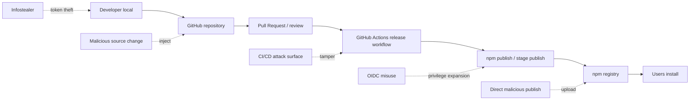
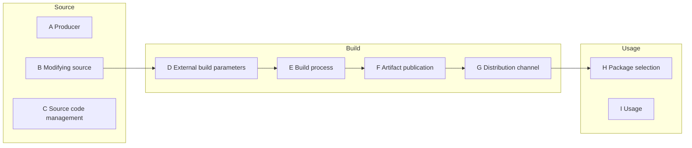
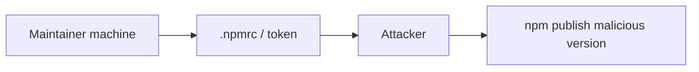
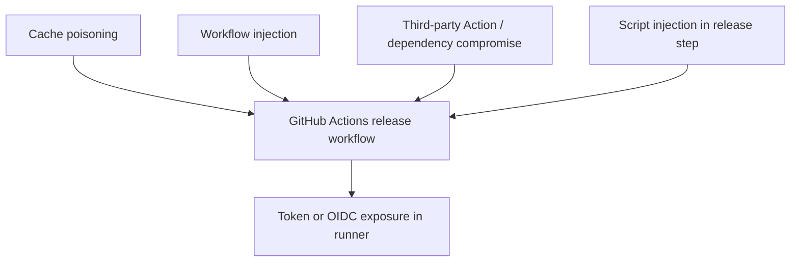
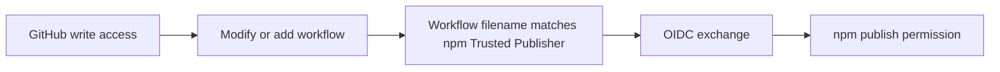

# SLSA とサプライチェーン攻撃の発表者ノート

このノートは `slide.md` の発表補助用。スライドにそのまま全部入れるのではなく、SLSA の脅威モデルと npm publishing hardening の対応関係を説明するときの手元メモとして使う。

注: 「SALA」ではなく **SLSA**。読みは「サルサ」。

## 目的

- サプライチェーン攻撃を「どこで混入するか」で可視化する
- OIDC / Environment / staged publishing が、どの攻撃経路に対応する対策なのかを説明する
- SLSA を「達成レベルの話」ではなく「脅威を分類するモデル」として使う
- この発表の目的は、改ざんそのものを完全に防ぐことではなく、侵害されても悪い package が registry / Distribution へ進む前に止めること
- build中に悪性コードが混ざり、それを人が気づかずApproveしてしまう問題は残る。そこは成果物検証、monitoring、より強い build isolation の領域で、今回の中心ではない

## 1. サプライチェーン攻撃の可視化

今回の発表で扱う npm publishing は、主に「公開直前から公開後」に焦点がある。



話すポイント:

- 攻撃者は「ソースコードに入る」だけでなく「ビルドや公開の流れ」に入る
- npm は依存の伝播力が強いので、公開地点を取られると利用者側へ一気に広がる
- だから公開フローを 1 箇所だけではなく、ローカル、GitHub、CI、npm の各段で制御する

## 2. SLSA の脅威モデルに対応づける

SLSA v1.2 の脅威モデルでは、サプライチェーンを Source / Build / Usage に分け、A-I の脅威として整理している。



今回の中心は **(F) Artifact publication**。

SLSA の (F) は「公式ソースの意図を反映しない artifact がアップロードされる」脅威。npm の文脈では、悪意ある tarball や、本来の release workflow ではない経路から作られた package が registry に出ること。

## 3. この発表の対策が対応する範囲

| 対策 | 主な対応範囲 | 緩和するリスク |
| --- | --- | --- |
| npm token 0 個 | Local / Artifact publication | infostealer で npm publish token が漏れる経路を消す |
| Require 2FA and disallow tokens | Artifact publication | 既存 token だけで publish される経路を閉じ、OIDC Trusted Publisher を残す |
| OIDC Trusted Publishing | Artifact publication | 長期 token ではなく、特定 workflow からの短命 credential にする |
| provenance | Build / Artifact publication | どの repo / workflow から来た artifact かを後から検証できるようにする |
| PR 必須 / Rulesets | Source | 直接 push や review 抜きの変更を減らす |
| Environment required reviewers | Build / Artifact publication | GitHub write 権限から npm publish 権限へ広がる経路にApproveを挟む |
| cache を使わない | Build process | PR 側など低権限 workflow から release workflow へ汚染が伝わるのを避ける |
| staged publishing | Artifact publication | publish 直前に 2FA 付き review を追加する |

話すポイント:

- OIDC は「token を消す」対策だが、それだけだと GitHub 側を取られたときに npm publish へ権限が広がる
- Environment はその権限境界にApproveを置く対策
- staged publishing は npm 側で公開前 review を追加する対策
- `Require 2FA and disallow tokens` は token publish を閉じる設定であり、npm publish 権限を持つ maintainer の interactive publish までは閉じない。CIに公開経路を寄せたい場合は、npm側のpublish権限を最小化し、メンテナはGitHub側のPR/Approveへ寄せる。
- どれか 1 つで完結するのではなく、同じ (F) に対して複数の段階で緩和策を置く

## 4. 攻撃シナリオ別の見せ方

### Infostealer



関連する対策:

- npm token 0 個
- disallow tokens
- OIDC Trusted Publishing

スライドでの使いどころ:

- 「生のcredentialをローカルに置かない」
- 「npm: アクセストークンを0個にする」
- 「Require 2FA and disallow tokens」

### CI / GitHub Actions の攻撃面



Actions では、cache poisoning だけではなく、workflow の改変、外部 Action や依存の侵害、release step への script injection、runner 上の token / OIDC credential の露出など、複数の経路を考える。

関連する対策:

- release workflow で cache を使わない
- 外部 Action 依存を減らす
- checkout / setup-node の SHA pin
- workflow permissions を最小化する
- `persist-credentials: false` を設定する
- Environment approval

スライドでの使いどころ:

- 「実装: 外部Actionに依存しない」
- 「なぜcacheを使わないか」
- 「実装: release.yml（抜粋）」
- 「実装: EnvironmentでApproveとrefを制御する」
- TanStack 事例の説明

### OIDC 権限カスケード



関連する対策:

- npm Trusted Publisher で workflow filename だけでなく Environment も縛る
- Environment required reviewers
- Environmentのbranch/tag ruleを `refs/pull/*/merge` にして、PRのmerge refだけに限定する
- staged publishing を stage-only にする

`refs/pull/<n>/merge` の説明:

- 普通のbranchではなく、PRごとにGitHubが作る一時的なread-only ref
- ユーザーが自由に作れるrefではない
- ユーザーが同名branchを作っても `refs/heads/pull/...` であり、`refs/pull/...` ではない
- Environmentのbranch/tag ruleは `GITHUB_REF` を評価する
- `pull_request` 系では `GITHUB_REF` が `refs/pull/<n>/merge` になる
- だからnpm Environmentで `refs/pull/*/merge` だけ許可し、required reviewersのApproveと組み合わせる

Bitwarden CLI 事例の言い方:

- workflow改変 → OIDCでnpm短期credential → ログへ出して持ち出し → Gitコンテキスト外からpublish
- 悪性 2026.4.0 も npm の `_npmUser` は GitHub Actions / OIDC だが、provenance は欠落
- 長期npm tokenを消すことと、workflow改変だけでpublishへ進めないようにすることは別の問題
- Environment + Approve で「workflowを変えた主体」と「publishへ進める判断」を分ける

スライドでの使いどころ:

- 「Bitwarden CLI侵害: OIDCは通った」
- 「権限カスケード（権限昇格）」
- 「実装: 改変だけではpublishへ進めない」
- 「staged publishing」

## 5. 可視化スライド案

作成した図:

- `img/slsa-slide-mapping.svg`
- `img/slsa-slide-mapping.png`

この図は、SLSA の全体仕様を説明するためのものではなく、既存スライドの対策を SLSA の脅威面へ対応づけるための図。

見せたい構造:

- 上段: SLSA の Source / Build / Publish(F) / Distribution / Usage
- 中段: この発表の npm publishing flow
- 下段: 攻撃パスと、このスライドで紹介する対策
- 強調: Publish(F) と `Actions -> publish -> use`

差し込み候補:

1. 「SLSAでレイヤーごとに対策する」の画像を、この図に差し替える
2. 既存の SLSA 脅威図の次に、対応づけスライドとして 1 枚追加する

おすすめは 2。SLSA 公式図で脅威分類を示したあと、この図で「今回の発表ではここを扱う」と対応づけると、抽象から具体への流れが作りやすい。

話すポイント:

> SLSA の全部を扱う話ではなく、この発表で扱っている npm publish の対策が SLSA のどこに対応するかを見る図です。Source や Build も関係しますが、中心は Artifact publication(F) です。悪い package が registry に出る経路に対して、OIDC、Environment、staged publishing をそれぞれ別の段階で配置しています。

## 6. スライド上で SLSA が説明できること

### 説明できること

- 個別対策の羅列を「同じ脅威を複数段階で制御している」という説明にできる
- OIDC / Environment / staged publishing の違いを整理できる
- 「なぜ staged publishing まで必要なのか」を説明しやすくなる
- 攻撃事例を Source / Build / Publication のどこで起きたかに置ける

### 主役にしない方がいいこと

- SLSA レベル達成の説明
- SLSA certification の話
- 仕様の細かい用語説明
- 利用者側の verification を本題にすること

今回の主題は「OSS 開発者が npm publish の公開フローをどう制御するか」。SLSA は、その対応関係を説明する脅威モデルとして使う。

## 7. 発表時の短い説明例

> ここで SLSA を出すのは、SLSA レベルを達成しましょうという話ではありません。攻撃がどの段で起きるかを整理するための脅威モデルとして使っています。今回の npm publishing で一番見ているのは Artifact publication、つまり公式ソースの意図と違う package が registry に出てしまう場所です。

> OIDC は token を消します。Environment は GitHub の権限が npm publish 権限へ広がる地点にApprove stepを置きます。staged publishing は npm 側で公開直前の review を追加します。いずれも同じ問題に対する別レイヤーの制御です。

## 8. 既存スライドへの対応

| slide.md の場所 | SLSA ノートの使い方 |
| --- | --- |
| なぜ今、公開フローを守るのか | サプライチェーン攻撃は source だけでなく publish path も狙うと説明する |
| この発表の目的 | 侵害されても悪い package が registry へ出る前に止める話であり、改ざん検出全般ではないと境界を置く |
| npm packageが使われるまで | Local -> PR -> Actions -> publish -> use の背骨を先に見せる。SLSA用語に寄せすぎず、一般的な公開手順として説明する |
| 公開までのレイヤー | ローカルから registry までの攻撃面を可視化する |
| provenanceで来歴を残す | 本文では「packageとworkflowを結びつける証拠」と説明し、SLSA Build L2はノートで補足する |
| なぜcacheを使わないか | SLSA の Build process(E) として説明する |
| OIDC と権限昇格 | OIDC 単体では GitHub 侵害から npm へ権限がカスケードする、と説明する |
| SLSAの流れで振り返る | 具体策を全部話したあと、SLSAのSource / Build / Publishの流れに対応づけて回収する |
| npm staged publishing | Artifact publication(F) の最後のApprove stepとして説明する |
| まとめ | 「SLSA のレイヤーに沿って逐次やる」より「SLSA の脅威モデルでいう publish 地点に複数の緩和策を置く」が正確 |

## 9. L1 / L2 / L3 の短い理解

npm provenance の説明では、L1 / L2 / L3 をそのまま本文に出すと分かりにくい。発表者側の理解として次の対応を持っておき、スライドでは「証拠」と「隔離」に言い換える。

v1.2にもLevelはある。ただし、v1.2は複数trackに分かれている。Build trackは Build L0-L3、Source trackは Source L1-L4 として扱う。今回のnpm provenanceの話は主にBuild trackを見る。

| Level | 見ているもの | npm publishing での理解 |
| --- | --- | --- |
| Build L1 | provenance が存在する | どこからどう作ったかの記録はある。ただし不完全・未署名でもよく、偽造や改ざんに弱い |
| Build L2 | hosted builder が署名付き provenance を出す | GitHub Actions / npm / Sigstore で package digest と repo / workflow / ref を結びつけて検証できる |
| Build L3 | isolated build | build 間の影響、cache poisoning、build platform secret へのアクセスを防ぐ隔離がある |

言い方の注意:

- `distribution 中の改ざん` ではなく、`build 中の汚染` と言う方が正確
- L2 は build 後の artifact / provenance の差し替えには強い
- L2 は build 中に攻撃者コードが混ざる、cache が汚染される、runner 内の OIDC identity が抜かれる、といった問題までは保証しない
- その領域は L3 の isolation が見る
- ただし L3 でも producer が危険な workflow を書いた場合までは防がない。L3 は善意の build が意図しない外部影響を受けないための隔離
- 細かい補足: private repository でも Trusted Publishing(OIDC) は使えるが、npm provenance は生成されない。provenance 自動生成は Trusted Publishing、public repository、public package の組み合わせが条件。

短い言い方:

> provenance は「このpackageはこのworkflowから出た」という証拠です。ただし、build中にcacheやrunnerから汚染されていないかは別の話です。

## 10. Isolated ぐらいまで触れる方針

この発表では、SLSA Build L3 全体を達成する話にはしない。ただし Build L3 の `Isolated` は、provenance だけでは足りない理由を説明するために触れる価値がある。

話す粒度:

- npm provenance は「どこでビルドされたか」を残す証拠
- でも build 環境が汚染されていれば、署名付きでも悪性 package は出る
- 隔離は、build 間の影響、cache poisoning、build platform secret へのアクセスを防ぐ考え方
- 今回は SLSA レベル達成ではなく、その発想を release workflow hardening に落とす

スライドに入れるなら、`なぜcacheを使わないか` の直後が自然。TanStack / Mini Shai-Hulud の具体例を見せた直後に、provenance と isolation の違いを説明できる。

ただし、`provenanceだけでは足りない` の本文では cache を再度出さない。cache は直前の専用スライドで説明済みなので、ここでは「provenance は来歴の証拠であって、publish に進めてよいかを決める Approve や build 中の影響確認とは別」という線にする。

スライド案:

```md
# provenanceだけでは足りない

- provenanceで「どこから出たか」は分かる
- でも「作る途中で何が混ざったか」は分からない
- 悪いpackageにも正しい署名が付くことがある
- だからpublishに進む前に別のApproveを求める
```

Speaker note 案:

```md
^ SLSA Build L3を達成する話ではない。重要なのは、provenanceは証拠であって、成果物をpublishしてよいと判断した事実ではないという点。本文ではL3/Isolatedという用語より「出どころは分かるが、作る途中までは見ない」と説明する。ここから、provenanceとは別にpublishへ進むためのApproveを求める話へつなげる。staged publishingでは中身確認もできるが、このスライドの主語は「provenanceとは別のApprove」。
```

短い言い方:

> provenance は証拠、隔離は build 中に混ざらないための条件です。証拠が正しくても、隔離されていない build 環境で攻撃者コードが動いていれば成果物は汚染されます。

## 11. Mini Shai-Hulud 記事から足す観点

SLSA 公式ブログの Mini Shai-Hulud 解説は、この発表にかなり役立つ。特に「valid provenance でも、それだけでは安全とは言えない」という境界線を説明できる。

使えるポイント:

- TanStack 侵害は、workflow misconfiguration、cache poisoning、OIDC token extraction が連鎖した例として説明できる
- 悪性 package でも npm provenance attestation は暗号的には valid だった
- 問題は attestation そのものではなく、attestation を生成した build platform の分離境界が破られていたこと
- npm built-in provenance は Build L2 相当の保証として有用だが、Build L3 の cache isolation や signing identity 隔離までは保証しない
- SLSA は「何が起きたか」の evidence を残す。そこから「受け入れてよいか」を決めるには policy と monitoring が別途必要
- publish が failed workflow run から発生していないかを監視する、という運用面の話にもつなげられる

発表での使い方:

- 「provenanceで来歴を残す」では、provenance は必要条件であって十分条件ではないと補足する
- 「なぜcacheを使わないか」では、Build L3 isolation が本来止めるべき種類の攻撃として説明する
- 「SLSAの流れで振り返る」では、SLSA の限界を話して主張を現実的にする
- 「まとめ」では、SLSA、policy、workflow hygiene、monitoring は別レイヤーだと整理する

短い言い方:

> valid provenance は「正しいビルドだった」ではなく、「そのビルド基盤が観測したことが署名されている」という意味です。ビルド基盤の中で攻撃者コードが動いているなら、観測は正しくても成果物は汚染されます。

> だから provenance だけで終わりではなく、cache を信頼境界として扱う、Environment で権限境界にApproveを置く、staged publishing と monitoring で公開直前・公開直後を見る、という話になります。

## 12. 参考リンク

- SLSA Threats & mitigations: https://slsa.dev/spec/v1.2/threats
- Mini Shai-Hulud: Where SLSA’s Boundaries Fall: https://slsa.dev/blog/2026/05/mini-shai-hulud-what-slsa-can-and-cannot-do
- npm Trusted Publishing: https://docs.npmjs.com/trusted-publishers/
- npm provenance: https://docs.npmjs.com/generating-provenance-statements/
- npm staged publishing: https://docs.npmjs.com/staged-publishing/
