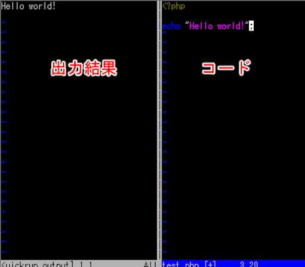
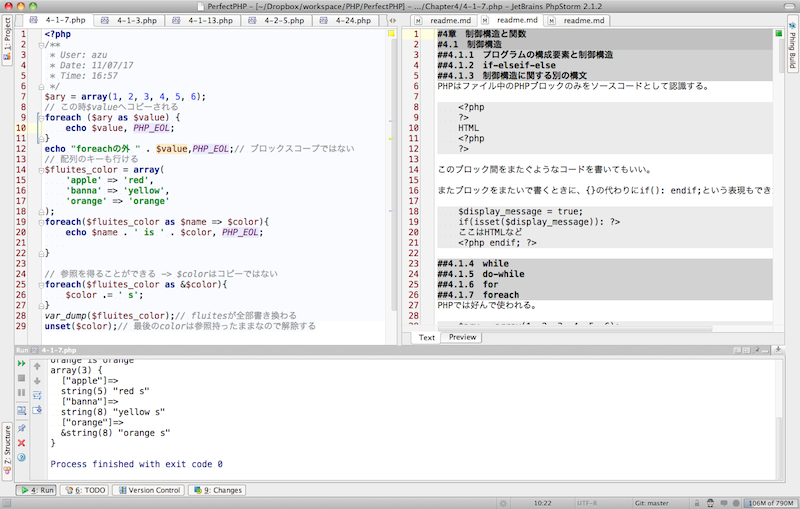

# HOW TO LEARN

---

新しい言語の勉強
==============

- 一か月で3言語を勉強している
    - C言語
    - PHP
    - Objective-C
- トライアンドエラー
    - 入力、実行を繰り返して覚える
    - 反復実行、デバッグのし易さ大事

.notes: まだ使えるというほどではないが

---

C言語
====

## 実行環境

- Vim + quickrun.vim + GCC

## 教材

- 苦しんで覚えるC言語
    - 基本的なサンプル
- プログラミング言語C 第2版 k&R本
    - C言語とは何か

---

C言語 - 反復実行
==============

- Vim + GCC => どの環境でもできる
- quickrun.vim
    - プログラムをコンパイルして実行結果を出力する

実行->確認->実行と繰り返せる(保存しなくてもいい)

    !c
    #include <stdio.h>
    int main(void){
      printf("Hello, World!\n");
      return 0;
    }

プログラムを書いて、¥-rを押して実行結果を確認しながら学べる

- [Vim+quickrunでC言語の勉強環境](http://meme.efcl.info/2011/07/vimquickrunc.html)

---

C言語 - quickrun.vim
===============

---

PHP
===

## 開発環境

- PHPStorm
    - Jetbrains製のIDE
    - Intelli J,WebStorm, RubyMineなどの姉妹品

## 教材

- パーフェクトPHP
    - お借りした書籍
---

PHP - 学習方法
============

1. パーフェクトPHPを読む
2. サンプルコードを入力する
3. 実行結果を見る
4. 気になったらWebで調べる
5. ... 繰り返し

気になった部分はメモを取る

----

PHP - コードの実行
================

- コンソールで完結するコード
    - phpコマンドで叩く
    - 結果がわかる
- ブラウザで見る必要があるコード
    - PHP5.4のビルドインサーバーを使う
    - Apacheの設定をせずに単体のphpファイルを動作確認

- [PHP5.4でビルトインウェブサーバーを使って反復実行環境の構築 | MemeTodo](http://meme.efcl.info/2011/07/php54.html)

---

PHPStormの画面分割を使いメモを取る
=============================

- PHPStormはMarkdown形式に対応(プラグイン)
- パーフェクトPHPの目次を作成
- 画面分割
    - 左画面でコードを書いて実行
    - 右画面でMarkdown形式でメモを書く
- コードとメモはGitで管理
- 書いたメモはGithubにそのままpush
    - GithubはMarkdown形式をhtmlで表示してくれる

---

PHPStromの作業環境
================

---

Objective-C
===========

## 開発環境

- XCode
- AppCode
    - Jetbrains製のIDE
- MacVim

## 教材

- iPhone/iPadプログラミングバイブル
- iOSの教科書
- Webでの連載などいろいろ
- [Stack Overflow][]

近年のiPhoneブームに乗り、情報はたくさんあるが、
始め方に癖があり、どこから学ぶべきなのかがわかりにくい

[Stack Overflow]: http://stackoverflow.com/

---

Objective-Cの学習方向
================

- Interface Builderから作るアプリ
    - 比較的、形は簡単に作成できる
    - コード生成の補助機能も多い
- コードからUIを構築するアプリ
    - 自由度高い

結局はどちらのやり方も知ってる方がいい

---

Objective-Cという言語
===================
- 言語仕様はCの完全上位互換
- C + オブジェクト指向
    - メッセージ式 : `[オブジェクト名 メソッド名]`
- 命名規則など暗黙の了解が多い
    - [Google Objective-Cスタイルガイド 日本語訳](http://www.textdrop.net/google-styleguide-ja/objcguide.xml)
    - [Coding Guidelines for Cocoa: Naming Methods](http://developer.apple.com/library/mac/#documentation/Cocoa/Conceptual/CodingGuidelines/Articles/NamingMethods.html)
- 動的な言語なため柔軟な仕組みができる
    - MVC
    - デザインパターン
- 開発環境は結構重要
    - 書き方が冗長なためよいエディタが必要
	
---

