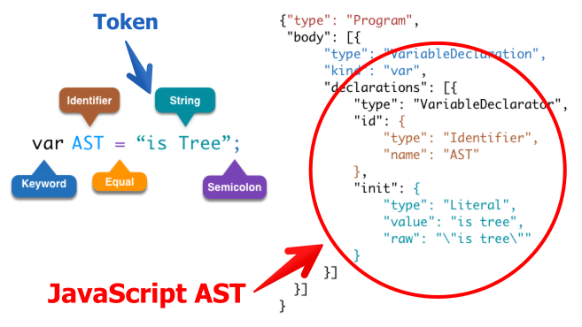
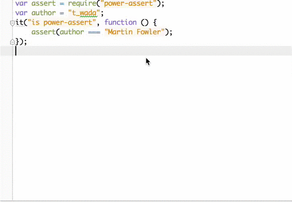

title: カジュアルJavaScript AST
author:
  name: azu
  twitter: azu_re  
  url: http://efcl.info/
theme: azu/cleaver-ribbon
output: index.html
--


# カジュアルJavaScript AST


--

# 自己紹介


- Name : **azu**
- Twitter : @[azu_re](https://twitter.com/azu_re)
- Website: [Web scratch], [JSer.info]

[Web scratch]: http://efcl.info/ "Web scratch"
[JSer.info]: http://jser.info/ "JSer.info"

--

# 今日の概要

- 実は使われてるJavaScript AST
- JavaScript AST(Abstract Syntax Tree)とは?
- JavaScript ASTを使ったツール紹介
- 使うだけじゃなくて書いてみよう

--


# [browserify](https://github.com/substack/node-browserify "browserify")

- Node.jsで書かれたものをブラウザ向けに変換するツール
- Node環境で開発 -> browserifyでビルド -> ブラウザで動く
- JavaScriptのコードを **変換** する
	- ≒ JavaScript ASTを見て**変換** する
	- 本体の色々な部分、transform pluginなどでASTを使ってる


--

# [JSDoc 3](https://github.com/jsdoc3/jsdoc "JSDoc 3")

- JSDocのアノテーションからHTMLリファレンスを作成する標準ツール
- Node版の実装にesprimaが使われてる
- JSDocを解析したい場合は[doctrine](https://github.com/Constellation/doctrine "doctrine")を使うのが楽

--


# [UglifyJS 2](https://github.com/mishoo/UglifyJS2 "UglifyJS 2")

- JavaScriptコード圧縮ツール(minifier)
- コードを圧縮するためにコードをパースしてAST(構文木)を作る
    - 1までは独自のASTのみ
    - 2からは一般的な[SpiderMonkey AST](https://github.com/mishoo/UglifyJS2#support-for-the-spidermonkey-ast "SpiderMonkey AST")もサポート

--

# [plato](https://github.com/es-analysis/plato "plato")

- コードのメトリクス計測のビジュアライズ
- コード解析的な事はJavaScript ASTを使うのに最もマッチした内容


--

# What is JavaScript AST?



--

## JavaScript ASTって何?

* AST(Abstract Syntax Tree)はコードをパースした抽象構文木
* Mozilla JavaScript AST([Parser API](https://developer.mozilla.org/en-US/docs/SpiderMonkey/Parser_API "Parser API")) がデファクト
* JavaScript AST扱う際にはただのJavaScriptオブジェクト
* Code -> Token -> AST(tokenの関係を構造化したもの)
* 端的に言えばコードをJSON/JavaScriptオブジェクトで表現したもの


--

## JavaScript AST

``` javascript
new C(1 + a);
```

このコードには、以下のような要素(node)が存在する

* `NewExpression` - `new`演算子
* `BinaryExpression` の `+`
* `1` というvalueをもつ `Literal`
* `C` と `a` という変数は `Identifier`

--

### JS AST Structure


--

### JS AST as JSON


> [SpiderMonkey Parser API: A Standard For Structured JS Representations // Speaker Deck](https://speakerdeck.com/michaelficarra/spidermonkey-parser-api-a-standard-for-structured-js-representations "SpiderMonkey Parser API: A Standard For Structured JS Representations // Speaker Deck") からの引用

--

## JS AST as HTML

<style>
Keyword {
    color: #445588;
    font-weight: bold;
}
Identifier {
    color: #009999;
}
Literal {
    color: #E67A00;
}
VariableDeclaration {
    color: purple;
}
ThrowStatement {
    color: red;
}
</style>

<pre><code>
<Program><ExpressionStatement><NewExpression>new <Identifier>C</Identifier>(<BinaryExpression><Literal>1</Literal> + <Identifier>a</Identifier></BinaryExpression>)</NewExpression>;</ExpressionStatement>
</Program>
</code></pre>

- **↑ Inspect Here ↑**
- JavaScript ASTからHTMLタグを生成したもの
- [azu/syntax-highlighted-js-ast](https://github.com/azu/syntax-highlighted-js-ast "azu/syntax-highlighted-js-ast")

--

## 習うより慣れろ

* [Esprima: Parser](http://esprima.org/demo/parse.html "Esprima: Parser")
* コードを入力してどういうASTが出力されるかをみて理解する
* JavaScript ASTはECMAScriptの仕様を尊重してる
* JavaScriptの基本的な文法がわかってれば問題ない
* 既に公開されてるツールを見ていく

--

# JavaScript ASTを使ったツール

--

# [Tern](http://ternjs.net/ "Tern")

- [Tern for Vim](https://github.com/marijnh/tern_for_vim "Tern for Vim")や[Tern for Sublime Text](https://github.com/marijnh/tern_for_sublime " Tern for Sublime Text")の補完エンジン
- パーサーには[ acorn.js ](http://marijnhaverbeke.nl/acorn/ " acorn.js ")が使われてる

--

## [CoffeeScriptRedux](https://github.com/michaelficarra/CoffeeScriptRedux "CoffeeScriptRedux")

- [Rewrite the CoffeeScript compiler](https://www.kickstarter.com/projects/michaelficarra/make-a-better-coffeescript-compiler "Rewrite the CoffeeScript compiler")
- CoffeeScriptコンパイラをCoffeeScript AST -> JS ASTという形で実装
- *AST is IR(中間表現)*
- LLVM みたいな雰囲気の使い方
- More Info
  - [Escodegen and Esmangle: Using Mozilla JavaScript AST as an IR](http://aosd.net/2013/escodegen.html "Escodegen and Esmangle: Using Mozilla JavaScript AST as an IR")
  - [Redesigning the CoffeeScript Compiler // Speaker Deck](https://speakerdeck.com/michaelficarra/redesigning-the-coffeescript-compiler "Redesigning the CoffeeScript Compiler // Speaker Deck")

--

# [power-assert](https://github.com/twada/power-assert "power-assert") [](https://github.com/twada)



--

## power-assertのテスト失敗例


--

## power-assert

- テストコード中に出てくる `assert()` 等のASTを変換
- 失敗した場合に欲しい情報を埋め込めるように介入
- assertionの書き方はシンプル、だけど失敗しても分かりやすくなる

--

# [JSCS](https://github.com/mdevils/node-jscs "JSCS")
 

- JavaScript Code Style Checker
- JSHintと併用してコーディングのスタイルをチェックするツール
	- JSHint 3.0でスタイル関係のルールは外される
- tokensをみて **スタイル** をチェックする
	- AST自体は抽象表現なのでスタイルをチェックするには不向き
	- ホワイトスペースとか`;`があるとかそういう情報はASTには(そのままだと)ない
	- コードの最小単位であるtokensを見ることでスタイルをチェックする


--

# [JSX](http://jsx.github.io/ "JSX")言語のminifier

- minify処理の一部で[esmangle](https://github.com/Constellation/esmangle "esmangle")を利用
- ASTレベルでminifyをする
- 安全にコードを圧縮できるように設計されてる

--

# [Grasp](http://graspjs.com/ "Grasp")

- ASTを元にGrep/Sedのような検索/置換するツール
- ASTを元に検索するので、誤爆しない置換が行える
- コードベースやAST Query Selectorでの検索方法が用意されている
- [Graspを使ったJavaScriptのリファクタリング | JSer.info](http://jser.info/post/73202282881/grasp-javascript "Graspを使ったJavaScriptのリファクタリング | JSer.info")
- [JavaScriptライブラリの気になる実装をどうやって見ていくか | Web scratch](http://efcl.info/2014/0209/res3658/ "JavaScriptライブラリの気になる実装をどうやって見ていくか | Web scratch")

--

# [ESLint](http://eslint.org/ "ESLint")

* ASTを元にコードのLintをするツール
* JSHintと役割は被る部分が多い。
* プラグインで独自のルールを追加しやすいのが特徴

--

# [ESLint](http://eslint.org/ "ESLint")で局所的Lint

- プラグインで*プロジェクト固有のLint**が簡単に実現できる
- [Avoid &#34;push&#34; with multiple arguments due to performance issue. · 48bfe19 · Constellation/escodegen](https://github.com/Constellation/escodegen/commit/48bfe1947f6cd09cf539de350859dba14431b255 "Avoid &#34;push&#34; with multiple arguments due to performance issue. · 48bfe19 · Constellation/escodegen")

--

# 局所的Lintの例

- あるブログサイトのJSで特定のコメントが出てきてないかチェックしたい!
	- ✘ "なぜやってるのか不明"
	- ✘ "コピペ"
- といったコメントを検出したい！
- [hatena-blog-js-lint](https://github.com/azu/hatena-blog-js-lint "hatena-blog-js-lint")

--

# あるブログサイトをLintした例


--

# 書いてみよう

--

## Mochaのテストをパースする例

- [MechaMocha](https://github.com/azu/MechaMocha "MechaMocha")
- BDD的なテスト構造をテキストとして吐きだしたい!
- => JavaScript ASTを見てテストの構造を取ってみる
- describe - context - it ...


--

## Example


``` javascript
var assert = require("power-assert");
describe('Array', function () {
    describe('#indexOf()', function () {
        it('should return -1 when the value is not present', function () {
            assert.equal([1, 2, 3].indexOf(5), -1);
            assert.equal([1, 2, 3].indexOf(0), -1);
        });
        it('should return -1 when the value is not present', function () {
            assert.equal([1, 2, 3].indexOf(5), -1);
            assert.equal([1, 2, 3].indexOf(0), -1);
        })
    });
});
describe('IsNaN', function () {
    context("when value is NaN", function () {
        it('should return true', function () {
            assert(isNaN(NaN));
        });
    });
});
```

--

## Output

テストコードから以下のようなテキストを出力

```
Array
   #indexOf()
     should return -1 when the value is not present
       [1, 2, 3].indexOf(5) equal -1
       [1, 2, 3].indexOf(0) equal -1
IsNaN
   when value is NaN
     should return true
       assert isNaN(NaN)
```

--

## MechaMocha

* [Estraverse](https://github.com/Constellation/estraverse "Estraverse")を使ったシンプルな走査
* ASTは木構造だがプロパティの種類が多くて大変
* traverseライブラリを使うのが一般的

--

* **enter**
	* `"describe", "context", "it"` の `CallExpression` ならindentレベルを+1
		* `["describe", "context", "it"]` なら print
			* `assert` ならprint
* **leave**
	* `"describe", "context", "it"` の `CallExpression` ならindentレベルを-1


--

## [visualize estraverse step](http://azu.github.io/visualize_estraverse/ "visualize estraverse step")

<iframe src="http://azu.github.io/visualize_estraverse/#describe%28%27Array%27%2C%20function%20%28%29%20{%0A%20%20%20%20describe%28%27%23indexOf%28%29%27%2C%20function%20%28%29%20{%0A%20%20%20%20%20%20%20%20it%28%27should%20return%20-1%20when%20the%20value%20is%20not%20present%27%2C%20function%20%28%29%20{%0A%20%20%20%20%20%20%20%20%20%20%20%20assert%281%29%3B%0A%20%20%20%20%20%20%20%20}%29%3B%0A%20%20%20%20}%29%3B%0A}%29%3B" width="100%" height="450" style="border: 1px black solid;"></iframe>

--

## [azu/inlining-node-require](https://github.com/azu/inlining-node-require "azu/inlining-node-require")

* node.jsの`require`をインライン化してつなげる
* [falafel](https://github.com/substack/node-falafel "falafel")を使いASTを編集

## [azu/remove-use-strict](https://github.com/azu/remove-use-strict "azu/remove-use-strict")

* 無意味な`"use strict"`を取り除く
* 関数スコープを意識した作り
* [Estraverse](https://github.com/Constellation/estraverse "Estraverse")を使うと楽に関数スコープをみていける

[Node.jsのrequireをインライン化、無駄なuse strictを取り除くモジュールを書いた | Web scratch](http://efcl.info/2014/0316/res3719/ "Node.jsのrequireをインライン化、無駄なuse strictを取り除くモジュールを書いた | Web scratch")

--

## まとめ

* JavaScript ASTは既に色々なツールで使われてる
* 言語仕様に近いので、より正確にJavaScriptコードを扱える
* JS AST自体はただのJavaScriptオブジェクト/JSON
	* 実際にコードのASTを見る、トライアンドエラーして慣れるのが近道 - [Esprima:Parser](http://esprima.org/demo/parse.html "Esprima: Parser")
	* JavaScriptの構文が分かってるならだれでも扱える
* [ESLint](http://eslint.org/ "ESLint")のプラグインやちょっとしたツールにASTを使えると楽しくなる

--

## 参考

* [JavaScript AST Walker](http://azu.github.io/slide/tkbjs/js-ast-walker.html "JavaScript AST Walker")
* [JavaScript Parser Infrastructure for Code Quality Analysis](http://www.slideshare.net/ariyahidayat/javascript-parser-infrastructure-for-code-quality-analysis# "JavaScript Parser Infrastructure for Code Quality Analysis")
* [SpiderMonkey Parser API: A Standard For Structured JS Representations // Speaker Deck](https://speakerdeck.com/michaelficarra/spidermonkey-parser-api-a-standard-for-structured-js-representations "SpiderMonkey Parser API: A Standard For Structured JS Representations // Speaker Deck")
* [Building JavaScript Tools](http://gregfranko.com/building-javascript-tools-talk/ "Building JavaScript Tools")

--

# 質問

## 正規表現でいいんじゃない?

> ❝ある人々は問題に直面すると、「そうか、正規表現を使うんだ」と考える。こうして彼らは２つの問題を抱えることになる。❞
> — Jamie Zawinski 

最新の正規表現でやってぶっ壊れた事例(fixed)

* [Error in Browser for newer version · Issue #639 · substack/node-* browserify](https://github.com/substack/node-browserify/issues/639 "Error in Browser for newer version · Issue #639 · substack/node-browserify")

--

## ASTからコードは?

* [Escodegen](https://github.com/Constellation/escodegen "Escodegen")を使う
