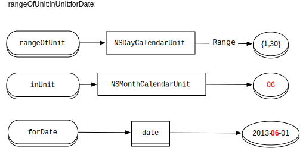

# NSDate A Live

-----

# 自己紹介

- Name : azu
- Twitter : @[azu_re](https://twitter.com/azu_re)
- Website: [Web scratch], [JSer.info], [MemeTodo], [prog*sig]

[Web scratch]: http://efcl.info/ "Web scratch"
[JSer.info]: http://jser.info/ "JSer.info"
[MemeTodo]: http://meme.efcl.info/ "MemeTodo"
[prog*sig]: http://efcl.info/adiary/ "prog*sig"

----

# NSDate

* 日付オブジェクト
* これをベースに考える

----

# NSDateFormatter

* strftime
* 基本的に**表示用**に使うことを念頭に置いて使う
* データを保存するための**変換**には使わない
	* NSDateオブジェクト自体を保存すべき

----

## dateFormatFromTemplate

* 多言語対応に便利
* ``[NSLocale currentLocale]``で自動的に他言語対応のNSDateFormatter
* [dateFormatFromTemplateSpec.m at master · azu/NSDateALive · GitHub](https://github.com/azu/NSDateALive/blob/master/NSDateALiveTests/dateFormatFromTemplateSpec.m "NSDateALive/NSDateALiveTests/dateFormatFromTemplateSpec.m at master · azu/NSDateALive · GitHub")

サンプル
	
	!objectivec
	NSString *format = [NSDateFormatter dateFormatFromTemplate:@"EdMMM" options:0 locale:[NSLocale currentLocale]];
	NSDateFormatter *dateFormatter = [[NSDateFormatter alloc] init];
	[dateFormatter setDateFormat:format];
	[dateFormatter stringFromDate:[NSDate date]];
	// en_US => Thu, Jun 6
	// ja_JP => 6月6日(木)

----

## 和暦カレンダー

* iOSの設定でカレンダーが和暦の場合の挙動

和暦時に ``yyyy`` の値がおかしい

    NSDateFormatter *dateFormatter = [[NSDateFormatter alloc] init];
    [dateFormatter setDateFormat:@"yyyy-MM-dd"];
    NSString *result = [dateFormatter stringFromDate:stubDate];
    // 期待 : 2013-06-06
	// 現実 : 0025-06-06

* [JapaneseCalendarSpec.m at master · azu/NSDateALive · GitHub](https://github.com/azu/NSDateALive/blob/master/NSDateALiveTests/JapaneseCalendarSpec.m "NSDateALive/NSDateALiveTests/JapaneseCalendarSpec.m at master · azu/NSDateALive · GitHub")

----

## 24時間表示

``HH`` の値がiOSの設定の影響を受ける

* [guess what?: iOSの日付処理まとめ](http://aqubiblog.blogspot.jp/2012/11/ios.html "guess what?: iOSの日付処理まとめ")
* [iOS6とNSDateFormatterと和暦と24時間表示オフで発生しやすいバグについて | Technology-Gym](http://tech-gym.com/2012/10/ios/893.html "iOS6とNSDateFormatterと和暦と24時間表示オフで発生しやすいバグについて | Technology-Gym")

### 解決方法

* locale(とtimeZone)を設定する

----

## Thread-Unsafe

* [Threadsafe Date Formatting « Under The Bridge](http://www.alexcurylo.com/blog/2011/07/05/threadsafe-date-formatting/ "Threadsafe Date Formatting « Under The Bridge")
* [Thread-Unsafe](http://developer.apple.com/library/mac/#documentation/Cocoa/Conceptual/Multithreading/ThreadSafetySummary/ThreadSafetySummary.html "Thread-Unsafe")

----

# NSDateComponents

* 1年は365日とは限らない
* Calendarによって異なる
* NSDateを操作するときはNSDatecomponetsを経由した方がいい
* [NSDateComponents : NSHipster](http://nshipster.com/nsdatecomponents/ "NSDateComponents : * NSHipster")

----

## NSDate同士の差分を取得

* ``components:fromDate:toDate:options:``
* AとBのNSDateの**差**を持つNSDateComponentsを取得

e.g) minuteの差分を得る

	!objectivec
	NSCalendar *calendar = [NSCalendar currentCalendar];
	NSDateComponents *dateComponents = [calendar
	    components:NSMinuteCalendarUnit fromDate:fromDate toDate:toDate options:0];
	[dateComponents minute];
	// toDate - fromDate の 分 を取得できる

* [NSDateComponentsSpec.m at master · azu/NSDateALive · GitHub](https://github.com/azu/NSDateALive/blob/master/NSDateALiveTests/NSDateComponentsSpec.m "NSDateALive/NSDateALiveTests/NSDateComponentsSpec.m at master · azu/NSDateALive · GitHub")

----

# NSCalendar

* ``currentCalendar`` is slow
* ``NSDateFormatter`` のインスタンス化も遅め
* Thread-Unsafe

*[NSCalendar Class Reference](https://developer.apple.com/library/mac/#documentation/Cocoa/Reference/Foundation/Classes/NSCalendar_Class/Reference/NSCalendar.html "NSCalendar Class Reference")
* [EZ-NET: NSDate から年月や日時を取り出す - Objective-C プログラミング](http://program.station.ez-net.jp/special/handbook/objective-c/nsdate/components.asp "EZ-NET: NSDate から年月や日時を取り出す - Objective-C プログラミング")

----

## 月初/月末を取得する

* ``rangeOfUnit:inUnit:forDate:``

e.g) ``targetDate`` の月初めを取得

	!objectivec
    NSCalendar *cal = [NSCalendar currentCalendar];
    // inUnit:で指定した単位（月）の中で、rangeOfUnit:で指定した単位（日）が取り得る範囲
    NSRange range = [cal rangeOfUnit:NSDayCalendarUnit inUnit:NSMonthCalendarUnit forDate:targetDate];
    NSInteger firstDayValue = range.location;

* [NSCalendarFirstLastSpec.m at master · azu/NSDateALive · GitHub](https://github.com/azu/NSDateALive/blob/master/NSDateALiveTests/NSCalendarFirstLastSpec.m "NSDateALive/NSDateALiveTests/NSCalendarFirstLastSpec.m at master · azu/NSDateALive · GitHub")

----

# UIDatePicker

* 表示はiOSの設定に依存
* Calanderとlocaleを設定する事で、表示をプログラマブルに変更できる
	* iOS5だと動作がちょっとおかしい

e.g.) 和暦の表示のUIDatePicker

	!objectivec
	UIDatePicker *datePicker = [[UIDatePicker alloc] init];
	// 言語は日本語(iOSの設定の書式に該当)
	datePicker.locale = [[NSLocale alloc] initWithLocaleIdentifier:@"ja_JP"];
	// カレンダーは西暦(iOSの設定のカレンダーに該当)
	NSCalendar *gregorian = [[NSCalendar alloc]initWithCalendarIdentifier:NSGregorianCalendar];
	gregorian.locale = [NSLocale currentLocale];
	datePicker.calendar = gregorian;
	datePicker.datePickerMode = UIDatePickerModeDateAndTime;

* [和暦を利用時でもUIDatePickerでカレンダー:西暦の表示にする](https://gist.github.com/azu/5044045/ "和暦を利用時でもUIDatePickerでカレンダー:西暦の表示にする")

----

# ここまでのまとめ

* 出来る限り直接扱うのは ``NSDate`` にする
* ``NSDateFormatter`` に 頼りすぎるな
* 日付を操作するには ``NSDateComponents`` が一番
	* ただし冗長になりが…
* ``NSCalendar`` は1種類じゃない
	* 西暦/和暦/タイ歴…

----

# よりNSDateと仲良くなるには

* ``NSDateComponents`` は直接扱うには冗長すぎる
* ``NSCalendar`` や ``NSDateFormatter`` は安易に使うとパフォーマンスの問題を起こしやすい

## We need Library!

----

# 現在のライブラリ

### [erica/NSDate-Extensions · GitHub](https://github.com/erica/NSDate-Extensions "erica/NSDate-Extensions · GitHub")

* 安定、率直な実装
* パフォーマンスの問題

### [mysterioustrousers/MTDates · GitHub](https://github.com/mysterioustrousers/MTDates "mysterioustrousers/MTDates · GitHub")

* 多機能
* キャッシュ
* テストが書かれている
* APIが少し分かりにく

### [mirego/MCDateExtensions · GitHub](https://github.com/mirego/MCDateExtensions "mirego/MCDateExtensions · GitHub")

* シンプル
* キャッシュ
* NSCurrentLocaleDidChangeNotification対応

----

# もっともっと便利なのが欲しい

## [azu/NSDate-escort · GitHub](https://github.com/azu/NSDate-escort "azu/NSDate-escort · GitHub")

## Proposal(未着手…)

- [NSDate-Extensions](https://github.com/erica/NSDate-Extensions "NSDate-Extensions") Compatible API
- Cache & Fast implement
- Thread safe API
- Test Test Test!
- Test multiple languages
- 100% Code Coverage

----

# A primary purpose of [NSDate-escort](https://github.com/azu/NSDate-escort "azu/NSDate-escort · GitHub")

## 誰もが安心して使えるライブラリ

* できるだけシンプルな実装
* 複雑すぎる機能は入れない
* パフォーマンスの問題を発生しにくくする
* テストをできるだけ書く
* ``NSDate`` を中心に考える(ユーザーが直接扱うのはNSDate)
* ``NSDateComponents`` を考える必要を少なくする

----

# 課題

* どうやってThread safe???
* prefixは必要??

[Contributing](https://github.com/azu/NSDate-escort#contributing "Contributing") や [issue](https://github.com/azu/NSDate-escort/issues "issue.") 待ってます(日本語で大丈夫です)

----

# おわり

参考

* [Realmac Blog - Working with Date and Time](http://realmacsoftware.com/blog/working-with-date-and-time "Realmac Blog - Working with Date and Time")
