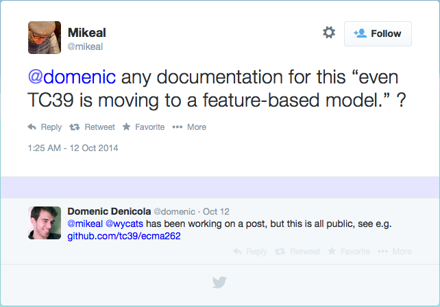
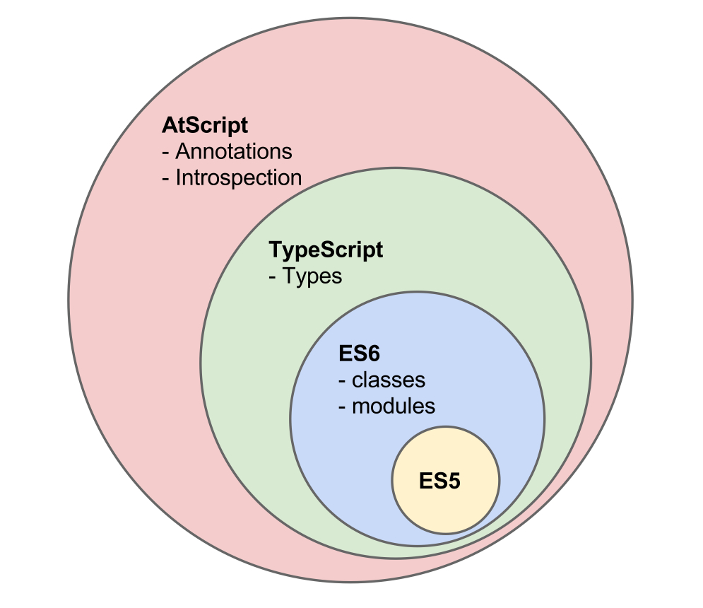
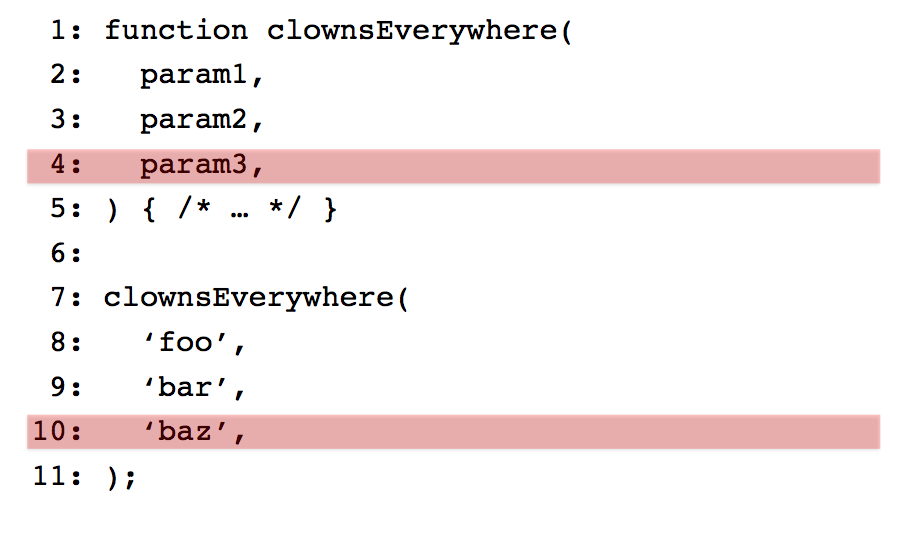

# 明日には使えなくなるES7トーク

^ 明日には使えなくなるかもしれないES7+で提案されてる仕様についての発表です。
まだ実装も無いケースが多いですし、仕様として策定されるかも未確定なため本当に明日から使えないものばかりです。

----

# 自己紹介


## **azu**
## @[azu_re](https://twitter.com/azu_re)
## [Web scratch], [JSer.info]


[Web scratch]: http://efcl.info/ "Web scratch"
[JSer.info]: http://jser.info/ "JSer.info"

----

# ES7 Proposals

## [tc39/ecma262](https://github.com/tc39/ecma262 "tc39/ecma262")

^ [ES7 Process, New Proposal Home](https://github.com/rwaldron/tc39-notes/blob/master/es6/2014-04/apr-9.md#es7-process-new-proposal-home "ES7 Process, New Proposal Home")でこのリポジトリが作成された。
Wikiの代わりにGitHub使いつつ議論を進めていくという方針が出た。


----

# 用語

- `TC` : Technical Committee = 専門委員会
- [TC39](http://www.ecma-international.org/memento/TC39.htm "TC39"): ECMAScriptを策定してる専門委員会
- `プロポーサル` : 仕様の提案
- `ECMAScript`: JavaScriptの仕様
- `ES7`: ECMAScript7


----



^ [Node Forward](http://nodeforward.org/ "Node Forward")というNode.jsのリリースが遅い問題をどうにかしようというコミュニティでDomenicさんが"TC39 is moving to a feature-based model."と言っていた
https://twitter.com/mikeal/status/520973415553851393

----


# TC39 is moving to a feature-based model


- ECMAScript 7は機能ごとに仕様を策定していく(方針)
- 仕様同士を独立して進めていく事でスピードをあげる
- 仕様のモジュール化
- [tc39/ecma262](https://github.com/tc39/ecma262 "tc39/ecma262")に現在のプロポーサルが一覧がある
- それぞれの仕様はTC39のプロセスで策定が進められる

^ ECMAScriptの策定は機能ごとにプロポーサルをだして、Draftを書いて進めていく方針。
機能レベルで決まっていれば、polyfillだったりそういうものも安定したものが早い段階で作りやすい。

^このリリースプロセスの初出は2013年5月のTC39 MTGの[ES6, ES7, ES8... Mark&#39;s Strawman Roadmap](https://github.com/rwaldron/tc39-notes/blob/master/es6/2013-05/may-23.md#es6-es7-es8-marks-strawman-roadmap "ES6, ES7, ES8... Mark&#39;s Strawman Roadmap")だと思う。


----

# TC39のプロセスとは

- Stage 0. `Strawman` : ESに入れたいアイデアを議論する段階
- Stage 1. `Proposal` : `Strawman`を具体化、デモ作成、分析
- Stage 2. `Draft` : 正式な仕様定義の形式で仕様書を書く段階
- Stage 3. `Candidate`: Draftの実装等をしてフィードバック
- Stage 4. `Finished`: ECMAScriptに正式採用 - [Test262](https://github.com/tc39/test262 "Test262")への実装

More Detail on [TC39 Process](https://docs.google.com/document/d/1QbEE0BsO4lvl7NFTn5WXWeiEIBfaVUF7Dk0hpPpPDzU/edit "TC39 Process") [^1]

[^1]:参考 [[JS] ECMAScript6をまるっと学ぶ。重要用語とか、仕様策定の進め方とか、新機能とか。 - YoheiM .NET](http://www.yoheim.net/blog.php?q=20140403 "[JS] ECMAScript6をまるっと学ぶ。重要用語とか、仕様策定の進め方とか、新機能とか。 - YoheiM .NET") 

^ `Proposal`は`approved`的な意味で使われる。
少なくても承認された感じ。

-----

# 今日話すのはStage : 0の話が中心

##  明日なくなるかもしれない仕様の話

### 後あまり正確ではないです

-----

# [Object.observe](http://wiki.ecmascript.org/doku.php?id=harmony:observe "Object.observe") :star: Stage 2

^ 結構前からある
Googleっぽい空気ある

----

# Object.observe()

- JavaScriptオブジェクトの変更を監視する仕様
- ![inline][chrome] Google Chrome 36には既に載ってる
- [Object.observe() でデータバインディング革命 - HTML5 Rocks](http://www.html5rocks.com/ja/tutorials/es7/observe/ "Object.observe() でデータバインディング革命 - HTML5 Rocks")

----

```js
// データを持ったモデル
var model = {};
// modelを監視する
Object.observe(model, function(changes){
    changes.forEach(function(change) {
        // 変更内容
        console.log(change.type, change.name, change.oldValue);
    });
});
// modelを変更する
model.some = "追加";
```

----

# [Exponentiation Operator](https://github.com/rwaldron/exponentiation-operator "Exponentiation Operator") :star: Stage 2

----

- `**` 演算子の仕様
- べき乗演算子
-  `x ** y == Math.pow(x,y)` のこと
- 9月のTC39 MTGでStage 2まで上がった
- [5.8 Exponentiation Operator Update](https://github.com/rwaldron/tc39-notes/blob/master/es6/2014-09/sept-23.md#58-exponentiation-operator-update "5.8 Exponentiation Operator Update")

^ @[rwaldron](https://github.com/rwaldron "rwaldron")さんがメイン
かなり速度が早い仕様


----

# Exponentiation Operator

- Python, CoffeeScript, F#, Ruby, Perl 等他の言語にもある
- 仕様自体は`Math.pow`そのままなのでシンプル
- Traceurに実装済み
- [Add support for the exponentiation operator by arv · Pull Request #1216 · google/traceur-compiler](https://github.com/google/traceur-compiler/pull/1216 "Add support for the exponentiation operator by arv · Pull Request #1216 · google/traceur-compiler")

----

# [Async Functions](https://github.com/lukehoban/ecmascript-asyncawait "Async Functions") :star: Stage 1

----

- `async`と`await`の仕様
- [Task.js:](http://taskjs.org/ "Task.js: Beautiful Concurrency for JavaScript")の`spawn`のシンタックシュガー的な感じ
- Generator関数とPromiseを使った同期的な非同期処理
- [regenerator](https://github.com/facebook/regenerator/tree/async-await "regenerator")にTranspileの実装がある
- [Transform async functions and await expressions by benjamn · Pull Request #101 · facebook/regenerator](https://github.com/facebook/regenerator/pull/101 "Transform async functions and await expressions by benjamn · Pull Request #101 · facebook/regenerator")


^ By MS

-----

# [Array.prototype.contains](https://github.com/domenic/Array.prototype.contains "Array.prototype.contains") :star: Stage 1

-----

# [Array.prototype.contains](https://github.com/domenic/Array.prototype.contains "Array.prototype.contains") のモチベーション

```javascript
if (arr.indexOf(el) !== -1) {
    ...
}
```

というコードを無くして次のようにしたい

```javascript
if (arr.contains(el)){
    ...
}
```

^ ちなみに`has`じゃなくて`contains`なのは第二引数で`fromIndex`が指定できるのでこちらの方が意味的に合ってるから

----

# BREAK THE WEBの問題

- [1075059 – non-enumerable Array.prototype.contains is not web-compatible (breaks jsfiddle.net)](https://bugzilla.mozilla.org/show_bug.cgi?id=1075059 "1075059 – non-enumerable Array.prototype.contains is not web-compatible (breaks jsfiddle.net)")
- [gist:28953b01e455078fb4f8](https://gist.github.com/fakedarren/28953b01e455078fb4f8 "gist:28953b01e455078fb4f8")
- [Array.prototype.contains solutions](https://esdiscuss.org/topic/array-prototype-contains-solutions "Array.prototype.contains solutions")


^ MooToolsがArray.containsを拡張していて、
BREAK THE WEBが発生する。

^ [Array.prototype.values breaks the web](https://esdiscuss.org/topic/array-prototype-values-breaks-the-web "Array.prototype.values breaks the web") でも最近同じ事がおきてた。
[Issue 647703003: Don&#39;t expose Array.prototype.values as it breaks webcompat - Code Review](https://codereview.chromium.org/647703003 "Issue 647703003: Don&#39;t expose Array.prototype.values as it breaks webcompat - Code Review")

----


# Types and Type Annotation :star: Stage 0

## [tc39-notes/sept-25.md](https://github.com/rwaldron/tc39-notes/blob/master/es6/2014-09/sept-25.md#types "tc39-notes/sept-25.md at master · rwaldron/tc39-notes")

^ By MS
Typed Objectsとは別のプロポーサルです。
Typed ObjectsはTypedArrayみたいに内部的にコンパイルにもっと情報を教えるために書くためのAPIなので、ちょっと違うもの。
 [Typed Objects Status Report - Baby Steps](http://smallcultfollowing.com/babysteps/blog/2014/04/01/typed-objects-status-report/ "Typed Objects Status Report - Baby Steps")

-----
# Types and Type Annotations

- JSDocやTypeScript等色々な型注釈が溢れてる
- 短期目標
	- まずはその構文を予約しておきたい
	- その構文を使った場合はSyntax Errorに落とす

----

# Types and Type Annotations

- 長期目標
	- その構文でType Annotationsの実装、型チェック
	- `d.ts`のようなAPIのドキュメント定義に使いたい
- 類似研究
	- TypeScript
	- Python

-----

# AtScript :star: Stage NaN

^ By Google(Angluarチーム)
`Types`とやりたいことはほぼ同じで型注釈の定義をSyntaxとして定義することがある。

-----
# AtScript



- Angular 2.0で使われてる(まだ未公開)
- ES6**+A(Annotations)**
- TraceurでES6 validに変換できる
	- [traceur-compiler 入門](http://yosuke-furukawa.hatenablog.com/entry/2014/07/31/093041 "traceur-compiler 入門 - from scratch")
- まずは[Assert.js](http://angular.github.io/assert/ "Assert.js")を使ったruntime assertから

^ Introspection は実際のコードから型情報を得るAPI(要はオブジェクトで型情報を取って検証出来る拡張)

-----

# AtScript is ES6+A(Annotations)

- Type Annotations
	- TypeScriptでやるやつ
- Metadata Annotations
	- メタデータを定義する`@Directive`
- Introspection
	- DIなどで**実行時**に使えるメタ情報の提供

-----

# AtScript Roadmap


-----

# AtScript Resources

- [Keynote: AtScript](https://docs.google.com/presentation/d/1hr2IM-8G-0RzpB-WY8pLHvxqNggKPzUO0KvEv1IKPws/edit#slide=id.p "Keynote: AtScript - Google スライド")
- [ES6 &amp; Traceur](http://arv.github.io/ngeurope/#/ "ES6 &amp; Traceur")
- [AtScript Primer](https://docs.google.com/document/d/11YUzC-1d0V1-Q3V0fQ7KSit97HnZoKVygDxpWzEYW0U/preview "AtScript Primer - Google ドキュメント")
	- [AtScript (was "ES6 +A") Q&A](https://docs.google.com/document/d/1cUTD8oVzfpwFqX5tMxHTifKO8uJm5VddwmB0aVQMxpI/edit "AtScript (was &#34;ES6 +A&#34;) Q&amp;A - Google ドキュメント")

-----

# Flow (Facebook) :star: Stage NaN

----

# Flow (Facebook)

- [@Scale 2014: Recap of Web Track | Engineering Blog | Facebook Code](https://code.facebook.com/posts/712565848827879/-scale-2014-recap-of-web-track/ "@Scale 2014: Recap of Web Track | Engineering Blog | Facebook Code")
- まだ未公開のツール
- Facebook社内のType assertions 静的チェックツール?
- [React](http://facebook.github.io/react/ "React")に使われている

-----

# Flow(Facebook)

- Compatible TypeScript Syntax
- Committed to evolved with JS standard
- Integrated with React + JSX

-- [youtu.be/M8x0bc81smU?t=12m47s](http://youtu.be/M8x0bc81smU?t=12m47s)

^ まだ出てもないので何ともいえないけど、
Flowは全てTypeをつけていくのではなく、Typeの浸透していくような大規模の目的に欲しい感じ。
1のファイルじゃなくて、全体としてのTypeをつけていきたい感じ。
Hack/HHVMみたいな話だと思う。
型推論に強い仕組み、[hackificator](http://docs.hhvm.com/manual/en/install.hack.conversion.php "hackificator")みたいに元のコードを型付きへ変換していく仕組み(フロー)を持ってる

-----

# ECMAScriptと型

- AtScriptとFlow(Facebook) どちらもTypeScriptのSyntaxをベースに置いている
- TypeScriptのチームとAtScript/Flowのチームは話し合ってる

> The TypeScript team is working with both the Flow and AtScript teams to help ensure that resources
-- http://blogs.msdn.com/b/typescript/archive/2014/10/22/typescript-and-the-road-to-2-0.aspx

^ MSのTypeScriptの人がTC39へ提案してる。
AtScriptとFlowもオープンになったら議論に参加してくる可能性は高い。
Type Annotationsの実行環境として既に3つ存在してるため、仕様が上手くまとまれてば仕様として入る可能性は考えられる。
[Extensible Web Manifesto](http://extensiblewebmanifesto.org/ "Extensible Web Manifesto") のやり方

-----

# global.asap :star: Stage 0

^ ＝as soon as possibleのこと
Nodeの[asap](https://www.npmjs.org/package/asap "asap")モジュールとは微妙に違う話

-----

- ES6でJob Queuesというキューの仕組みが入った
- ES6 Promises等で利用している
- `global.asap` はそのキューに優先度を付けたいという話

```js
// high order queue
global.asap(function(){

});
```


-----

# [Trailing Commas in Function Call Expressions and Declarations](https://github.com/rwaldron/tc39-notes/blob/master/es6/2014-09/sept-24.md#51-trailing-commas-in-function-call-expressions-and-declarations "Trailing Commas in Function Call Expressions and Declarations") :star: Stage 1

###[jeffmo/es-trailing-function-commas](https://github.com/jeffmo/es-trailing-function-commas "jeffmo/es-trailing-function-commas")

----

# 関数呼び出しと定義のケツカンマ問題



----

# 関数呼び出しと定義のケツカンマ問題

- 現在の仕様だと関数定義の引数の末尾に`,`があるとエラー
- 同様に関数呼び出しの末尾に`,`があってもエラー
- これを許容したいという提案
- **モチベーション**
	- gitなどでのdiffのわかり易さ
	- コード生成のし易さ

----


^ 分かりやすい変更！！

----
# おわりに

- [rwaldron/tc39-notes](https://github.com/rwaldron/tc39-notes "rwaldron/tc39-notes") にTC39のMTGノートがまとまってる
	-  Follow ![inline][twitter] [@rwaldron](https://twitter.com/rwaldron "@rwaldron")
- ポッドキャスト聞く感覚で読むと面白いと思います。
	- TC39 MTGのMTGをしたい
- 次回のMTGで話す事は[tc39/agendas](https://github.com/tc39/agendas "tc39/agendas")にまとめられています

[ie]: icons/internet-explorer_512x512.png "Internet Explorer"
[firefox]: icons/firefox_512x512.png "Firefox"
[chrome]: icons/chrome_512x512.png "Google Chrome"
[chromium]: icons/chromium_512x512.png "Chromium"
[opera]: icons/opera_512x512.png "Opera"
[webkit]: icons/webkit_512x512.png "Webkit"
[github]: icons/github.png "GitHub"
[twitter]: icons/twitter.png "Twitter"
