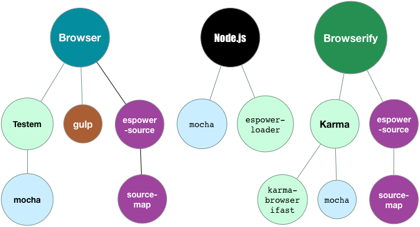

title: power-assertの記事が出来るまで
theme: azu/cleaver-ribbon
author:
  name: azu
  twitter: azu_re
  url: http://efcl.info/
output: power-assert.html
--

# power-assertの記事ができるまで

* [power-assertの使い方 Node.js編 | Web scratch](http://efcl.info/2014/0406/res3809/ "power-assertの使い方 Node.js編 | Web scratch")
* [power-assertでJavaScriptのテストをする ブラウザ編 | Web scratch](http://efcl.info/2014/0411/res3820/ "power-assertでJavaScriptのテストをする ブラウザ編 | Web scratch")
* この記事を書くまでに至る話

--

# power-assert情報量不足

- power-assertの記事だれかが書くと思ってた
- 誰も書いてくれない
- => 自分で書くことにした

--

# 事前の経験値

- node.jsでしか利用した事ない
	- [intelli-espower-loader](https://github.com/azu/intelli-espower-loader "intelli-espower-loader")が便利
- ブラウザでのテストに利用したこと無かった

--

# ピースを出す

- 記事を書くのに必要な技術の要素を考える

<iframe src="frame/tag.html" width="100%" height=350></iframe>

--

# 経験と記憶

- たぶん恐らくなんとかできるはず…

<iframe src="frame/tag_ex.html" width="100%" height=350></iframe>

--

# ピースはどこから

- 記憶から
- キーワードベースの記憶
    - 誰かが書いてた
    - リリースノートで見た
    - そういうライブラリがある
    - そういうツールがある
- 全てを自分の経験から得るのは難しい
- 他人の経験から得る

--

# ピースを仮で組み立てる

- とりあえず脳内情報で記事を書く
    - https://gist.github.com/azu/c837cb79a848d3d73c04
- Node.js => できた
- ブラウザ => 一応動いた
- browserify => 一応動いた

--

# ピースが足りない(ブラウザ)

- ブラウザ
	- => SourceMapが無いのでデバッガーが使えない
- browserify
	- => 誤算 : [soucemap自動でやってくれなかった](https://twitter.com/azu_re/status/451176979245461504 "Twitter / azu_re: @t_wada すいません、やっぱりやる必要があるみたいです ...")
- SourceMapが足りない！！

--

# 足りないピースを作ろう

- まずは[espowerify](https://github.com/twada/espowerify "espowerify") (browserify)でsourcemapサポートさせる
	- コネコネしたら[source-map support](https://github.com/twada/espowerify/pull/1 "source-map support")できた
- テストないコード => [@t_wada](https://twitter.com/t_wada "Takuto Wada (t_wada) on Twitter") => テストあるコード
- sourcemapにより人類にデバッガーがやってきた

--

--

# ブラウザもできる事が確定

- sourcemapサポートしていけばブラウザもデバッグ対応できる
- Node.js版は既にできてる
	- あまりにも長くなりそうなので、分割して先に記事にする
    - [power-assertの使い方 Node.js編 | Web scratch](http://efcl.info/2014/0406/res3809/ "power-assertの使い方 Node.js編 | Web scratch")
- ブラウザを引き続き検証

--

# ピースが揃った

- ブラウザ, browserifyでsourcemap対応
	- [espower-source](https://github.com/twada/espower-source "espower-source")
- どの環境でもデバッグ実行ができるようになる

--

# ピースを再構築する

--

# サンプルを作る

- testem
    - [azu/power-assert-testem-seed](https://github.com/azu/power-assert-testem-seed "azu/power-assert-testem-seed")
- karma
    - [azu/power-assert-karma-seed](https://github.com/azu/power-assert-karma-seed "azu/power-assert-karma-seed")

--

# karma-browserifastの問題がでてくる

- [karma-browserifast](https://github.com/cjohansen/karma-browserifast "karma-browserifast")
- [fix for windows paths](https://github.com/cjohansen/karma-browserifast/pull/13#commitcomment-5952504 "fix for windows paths")
    - => Macで壊れる
- [fix for unix paths](https://github.com/cjohansen/karma-browserifast/pull/14 "fix for unix paths")
    - => 直した

--

# ブラウザ編の記事を書く

- 書いてる途中でpower-assert [0.6.0](https://github.com/twada/power-assert/releases/tag/v0.6.0 "0.6.0") がでる
- browserifyのsourcemapが壊れた
    - => [1時間で直った](https://github.com/twada/espowerify/pull/3 "source-map in browserify transform chain. by twada · Pull Request #3 · twada/espowerify")
- [power-assertでJavaScriptのテストをする ブラウザ編](http://efcl.info/2014/0411/res3820/ "power-assertでJavaScriptのテストをする ブラウザ編 | Web scratch") リリース

--

# その他

- karma-browserifastにスタックトレースのsourcemapサポートをPR
    - [Add source map support for Karma&#39;s reporter by azu · Pull Request #15 · cjohansen/karma-browserifast](https://github.com/cjohansen/karma-browserifast/pull/15 "Add source map support for Karma&#39;s reporter by azu · Pull Request #15 · cjohansen/karma-browserifast")

--

# おわりに

* お疲れ様でしたー @[twada](https://github.com/twada "twada")