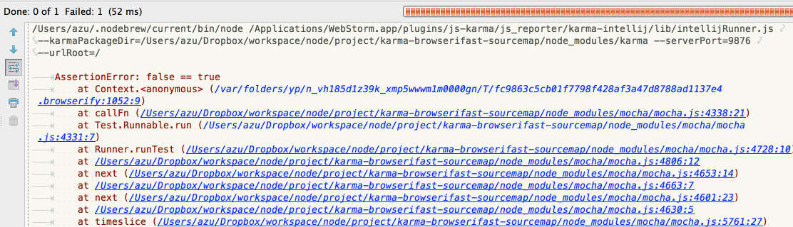
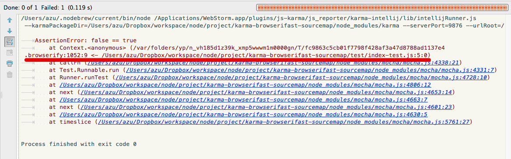

title: Test Runner Tips
author:
  name: azu
  twitter: azu_re
  url: http://efcl.info/
theme: azu/cleaver-ribbon
output: index.html
--

# JavaScript Test Runner Tips

* JavaScript Test RunnerのTips
* Mocha
* Testem
* Karma

--

# [JavaScript Unit Test Why? What? How?](http://www.slideshare.net/teppeis/javascript-testwhywhathow "JavaScript Unit Test Why? What? How?")


--

# [Mocha](http://visionmedia.github.io/mocha/ "Mocha")

* 実質的な覇者
* Test Runnerやツールのサポートが多い
* テストの枠だけ提供
* アサーションとかは自由に組み合わせる
	* chai, should, expect ,power-assert

--

## mocha.opts

* mochaのオプション(引数)を設定ファイルとして書ける
* 何故か`./test/mocha.opts`固定…

--

## mocha.opts ユースケース

* ブラウザとNode.jsで同じテストを使いたい
* `mocha.opts` で `global.` に値をいれてしまう

e.g.) [promises-book/test/mocha.opts](https://github.com/azu/promises-book/blob/master/test/mocha.opts "promises-book/test/mocha.opts at master · azu/promises-book")

``` javascript
global.XMLHttpRequest = require('w3c-xmlhttprequest').XMLHttpRequest;
global.Promise = require("ypromise");
```

グローバル拡張をして、ブラウザとNode.jsで同じコードを使える

--

## mocha hack

* mochaは色々なツールで使われる
* 内部で使ってるのにmochaに引数を渡せないツールもある
	* [defunctzombie/zuul](https://github.com/defunctzombie/zuul "defunctzombie/zuul")
* デフォルトで`--check-leaks`にされると拡張ができない
* => グローバルオブジェクトの`mocha`から潰せる

``` javascript
if (global.mocha) {
    global.mocha.checkLeaks = false;
}
```

--

# [testem](https://github.com/airportyh/testem "testem")

* 作りは素朴
* でも柔軟性ある
* テストが走る場所は特殊な事してないHTML
* テスト画面がかっこいい


--

# test bed

* テストを動かす場所を簡単にカスタム出来る
* [testemで任意のHTMLでテストを動かす方法とJavaScriptデバッガ連携 | Web scratch](http://efcl.info/2013/0405/res3256/ "testemで任意のHTMLでテストを動かす方法とJavaScriptデバッガ連携 | Web scratch")
	* => サポートされてないものもサポートしやすい
* デバッグツールもウェブサイトで使ってるものが大体通用する

--

# setup/teardown

* `"before_tests"`　、 `"after_tests"`
	* テストの実行に対するsetup/teardownがある
	* プロプロセッサ等の変換等も対応しやすい
* `on_exit"` でゴミ掃除もできる

--

# testem

* 真っ当
* Node.jsのテストも一緒に動かせる
* サンプルがドキュメントになってる
* [testem2](https://github.com/airportyh/testem2 "testem2")?

--

# [Karma](http://karma-runner.github.io/ "Karma - Spectacular Test Runner for Javascript")

* Angular.JS(本体)で[js-test-driver](http://code.google.com/p/js-test-driver/ "js-test-driver")使いたくない
	* => [Karma](http://karma-runner.github.io/ "Karma - Spectacular Test Runner for Javascript")誕生(testacular)
* 癖がある、大きくて早い
* オプションがとても多い
* Googleプロダクト依存の払拭ができてない

--

## プリプロセッサ

* [Karma - Preprocessors](http://karma-runner.github.io/0.12/config/preprocessors.html "Karma - Preprocessors")
* テストを実行前に処理する拡張機能
* altjsの変換をしたりできる
	* 当たり前だけどsourcemap対応してる

--

## sourcemapスタックトレース

* 通常のsourcemapはエラー時のスタックトレースまでは変わらない
* Karmaはsourcemapを使ったスタックトレースの書き換えをサポートしてる
* 変換するときのファイルに`file.sourceMap`というものを追加してあげればいい

--



=> スタックトレースサポート版



--

## 類似

* [evanw/node-source-map-support](https://github.com/evanw/node-source-map-support/ "evanw/node-source-map-support")
	* [Node.js＋CoffeeScript でソースマップを使ってデバッグを楽にする方法 - てっく煮ブログ](http://tech.nitoyon.com/ja/blog/2013/02/19/node-source-map/ "Node.js＋CoffeeScript でソースマップを使ってデバッグを楽にする方法 - てっく煮ブログ")
* V8のスタックトレース拡張を利用
* エラーを取得して無理やりスタックトレースを書き換える

--

## Future of Karma

* [The Nearest Future of Karma - Google ドライブ](https://docs.google.com/document/d/1XMg9CYTsu8NIGBFyXtQS8q0KaWdvldhjLsIcEBOitjo/edit#heading=h.qn3po2dator2 "The Nearest Future of Karma - Google ドライブ")
* よりオープンな開発へ
* より安定したテストフレームワークへ
	* セマンティクスなバージョン(semver)
	* PluginのためのAPIを固定する
* よりよい[E2E test](https://github.com/angular/protractor "E2E test")

--

# Next

> [Next Slide](./power-assert.html)