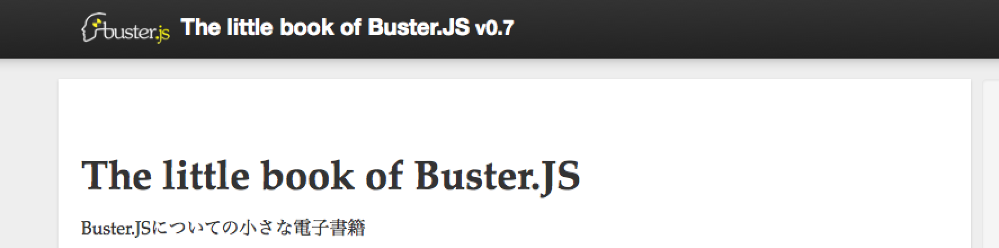
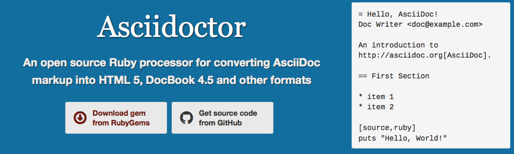

title: Githubで書く電子書籍
author:
  name: azu
  twitter: azu_re  
  url: http://efcl.info/
theme: /Users/azu/Dropbox/workspace/slide/cleaver-clear-theme
output: index.html
--

# Githubで書く電子書籍
## JavaScript Promiseの本でのワークフロー

-- azu fit

# 自己紹介

-- promises-book fit

# JavaScript Promiseの本を書いた

-- 

# アジェンダ

- [JavaScript Promiseの本](http://azu.github.io/promises-book/ "JavaScript Promiseの本") がどう書かれたのか
- 電子書籍のフォーマット
- Githubワークフロー
- Travis CI
    - ビルド
    - テスト
    - デプロイ
- CONTRIBUTION

--

# 電子書籍のフォーマット

- Markdown
- [AsciiDoc](http://www.methods.co.nz/asciidoc/ "AsciiDoc")
- [Sphinx](http://sphinx-users.jp/ "Sphinx")(reStructuredText)
- [Re:VIEW](https://github.com/kmuto/review "Re:VIEW")

-- 

# Markdown

- 外部ファイル読み込み機能が足りない
	- サンプルコードはjsファイルとして分離したい
- pandoc ASTでMarkdown拡張書いた
    - http://efcl.info/2014/0301/res3692/
- PDFとかキレイに作るのが面倒
- お手軽だが細かい事はいまいち
- => 今なら [Leanpub](https://leanpub.com/ "Leanpub: Publish Early, Publish Often") や [GitBook](https://www.gitbook.io/ "GitBook") や [Arturo.io](https://arturo.io/ "Arturo.io - A smarter way to publish") がある
- 適当に始めるならMarkdownを選ぶのが間違いない

--

# Sphinx(reST)

* 構文が重い
* 色々揃ってる
* [Read the Docs](https://readthedocs.org/ "Read the Docs") が Good
* [前回やった](http://the-little-book-of-busterjs.readthedocs.org/en/latest/ "The little book of Buster.JS — The little book of Buster.JS 0.7 documentation")ので別の方法にしたい

--

# Asciidoc

- Oreilly Mediaが使ってるという実績
	- 安定したPDFの出力等がある
- 基本はMarkdownと似てる
	- [Markdown Compatibility](http://asciidoctor.org/docs/asciidoc-syntax-quick-reference/#markdown-compatibility "Markdown Compatibility") を設定するさらにそっくり
- 無駄に多機能(構文ではなく属性が多い)
- 構文自体はそこまでSphinxよりは複雑じゃない
- [Farata/EnterpriseWebBook](https://github.com/Farata/EnterpriseWebBook "Farata/EnterpriseWebBook")という前例

--

# [Asciidoctor](http://asciidoctor.org/ "Asciidoctor")

- AsciidocのRuby実装
- モダンな感じ - アイコンフォントがビルドインで使える
- デフォルトの出力でも十分キレイ
- => **採用**

-- github-flow fit

# Githubワークフロー

--

# Pull Request駆動

* `Master` から `Branch` を切る
* `Branch` を `Pull Request` する
* `Pull Request`を`Master`にマージする
* `Master` から `gh-pages` に自動的にデプロイする

--

# Github Issueの活用

- Github Issueをメモ代わりにする
	- Issue References便利 `ref. #1`
- 自分自身にPull Request駆動 `feature/id/1`
    - セクションを書く時等大きいコミットはPR駆動
- 小さいチケットはPRしないで、コミットメッセージでIssueを閉じる `#fixes 1`
- 詳しくは [一人で使えるGithub Issue](https://azu.github.io/slide/udonjs/github-issue.html "一人で使えるGithub Issue")

--

# コミットメッセージ

* 日本人しか読まないので日本語で書いた
* AngularJSの[コミットメッセージルール](https://docs.google.com/document/d/1QrDFcIiPjSLDn3EL15IJygNPiHORgU1_OOAqWjiDU5Y/edit# "Git Commit Message Conventions - Google ドキュメント")を採用
    * **自分以外には強要しない**
* [ajoslin/conventional-changelog](https://github.com/ajoslin/conventional-changelog/ "ajoslin/conventional-changelog")を使ってCHANGELOGの自動生成できる
    * [azu/release-changelog](https://github.com/azu/release-changelog "azu/release-changelog") でgit tagも自動化

-- 

# [Git Commit Message Conventions](https://docs.google.com/document/d/1QrDFcIiPjSLDn3EL15IJygNPiHORgU1_OOAqWjiDU5Y/edit# "Git Commit Message Conventions - Google ドキュメント")

* **feat**: A new feature
* **fix**: A bug fix
* **docs**: Documentation only changes
* **style**: Changes that do not affect the meaning of the code (white-space, formatting, missing
  semi-colons, etc)
* **refactor**: A code change that neither fixes a bug or adds a feature
* **test**: Adding missing tests
* **chore**: Changes to the build process or auxiliary tools and libraries such as documentation
  generation
-- github-issue fit

# issue 171

pull-requestを含む

-- pull-request fit

# pull-request 80

-- core-time fit

--

# Travis CIの活用

- ビルド
- テスト - Pull Request駆動でやる意味の一つ
- デプロイ(masterへのコミットが対象)

--

# ビルド

- AsciidoctorでHTMLを生成
- Asciidoc -> docbook -> pdfの生成
- ビルド時にWARNINGがでたらTravis CIはFAIL
	- ビルドテストも兼ねてる

--

# テスト

- サンプルコードをテスト
- 出力したHTMLの内部リンクのテスト
	- `<a href="#id">` がある時 `<a name="id">` が存在するかをチェックする
- Asciidocのインラインコードをパーステスト
	- asciidoc中に書かれたコードを抽出
	- EsprimaでJavaScriptとしてパースできるかをテストする
- 詳細 => [JavaScript Promiseの本 付録](https://gumroad.com/l/javascript-promise "JavaScript Promiseの本 付録")

--

# デプロイ

- テスト済みのコミットのみが対象
- ビルドしたものをTravis CIからgithub-pagesにデプロイ
	- ref. [Middleman で作った web サイトを Travis + GitHub pages でお手軽に運用する](http://tricknotes.hateblo.jp/entry/2013/06/17/020229 "Middleman で作った web サイトを Travis + GitHub pages でお手軽に運用する - tricknotesのぼうけんのしょ")
- Pull Requestに対してもHTMLを生成してプレビュー用URLの発行
	- Gitterに通知して確認できるように
- どのコミットに対してもプレビュー出来るURLを作れる
	- 見るだけならどこからでも見られるようにしたかった

--

# 文章のリファクタリング

## リファクタリングからが本番

- 文章表現の統一ルールは`CONTRIBUTE`ファイルに追加していく
- 一文が長くならないように気をつけて区切る
	- 60*2文字より多い場合はアウト
- typoは見つけたらその場でissueを立てる
	- HTML版があるのでモバイルからも見られる + Issueを作れる
	- 移動中にレビュー出来るようにする

-- ios-issue fit

# Issueをモバイル環境でも作る

* 移動中にtypoを発見して修正のIssueを立てやすくする
* 後でまとめてIssueを処理する

-- visual-gif fit

# 依存関係の可視化

- [azu/visualize-promises-book](https://github.com/azu/visualize-promises-book "azu/visualize-promises-book")
- 文章を文字だけだけで確認するのは疲れる
- 視覚的に全体像をざっと把握したい
- 何か色々な方向から見て確認したかった
- 客観的に見る必要がある

--

# Pull Requestしやすい空気

- 皆が慣れてるフォーマットで書く
	- Markdownがベスト
- Asciidocで書いたけど、意外とPull Requestしてもらえた
- [CONTRIBUTE.md](https://github.com/azu/promises-book/blob/master/CONTRIBUTE.md "CONTRIBUTE.md")をちゃんと作る
 - Issueを作る画面にリンクが表示される
 - [Contributing Guidelines](https://github.com/blog/1184-contributing-guidelines "Contributing Guidelines")
- 成果物(HTML)をmasterに混ぜない
- 1文字Pull Request取り込む作業楽しい!

-- 

# まとめ

* [JavaScript Promiseの本](http://azu.github.io/promises-book/ "JavaScript Promiseの本") ではAsciidocを使った
    * [Asciidoctor](http://asciidoctor.org/ "Asciidoctor")が良くできてた
* 人間はやることスグ忘れるのでGithub Issueにメモろう
    * 公開情報になるので周りが口出しやすい
* 自動化できるところは自動化してTravis CI等で回す
* 文章のリファクタリングは大変なので、周りが協力しやすい形にしよう
    * ATOK買った方がいいと思いました
    * typoのIssueが半分以上です