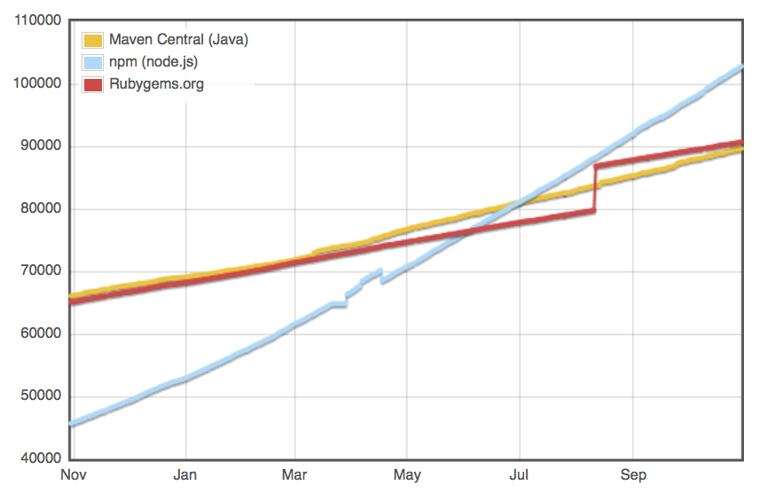
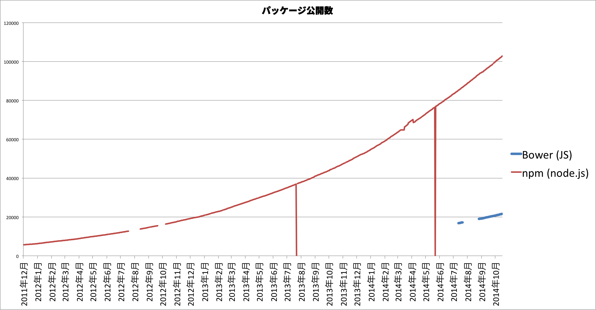
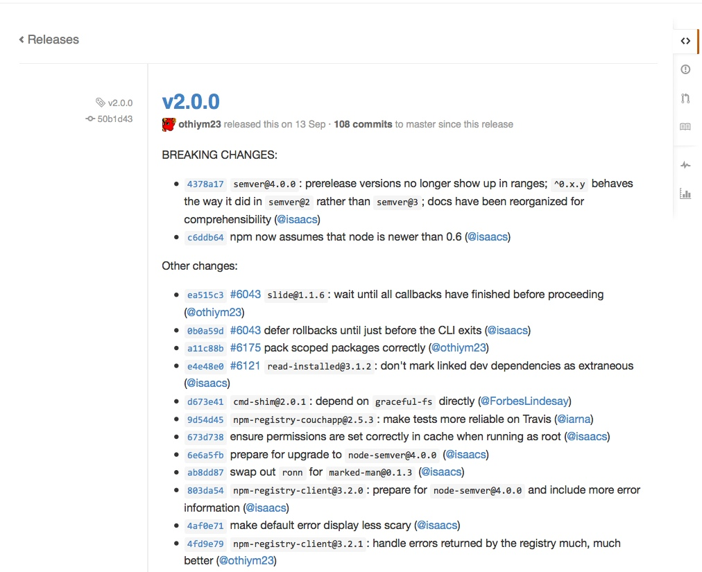
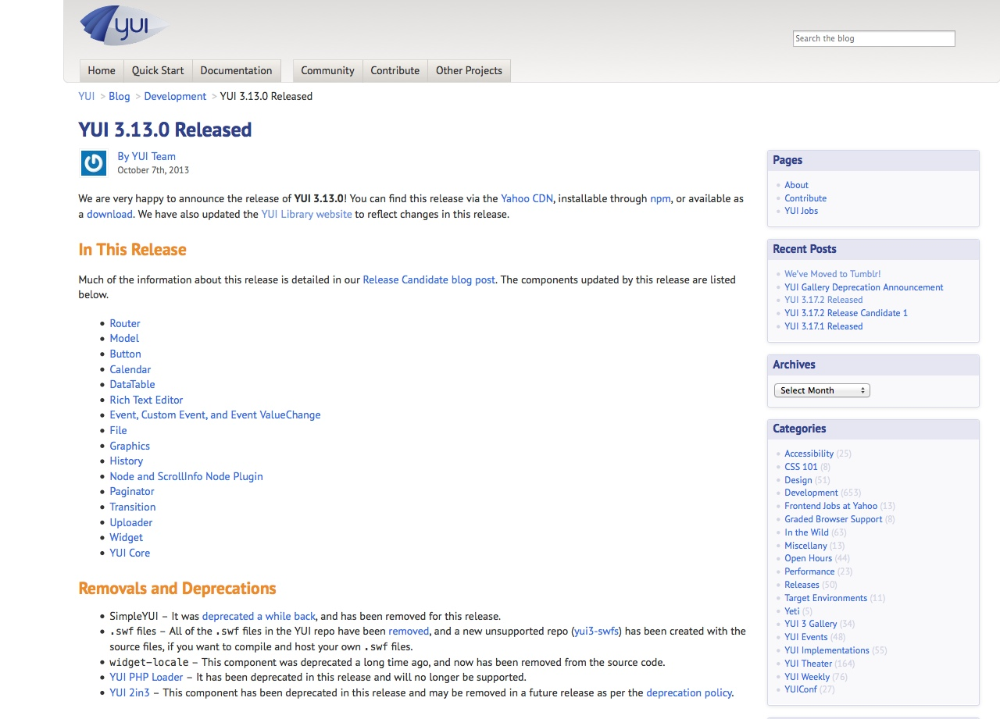
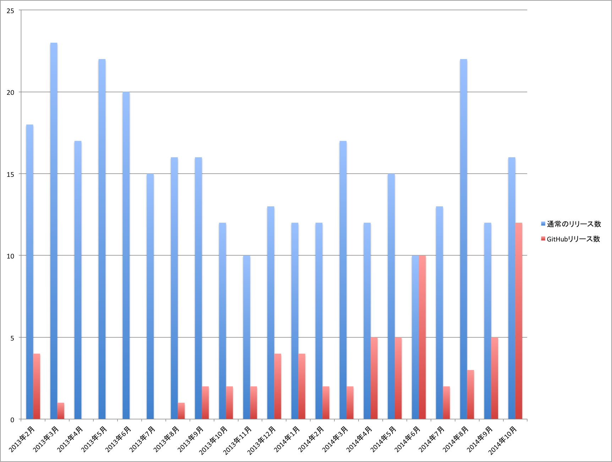
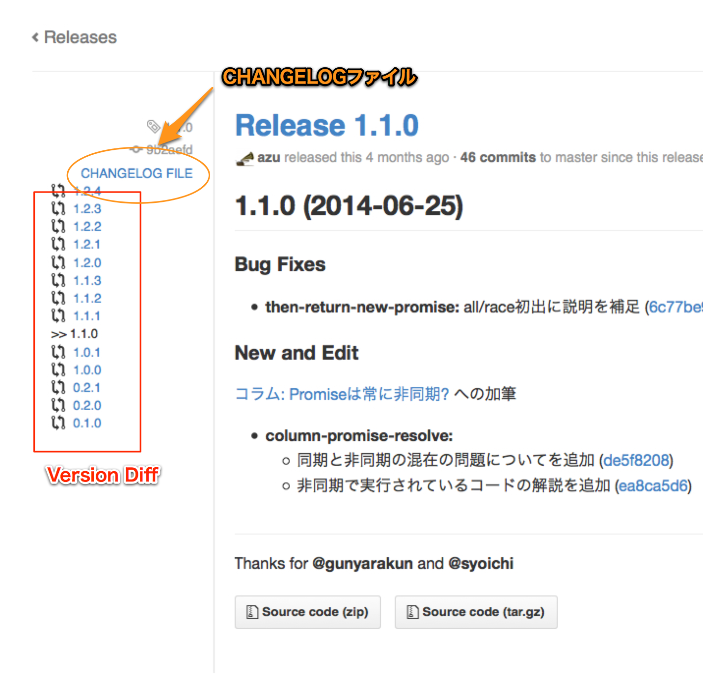
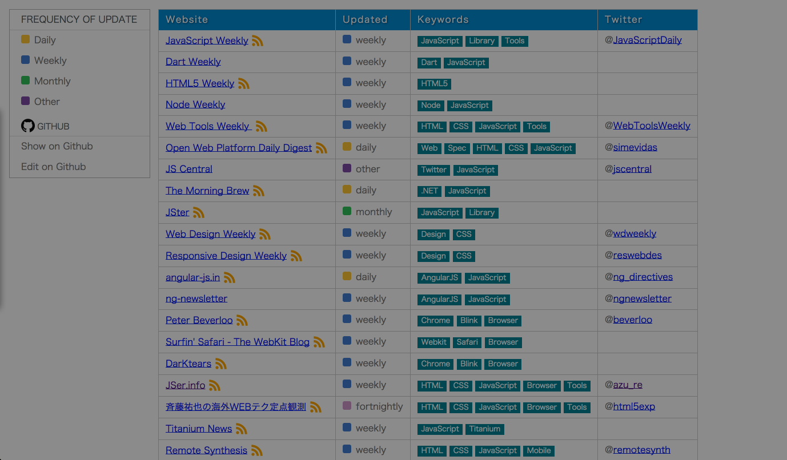
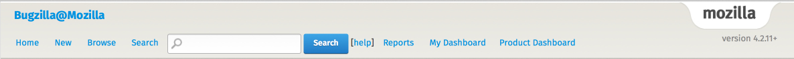
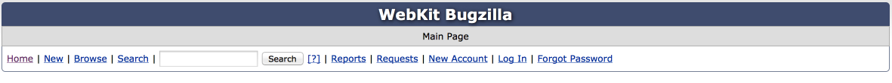

# 世界のJavaScriptを読もう @ 2014

^目的: ウェブの世界は絶対変化するもの
変化する前提の行動が求める
それをどうやって見ていくか、それを知ってどうするか

^ JavaScriptやブラウザ周りのリリースの状況はウェブの変化にあわせるように変化してきている。
どのように変化してきたか知り、どうやって変化を見ていくのか、そしてわたしたちはどう変化していくのかを考えよう。

----

# アジェンダ

1. ブラウザやJavaScriptのリリースは変化してきている
2. 私たちはどのように変化を知り見ていくのか
3. そして私たちはどのように変化していくのか

----

# [fit] 世界のJavaScriptを見る話

### [fit] JSer.info 開始 2011年〜

^ JSer.infoを始めた2011年を一つの基準として考えて、
そこからブラウザやJavaScript等にどういう変化があったのかを振り替えつつ、"今"どういう変化が起きてるのかを見て行きたいと思います。

----
# [fit] Browser

----

# [fit] Browser Version @ 2011

### JSer.info が開始した2011年ごろのブラウザバージョン

---

# [fit] ![inline][ie] Internet Explorer 9

# [fit] ![inline][firefox] Mozilla Firefox 4

# [fit] ![inline][chrome] Google Chrome 8 

---
# [fit] ![inline][ie] Internet Explorer 9

- 正常になってくるIE9がリリースされたころ
- [IE9 RTW Due Date, A Big Thank You, MIX11, and a Unicorn Named Frank | Charles | Channel 9](http://channel9.msdn.com/Blogs/Charles/IE9-RTW-Due-Date-A-Big-Thank-You-MIX11-and-a-Unicorn-Named-Frank "IE9 RTW Due Date, A Big Thank You, MIX11, and a Unicorn Named Frank | Charles | Channel 9")
- 日本だけ東北地方太平洋沖地震の影響で延期

----

# [fit] ![inline][firefox] Mozilla Firefox 4

## Rapid Releaseが始まる直前

----

# [fit] ![inline][chrome] Google Chrome 8

## いつものChromeです

----

# [fit] Browser Version @ 2014

### 2014-11-01 現在のブラウザ

---

# [fit] ![inline][ie] Internet Explorer 12

# [fit] ![inline][firefox] Mozilla Firefox 33

# [fit] ![inline][chrome] Google Chrome 38

----

# [fit] ![inline][ie] Internet Explorer 9 -> 12

# [fit] ![inline][firefox] Mozilla Firefox 4 -> 33

# [fit] ![inline][chrome] Google Chrome 8 -> 38

----

# Internet Explorerの開発方針も変わってきた

- IEの[Developerバージョン](http://devchannel.modern.ie/ "IE Technical Preview")が先行公開
- 今後開発予定の公開
	-  [status.modern.IE](https://status.modern.ie/ "Internet Explorer Web Platform Status and Roadmap - status.modern.IE") [![][github]](https://github.com/internetexplorer/status.ie "InternetExplorer/Status.IE")
- [UserVoice](https://wpdev.uservoice.com/forums/257854-internet-explorer-platform)での開発優先度の意見募集
- IEのサポートバージョンをOSで使える最新版だけに

^ [Stay up-to-date with Internet Explorer - IEBlog - Site Home - MSDN Blogs](http://blogs.msdn.com/b/ie/archive/2014/08/07/stay-up-to-date-with-internet-explorer.aspx "Stay up-to-date with Internet Explorer - IEBlog - Site Home - MSDN Blogs")

---

# [fit] ヘッドレスブラウザの登場

---
# [PhantomJS](http://phantomjs.org/ "PhantomJS")

-  [WebkitベースのJavaScriptコマンドラインツール「PhantomJS」 - JSer.info](http://jser.info/post/2888913234/ "WebkitベースのJavaScriptコマンドラインツール「PhantomJS」 - JSer.info") (2011)
- [SlimerJS](http://slimerjs.org/index.html "SlimerJS") (2013)
	- Firefox(Gecko)のヘッドレスブラウザ
- [sdesalas/trifleJS](https://github.com/sdesalas/trifleJS "sdesalas/trifleJS") (2013)
	- IEのヘッドレスブラウザ

----
# ヘッドレスブラウザ

- PhantomJSが先行し広く普及した
- PhantomJSのAPIがデファクトとなった
	- [CasperJS](http://casperjs.org/ "CasperJS, a navigation scripting and testing utility for PhantomJS and SlimerJS")
	- [Nightmare](http://www.nightmarejs.org/ "Nightmare")

----

# ブラウザリリースのまとめ

- IE、Firefox、Chrome等のリリース周りは変化してきた
- FirefoxとChromeはRapid Releaseへ
- IEもIEらしさは残しつつ変化に対応しようとしてる
- ヘッドレスブラウザなどツールとしてのブラウザがでてきた

----

# [fit] そもそも何故リリース速度が上がったの?

-----

# [高速リリースサイクルに関するよくある質問 | 次世代ブラウザ Firefox](http://www.mozilla.jp/firefox/preview/faq/ "高速リリースサイクルに関するよくある質問 | 次世代ブラウザ Firefox")

> Web ブラウザは、他のアプリケーションと異なり、Web という「生き物」を相手にしています。HTML5 や CSS3 など新たな標準技術が次々に考案され、ソーシャルメディアなどのトレンドも目まぐるしく変わっています。Web の進化するスピードが速くなっているので、これまでのように半年から 1 年周期のアップデートでは間に合わなくなっているのです。

----

# ウェブの変化の早さ

- ウェブの変化に対応するためにブラウザのリリース速度は上がった
- ライブラリも変化/トレンドに対応するためリリース速度は上がってる

----

# ライブラリのリリースの変化?

^ 開発者の皆さんに近い所としてライブラリのリリース周りを見て行きたいと思います。

-----

# npmで公開されてるパッケージ

- 公開されてるパッケージ数は増加傾向
- gemやMavenよりも多い by [Modulecounts](http://www.modulecounts.com/ "Modulecounts")

^ 更新数についてはデータがないので不明だが、体感的には更新数自体も増えている

-----

-----

# リリース回数がとにかく増えた！

- 原因は色々考えられる
- ブラウザが変化したようにトレンドに対応するため
	- 新しいライブラリが色々出てくる
- もう一つの要因 =>  [Semantic Versioning](http://semver.org/ "Semantic Versioning 2.0.0")！

-----

# [Semantic Versioning](http://semver.org/ "Semantic Versioning 2.0.0")(semver)の採用

- 1 commit = 1 patch release をするライブラリが増えた
- バージョンをあげることへの抵抗感が薄くなった
- => 結果としてリリース回数が増える
- => リリースノートの自動化が進んだ

^ JavaScriptのライブラリの多くは今セマンティクスバージョニングにてリリースしていってる。
リリースノートについては後ほど詳しくやります。

----

# ライブラリとsemver

- npmではバージョンは[semver](https://github.com/npm/node-semver "semver")として解釈する 
- npmのエコシステムに載るにはsemverである方が自然
- npmやbowerで公開するにはバージョンをあげる必要がある
- => 結果としてリリース回数が増える

^ semverもあるし、そもそもバージョンをあげないとnpmやbowerなどのものは更新できないのでリリース回数が自然と増える。
1コミットで1パッチリリースする人も多いので、この辺まで来るとリリースノートは手動で書くのには無理がある。
そのためコミットベースの自動生成が増えてきたと考える。

----

# Node.js 本体は?

-----

# Node.js 本体

- Node.js本体のリリースが停滞してることが問題視されてきた
- 一定期間でリリースされないので停滞しやすい
- それを解決しようと[Node Forward](http://nodeforward.org/ "Node Forward")がでてきた
- これに対応しようと[Node.js Advisory Board](https://www.joyent.com/blog/node-js-advisory-board "Node.js Advisory Board")が設置された
- **リリース**を変えようとすると**コミュニティ**も変わってくる

^ [Node.jsのコミュニティに変化を与えるnode-forwardについて - from scratch](http://yosuke-furukawa.hatenablog.com/entry/2014/10/23/101831 "Node.jsのコミュニティに変化を与えるnode-forwardについて - from scratch")

^ 詳しくはNode.js 日本ユーザグループ代表の@yousuke_furukawaさんに聞きましょう！

----

# ECMAScript は?

-----

# ECMAScriptの進捗

- JavaScriptの元となる標準仕様
- [ES Discuss](https://esdiscuss.org/ "ES Discuss")で議論される
- [tc39/tc39-notes](https://github.com/tc39/tc39-notes "tc39/tc39-notes")に定期MTGのNoteが公開される
- ES6の機能策定はほぼ完了
- ES7の機能提案の段階

-----

# ECMAScript 7

## feature-model releaseへ

-----

# ECMAScript 7

- ES6とES7の策定は同時に進行している
- ES7は**機能毎**の仕様策定を中心に進めている
	- feature-model release
- 理由としてはもっとリリース速度をあげるため

-- [明日には使えなくなるES7トーク](http://azu.github.io/slide/es6talks/ "明日には使えなくなるES7トーク")

^ ES7は機能レベルの仕様それぞれに策定のstageを設けていて、それが一定の段階になったらES7として取り込むようになっている。
このような事をする理由の一つがリリース速度の改善！

-----

# リリース傾向の変化まとめ

- 変化はブラウザだけではなく言語まできてる :boom:
- 言語もブラウザもライブラリもリリースが変わってきた
- GitHubがかなり活用されている

^ ブラウザはRapid Releaseを取り入れリリース速度が上がった。
GitHubでのリリースの増加。
ECMAScriptの策定も機能毎に進めリリース速度をあげようとしている。JavaScriptの実装はブラウザが中心なので、やはり変化の中心はブラウザだと考えられる。

----

# :watch: WATCH

## どのように変化を知り見ていくのか

^ では私達はどのようにその変化を見ていくのか?
変化の中心であるGitHubとブラウザを中心に見ていこう。

----

# :memo: リリースノートの変化

----

# [fit] ブログとリリースノート

^ 今も多くあるが、ブログでのリリースノートを書くスタイルが中心だった。
しかし、今はある程度の規模のライブラリでないとブログにリリースノートを書く人は少なくなってきた。

----

# [fit] GitHubとリリースノート

^ 最近ではGitHubにリリースノートを書くだけのケースが増えてきた
あるいは、CHANGELOGを自動生成したもの(またはそれを両立したもの)

----

# リリースノートの場所

## ブログとGitHubどっちが多い?

----

^ JSer.infoで紹介したリリースノートからの抜粋
GitHub上のReleseまたはCHANGELOGを紹介したものと
それ以外の数を並べたもの。

^ JSer.infoで紹介するものはある程度規模のあるものが中心なので、
ブログスタイルもそこまで減っているという訳ではない。

----

# リリースノートの場所(JSer.info調べ)

- JSer.infoで紹介したもの(ある程度著名なものが中心)
- ブログでのリリースノート自体はそこまで減ってない
- GitHubでのリリースノートは増えている
	- `CHANGELOG`ファイルを作成するケース
	- GitHub Releaseに書くケース

----

# 最近のリリースノートの変化

- 小さいものほどGitHubのみにしかリリースノートを書かない
- ライブラリはsemverを採用しリリース回数自体が増加
- コミットからのリリースノートを自動生成
	- [Git tagとGitHub ReleasesとCHANGELOG.mdの自動化](http://efcl.info/2014/07/20/git-tag-to-release-github/ "Git tagとGitHub ReleasesとCHANGELOG.mdの自動化について | Web Scratch")

^ 小さいライブラリはtagを貼るだけのケースが多い。
また、そのときにコミット一覧をリリースノートに貼り付ける方式のリリースノートの自動化が多くなった。

-----

# リリースノートを見ていく方法も変化する

- リリース方法が変化するので、見る方も変化する
- まずリリースに気づけない問題が発生する
	- お世辞にもGitHubは追いやすい形式になってない
- 変更履歴のコミット直接見る必要が出てくる
- 対策を[GitHubでライブラリのリリースを見ていくためのツールや方法](http://efcl.info/2014/07/30/find-github-release/ "GitHubでライブラリのリリースを見ていくためのツールや方法 | Web Scratch") に書いた

^ リリースノートの書き方が変わってくると、それを読む側の意識も変わってこないと、そのライブラリの何が変わったのかわからなくなるケースが多い。
まだ仕組みが未成熟であるため、もっと改善していくとエコシステムが良くなると思う。

----

# GitHubのタイムラインを読む

- リポジトリのWatchする
	- [azu/github-reader](https://github.com/azu/github-reader "azu/github-reader")
- タイムラインを見る
	- [azu/github-reader](https://github.com/azu/github-reader "azu/github-reader")
* 他の人がStarしたものを見る :star: 
	* [starseeker](http://starseeker.so/ "starseeker")

^ [GitHubでライブラリのリリースを見ていくためのツールや方法](http://efcl.info/2014/07/30/find-github-release/ "GitHubでライブラリのリリースを見ていくためのツールや方法 | Web Scratch") の内容から

----

# リリースノートを見る

- GitHub ReleaseをRSS購読(Feedly)
	- [azu/github-releases-to-feedly](https://github.com/azu/github-releases-to-feedly "azu/github-releases-to-feedly")
* Feedlyをバックエンドに使う -> any
	* [IFTTT](https://ifttt.com/myrecipes/personal "My Recipes - IFTTT")
* GitHub Release -> CHANGELOG
	* [azu/check_changelog_from_release](https://github.com/azu/check_changelog_from_release "azu/check_changelog_from_release")
* GitHub Release -> Version Diff
	*  [azu/show-diff-from-release](https://github.com/azu/show-diff-from-release "azu/show-diff-from-release")

----

# リリースノートまとめ

- リリースノートの出し方も変化してる
- ブログ以外にもGitHubが増えてきた
- リリースはしやすくなったが、リリースはまだ見やすくない
- リリースノートの仕組みが未成熟
- リリースを見る側も工夫が必要になる

^GitHubにtagをつけてpushするだけというスタイルになったため、リリース速度は上がっている。
しかし、必然的にリリース回数があがりリリースノートが軽視されてる傾向がある。
もっとリリースノートを書こう。そのためにはリリースノートを書きやすい仕組みが必要だと考えてる。

----

# [fit] 話はブラウザに戻って

-----

# 現在のウェブの変化の中心はブラウザ！

- ブラウザの変化を知ることができれば他の変化が見えるかも
- ブラウザはベンダーがいるので公式の情報がある
	- ライブラリ等に比べれば安定した情報 :green_heart:
- ブラウザごとにその安定した情報を見ていこう！

^ 安定した情報がある

-----

![IE, inline][ie]  ![firefox,inline][firefox]  ![chrome,inline][chrome]  ![opera,inline][opera] ![inline][webkit]

# [fit] Browser Watcher

-----

# ![inline][ie] Internet Explorer

- [IEBlog](http://blogs.msdn.com/b/ie/ "IEBlog - Site Home - MSDN Blogs") （[日本語版](http://blogs.msdn.com/b/ie_jp/ "(日本語版)")）
	- 公式ブログ
- [status.modern.IE](https://status.modern.ie/ "Internet Explorer Web Platform Status and Roadmap - status.modern.IE") [![][github]](https://github.com/internetexplorer/status.ie "InternetExplorer/Status.IE")
	- IEのロードマップや開発状態が機能別に公開されている
- [Hebikuzure's Tech Memo | 技術的覚書と情報](http://hebikuzure.wordpress.com/ "Hebikuzure&#39;s Tech Memo | 技術的覚書と情報") by [@hebikuzure](https://twitter.com/hebikuzure "hebikuzure ")
	- IEBlogの翻訳やWindowsやIEの細かい挙動について書かれてる

-----
# ![inline][ie]  [status.modern.IE](https://status.modern.ie/ "Internet Explorer Web Platform Status and Roadmap - status.modern.IE") [![][github]](https://github.com/internetexplorer/status.ie "InternetExplorer/Status.IE")

- `Not currently planned` : 今のところ予定なし
- `Under Consideration` : 実装を検討、調査中
- `In Development` : 開発中
- `Preview Release` : プレビューリリース版に実装済み
- `IExx+`: IEのバージョンxxから利用可能

-- [status.modern.IEの見方 | Web Scratch](http://efcl.info/2014/10/19/modern-ie/ "status.modern.IEの見方 | Web Scratch")

^ status.modern.IE を見ておけば、IEの開発状況が分かると言えるぐらい更新が活発なので見て損はない。

-----

# ![inline][firefox] Firefox

- [Firefox Nightly News](http://firefoxnightly.tumblr.com/ "Firefox Nightly News") [![inline][twitter]](https://twitter.com/firefoxnightly)
	- FirefoxのNightlyの機能について
- [FxSiteCompat - MozillaWiki](https://wiki.mozilla.org/FxSiteCompat "FxSiteCompat - MozillaWiki") [![inline][twitter]](https://twitter.com/FxSiteCompat)
	- Firefoxのリリース情報
- [Mozilla Hacks – the Web developer blog](https://hacks.mozilla.org/ "Mozilla Hacks – the Web developer blog") [![inline][twitter]](https://twitter.com/mozhacks)
	- Firefox中心に色々紹介 - [HTML5 Rocks](http://www.html5rocks.com/ "HTML5 Rocks - A resource for open web HTML5 developers")もそれに近い

----

# ![inline][firefox] Firefox

 [Mozilla Developer Street (modest)](https://dev.mozilla.jp/ "Mozilla Developer Street (modest)")
	- Mozilla Hacksの日本語訳やリリース情報が多い

^ その他詳しくはFirefox/Servoのコミッタである @saneyuki_s  さんに聞きましょう！

----

#  ![inline][firefox] [Planet Mozilla](http://planet.mozilla.org/ "Planet Mozilla")

![right fit, firefox][firefox]

[The Mozilla Blog](https://blog.mozilla.org/)
[Future Releases](https://blog.mozilla.org/futurereleases/)
[Mozilla Research](https://blog.mozilla.org/research/)
[Mozilla Security Blog](https://blog.mozilla.org/security/)
[Mozilla Privacy Blog](https://blog.mozilla.org/privacy/)
[Mozilla UX](https://blog.mozilla.org/ux/)
[Mozilla Cloud Services](https://blog.mozilla.org/services/)
[JavaScript](https://blog.mozilla.org/javascript/)

^ 公式ブログがそれぞれジャンルごとに存在する。
`Planet *` というのは一時期流行った感じの関連するRSSをまとめたものを配信するアグリゲートの事。
[Planet Feed Reader](http://www.planetplanet.org/ "Planet Feed Reader")

----

# ![inline][chrome] Google Chrome

- [HTML5 Rocks](http://www.html5rocks.com/ "HTML5 Rocks - A resource for open web HTML5 developers")
	- 大きめな新しい機能は大体ここで紹介される
- [Google Chrome Developers - Google+](https://plus.google.com/+GoogleChromeDevelopers/posts "Google Chrome Developers - Google+")
	- Google+にGoogleの人がいる
- [JS.next](http://js-next.hatenablog.com/ "JS.next")
	-  V8に実装された新しい機能について書かれてる

-----

# ![inline][chrome] [Planet Chrome](http://planet.chromium.org/ "Planet Chromium")

![right,fit chrome][chrome]

- [Google Chrome Blog](http://chrome.blogspot.jp/)
- [Chromium Blog](http://blog.chromium.org/)
- [Chrome Releases](http://googlechromereleases.blogspot.jp/)
- [developer.chrome.com](https://developer.chrome.com/home "Mobile DevTools: Remote Debugging for Android with Screencast - Google Chrome")
- [DevTools Tips](http://devtoolstips.com/ "DevTools Tips")

^ V8やBlinkといったJavaScriptについてだと、公式のブログはそこまで読みやすくない。
後述する[Dev.Opera](https://dev.opera.com/blog/ "Dev.Opera — Blog")も見ることを薦めている。

----
#![inline][chromium] [Chromium](http://www.chromium.org/ "The Chromium Projects")

> Chromium is an open-source browser.
-- http://www.chromium.org/

^ Google Chromeのオープンソース版というところ。
Chromeに入る機能の大体はここへコミットされる。(一部ChromeにあってChromiumないものもある。翻訳機能とか)
[V8](https://code.google.com/p/v8/ "V8") や[ Blink ](http://dev.chromium.org/blink " Blink ")なども含まれているプロジェクトの総称。

-----

#![inline][chromium] [Chromium](http://www.chromium.org/ "The Chromium Projects")

- [Chromium Dashboard](https://www.chromestatus.com/features "Chromium Dashboard")
	-  ![IE, inline][ie]  ![firefox,inline][firefox]  ![chrome,inline][chrome] Chromiumを中心にブラウザの実装ステータス
- [Highlights from recent Chromium, Blink, Skia and v8 commits](http://commits.peter.sh/ "Highlights from recent Chromium, Blink, Skia and v8 commits") [![inline][twitter]](https://twitter.com/beverloo)
	- Chromium等のコミットサマリ + [Chromium DevTools](https://feeds.peter.sh/chrome-devtools/ "Chromium DevTools") [![inline][twitter]](https://twitter.com/ChromeDevTools) 
- [blink-dev - Google グループ](https://groups.google.com/a/chromium.org/forum/#!forum/blink-dev "blink-dev - Google グループ")
	- **Intent to 〜** にBlinkに入る予定の機能が載る

^ Chromeを自力で追うとかんがえると何故かコミットやChromiumの開発者向けのところまで見ないといけない事がある。
Chromeは"リリース"という部分が分かりにくく感じる。

----

#  ![inline][opera] Opera

- [Dev.Opera](https://dev.opera.com/blog/ "Dev.Opera — Blog") [![inline][github]](https://github.com/operasoftware/devopera) [![inline][twitter]](https://twitter.com/odevrel)
	- 現在のOperaはChromiumベースになってる
	- [Chromium Blog](http://blog.chromium.org/ "Chromium Blog")より分かりやすい解説が載ってる
	- :heart: [@mathias](https://twitter.com/mathias "@mathias")
- [Opera Desktop Team's blog - Opera Software](http://blogs.opera.com/desktop/ "Opera Desktop Team&#39;s blog - Opera Software")
- [Upstreamed commits – Opera](https://operasoftware.github.io/upstreamtools/ "Upstreamed commits – Opera")

----

# ![inline][webkit] [WebKit](https://www.webkit.org/ "WebKit")

> WebKit is an open source web browser engine.
-- https://www.webkit.org/

^ SafariやiOS、[Qt WebKit](http://qt-project.org/doc/qt-5/qtwebkit-index.html "Qt WebKit")(PhantomJS)、[WebKitGTK+](http://webkitgtk.org/ "WebKitGTK+")等で使われるブラウザエンジンです。

^ 詳しくはWebKitコミッターでもある @Constellation  さんに聞きましょう！

----

# ![inline][webkit] [WebKit](https://www.webkit.org/ "WebKit")

- [Surfin' Safari - The WebKit Blog](https://www.webkit.org/blog/ "Surfin&#39; Safari - The WebKit Blog")
	- 公式のブログ - 内部実装の話が多い
- [News and Updates - Apple Developer](https://developer.apple.com/news/ "News and Updates - Apple Developer")
	- AppleのNews - まれにSafariについてがある
- [Planet Igalia](http://planet.igalia.com/ "Planet Igalia") [![inline][twitter]](https://twitter.com/igalia/)
	- [Igalia](http://www.igalia.com/ "Igalia")社はWebKitやChromiumに[コミット](http://www.igalia.com/webkit/)してるコンサル企業

^ WebKitはChromiumと同様に実装よりの話が中心となる。
WebKitを使ったメジャーなブラウザはSafariぐらいで、Safariはあんまりそういうリリース書かないのでコミットを追っている人を見ていくのが中心になりやすい。

----

# ![inline][webkit] Webkit Watch

- [trac.webkit.org](http://trac.webkit.org/ "ChangeSet – WebKit")
	- WebKitのリポジトリ
- [WebKit Changesets · uupaa/Spec.js Wiki](https://github.com/uupaa/Spec.js/wiki/WebKit-Changesets "WebKit Changesets · uupaa/Spec.js Wiki") by [@uupaa](https://twitter.com/uupaa "@uupaa")
	- iOSバージョン間のコミット差分がまとめられている
- [mobilexweb.com](http://www.mobilexweb.com/ "Mobile Web &amp; HTML5 for mobile devices analysis, news and source code") と [sencha.com/blog/](http://www.sencha.com/blog/ "Blog | Sencha")
	- iOSのアップデート時にWebKitのレポートを書いてる

----

# Other Vendor

- [Web Platform Team Blog](http://blogs.adobe.com/webplatform/ "Web Platform Team Blog")
	- Adobeのブログ - 主に[CSS周り](http://webplatform.adobe.com/ "Adobe Web Platform Team")のコミットをしてる

----

# Other

- [Can I use... Support tables for HTML5, CSS3, etc](http://caniuse.com/ "Can I use... Support tables for HTML5, CSS3, etc") [![inline, github][github]](https://github.com/fyrd/caniuse)
	- ![IE, inline][ie]  ![firefox,inline][firefox]  ![chrome,inline][chrome]  ![opera,inline][opera] ブラウザの実装状況がまとまってる  
- [Browser Platform Status Tracker](http://platformstatustracker.azurewebsites.net/ "Browser Platform Status Tracker") by [@mayuki](https://twitter.com/mayuki "@mayuki")
	-  ![inline][ie] [status.modern.IE](https://status.modern.ie/ "Internet Explorer Web Platform Status and Roadmap - status.modern.IE") と![inline][chromium] [Chromium Dashboard](https://www.chromestatus.com/features "Chromium Dashboard")の差分
- [Echo JS - JavaScript News](http://www.echojs.com/ "Echo JS - JavaScript News") [![inline][twitter]](https://twitter.com/echojs)
	- HNスタイルのJavaScript特化ニュースサイト

^ **Can I use...**は多くの人が使ったことがあると思うサイトで、著名な機能については大体載っているのでまず最初に見ると把握がし易いです。
載っていない機能は[Support table suggestions](http://www.google.com/moderator/#15/e=ae425&t=ae425.40&f=ae425.6f6689 "Support table suggestions")からVoteしたりPull Requestで追加したりも出来ます。
ベンダーに依存してるわけではなく、[Autoprefixer](https://github.com/postcss/autoprefixer "Autoprefixer")や[Compass](http://compass-style.org/ "Compass")など幅広く利用されている。

^ **Echo JS**は結構いい感じの情報が流れてくるのでオススメ。
また体感的にはHNにただPostされるより、Echo JSにただPostされたほうが反応がある感じがする。

----

# [Meta Weekly](http://azu.github.io/Meta-Weekly/ "Meta Weekly")

Daily/Weekly/Monthlyで更新されてるサイトのまとめ

- [JavaScript Weekly](http://javascriptweekly.com/ "JavaScript Weekly")  [![inline][twitter]](https://twitter.com/JavaScriptDaily)
- [JSer.info](http://jser.info/ "JSer.info") [![inline][twitter]](https://twitter.com/jser_info)

----

# Person

- [@rockridge07](https://twitter.com/rockridge07 "@rockridge07")
	- ![inline][firefox] Mozilla関係のWatch
- [@myakura](https://twitter.com/myakura "@myakura") 
	- ![inline][chromium] ![inline][webkit] [はてなブックマーク](http://b.hatena.ne.jp/vantguarde/ "はてなブックマーク - vantguarde") + [Google+](https://plus.google.com/115203843155141445032/posts "Masataka Yakura - Google+")

----

# Meta-Meta

 

### 今は更新されててもいずれは死ぬ[^1]

[^1]:https://flic.kr/p/4zBvWg

^  GitHubやブラウザを中心にどこで変化がおきてることを知ることが大事という話をしましたが、いつまでも続くとは限らない

----

# [fit] そして、私達はどう変化する?

-----

# 人は変化する

- ブラウザ、言語側は変化してきた 
- 言語は勝手に策定されてリリースされるわけではない
- 結局は人が決めてるので、人が変化してきたと言える

-----

# 誰がその変化を作ってるのか

^ 自分を変えるのは大変なので、周りの変化を感じのが手っ取り早い。
その一つとして変化を作ってる人達を見ていくのが近道。

-----

# 引力 :earth_africa:

- 変化を求める人の所には引力がある
- 自然と情報が集まる
- まずはそういう人たちを知ることが手っ取り早い

-----

# ターニングポイント :triangular_flag_on_post:

## 変化を作ってる人が集まる場所を考える

-----

# ターニングポイント

1. GitHub
2. BTS(Bug Tracking System)
3. SNS

-----

# GitHub

## 今の開発はGitHubなしでは成立してない

-----

# GitHub

- ライブラリから仕様まで多種多様な開発が行われてる
- 全てを追うことは無理なので諦めよう
	- 中の人でも全て見ようとすると迷子になる via [Rebuild: 62](http://rebuild.fm/62/ "Rebuild: 62: Wrong Username Mentions (dice)")
- 通知メールのフィルターや工夫して乗り切ろう

^ Watchには抑制する力も必要。
何でも見て追おうとすると破綻する。
中の人も全てを応用にすると破綻するといってるので、
上手いバランスを見つけてやるのが大事。

-----

# BTS(Bug Tracking System)

# BTS

- [ブラウザのバグを見つけたときにやること - Please Sleep](http://please-sleep.cou929.nu/how-to-report-bugs-of-browser.html "ブラウザのバグを見つけたときにやること - Please Sleep")
- [Microsoft Connect](http://connect.microsoft.com/)
- [Issues - chromium](https://code.google.com/p/chromium/issues/list "Issues - chromium - An open-source project to help move the web forward. - Google Project Hosting")
- [Bugzilla@Mozilla](https://bugzilla.mozilla.org/ "Bugzilla@Mozilla")
- [WebKit Bugzilla](https://bugs.webkit.org/ "WebKit Bugzilla")
- GitHubのリポジトリ(各種仕様)

^ IE以外はオープンソースであり、Issueも対外的にはオープンに公開されている。
IEに関してはstatus.modern.IEを通して開発状況をオープンにしてる。

-----

# BTS

- ブラウザに実装予定/バグ等は大抵の場合チケットがある
- 開発者は必ずここにいるはず
- つまり、変化を作る人がいるはず

-----

# ウェブ開発者にはBTSは遠い

- ウェブ開発者がブラウザのBTSを見る機会は少ない
- その他だとWatcherぐらいしか見てない
- しかし、ウェブ開発者からのフィードバックも求めてる

-----

# もっと身近なフィードバックへ

- [Specifiction](http://discourse.specifiction.org/ "Specifiction")
	- 仕様に対してどこに意見を言えばいいのかを解決する場所
- [webcompat.com](https://webcompat.com/ "webcompat.com")
	- ウェブサイト/ブラウザの問題指摘をする場所
	- 「Firefox Mobileだとgmail.comでタッチ出来ない」

-- [ウェブの仕様は今どこにあるのか？ | Web Scratch](http://efcl.info/2014/09/02/webspec-here/ "ウェブの仕様は今どこにあるのか？ | Web Scratch")

------

# 最新の情報を追うことの意味

-----

# フィードバックする機会を失う問題

- ウェブの進化は早い(10分ぶり3度目)
- でも、仕様策定者だけで全ては決めたくない
- だから、ウェブ開発者にもフィードバックを求めてる
- フィードバック側はその**最新の情報**に気づかないといけない
- そうしないとフィードバックする機会を失う

^ 情報を知らないとフィードバック出来ないわけじゃない。
[Specifiction](http://discourse.specifiction.org/ "Specifiction")はまさにそれを解決しようとしてる。
しかし、ある程度知ってないとフィードバックが心理的にしにくいという現状がある。

^ 今は過渡期だからという言葉片付けるのは簡単だけど、過渡期が終わったら理想が来るとは限らない

-----

# [fit] SNS
-----

# SNS

- ![inline][twitter] TwitterやGoogle+のようなSNS
- フロー型のサービスは最新情報が流れやすい
	- 流れやすいけど、気づきにくい
- 他のものと併用すればいい

^ 変化を感じるならSNSが一番お手軽。
ウェブの場合はオープンにやっていることが殆どなので、変化を作ってる人たちも多くはSNSにもいる。

-----

# その他

- ブログ
- メーリングリスト
- メールマガジン[^1]
- ポッドキャスト

[^1]: [Meta Weekly](http://azu.github.io/Meta-Weekly/ "Meta Weekly")

^ 情報源は色々あるはず、好きな形体とバランスを見極めよう。

-----

# 大事なこと

- 一番大事なのは追うことに無理をしないこと
- 好きな方法で追うのが一番いい
	- 例) メールは嫌いなのでメーリングリストは見ない
- 負荷がかかる方法は長続きしないから仕組みを変えるべき
- 自分の好きな形に持ち込む事が大事

^ リリースを追うために自身が変化することは大切ではあるけど、無理はしてはいけない。
スクラップ、RSS、Notification、メールなど自分の好きな形に持ち込むことが大切。

^ 非連続性、非同期である事がストレスフリーである空間を作るのに役立ちそう。
^ 取りこぼしが不安感があるなら取りこぼしを取る方法をいれ二回拾えばいい。

-----

# まとめ

- 未来は突然やってこない
- 最新の情報は変化の兆候捉えるための要素でしかない
- 最新の情報を追う技術 ＝ 変化兆候を捉える技術
- 変化を作る人を見つけて見るのが一番
- ものは使い分け、自分の好きな方法を使えばいい

----

# [fit] おわり

[ie]: icon/internet-explorer_512x512.png "Internet Explorer"
[firefox]: icon/firefox_512x512.png "Firefox"
[chrome]: icon/chrome_512x512.png "Google Chrome"
[chromium]: icon/chromium_512x512.png "Chromium"
[opera]: icon/opera_512x512.png "Opera"
[webkit]: icon/webkit_512x512.png "Webkit"
[github]: icon/github.png "GitHub"
[twitter]: icon/twitter.png "Twitter"
