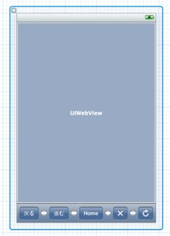
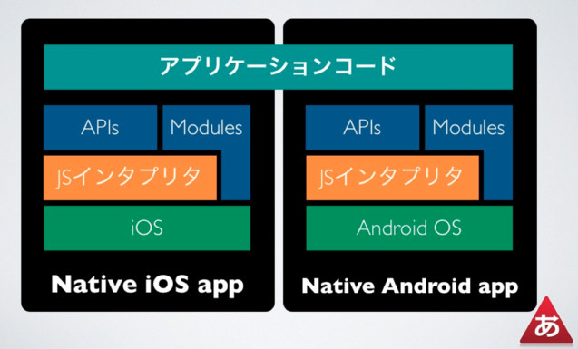

# ネイティブアプリとWebアプリ

---

# 用語

- WebView
	- 簡易的なブラウザコンポーネント
	- iOSとAndroidはWebkitベースのレンダリングエンジン
		- WebkitのバージョンやJavaScriptエンジンは異なる

---

# [PhoneGap][]

[PhoneGap]: http://www.phonegap.com/ "PhoneGap"

## PhoneGapはnitobi社の開発した、スマートフォン向けハイブリッドアプリケーション制作のためのフレームワーク

- 対応端末が多い
	-   iOS
        Android
        BlackBerry
        HP WebOS
        Windows Phone 7
        Symbian
        Bada

## 2011/10/04に[Adobe](http://www.adobe.com/jp/aboutadobe/pressroom/pressreleases/20111004_AdobeAquiresNitobi.html "Adobe")により買収

---

# PhoneGapの構造

- WebViewでWebページを表示している
	- HTML+CSS+JavaScript
	- これだけだとWebサイトと同じ
- JavaScript から ネイティブの機能へブリッジする機能を持つ
	- phonegap.js
	- API的にネイティブ機能を呼び出せる

---

# PhoneGapアプリの例
- Facebookアプリ
	- [How Facebook Mobile Was Designed to Write Once, Run Everywhere](http://www.readwriteweb.com/mobile/2011/09/how-facebook-mobile-was-design.php "How Facebook Mobile Was Designed to Write Once, Run Everywhere")

 <strong style="display:block;margin:12px 0 4px"><a href="http://www.slideshare.net/naoya1977/smartphone-development-guide-with-coffeescript-node-html5-technology-for-perl-programmers" title="SmartPhone development guide with CoffeeScript + Node + HTML5 Technology, for Perl Programmers" target="_blank">SmartPhone development guide</a></strong> <object id="__sse9704771" width="510" height="426"> <param name="movie" value="http://static.slidesharecdn.com/swf/ssplayer2.swf?doc=smartphoneguide-111015003714-phpapp02&startSlide=3&stripped_title=smartphone-development-guide-with-coffeescript-node-html5-technology-for-perl-programmers&userName=naoya1977" /> <param name="allowFullScreen" value="true"/> <param name="allowScriptAccess" value="always"/> <embed name="__sse9704771" src="http://static.slidesharecdn.com/swf/ssplayer2.swf?doc=smartphoneguide-111015003714-phpapp02&startSlide=3&stripped_title=smartphone-development-guide-with-coffeescript-node-html5-technology-for-perl-programmers&userName=naoya1977" type="application/x-shockwave-flash" allowscriptaccess="always" allowfullscreen="true" width="510" height="426"></embed> </object> 
 View more <a href="http://www.slideshare.net/" target="_blank">presentations</a> from <a href="http://www.slideshare.net/naoya1977" target="_blank">Naoya Ito</a> 
 

--- 

# ネイティブ機能呼び出し

- JavaScriptからカメラ機能を使う例
	- navigator.camera.getPicturesでカメラを起動
	- コールバックで画像のBase64文字列を受け取る

コード

	!javascript
	navigator.camera.getPictures(onSuccess, onFail);// カメラを立ち上げ
	
	onSuccess = function (base64data) {
		var img = document.getElementById('myImage');
		img.src = "data:image/jpeg;base64;" + base64data;
	}

---

# 動作原理
- FFI = Foreign Function Interface = ブリッジ
- ブラウザとネイティブ機能をFFIがつなぐ

 <strong style="display:block;margin:12px 0 4px"><a href="http://www.slideshare.net/m0bz/html5-phonegap-and-whats-next" title="HTML5, PhoneGap and What&#39;s Next" target="_blank">HTML5, PhoneGap and What&#39;s Next</a></strong> <object id="__sse9725791" width="510" height="426"> <param name="movie" value="http://static.slidesharecdn.com/swf/ssplayer2.swf?doc=phonegap-111016234029-phpapp01&rel=0&startSlide=33&stripped_title=html5-phonegap-and-whats-next&userName=m0bz" /> <param name="allowFullScreen" value="true"/> <param name="allowScriptAccess" value="always"/> <embed name="__sse9725791" src="http://static.slidesharecdn.com/swf/ssplayer2.swf?doc=phonegap-111016234029-phpapp01&rel=0&startSlide=33&stripped_title=html5-phonegap-and-whats-next&userName=m0bz" type="application/x-shockwave-flash" allowscriptaccess="always" allowfullscreen="true" width="510" height="426"></embed> </object> 
 View more <a href="http://www.slideshare.net/" target="_blank">presentations</a> from <a href="http://www.slideshare.net/m0bz" target="_blank">m0bz</a> 
 

---

# PhoneGapプラグイン

- [PhoneGap APIを拡張する@iPhone | Lab by engineering@dwango.jp](http://lab.dwango.jp/articles/extending-phonegap/2-phonegap-api-iphone.html "PhoneGap APIを拡張する@iPhone | Lab by engineering@dwango.jp")

- iOSなら特定のURLを叩きネイティブ機能を呼び出す
	1. `gap://<Class>.<command>/[<arguments>][?<dictionary>]`
	2. ネイティブ処理
	3. ネイティブからstringByEvaluatingJavaScriptでコールバック関数に結果を渡す

---

# PhongeGap Application

- 表示されている画面はWeb
	- 既存のWebAppを持ってこられる
- カメラ等のネイティブ機能はブリッジしてプラグインで呼ぶ
- なぜブリッジが必要?
	- ブラウザにはまだ存在しない or 制限された機能が多い
	- Device API, Media, Notification …
- W3Cで標準化されて、全部のOSで使えるようになったらPhoneGapは不要?
	- "The second goal of PhoneGap is for the project to cease to exist"

---

# 現在のW3C標準化について

 <strong style="display:block;margin:12px 0 4px"><a href="http://www.slideshare.net/m0bz/html5-phonegap-and-whats-next" title="HTML5, PhoneGap and What&#39;s Next" target="_blank">HTML5, PhoneGap and What&#39;s Next</a></strong> <object id="__sse9725791" width="595" height="497"> <param name="movie" value="http://static.slidesharecdn.com/swf/ssplayer2.swf?doc=phonegap-111016234029-phpapp01&rel=0&startSlide=58&stripped_title=html5-phonegap-and-whats-next&userName=m0bz" /> <param name="allowFullScreen" value="true"/> <param name="allowScriptAccess" value="always"/> <embed name="__sse9725791" src="http://static.slidesharecdn.com/swf/ssplayer2.swf?doc=phonegap-111016234029-phpapp01&rel=0&startSlide=58&stripped_title=html5-phonegap-and-whats-next&userName=m0bz" type="application/x-shockwave-flash" allowscriptaccess="always" allowfullscreen="true" width="595" height="497"></embed> </object> 
 View more <a href="http://www.slideshare.net/" target="_blank">presentations</a> from <a href="http://www.slideshare.net/m0bz" target="_blank">m0bz</a> 
 

---

# ブラウザベンダの動き

- [Mozilla、HTML5ベースのアプリケーション開発用API策定プロジェクト「WebAPI」を立ち上げ - SourceForge.JP Magazine : オープンソースの話題満載](http://sourceforge.jp/magazine/11/08/24/0411240 "Mozilla、HTML5ベースのアプリケーション開発用API策定プロジェクト「WebAPI」を立ち上げ - SourceForge.JP Magazine : オープンソースの話題満載")
	- [WebAPI - MozillaWiki](https://wiki.mozilla.org/WebAPI "WebAPI - MozillaWiki")
- Opera [ウェブカム API と本スタイル CSS - もし高校野球の女子マネージャーがOpera Browserを使ったら - チーム俺等](http://orera.g.hatena.ne.jp/edvakf/20111019/1319019691 "ウェブカム API と本スタイル CSS - もし高校野球の女子マネージャーがOpera Browserを使ったら - チーム俺等")
	- WebカメラAPI

---

# PhoneGap With Sencha Touch

[Sencha Touch]: http://extjs.co.jp/products/touch/ "Sencha Touch"

- PhoneGap は Mobile Web を ネイティブアプリにできる
	- ネイティブっぽいWeb Appを作るのに[Sencha Touch][]は強力
	- ネイティブ箇所以外はChrome(Webkit系ブラウザ)で動作確認

---

# Sencha Touch 2.0

- [InfoQ: Sencha Touch 2とはどのようなものか](http://www.infoq.com/jp/news/2011/09/sencha-touch-2-preview "InfoQ: Sencha Touch 2とはどのようなものか")

>Sencha Touch 2は、1行のコマンドでWebアプリケーションをiOS App StoreやAndroid Marketplaceに配置できるようパッケージングする機能や、デバイス特有の関数にアクセス可能な新APIを備えています。

あれ? PhoneGap…?

---

# [Titanium Mobile][]

[Titanium Mobile]:http://www.appcelerator.com/products/titanium-mobile-application-development/ "Titanium Mobile"

## Appcelerator社が提供しているJavaScript を利用して iPhone/iPad, Android向けのアプリケーションが開発できるソフトウェア

- Titanium Mobileで作られたアプリ
	- [iTunes App Store / Android market にあるTitanium Mobile を利用してつくられたiPhone/Android アプリケーション - laiso - iPhoneアプリ開発グループ](http://iphone-dev.g.hatena.ne.jp/laiso/20111024/1319458278 "iTunes App Store / Android market にあるTitanium Mobile を利用してつくられたiPhone/Android アプリケーション - laiso - iPhoneアプリ開発グループ")

---

# アーキテクチャ
- 共通のアプリケーションコード(JavaScript)でアプリを書ける
	- OSで異なる挙動も多いが...

---

# JavaScriptでネイティブ?

- Titaniumは内部にJavaScripttエンジンを持つ
	- iOS は　JavaScriptCore
	- Android は　V8 (以前はRhino)
- JavaScriptインタプリタ経由でネイティブAPIを叩く
	- UIKitでネイティブUIの作成
	- ネイティブの機能を触る
- [Titanium Mobileは本当の意味でネイティブコードを吐くわけではないらしい](http://postoro.blogspot.com/2011/10/titanium-mobile.html "POSTORO: Titanium Mobileは本当の意味でネイティブコードを吐くわけではないらしい")

---

# PhoneGap and Titanium

- PhoneGap は webviewにサイトを表示してPhoneGapプラグインで包んだもの
	- 既存のサイトをそのまま持って来られる
	- ネイティブな機能はブリッジを経由する
- Titanium MobileはJavaScriptをネイティブコードへコンパイルしているようにみえる…が
	- 実際にはJavaScriptインタプリタを使ってネイティブ機能を使うため、変換ではない
	- JavaScriptを手段として使いネイティブアプリを作る環境を提供する
	- 既存サイト(HTML,CSS,JS)を持ってくるのが目的ではない

[CoronaとPhonegapとTitanium Mobileの比較 « bulblub](http://bulblub.com/2010/11/22/corona%E3%81%A8phonegap%E3%81%A8titanium-mobile%E3%81%AE%E6%AF%94%E8%BC%83/ "CoronaとPhonegapとTitanium Mobileの比較 « bulblub")

---

# Titanium Mobile to Web

- Web to Titanium Mobile ではない
- [Titanium SDK for Mobile Web](http://developer.appcelerator.com/blog/2011/09/titanium-sdk-for-mobile-web-beta-1.html "Titanium SDK for Mobile Web")
	- 逆にTitanium Mobile向けのソースで、Webアプリケーションを作るSDK
	- [Titanium SDK for Mobile Web Beta 1が公開されていますね。 - JP::HSJ::Junknews::HatenaSide](http://d.hatena.ne.jp/donayama/20110917/timobileweb "Titanium SDK for Mobile Web Beta 1が公開されていますね。 - JP::HSJ::Junknews::HatenaSide")
- JavaScriptという手段を使って何を作る環境
---