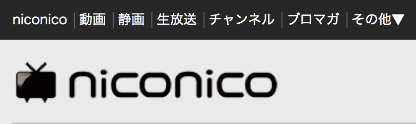
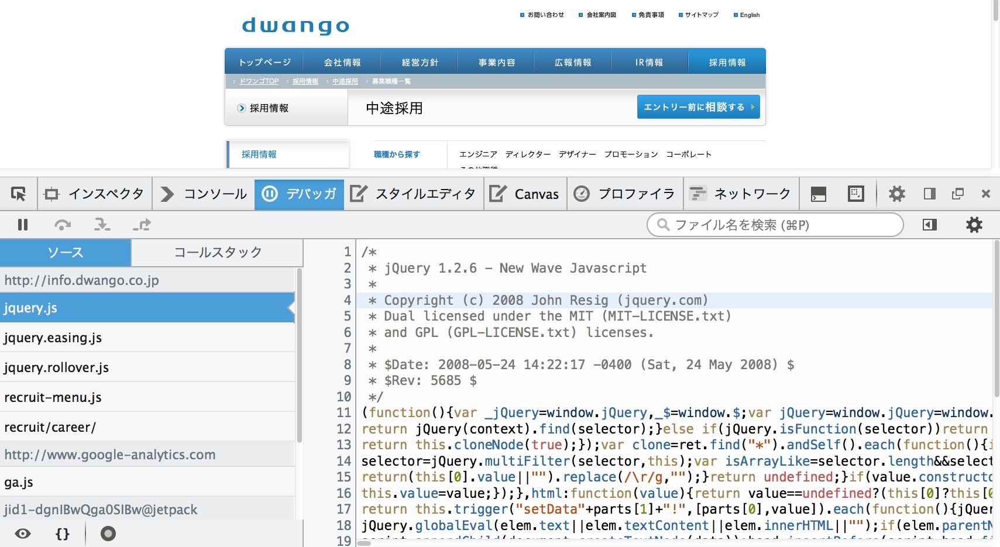
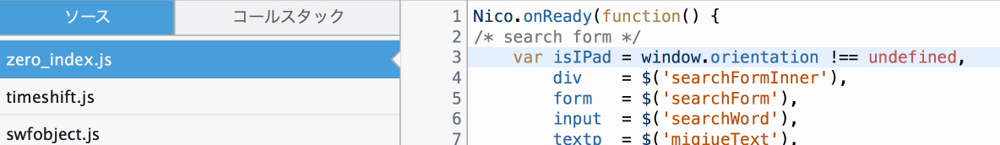

# [fit] ニコニコードリーディング 

-----
# 自己紹介


## azu
## @[azu_re](https://twitter.com/azu_re)
###  [Web scratch], [JSer.info]

### [JavaScript Promiseの本](http://azu.github.io/promises-book/ "JavaScript Promiseの本")

[Web scratch]: http://efcl.info/ "Web scratch"
[JSer.info]: http://jser.info/ "JSer.info"

-----



-----



-----

# ニコニコ生放送 PC :warning:

-----

# ニコニコ生放送

- prototype.js + jQuery + Backbone(+underscore)
- Why `collection.js` depend on `prototype.js`? [^nicolive.collection.js]
- Boolean trapを持った関数がある

[^nicolive.collection.js]: http://nl.simg.jp/public/inc/assets/zero/js/base/nicolive.collection.js

----

# Boolean Trap

- 引数に真偽値を渡してしまう関数
- メソッドから挙動が分からなくなる

``` js
Nicolive.Liveinfo.liveinfoArea.setRankingInfoEnabled(true);
```

- See [hall of api shame: boolean trap](http://ariya.ofilabs.com/2011/08/hall-of-api-shame-boolean-trap.html "hall of api shame: boolean trap")


-----

# Duplicate module

- jquery.placeholder.js
- nicolive.placeholder.js

^ プレースホルダーの実装が何故が2種類ある

-----

# UA detection is not modern

- ✘ `Prototype.Browser.*`
- UA判定はAndroidの**機種固有**のバグを避ける以外等に使わないほうがいい
- [Modernizr](http://modernizr.com/ "Modernizr") or polyfillを使うべき


-----

# ニコニコ動画

----

# ニコニコ動画

- Good Catch :+1:
	- __Kenta Takahashi__ and __Takayuki Yamaguchi__
- `evalJSON` is EVIL!
	- Use `JSON.parse` [^json2.js]

[^json2.js]: [douglascrockford/JSON-js](https://github.com/douglascrockford/JSON-js "douglascrockford/JSON-js")

-----

# ニコニコ動画



```js
var isIPad = window.orientation !== undefined;
```

- これは iPad ですか? - いいえ違います [^zero_index]

------

# 変数名に嘘をつかせない

-  See リーダブルコード
-  [名前：誤解されない名前：ユーザの期待に合わせる - Strategic Choice](http://d.hatena.ne.jp/asakichy/20140722/1405980781 "名前：誤解されない名前：ユーザの期待に合わせる - Strategic Choice")

[^zero_index]: http://uni.res.nimg.jp/js/zero_index.js

-----

# ニコニコ動画ページ

- AMD
- Require.js
- Backbone.js + LoDash

-----

# ニコニコ静画

-----

# ニコニコ静画

- [Knockout.js](http://knockoutjs.com/documentation/browser-support.html "Knockout : Browser support")
	- Good choice for IE**x** support.
	- Knockoutは未だにIE6をサポートしてる
- `eval JSON` is EVIL! (2分ぶり2回目)[^nicodic.js]
	- Use `JSON.parse` 


[^nicodic.js]: [seiga.nicovideo.jp/book/static/js/nicodic.js](http://seiga.nicovideo.jp/book/static/js/nicodic.js)

-----

# ニコニコ静画

- 意図せぬグローバル変数?

出典: [seiga.nicovideo.jp/book/static/js/nicodic.js](http://seiga.nicovideo.jp/book/static/js/nicodic.js)

```js
Nicodic = function(){};

nicodic = new Nicodic();
```

- [JSHint](http://www.jshint.com/ "JSHint, a JavaScript Code Quality Tool") or [ESLint](http://eslint.org/ "ESLint") で検出しよう

^ `var`が抜けている。

-----

# ニコニコ立体

- Backbone.js( + Marionette) 
- pjax ( + html fragment )
- 比較的新しい感じ?

-----

# [fit] Common


-----
# Template Engine

- 色々な場所で色々なテンプレートが使われている[]()
- [Jarty](https://github.com/kotas/jarty "Jarty"). [nicolib.js](http://com.res.nimg.jp/js/nicolib.js) , [\_.template](http://underscorejs.org/#template "_.template") , `String.replace`
- 複数のテンプレートエンジンは誰も幸せにならない
	- FYI : [_.template breaking change!](https://github.com/jashkenas/underscore/issues/1736 "_.template should not accept data argument · Issue #1736 · jashkenas/underscore") @ 1.7.0 

-----

# common.js?? :confused:

- common.jsのやってることが共通ではない
- 全てのサイトで異なってる
- UtilはUtilとして扱うべき
- common.jsを作る前にモジュール化できないかを考える

-----

# Common.jsとは :confused:

- http://uni.res.nimg.jp/js/common.js
- http://seiga.nicovideo.jp/js/illust/common.min.js
- http://seiga.nicovideo.jp/book/static/js/common/common.js
- http://seiga.nicovideo.jp/js/manga/common.js
- http://ch.res.nimg.jp/js/common.js
- http://nl.simg.jp/public/inc/common_cb.js
- http://res.nimg.jp/js/common.js

-----

# Refactoring Plan :airplane:

-----

# モジュール化

- 各サービスでコピー.jsが氾濫してる
- JavaScriptモジュールのルールの統一
	- `function($,window)`
	- `(function($){....})(jQueries["1.8.1"]);`
	- `$j`
	- `if (typeof Nico === 'undefined') Nico = {};`

^ Common.js (CJSの方ではない) ができてしまう原因として、モジュール化のルールが決まってないから、一箇所にまとめてしまってる。
今はビルドツールがしっかりあるので、そちらに移行していくのがいい。(またjQuery、prototype.jsが常にどこかにいるという前提で書かれているコードが見られる)

------

# CommonJS 

- モジュール: CommonJS or ES6 or AMD
- npm、Browserify、webpack などを使ってモジュールの管理/ビルド
	- npm enterprize or Local Path
- FYI: ニコニコ動画再生ページはAMD + Require.js

------

# モジュール

**メリット**

- モジュール化することでコードが捨てやすくなる
- 重複するコードが減る
- グローバル汚染を除去

**デメリット**

- ビルドツールを使わないといけない

-----

# グローバルでワールドワイド  :globe_with_meridians: 

- http://ch.res.nimg.jp/js/channel/blog/article.js
- http://nl.simg.jp/public/inc/notifybox_preload.js
- http://res.nimg.jp/js/__utm.js

-----

# Remove prototype.js

- prototype.js は取り除く努力をすべき
	- Big bottleneck!
- 広告のjsが大きな依存を持つべきではない[^ads.min.js]
	- 心理的にその依存が外しにくくなる
- Insecure library...

[^ads.min.js]: http://ads.nicovideo.jp/assets/js/ads-2.10.0.min.js

-----

# Update swfobject.js

- swfobject 1.x has vulnerability
	- UXSSではないが、エスケープに気を使う必要がある
	- 安全に倒されてない実装
- Update or Replace
- See [swfobject.js がアレな話 - ほむらちゃほむほむ](http://t-ashula.hateblo.jp/entry/2012/01/11/233156 "swfobject.js がアレな話 - ほむらちゃほむほむ")


^swfobject.js は FLASH を web ページに埋め込むための JavaScript のライブラリ．クロスブラウザ対応してたり，面倒な HTML-tag のお作法を覚えなくても良くなったりとでデファクトスタンダードな感じのモノ

-----

# Remove unused files...

- 使ってないjsを削除するのが一番大事!
	- 使ってるかどうか分かるようにするためにも、依存関係を静的に解析出来るモジュール管理を取り入れよう
- ビルドツールを導入しよう

-----

# More Testable

- How many have test code?
- 新規に書く場合はユニットテストを
- レグレッション検知としてのE2Eテスト
- テスト と リファクタリングは仲良し

-----

# まとめ

- モジュール化
	- 万能ではないがコードが捨てやすくなる
- 安全でない実装はできるだけ把握するべき
	- eval, prototype, jQuery sink
- サービスごとで担当が違うなら、共通理解を得る
- prototype.js / jQuery べったりなコードからの脱却