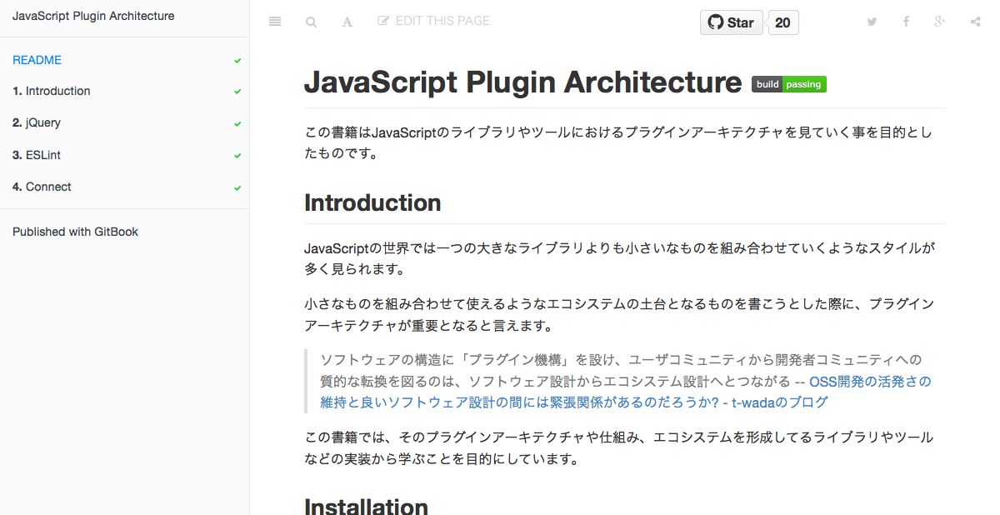
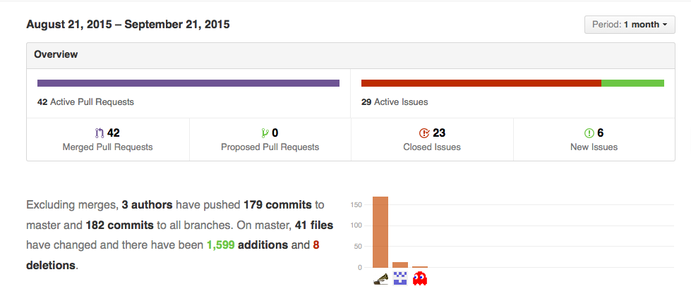
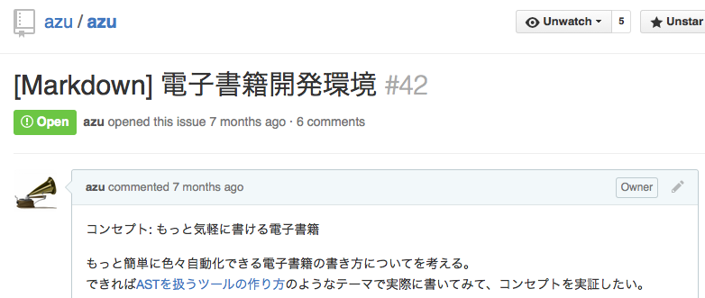
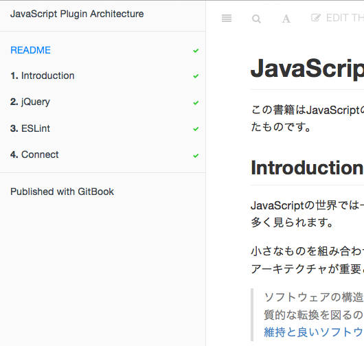

# 電子書籍の開発環境

----

# 自己紹介


- Name : **azu**
- Twitter : @[azu_re](https://twitter.com/azu_re)
- Website: [Web scratch], [JSer.info]

[Web scratch]: http://efcl.info/ "Web scratch"
[JSer.info]: http://jser.info/ "JSer.info"


----

# [JavaScript Plugin Architecture](https://github.com/azu/JavaScript-Plugin-Architecture/ "JavaScript Plugin Architecture")



----

# [JavaScript Plugin Architecture](https://github.com/azu/JavaScript-Plugin-Architecture/ "JavaScript Plugin Architecture")


## 電子書籍の開発中にやったこと


-----


# Issue/Pull Request駆動



----

# Issue/Pull Request駆動

- 文章の正しさは人により異なるので根拠を残す
	- コードと違って曖昧成分が多い
	- 文章の自動チェックを入れた理由を残す
- Pull Request駆動で文章もCIを通してから
	- [検証済みマージ](http://d.hatena.ne.jp/kkawa/20120604/p1 "検証済みマージ") - マージされるとGitBookに自動反映


----

# チェックしたいこと




----

# [[Markdown] 電子書籍開発環境 · Issue #42](https://github.com/azu/azu/issues/42 "[Markdown] 電子書籍開発環境 · Issue #42 · azu/azu")

- Markdown/文章のLint
- インラインコードのLint
- ファイルのincludeするMarkdown拡張
- Markdown to HTML or PDF
- エディタ

----

# [[Markdown] 電子書籍開発環境 · Issue #42](https://github.com/azu/azu/issues/42 "[Markdown] 電子書籍開発環境 · Issue #42 · azu/azu")

- Markdown/文章のLint => [textlint](https://github.com/azu/textlint "textlint")
- インラインコードのLint => [ESLint](http://eslint.org/ "ESLint")
- ファイルのincludeするMarkdown拡張 => [GitBook](https://www.gitbook.com/)
- Markdown to HTML or PDF => [GitBook](https://www.gitbook.com/)
- エディタ => [GitBook Editor](https://www.gitbook.com/editor)

-----

# [GitBook](https://www.gitbook.com/)

- Markdownで電子書籍を書けるツール/プラットフォーム
- [GitbookIO/gitbook](https://github.com/GitbookIO/gitbook "GitbookIO/gitbook")
	- Markdown -> HTML/PDF/Epub
- [gitbook.com](https://www.gitbook.com)
	- 書籍公開プラットフォーム
	- GitHubと連携して自動ビルド、販売等に対応

-----
# [gitbook.com](https://www.gitbook.com)

- GitBookの公開プラットフォーム
- とても良く出来てる
- コラボレーター、販売、PDF/Epubの自動生成、コミットごとのプレビュー、アップデート通知、オンラインエディタ


-----

# ✔ [GitBook連携の設定 · Issue #4 · azu/JavaScript-Plugin-Architecture](https://github.com/azu/JavaScript-Plugin-Architecture/issues/4 "GitBook連携の設定 · Issue #4 · azu/JavaScript-Plugin-Architecture")

-----

# GitBookの構造



```
.
├── README.md
├── SUMMARY.md
└── book.json
```

- `SUMMARY.md` から各章へのMarkdownファイルへリンク
- `gitbook build` => 静的なHTMLが生成される

-----

# JavaScript Plugin Architectureの構造

```
├── README.md
├── SUMMARY.md
├── book.json
├── src(*.js)
│   └── jQuery
├── ja (*.md, *.png 文章系)
│    └── jQuery
├── test (*-test.js)
│   └── jQuery
└── package.json
```

----

# ✔ [プロジェクト構造について · Issue #5 · azu/JavaScript-Plugin-Architecture](https://github.com/azu/JavaScript-Plugin-Architecture/issues/5 "プロジェクト構造について · Issue #5 · azu/JavaScript-Plugin-Architecture")

----


# [textlint](https://github.com/azu/textlint "textlint")

- Markdownやテキスト向けのLintツール
- テキスト版ESLintツール
	- ルールをJavaScriptで簡単に追加できる
- [textlintで日本語の文章をチェックする | Web Scratch](http://efcl.info/2015/09/10/introduce-textlint/ "textlintで日本語の文章をチェックする | Web Scratch")

----

# textlint rule

- [textlint-rule-max-ten](https://github.com/azu/textlint-rule-max-ten)
	- 一文に利用できる`、`の数をチェックするルール
- [textlint-rule-spellcheck-tech-word](https://github.com/azu/textlint-rule-spellcheck-tech-word)
	- WEB+DB用語統一ルールベースの単語チェックするルール
- [textlint-rule-no-mix-dearu-desumasu](https://github.com/azu/textlint-rule-no-mix-dearu-desumasu)
	- 「ですます」調と「である」調の混在をチェックするルール

----

# textlint rule

- [textlint-rule-no-start-duplicated-conjunction](https://github.com/azu/textlint-rule-no-start-duplicated-conjunction "azu/textlint-rule-no-start-duplicated-conjunction")
	- 「しかし、〜　。 しかし、〜。」など同じ接続詞が連続してないかをチェックするルール
- textlintのルールは以下にまとめられている
	- [Collection of textlint rule · azu/textlint Wiki](https://github.com/azu/textlint/wiki/Collection-of-textlint-rule "Collection of textlint rule · azu/textlint Wiki")

-----

# プロジェクト固有の表記揺れ

- 表記揺れのチェックは汎用的ではない
- プロジェクト固有の表記揺れチェックが必要
- [textlint-rule-prh](https://github.com/azu/textlint-rule-prh "textlint-rule-prh")
- [textlint + prhで表記ゆれを検出する | Web Scratch](http://efcl.info/2015/09/14/textlint-rule-prh/ "textlint + prhで表記ゆれを検出する | Web Scratch")
- ymlで手軽に表記揺れの辞書を追加できるtextlint rule

-----

# [textlint-rule-prh](https://github.com/azu/textlint-rule-prh "textlint-rule-prh")


- [vvakame/prh](https://github.com/vvakame/prh "vvakame/prh") を利用したtextlint rule
- yamlでルールを簡単に追加できる(正規表現や大文字小文字などよくある表記揺れは簡単に書ける仕組みがある)

```
rules:
  - expected: プラグインアーキテクチャ
    pattern:
      - プラグイン機構
      - プラグインのアーキテクチャ
```


-----

# なぜプロジェクト毎に表記揺れルール？

- typoなどを見つけた場合にルールを追加して**から**修正できる
- [**C**onnectに統一しよう · Issue #48 · azu/JavaScript-Plugin-Architecture](https://github.com/azu/JavaScript-Plugin-Architecture/issues/48 "**C**onnectに統一しよう · Issue #48 · azu/JavaScript-Plugin-Architecture")
	- リグレッションテストと同じ意味合い
- 表記がルールとして明文化できるので[Contribute](https://github.com/azu/JavaScript-Plugin-Architecture/blob/master/CONTRIBUTING.md "Contribute")しやすい

-----

# GitBook + textlint

- GitBookは`SUMMARY.md`からmdへのリンクがある
- [azu/gitbook-summary-to-path](https://github.com/azu/gitbook-summary-to-path "azu/gitbook-summary-to-path")
- SUMMARY.mdにに書かれているファイルに`textlint`を行う

```sh
$ summary-to-path SUMMARY.md | xargs textlint
```

----

# ✔ [textlintの導入 · Issue #1 · azu/JavaScript-Plugin-Architecture](https://github.com/azu/JavaScript-Plugin-Architecture/issues/1 "textlintの導入 · Issue #1 · azu/JavaScript-Plugin-Architecture")

-----

# コードのLint

- コードを[ESLint](http://eslint.org/ "ESLint")でチェックしたい
- 技術書を書く場合、コードを書く方法が2種類
	- コードを外部ファイルとして書いて読み込む
	- インラインにコードを書く

----
# 外部ファイルのコード

- [azu/gitbook-plugin-include-codeblock](https://github.com/azu/gitbook-plugin-include-codeblock "azu/gitbook-plugin-include-codeblock")
- いい感じに外部ファイルをCodeBlockとして読み込むGitBookプラグイン


```
[include](fixtures/test.js)
```

と書けば、Code Blockとして展開される。
=> GitHub上ではただのコードへのリンクとなる(Fallback)


----

# 外部ファイルのコードをLint

- ESLintを使い単純にJavaScriptとしてLintを通す


## ✔ [ESLintの導入 · Issue #6 · azu/JavaScript-Plugin-Architecture](https://github.com/azu/JavaScript-Plugin-Architecture/issues/6 "ESLintの導入 · Issue #6 · azu/JavaScript-Plugin-Architecture")


----

# インラインコードのLint

	```js
	var a = 1;
	```

- インラインに書かれているコードに対してもLintを行う
- インラインコードは実行されないのでtypoし易い

----

# インラインコードのLint

- [eslint/eslint-plugin-markdown](https://github.com/eslint/eslint-plugin-markdown "eslint/eslint-plugin-markdown")を利用
- ESLintのプラグインとしてインラインコードをLintできる
	- `js`や`javascript`といったCode Blockに対してLint
- 問題: インラインコードは常に実行できるとは限らない！！

----

# 実行できないインラインコードのLint

- 設定ファイルを分けることで解決！
- 通常のコード用: [.eslintrc](https://github.com/azu/JavaScript-Plugin-Architecture/blob/master/.eslintrc ".eslintrc")
- インラインコード用: [.md.eslintrc](https://github.com/azu/JavaScript-Plugin-Architecture/blob/master/.md.eslintrc ".md.eslintrc")
	- .eslintrcを継承
	- `no-undef`や`no-unused-vars`などを無効化

----

# ✔ [ESLintでインラインコードのLint · Issue #7 · azu/JavaScript-Plugin-Architecture](https://github.com/azu/JavaScript-Plugin-Architecture/issues/7 "ESLintでインラインコードのLint · Issue #7 · azu/JavaScript-Plugin-Architecture")

----

# CONTRIBUTING.md

- [Contributing Guidelines](https://github.com/blog/1184-contributing-guidelines "Contributing Guidelines")を書いてみる
- 書こうと思うと、どういう手順でプレビューできるか、修正するか、文章を書いていくかの整理が必要になる
- 自分のためでもあり、Contributingする人のためになる


----


## ✔ [CONTRIBUTING.md · Issue #12 · azu/JavaScript-Plugin-Architecture](https://github.com/azu/JavaScript-Plugin-Architecture/issues/12 "CONTRIBUTING.md · Issue #12 · azu/JavaScript-Plugin-Architecture")