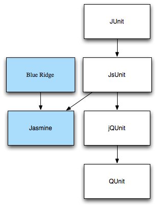

# 世界のJavaScriptを読もう @ 2012

---

# テーマ

## 調べる方法を知る

- JavaScriptは調べるとやり方が見つかることが多い
    - 古いものと最近のものがまざってる
    - ごく最近〜未来のものは見つけにくい
- 以下の総集編的な内容
    - [海外のJavaScript情報を見つけよう](http://efcl.info/2011/0116/res2185/ "海外のJavaScript情報を見つけよう")
    - [世界のJavaScript情報を読もう](http://efcl.info/2011/0117/res2229/ "世界のJavaScript情報を読もう")
    - [今からRSS購読すべきタグと検索結果](http://efcl.info/2010/1025/res2018/ "今からRSS購読すべきタグと検索結果")
    - [ブラウザの最新情報を知るために、Web開発者が読んでおくべきブログ](http://efcl.info/2011/0301/res2303/ "ブラウザの最新情報を知るために、Web開発者が読んでおくべきブログ")

Webの動きはとても早いので、調べ方を知る

---

# 目次

* 見る(何を見る、どこを見る)
* 知る(何を知りたい、探す、情報の取捨選択)
* 学ぶ(何からどう学ぶ、学習方法)

---

# 序章 導入

---

# JavaScriptとは

JavaScriptはもはやブラウザだけのJavaScriptではない

- クライアントサイド
    - Web 
    - ネイティブアプリ
        - Windows8、Titanium
    - [node.js]
        - クロスプラットフォームなツール用としてもいける
- サーバサイド
    - [node.js]
    - [Ringo](http://ringojs.org/ "Ringo")
    - [wakanda](http://www.wakanda.org/ "wakanda")
    - see more [State of the art: Server-Side JavaScript (ParisJS)](http://www.slideshare.net/alexandre_morgaut/state-of-the-art-serverside-javascript-parisjs "State of the art: Server-Side JavaScript (ParisJS)")

[node.js]: http://nodejs.org/

---

# JavaScriptの変化

- JavaScriptは制限された言語？
    - マルチコア(<a href="https://github.com/RiverTrail/RiverTrail">RiverTrail</a>)、GPU(<a href="http://code.google.com/p/webcl/">WebCL</a>)
    - ファイル操作、Device APIs: see <a href="http://www.slideshare.net/jamesgpearce/mobile-device-apis">Mobile Device APIs</a>
    - バイナリ
    - 固定型(e.g. Typed Arrays)
    - スレッド(e.g. Web Workers)
    - WebSocket
- JavaScript自体ができる幅も広がってきた
- HTML5 via <a href="http://www.slideshare.net/myakura/html5-2480964">HTML5, きちんと。</a>
    - HTML4 文章が目的
    - HTML5 アプリケーションが追加

---

#JavaScriptの変化

* [The evolution of the web - ウェブの進化](http://evolutionofweb.appspot.com/ "The evolution of the web - ウェブの進化")
    * ブラウザと共に変化が激しい時期
* 近年のJavaScript環境の変化は急速
* 一年で常識が変わる事もあるレベル
  * 動作プラットフォームの多様化
     * モバイル、サーバサイド
  * テストの変化
* なので、変化に対応できるように調べ方を知る

---

# 例) JavaScriptのテストの変化

DialyJSのアンケートから

### JavaScriptのテスト利用率

<table id="vsTable"><tbody><tr><td style="width: 25%;" class="cat title"></td><td style="width: 25%;" class="title">
2009
</td><td style="width: 25%;" class="title">
2010
</td><td style="width: 25%;" class="title">
2011
</td></tr><tr class="second"><td style="width: 25%;" class="cat">
YES
</td><td class="text" style="width: 25%;">
46(32%)
</td><td class="text" style="width: 25%;">
401(34%)
</td><td class="text" style="width: 25%;">
1185(48%)
</td></tr><tr><td style="width: 25%;" class="cat">
NO
</td><td class="text" style="width: 25%;">
96(68%)
</td><td class="text" style="width: 25%;">
778(66%)
</td><td class="text" style="width: 25%;">
1619(52%)
</td></tr></tbody></table>

via <a href="http://dailyjs.com/">DailyJS</a> : <a href="http://dailyjs.com/2011/12/15/javascript-survey-results/">JavaScript Developer Survey</a>

This table was created with <a href='http://www.compareninja.com' target='_blank'>Compare Ninja</a>.

---

### 利用されてるテスティングフレームワーク

* 2009年から2011年のアンケート結果
    * <a href="http://dailyjs.com/2009/12/02/survey-results/">DailyJS: JavaScript Developer Survey 2009 Results</a>
    * <a href="http://dailyjs.com/2010/12/13/javascript-survey-results/">DailyJS: JavaScript Developer Survey 2010 Results</a>
    * <a href="http://dailyjs.com/2011/12/15/javascript-survey-results/">DailyJS: JavaScript Developer Survey 2011 Results</a>

---

#### 2009年

---

#### 2010年

---

#### 2011年

---

# ライブラリの簡単な補足

- JsUnitTest < 元々はPrototype.js依存
- <a href="http://madrobby.github.com/scriptaculous/unit-testing/">unittest.js</a> < script.aculo.usのユニットテスト
- JsUnit =port=> <a href="http://code.google.com/p/jqunit/">jqunit</a>(JsUnit互換) -> QUnit
- Jasmine (Pivotal Labs)
    - JsUnit (Pivotal Labs)
    - Screw.Unit (Pivotal Labs) 

---

# 今のテスト環境について

- QUnit - XUnit系
- Jasmine - RSpec系

### テストの実行環境

- ブラウザ(IE,Firefox,Chrome,Opera…etc)
- PhantomJS, Webkitを利用したもの
- Node(V8)
- SpiderMonkey,Rhino などのコンソール
- テスト実行環境ホスティングサービス

---

### テストの補助ライブラリ

テストに便利なモックなど補助機能等を提供

- QUnit-TAP - TAP出力
- Sinon.jS
- Ajaxmock

### テスティングフレームワーク

全部入りの環境を提供してくれる

- mocha
- Buster
- JSTestDriver

---

# テスト環境の変化まとめ

- まだまだテスティングツールが変化している
- 2011年はNodeで動くものが続々登場
    - 今よりいいものが出てくる可能性

> Next: 新しいものを見ていく方法

---

# 見る・Watch

---

#ソーシャルサービス

### Twitter

- JavaScriptな人はTwitter利用者が多い
- ベンダー公式アカウントも

---

### はてなブックマーク

####ユーザーで追う

- id:<a href="http://b.hatena.ne.jp/vantguarde/">vantguarde</a> - 標準化, Webkit, Web全般
- id:<a href="http://b.hatena.ne.jp/Rockridge/">Rockridge</a> - Firefox
- マイホットエントリー(newはてブ)
- <a href="http://d.hatena.ne.jp/Cside/20110222/p1">「お気に入り」ページの閾値反映版RSSを配信するCGI</a>

####タグで追う

- 基本はフィルターなし
- 1Userのブックマークが大事
	- 新しい事との出会いは1ブクマから始まる

---

### Pinboard

- Deliciousと入れ替わりに利用者増加
- 有料であるからか、質も高め
- 新しい話題も多くブックマークされている
- メインは英語だが日本語のものも多め
- Deliciousは中国、ロシア利用者もポツポツいた
- Deliciousは古いもの内容混ざりごちゃごちゃ

---

#SNS , ソーシャルニュース

* <a href="http://www.reddit.com/">reddit</a>
掲示板+ソーシャルニュース
* <a href="http://www.slideshare.net/">SlideShare</a>
スライド共有
* <a href="http://coder.io/">coder.io</a> リンクアグリゲーター
* <a href="http://www.echojs.com/">Top News - Echo JS</a>
Hacker Newsスタイルのソーシャルニュース

### Twitter

- <a href="https://twitter.com/#!/azu_re">@azu_re</a> ME!
- <a href="https://twitter.com/#!/dalmaer">@dalmaer</a> member of <a href="http://functionsource.com/">functionsource.com</a>
- <a href="https://twitter.com/#!/jsgoodies">@jsgoodies</a> by @kuvos
- <a href="https://twitter.com/#!/jscentral">@jscentral</a> by <a href="https://twitter.com/#!/rauschma">Dr.Axel</a>
- <a href="https://twitter.com/#!/github_js">@github_js</a> github bot

---

# 定期配信型のサイト

### メールマガジン

Web版もあるが、メールマガジンとして立ち上がったもの

* <a href="http://javascriptweekly.com/">JavaScript Weekly</a> by [Cooper Press][]
* <a href="http://html5weekly.com/">HTML5 Weekly</a> by [Cooper Press][]
* <a href="http://dartweekly.com/">Dart Weekly</a> by [Cooper Press][]
* <a href="http://web-design-weekly.com/">Web Design Weekly</a> - Design,CSS
* <a href="http://tinyletter.com/cssradar">CSS Radar Newsletter</a> - 日本語 ,UX,UI,CSS,JS

[Cooper Press]: http://cooperpress.com/

---

### ブログ

* <a href="http://unformedbuilding.com/articles/news/">News Links</a> by <a href="http://unformedbuilding.com/">Unformed Building</a> - 日本語,CSS,Web
* <a href="http://peter.sh/">Peter Beverloo</a> - Webkit,Chrome
* <a href="http://www.bitstampede.com/">Bit Stampede</a> - Firefox,MDC
* <a href="http://www.w3.org/QA/archive/w3cqa_news/w3c_life/">W3C Blog</a> - W3C Life, 週間のW3Cサマリ
* <a href="http://blog.whatwg.org/">The WHATWG Blog</a> - <a href="http://suika.fam.cx/~wakaba/wiki/sw/n/WHATWG">WHATWG</a>, W3Cの週間サマリ
* <a href="http://standards.mitsue.co.jp/">Web標準Blog | メソッド | ミツエーリンクス</a> - 月間のWeb標準
* <a href="http://www.w3.org/html/">W3C HTML</a> - HTML via <a href="http://www.w3.org/blog/">W3C Blogs</a>
* <a href="http://www.w3.org/blog/CSS/">CSS WG Blog</a> and <a href="http://www.css3.info/">CSS3.info</a> via <a href="http://www.w3.org/blog/">W3C Blogs</a>
* <a href="http://www.jsmag.com/">JSMag</a> - 月間の有料JS電子雑誌 + 不定期<a href="http://jsmag.com/blog/">News roundup</a>
* <a href="http://badassjs.com/">Badass JavaScript</a> - 週間のJavaScript情報
* <a href="http://jser.info/">JSer.info</a> - 週間のJavaScript情報

---

# 乱立するまとめサイト

- ブラウザのアップデート頻度が増加
- Webの変化が急速化
- Webの情報量の増加
- SBMがまとめ役を保てなくなった
    - まとめ役が求められた
    - => Weekly系、小さくまとめるソーシャルニュースサイトが乱立

---

# 今年のブラウザアップデート

- FirefoxのRapidリリース

 via <a href="http://en.wikipedia.org/wiki/Timeline_of_web_browsers">Timeline of web browsers - Wikipedia, the free encyclopedia</a>

---

# ブラウザ年表

他のブラウザもアップデート頻度は徐々に上がっている

via <a href="http://meyerweb.com/eric/browsers/timeline-structured.html">Browser History Timeline</a>

---

# 見る(購読する)とは...

- 全てのRSSを読む必要はない
- 軽く目を通しておく程度でいい
- まとめサイトなどを上手く利用して見る
    - 同じ情報が複数のサイトで出てきたならそれは重要
    - 複数の情報源を目を通す

---

# RSS購読フロー

自分の場合

- 忘れないように何度も同じ記事がRSSにでてくる仕組み
- 重要なものほどRSSに出現することが多くなる
- 流し読みな記事もTwiterへ投稿
- フォロワーが興味を持ったもの
=> 少なくても需要があった記事
=> 読んでおいたほうがいい記事

---

---

# 見る-まとめ
- JavaScriptの情報量は膨大
- 新しいものだけに絞っても多い
- 効率よく見ていく
   - 詳しい人を追って見る
   - まとめサイトを見る
   - 全てを見るのは無謀

> NEXT : 知りたいことを知る方法