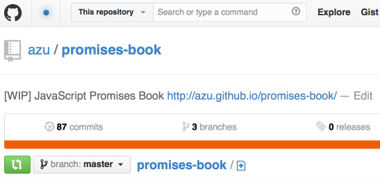

title: Promises Starter
author:
  name: azu
  twitter: azu_re  
  url: http://efcl.info/
theme: azu/cleaver-ribbon
output: index.html
--

# Promises Starter

Promisesのキホン

約束の🍣🍣🍣🍣🍣🍣

--

# 目次

* Promiseは値の器
* Promise API Overview
* Promise State
* Resolve/Reject
	* XHRの例
* エラーハンドリング

--

# Promise API Overview

### Constructor

``` javascript
var promise = new Promise(function(resolve, reject) { /* (非同期)処理 */ });
```

### Instance Method

``` javascript
promise.then(onFulfilled, onRejected);
promise.catch(onRejected);
```

### Static Method


`Promise.all()` 、 `Promise.resolve()` などの便利メソッド系

--

## Promiseのキホン的な流れ

``` javascript
function asyncFunction() {
    return new Promise(function (resolve, reject) {
        setTimeout(function () {
            resolve('Async Hello world');
        }, 16);
    });
}
asyncFunction().then(function (value) {
    console.log(value);// => 'Async Hello world'
}).catch(function (error) {
    console.log(error);// => エラーが合った時はこちら
});
```

--
## promise.then 


* 状態が変化する == `then`で登録しておいた関数が呼ばれる
* `resolve` には 結果の値 を渡す(解決)
* `reject` には Errorオブジェクト を渡す(棄却)
	* `throw` しないでErrorオブジェクトを渡すマナー

--

## Promise State


* Promiseの状態は3種類 - `Pending`、`Fulfilled`、`Rejected`
* `Pending` -> Settled(`Fulfilled` or `Rejected`)時に関数を呼ぶ
* Promiseの状態は一度変化したら変化しなくなる
* つまり、登録した関数が呼ばれるのは一度切り

--

## Promise不向き

* 状態が何度も変化する `readyState` 
	* => Event 使え
* 定期的にデータが飛んでくるのをキャッチしたい `ProgressEvents`
	* => Event 使え
* Stream…
	* Stream 使え
	* [Node.jsにPromiseが再びやって来た！ - ぼちぼち日記](http://d.hatena.ne.jp/jovi0608/20140319/1395199285 "Node.jsにPromiseが再びやって来た！ - ぼちぼち日記")

--

## Promiseいいところ

* エラーハンドリングが自然と入ってる
	* ただ[アンチパターン](http://p-baleine.hatenablog.com/entry/2014/03/14/085536 "アンチパターン")もある
* 複数の非同期処理をまとめて扱うのが得意
	* [コールバックでも何とかできるけど](http://azu.github.io/promises-book/#_chapter_2_promises "[WIP] Promises Book")、`Promise.all`がつよい

--

## XHR

``` javascript
function getURL(URL) {
    return new Promise(function (resolve, reject) {
        var req = new XMLHttpRequest();
        req.open('GET', URL, false);
        req.onload = function () {
		      resolve(req.response);
        };
        req.onerror = function () {
            reject(new Error(req.statusText));
        };
        req.send();
    });
}
```

--

## Use promised XHR

* `resolve` なら `onFulfilled` が呼ばれる
* `reject` なら `onRejected` が呼ばれる

``` javascript
var URL = "http://example.com/json";
getURL(URL).then(function onFulfilled(value){
    console.log(value);
}).catch(function onRejected(error){ 
    console.log(error);
});
```

--

# エラーハンドリング

先ほどのXHRで取得したJSONデータを処理したい

* コールバックスタイル
* Promiseでのスタイル

それぞれの違いを見てみる

--

## Callback - XHR

* XHRで取得 -> コールバックで次へ渡す

``` javascript
function getURLCallback(URL, callback) {
    var req = new XMLHttpRequest();
    req.open('GET', URL, false);
    req.onload = function () {
		callback(null, req.response);
    };
    req.onerror = function () {
        callback(new Error(req.statusText));
    };
    req.send();
}
```

--

## Callback - JSON.parse

* JSON.parseを安全にする

``` javascript
function jsonParse(callback, error, value) {
    if (error) {
        callback(error, value);
    } else {
        try {
            var result = JSON.parse(value);
            callback(null, result);
        } catch (e) {
            callback(e, value);
        }
    }
}
```

--

## Callback - Main

``` javascript
function main(callback){
    var URL = 'http://example.com/json';
    getURLCallback(URL, jsonParse.bind(null, callback));  
}
main(function(error, value){
    if(error){
        // => エラーが起きた場合
    }
    console.log(value);// => 取得したデータのオブジェクト 
});
```

--

## Callback - まとめ

* `JSON.parse` は例外となるケースがあるためラップした`jsonParse`関数を使う
	* 明示的な例外のハンドリングが必要
* コールバック関数には `callback(error,value)` というルールを適応
* `main` にエラーを集約するには意識して書く必要がある

--

# Promise - Main

``` javascript
function main(callback){
    var URL = 'http://example.com/json';
    return getURL(URL).then(JSON.parse);
}
main.then(function(value){
    console.log(value);// => 取得したデータのオブジェクト 
}).catch(function(error){
    console.error(error);// => エラーが起きた場合
);
```

--

## Promise - まとめ

* `JSON.parse` をそのまま使っている
	* エラーがおきてもPromiseにより`catch`できる
* `main()` はpromiseオブジェクトを返している
* エラーハンドリングは返ってきたpromiseオブジェクトに対して書く

--

# まとめ

* Promiseオブジェクトは器
* Promiseの状態は`Pending`、`Fulfilled`、`Rejected`のみ
* Promiseオブジェクトは一度きりの使い捨て
* デフォルトでエラーハンドリングをしてくれる

--

## 続きはWebで

[](https://github.com/azu/Promises-book "azu/promisses-book")

* [azu/promises-book](https://github.com/azu/Promises-book "azu/promises-book")
* [](https://gitter.im/azu/promises-book)

--

# おまけ

--

## Promise Chain

``` javascript
aPromise.then(…).then(…).catch(…);
```

* 状態の変化は一度きりなのに、何でメソッドチェーンができるの?
	* `aPromise` の状態の変化は1回しかおきない

=> `aPromise !== aPromise.then(…)`;// true => 新しいPromise Object

* `.then` は新しくPromiseオブジェクトを作って返してる

