title: HealthKit.framework概要
author:
  name: azu
theme: azu/cleaver-ribbon
output: index.html
--

# HealthKit概要

<style>
.slide img{
	max-height:415px;
}
</style>


--

# 自己紹介

## azu


* Objective-Cで小さなライブラリを作って使うのが最近の流行り


--

# アジェンダ

> iOS8 β4時点でのHealthKitについて扱う

- HealthKitとは
- HealthKitの権限管理
- データとは何か
- データの書き込み
- データの読み込み
- データの集計

--

# HealthKitとは

- iOS8から入った健康データ管理フレームワーク
- iOS8にはHealth.appがビルトイン
	- 健康データを管理、追加、グラフ表示出来るアプリ
- HealthKit(Health.app)を通してデータを読み書き出来る
	- データの権限管理はユーザーが詳細に管理できる
- 複数のアプリ間でデータ共有出来るようになる
- iPadは未対応(iOS8β4時点)

--

# 複数アプリで同じデータを利用

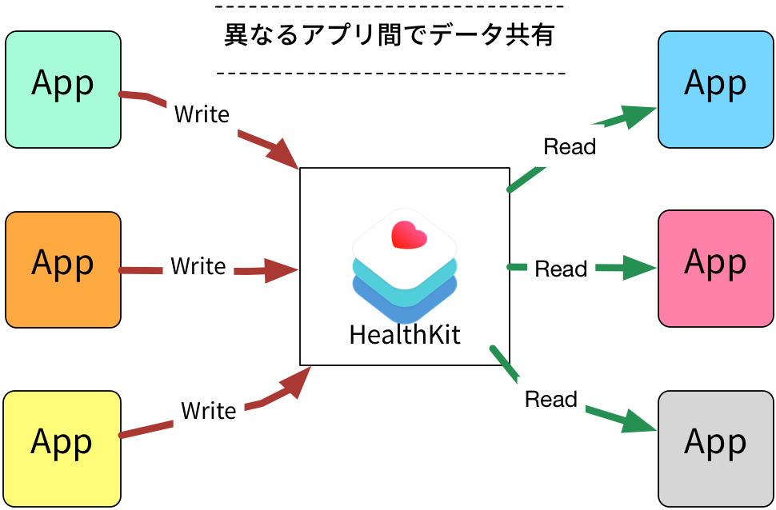


--

# HealthKitの認証

- 健康情報はセンシティブなデータ
- read / write それぞれ権限を要求される
    - read / write 個別に許可ができる
    - 認証画面はモーダル表示される(not AlertView)
- [Luis Abreu: iOS 8 Privacy Updates](http://lmjabreu.com/post/ios-8-privacy-updates/ "Luis Abreu: iOS 8 Privacy Updates")

-- 

# HealthKitの認証画面

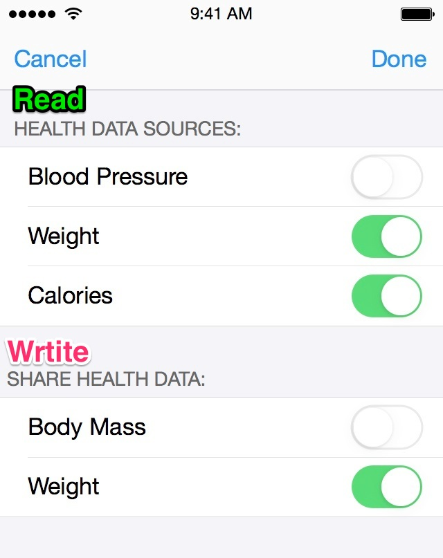

-- 

# パーミッションの範囲

- それぞれのアプリごと
- それぞれのデータの種類ごと
    - write-only
    - read-only
    - read-write
- 扱うデータの種類を増やすともう一度認証から
- アプリから別のアプリの権限の変更はできない


--

# HealthKitを使うには

1. Capabilitiesの追加(Keychain等と同じ)
2. 使用するデータの種類を宣言
3. ユーザーに使用許可の表示
4. 使用許可をもらったデータの種類のみアクセスが可能

詳細は [HealthKit + PromiseKit事始め 基本的なデータの読み書き | Technology-Gym](http://tech-gym.com/2014/07/ios/1502.html "HealthKit + PromiseKit事始め 基本的なデータの読み書き | Technology-Gym")

--

## データの種類は膨大

- 大きく分けて4分類、種類では100近くある
- 身長や血圧から、栄養素、睡眠時間、生年月日等がある
- 基本的に用意された種類のみしか記憶出来ない
	- UserInfoのように独自の属性は追加できる
- iOS8 β4では独自のTypeは作れない(はず)
	- [rdar://17257683: HealthKit should provide a way to store custom object types](http://openradar.appspot.com/radar?id=5892740361486336 "rdar://17257683: HealthKit should provide a way to store custom object types")

--

## データの4分類

- HKQuantityType - 量を記録する分類
    - Fitness
    - Blood
    - Nutrition(栄養素) 等...
- HKCategoryType - 睡眠時間等
- HKCharacteristicType - 生年月日、血液型
- HKCorrelationType (β4で追加)
	- 最高/最低血圧のような関連するデータ

-- healthapp fit

# Health.app

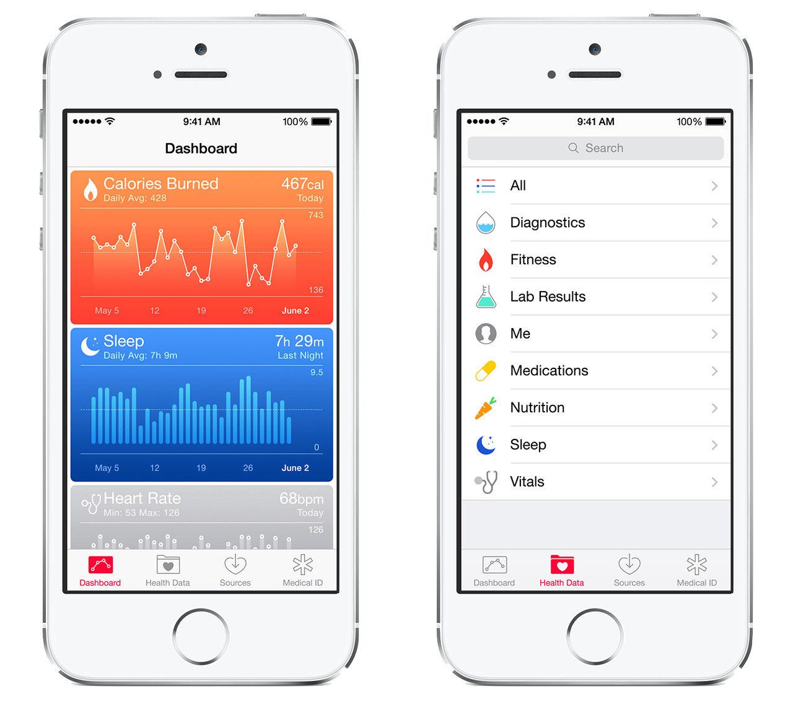

--

# Health.app


--

# ここまでのまとめ

- 異なるアプリ間でデータを共有できる
- データにアクセスするには認証が必要
- データはHealth.app(HealthKit)を通じて読み書きする
- 基本的に扱えるデータの種類は用意されたものだけ

--

# データを書き込むケース

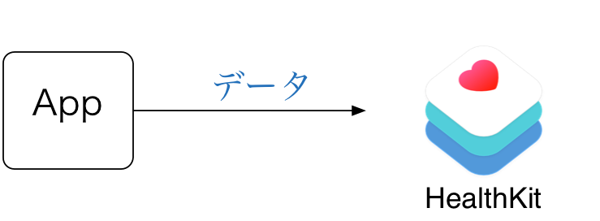

--

# データを書き込むには?

- データを書き込むには以下の事が必要
    1. データの書き込み権限の取得
    2. データの作成
    3. データの保存
- 認証/書き込み/読み込みは`HKHealthStore`クラスが管理する

--

# そもそもデータとは何か?

- HKObject = データオブジェクト
    - UUID
    - source (どのアプリで保存されたか)
    - metadata (userInfoのように独自の要素を入れる)
- HKObjectは抽象クラスのようなもの
- 実際に保存するときに使用するのは`HKSample`
- HKSample は HKObjectのサブクラス

--


# HKObject

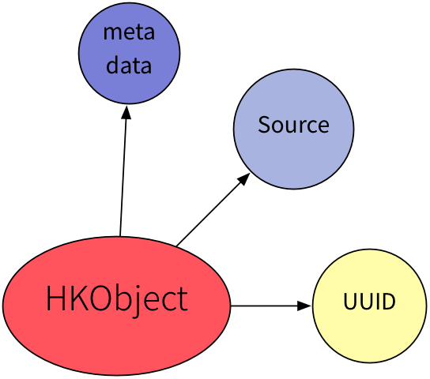

--

# HKSample

- `@interface HKSample : HKObject{}`
- HKSampleはHKObjectを継承したもの
- 更にサブクラスで、`HKQuantitySample` や `HKCategorySample`等がある
- 値や単位などはHKSampleのサブクラスに入れていく
- そのため実際に記録する時はHKSampleを作る -> 保存
- ここでは量の記録である`HKQuantitySample`を例にする

--

# HKQuantitySample

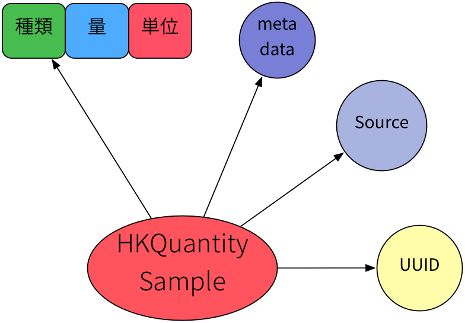

--

## データ = 種類 + 量 + 単位 

- HKQuantitySample は以下の要素から構成される
    - HKQuantityType(HealthKitが定義するデータの種類)
    - HKQuantity(量 => **10** kg)
    - HKUnit(単位 => 10 **kg**)
- HKQuantitySampleを作るには3つのオブジェクトを組わせる
- 無理な組み合わせは、**実行時に例外となる**

--

## HKQuantitySampleの組み立て

```objectivec
NSDate *today = [NSDate date];
double meterValue = 10;
// 単位 = meter
HKUnit *meterUnit = [HKUnit meterUnit];
// 量 = 10
HKQuantity *height = [HKQuantity quantityWithUnit:meterUnit doubleValue:meterValue];
// データ = 種類 + 量 + 単位
HKQuantitySample *heightSample = [HKQuantitySample quantitySampleWithType:heightType
    quantity:height
    startDate:today endDate:today];
```

--

# HKQuantitySampleの書き込み

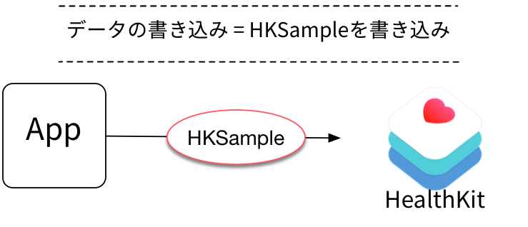

--

# データの書き込み

- 作った`HKQuantitySample`を書き込みする
- データの書き込みは`HKHealthStore`クラスが管理する
- 書き込みは非同期API

``` objectivec
[self.healthStore saveObject:sample withCompletion:^(BOOL success, NSError *error) {
  if (!error) {
      // 成功
  } else {
      // 失敗
  }
}];
```

--


# 書き込みのまとめ

- 書き込みには書き込み権限が必要
- 書き込むデータ = HKSample
	- 書き込む種類ごとにHKSampleのサブクラスがある
	- 量を表すHKQuantitySampleは種類+量+単位で構成
- HKHealthStoreでHealth.appへ書き込み
    - 権限取得や書き込みは非同期API

--

# データの読み込みのケース

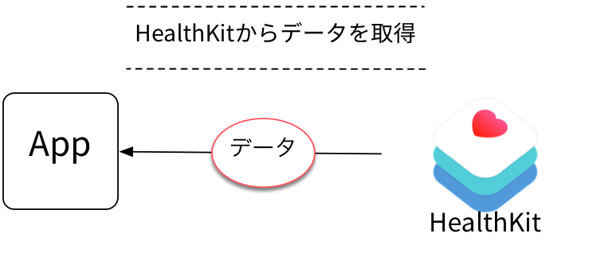

--

# HealthKitでのデータ取得

- データはアプリ間で共有できる
	- 他のアプリで記録したものも取得可能
- 読み込みには**読み込み権限**が必要
- データの取得とフィルターはCoreDataのような感じ
- 読み込みAPIも非同期が基本

--

# データの取得の流れ

- `HKQuery`クラスで検索条件を作成
	- HKSampleType(どの種類)
	- NSPredicate(取得条件)
- `HKQuery`は抽象クラス
- データの取得方法によって別のサブクラスを使う

--

- HKSampleQuery
	- 標準的な検索
- HKObserverQuery
	- 変更検知
- HKAnchoredObjectQuery 
	- 差分取得
- HKStatisticsQuery
	- 統計取得
- HKStatisticsCollectionQuery
	- 期間で区切った統計取得

--

- **HKSampleQuery**
	- 標準的な検索
- HKObserverQuery
	- 変更検知
- HKAnchoredObjectQuery
	- 差分取得
- **HKStatisticsQuery**
	- 統計取得
- HKStatisticsCollectionQuery
	- 期間で区切った統計取得

-- 

## 単純な取得

- `HKSampleQuery` を使って基本的な検索
- `HKQuery` に ソートと取得数の制限をつけたサブクラス
- 取得結果は`HKSample`の配列
- HKSampleには量や単位などが含まれている


--

## HKSampleQueryによる取得

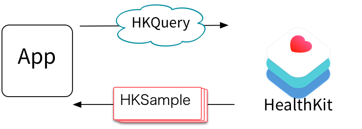

--

# 集計

- HKSampleQueryは単純なデータの取得
	- CoreDataからデータを取り出すのと同じ
- HealthKitには統計処理した結果の取得も可能
	- => `HKStatistics` 
	- ある期間のデータを統計処理したものが入ってる
	- 平均や最大値	、最小値等を含むオブジェクト
	
--	

# HKStatistics
	
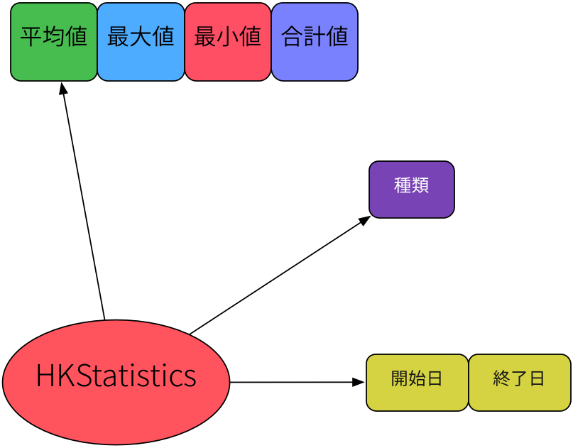


--

## HKStatisticsQueryでの統計取得

- HKQueryのサブクラスなので基本は同じ
	- HKSampleType(どの種類)
	- NSPredicate(取得条件)
	- `HKStatisticsOptions` (統計取得オプション)
- 検索結果は`HKStatistics`
- 取得できるものはHKStatisticsOptionsで指定する
	- 平均値、最小値、最大値、合計値
	
-- 

# HKStatisticsCollectionQuery

- HKStatisticsQuery は個別の結果(HKStatistics)を得る
- HKStatisticsCollectionQuery はグループ化した結果を得る
- `HKStatisticsCollection`
	- ある間隔で区切った `HKStatistics` の配列を持つ
	- 例) 1日毎に区切ったHKStatisticsを取りたい
- グラフを描画するときに活用しやすいデータ形式
- サンプル: [azu/StatisticsHealthKit](https://github.com/azu/StatisticsHealthKit "azu/StatisticsHealthKit")

--

# HKStatistics

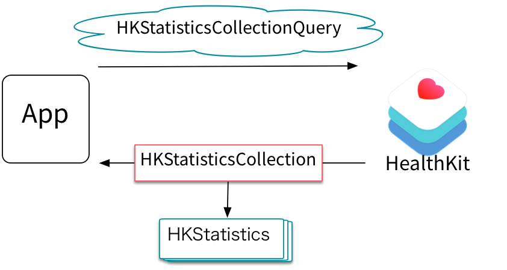

--

# HKStatisticsCollectionの特徴

- HKStatistics(区切った間隔での統計データ)の配列を持つ
- そこから開始日と終了日の範囲に含まれるHKStatisticsを取り出せる
- データを列挙するメソッドを持っている
	- 間隔区切りで列挙するが、データがないケースも列挙される
	- 1日毎のデータ一覧を作る処理がすごく簡単に書ける

```objectivec
- (void)enumerateStatisticsFromDate:(NSDate *)startDate
   toDate:(NSDate *)endDate
   withBlock:(void(^)(HKStatistics *result, BOOL *stop))block;
```

--

# HKStatisticsCollectionを使ったグラフ

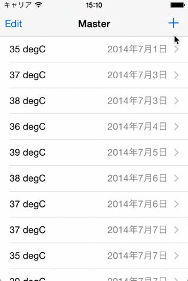

--

## 間隔での区切りとは

- NSDateCompoentsで間隔を指定する
- [Solutions to Common Date and Time Challenges](https://developer.apple.com/videos/wwdc/2013/#227 "Solutions to Common Date and Time Challenges")

``` objectivec
// 1日間隔を表現するNSDateComponents
NSDateComponents *dayComponents = [[NSDateComponents alloc] init];
dayComponents.day = 1;
```

- 指定した間隔でデータが区切られる + 平均値等を求められる
- 1日ごとにデータを表示するグラフなどでとても扱いやすい
- 詳細は[HealthKitのデータを集計してグラフ化 – HKStatisticsCollectionの使い方 | Technology-Gym](http://tech-gym.com/2014/07/ios/1512.html "HealthKitのデータを集計してグラフ化 – HKStatisticsCollectionの使い方 | Technology-Gym")

--

# via [Introducing HealthKit](https://developer.apple.com/videos/wwdc/2014/?id=203 "Introducing HealthKit")

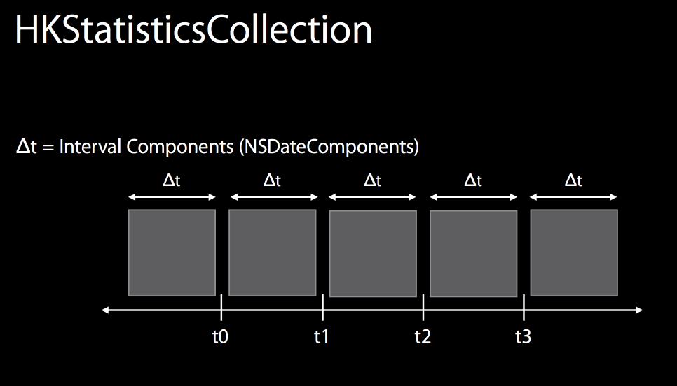

--

# データ読み込みのまとめ

- 読み込みには**読み込み権限**が必要
- 単純な取得から統計的な取得まで様々
- HKStatisticsCollectionQueryはグラフなどに役立つ
- 読み込みAPIも基本的に非同期

--

# CoreDataとの違い

- 基本が非同期API
- 扱えるデータの種類が限定されているが専用の型が用意されている
- アプリ間のデータ共有が可能
	- 他のアプリで記録したデータを使わない事も可能
- データの扱いはユーザーが強い権限を持つ
- 統計的な列挙を行うことが出来る
	- CoreDataだと自前かKVC程度

--


# まとめのまとめ

- HealthKitはread/write権限が細分化されている
	- ユーザーがコントール出来る領域が大きい
- 決められた種類のデータのみを扱える(β4時点)
- アプリ間をまたいだデータの共有が容易
- 非同期API(コールバック)が大量に出てくる
	- PromiseやNSOperationを使った非同期処理のパターンは必須

--

# 参考資料

- [Introducing HealthKit](https://developer.apple.com/videos/wwdc/2014/?id=203 "Introducing HealthKit")
- [HealthKit + PromiseKit事始め 基本的なデータの読み書き | Technology-Gym](http://tech-gym.com/2014/07/ios/1502.html "HealthKit + PromiseKit事始め 基本的なデータの読み書き | Technology-Gym")
- [HealthKitのデータを集計してグラフ化 – HKStatisticsCollectionの使い方 | Technology-Gym](http://tech-gym.com/2014/07/ios/1512.html "HealthKitのデータを集計してグラフ化 – HKStatisticsCollectionの使い方 | Technology-Gym")
- [HealthKit 入門 1 – I&#39;m Sei.](http://im-sei.tumblr.com/post/89246882818/healthkit-1 "HealthKit 入門 1 – I&#39;m Sei.")
- [HealthKit 入門 2 – I&#39;m Sei.](http://im-sei.tumblr.com/post/89752692798/healthkit-2 "HealthKit 入門 2 – I&#39;m Sei.")
- [shadyproject/HeathKitDemo](https://github.com/shadyproject/HeathKitDemo "shadyproject/HeathKitDemo")

--


# おわり

--

# Q&A

--

# Q.ローカライズは?

- NSFormatterで`HKUnit`等を使ったローカライズができる
- Mass, Length, & Energy Formatters
- [NSFormatter - NSHipster](http://nshipster.com/nsformatter/ "NSFormatter - NSHipster")

--

# 特定のアプリだけのデータはとれないの?

- HealthKitには色々なアプリからデータが登録される
- 特定のアプリから登録されたかどうかは`source`を見る
- データを`source`でフィルタするメソッドが用意されている

-- 

# 運動量の計測?

* Xcode 6β4で増えた
* フィットネス等の活動量を計測する `HKWorkout`
* バックグランドでの計測もあるっぽい?
	* `HKBackgroundDelivery`
