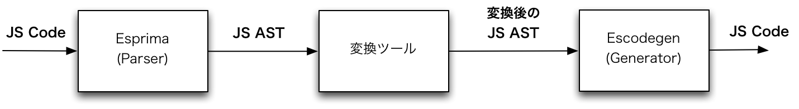
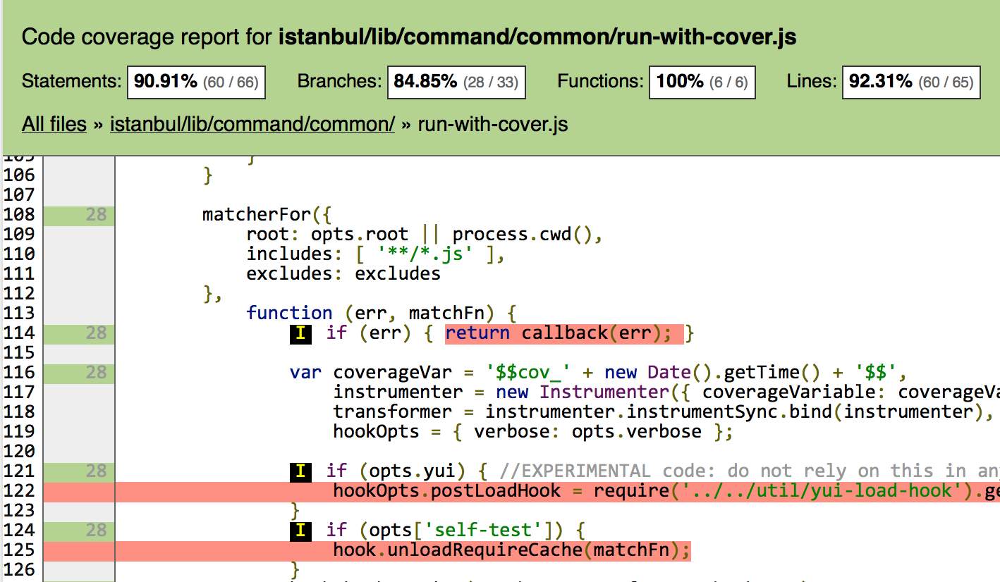
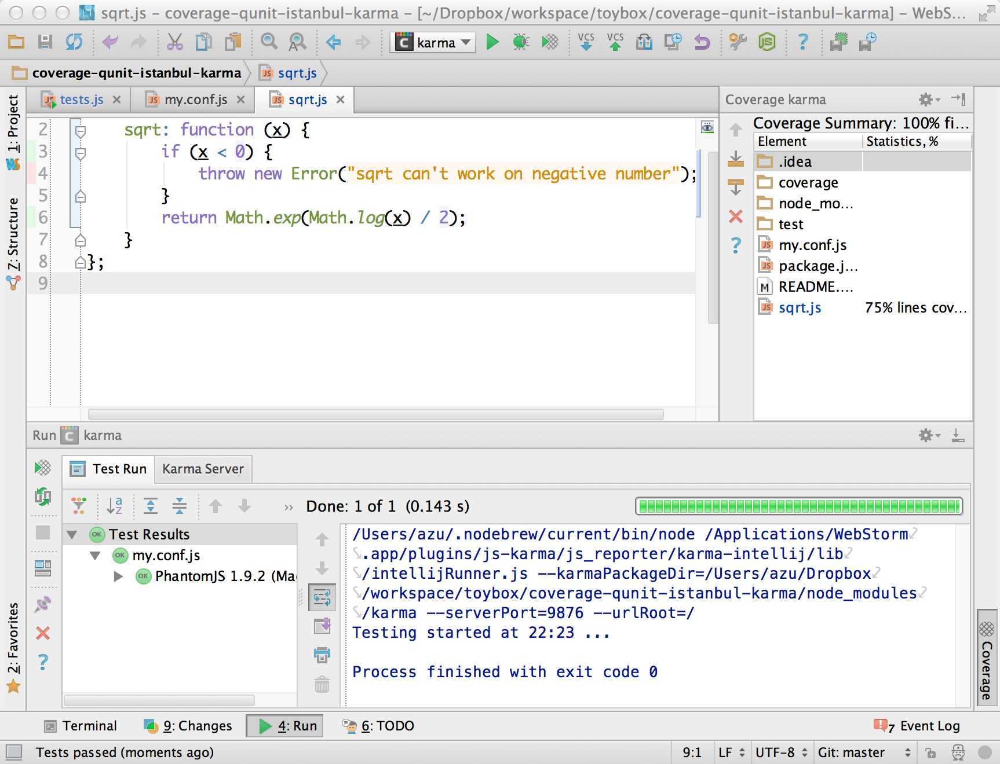
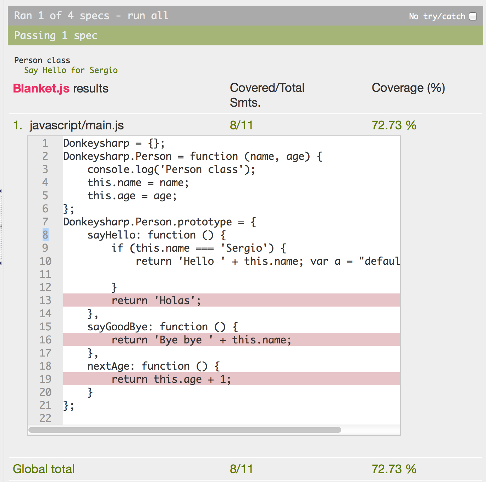

title: JavaScript AST Walker
author:
  name: azu
  twitter: azu_re
  url: http://efcl.info/
agenda: true
output: js-ast-walker.html

--

# JavaScript AST Walker

## JavaScript ASTを見て回る

--

### JavaScript ASTとは

* AST(Abstract Syntax Tree) は コードをパースした構文木
* Mozilla JavaScript AST([Parser API](https://developer.mozilla.org/en-US/docs/SpiderMonkey/Parser_API "Parser API")) がデファクト
* JS ASTはJSONで表現される

> [SpiderMonkey Parser API: A Standard For Structured JS Representations // Speaker Deck](https://speakerdeck.com/michaelficarra/spidermonkey-parser-api-a-standard-for-structured-js-representations "SpiderMonkey Parser API: A Standard For Structured JS Representations // Speaker Deck") を参照

--

### JS AST Structure


--

### JS AST as JSON


--

### Try JavaScript AST

* [Esprima: Parser](http://esprima.org/demo/parse.html "Esprima: Parser")
	* パーサーをオンラインで試せる
* [metajs: visualize javascript AST execution](http://int3.github.io/metajs/ "metajs: visualize javascript AST execution")
	* ASTレベルでJavaScriptをステップ実行できる
* [SpiderMonkey Parser API: A Standard For Structured JS Representations // Speaker Deck](https://speakerdeck.com/michaelficarra/spidermonkey-parser-api-a-standard-for-structured-js-representations "SpiderMonkey Parser API: A Standard For Structured JS Representations // Speaker Deck")
* [JavaScript Syntax | grasp - JavaScript structural search and replace](http://graspjs.com/docs/syntax-js/ "JavaScript Syntax | grasp - JavaScript structural search and replace")
	* ASTのidentifierとJS Codeの対応が分かりやすい

--

### パーサ

JavaScriptのコードから JS ASTを生成する

* [Esprima](http://esprima.org/ "Esprima")
* [Acorn](http://marijnhaverbeke.nl/acorn/ "Acorn")
	* [Acorn: yet another JavaScript parser](http://marijnhaverbeke.nl/blog/acorn.html "Acorn: yet another JavaScript parser")
* スピード競争
	* [Esprima: Speed Comparisons](http://esprima.org/test/compare.html "Esprima: Speed Comparisons")
	* [924466 – integrate acorn with the devtools](https://bugzilla.mozilla.org/show_bug.cgi?id=924466 "924466 – integrate acorn with the devtools")

--

### ジェネレーター

* [escodegen](https://github.com/Constellation/escodegen "escodegen")
	* JS AST から JavaScriptのコードを生成する

*JS Code* -> esprima -> AST -> __escodegen__ -> *JS Code*

```javascript
	parse(generate(parse(code))) === parse(code)
```

--

### ここまでのまとめ

* パーサ
	* esprima - コードからASTを生成する
* ASTを扱うツール(このスライドの主題)
	* JS ASTを別の形に変換/チェック/最適化等
* ジェネレータ
	* escodegen - ASTからコードを生成する



--

### More detail

* [ECMAScript tools - composable modules and transpiler infrastructure](http://constellation.github.io/slides/contents/20121118/modules.html#1 "ECMAScript tools - composable modules and transpiler infrastructure")
* [gist:3664429](https://gist.github.com/Constellation/3664429 "gist:3664429")
	* esprima系統のツールについて

--

# どんなもので使われてるの?

--

### コードカバレッジツール

* [istanbul](https://github.com/gotwarlost/istanbul " istanbul")
	* WebStormとも連携できる - [Karma - Coverage](http://karma-runner.github.io/0.8/config/coverage.html "Karma - Coverage")
* [blanket.js](https://github.com/alex-seville/blanket "blanket.js")

JS ASTを変換して、コード上にカバレッジ検出コードを埋め込んでいく

--

### istanbul-html



--

### istanbul-karma



--

### blanket



--

### [ESLint](https://github.com/nzakas/eslint "ESLint")

* JS ASTをチェックすることでLintを行えるツール
* プラグインを書くことで、Lintを追加できる
	* 初めてJS ASTを触るのにもいいかもしれない
* [ESLint 0.1.0がリリースされたので、JSHintとの違いやプラグインの書き方について | Web scratch](http://efcl.info/2013/1104/res3465/ "ESLint 0.1.0がリリースされたので、JSHintとの違いやプラグインの書き方について | Web scratch")

--

### [reQUnit](https://github.com/azu/reQUnit "reQUnit")

* QUnitで書かれたテストをJasmineなどに変換
	* 構造的な違いはJS ASTのnodeを移動させる
	* assertion等のメソッドは[Rephrase](https://github.com/puffnfresh/rephrase "Rephrase")で変換

--

### reQunit : before

#### Qunit

<iframe width="100%" height="300" src="http://jsfiddle.net/efcl/bA7Yg/embedded/" allowfullscreen="allowfullscreen" frameborder="0"></iframe>

--

### reQunit : after

#### Jasmine

<iframe width="100%" height="300" src="http://jsfiddle.net/efcl/53byk/embedded/" allowfullscreen="allowfullscreen" frameborder="0"></iframe>

--

### [regenerator](https://github.com/facebook/regenerator "regenerator")

* ES6のGeneratorをES5で動くように変換する
	* ASTを組み上げるのに[ast-types](https://github.com/benjamn/ast-types "ast-types")を利用
	* 変換したASTを整形して出力するのに[recast](https://github.com/benjamn/recast " recast")を利用

--

### [grasp](http://graspjs.com/ "grasp")

* grep + sed + JS AST
* [Example Query](http://graspjs.com/docs/equery/ "Example Query") を元にASTと一致している箇所を検索/編集するCLI

```bash
$ grasp -e "return __.length > __" lib/reQUnit.js
58:        return node.expression["arguments"].length > 1;
```

--

### [esgraph + graphviz](https://github.com/azu/esgraph-graphviz-online)

DEMO 

[esgraph + graphviz](http://azu.github.io/esgraph-graphviz-online/)

--

### detail

* ソースコード : [esgraph + graphviz](https://github.com/azu/esgraph-graphviz-online)
* [Swatinem/esgraph](https://github.com/Swatinem/esgraph "Swatinem/esgraph") がASTからgraphvizのdot形式に変換
	* Node専用になってたので[browserify](http://browserify.org/ "browserify")でブラウザで動くように変換
* Emscriptenでgraphvizをコンパイルした[viz.js](https://github.com/mdaines/viz.js "mdaines/viz.js")でSVGとしてレンダリング

--

# どうやってツールを書くの

--

### TreeWalker

* 木構造といえばTraversal
* [TreeWalker](https://developer.mozilla.org/en-US/docs/Web/API/TreeWalker "TreeWalker")
	* DOM を traverse するDOM API
* [JavaScript初級者から中級者になろう：七章第三回　条件を満たすノードをまとめて処理する: TreeWalker](http://uhyohyohyo.sakura.ne.jp/javascript/7_3.html "JavaScript初級者から中級者になろう：七章第三回　条件を満たすノードをまとめて処理する: TreeWalker")

--

### JavaScript AST Traversal lib

* ASTを走査するライブラリ.
	* 低レイヤーに近いので、他のライブラリがこれの上に成り立ってる事が多い
* [estraverse](https://github.com/Constellation/estraverse "estraverse")
	* JS AST traversalのデファクト
	* ``enter`` , ``leave`` , ``replace``
* [ast-traverse](https://github.com/olov/ast-traverse "ast-traverse")
	* ``pre`` , ``post`` , ``skipProperty``

--

### Traversal

* [millermedeiros/rocambole](https://github.com/millermedeiros/rocambole "millermedeiros/rocambole")
	* 通常はコードとコメントのTreeは別れているがlinked listで辿れるようになってる
	* ``next`` や ``prev`` でコードのイメージそのままたどっていける
	* これのために ``token`` という、nodeより小さい概念が導入されてる(独自っぽい?)
	* traversalのメソッドも持ってるので便利

---

### ASTセレクタ

* [cssauron](https://github.com/chrisdickinson/cssauron "cssauron")
	* CSSセレクタみたいなものを以下に対して行える
	* HTML,JSON,GLSL AST, JavaScript AST
* [esquery](https://github.com/jrfeenst/esquery "jrfeenst/esquery")
	* CSSセレクタみたいな感じ実装
	* [estraverse](https://github.com/Constellation/estraverse "estraverse") ベース
* [phadej/jsstana](https://github.com/phadej/jsstana "phadej/jsstana")
	* S式のパターンマッチ

--

### AST変換

* [node-falafel](https://github.com/substack/node-falafel " node-falafel")
	* AST traversal + update
* [AST Query](https://github.com/SBoudrias/AST-query#object-literal-token "AST Query")
	* ``rename`` , ``delete`` , ``insertAfter`` などnodeを操作するライブラリ
* [Rephrase](https://github.com/puffnfresh/rephrase "Rephrase")
	* GHCのRewrite Rulesライクな感じでJavaScriptを書き換える
	
--

### [Rephrase](https://github.com/puffnfresh/rephrase "Rephrase") example

* コメントで書き換えルールを定義する

```javascript
/* forall a f g. */
/* a.map(f).map(g) */
/* a.map(compose(f, g)) */

[1, 2, 3].map(add(1)).map(add(2));
// =>
[1, 2, 3].map(compose(add(1), add(2)));
```
--

### Other

* [Nitraの紹介 | JetBrains ブログ](http://blog.jetbrains.com/jp/2013/11/13/263 "Nitraの紹介 | JetBrains ブログ")

> Nitraにより皆様はパーサーや言語実装のエキスパートでなくても独自のDSLを開発することが出来るようになり、同時にエラーチェックやシンタックスハイライトといったIDEの機能を活用することができます

--

[](https://github.com/azu)