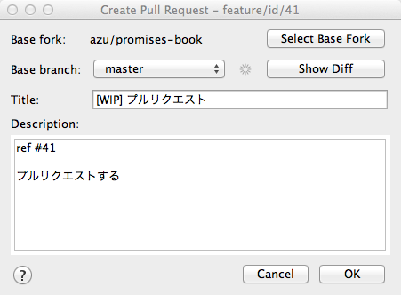

title: 一人で使えるGithub Issue
author:
  name: azu
  twitter: azu_re
  url: http://efcl.info/
theme: azu/cleaver-ribbon
output: github-issue.html

--

# 一人で使えるGithub Issue

* 一人で使うGithub Issueについて

--

# Promise本での利用方法

* [JavaScript Promiseの本](http://azu.github.io/promises-book/ "JavaScript Promiseの本")というのを書いてる
* それぞれのセクションレベルでIssue+pull-reqeuestsで書いてる
* リポジトリ => [azu/promises-book](https://github.com/azu/Promises-book "azu/promises-book")
	* 途中(後半)から積極的にIssueを使い出した
	* Issue数:50、Pull Requests数:20

--

# ワークフロー

1. Issueを立てる
2. git-issue + git-flow + percolでissueのブランチを切る
3. [WIP] pull-requestsを立てる ref #id
4. push -> review
5. merge + close #id でissueも閉じる
6. git flow finish でローカルとリモートブランチを削除

--

# 1. Issueを立てる

* Issueを立てる
	* 必要な情報をメモる
* ウェブから立ててる
	* 何だかんだ補完が効くので便利
* 画像も投稿できるので、Before/Afterのキャプチャをよく貼る
* モバイルなら[CodeHub](http://codehub-app.com/ "CodeHub")や[iOctocat](http://ioctocat.com/ "iOctocat")から書く

--

# 1.5 Issueの運用

* 作業に入る前にIssueを結構煮詰めてた
* IssueにIssueのURLやIDを書くとクロスリンクになるのが便利
	* 他のリポジトリからも逆リンクになるのは気にしてはいけない
	* Issueに沢山メモを書くとIssueの循環参照が起きる
* => Gitterを使う
	* [azu/promises-book - Gitter](https://gitter.im/azu/promises-book "azu/promises-book - Gitter")
	* 複数のIssueをまたいだ流れをまとめる。
	* 循環参照を一時的に解消して、Issueを処理していく

--

# 1.6 Issueの進歩

* 個人用なのであまり気にしてなかった
* Githubのマイルストーンはものすごく使いにくい
* 外部サービス等を活用した方がよさそう
	* [HuBoard](https://huboard.com/ "HuBoard")
	* [waffle.io](https://waffle.io/ "waffle.io")

--

# 2. [git-issue + git-flow + percol](https://gist.github.com/azu/d3fb5f970e4ff945ead4 "git-issue + git-flow + percol")

--

# 3. [WIP] pull-requestsを立てる

* 書籍は[WebStorm](http://www.jetbrains.com/webstorm/ "WebStorm")で書いてる
* IDE上から**Create Pull Request**で作成できる

--

# 4. push -> review

* 内容を書いてcommit -> pushを繰り返す
* 気になった事はIssueに書く
	* コード(文章) とは別の場所に書くと意見が整理しやすい
* Travis CIによるテスト等が毎回走る
* このスタイルにしてから、typoとかの細かいミスも減った

--

#  5. merge + close

* 完了したらGithubのマージボタンからマージする
	* マージコメントに`close #id`を書いて元issueも閉じる
	* Github上でブランチを閉じない＊1
* `git flow finish` でローカルと(push済み)リモートブランチを削除
	* リモートブランチが消えてるとfinishできないのツライ…
* TODO : ＊1何かもっと改善できるはず…

--

# pull-requestsのメリット

- `- [ ]` でissueのTodo管理
- pushする毎にCIによるテストが走る
- マージをするまでによくしようという心理影響
- 実装中の疑問をコメントとして残して整理出来る
- 作業内容が公開しやすい(共有しやすい)

--

# 自分用メモとしてのIssue

- 自分用Todo
	- [Issues · azu/azu](https://github.com/azu/azu/issues?state=open "Issues · azu/azu") というようなIssueのためだけのリポジトリを運用してる
- TODOサービスとの違い
	- Markdownでメモも書ける
	- 画像を置ける
	- 公開出来る(他の人も言及できる)

--

# Issueを見る

- [mislav/issuesync](https://github.com/mislav/issuesync "mislav/issuesync")
	- [Githubのissueをオフライン環境で見る | Web scratch](http://efcl.info/2014/0521/res3908/ "Githubのissueをオフライン環境で見る | Web scratch")
- [BugHub](http://bughubapp.com/ "BugHub")
	- [Me1000/BugHub](https://github.com/Me1000/BugHub "Me1000/BugHub")

--

# Issueの更新チェック

* 気になるリポジトリはとりあえずWatchする
* WatchするとNotificationに飛んでくる
* [github-reader](https://github.com/azu/github-reader "github-reader") で通知を受け取る
	* [Githubのタイムラインや通知を見るアプリをnode-webkitで作った | Web scratch](http://efcl.info/2014/0430/res3872/ "Githubのタイムラインや通知を見るアプリをnode-webkitで作った | Web scratch")
* TODO: WatchだけだとReleaseは監視できない

--

# まとめ

* ひとりぼっちでもGithub workflowは効果ある
	* TiDDと似てる
	* 継続するにはツールが結構重要
* 活動内容がWebに残る、記録として残せる
* Github Issueはそんな高機能ではない
* 迷ったら書いておいて、より最適なものがあったらそっちを使う
