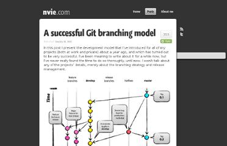
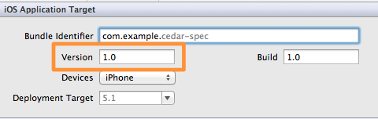

# 開発ツール

----

# git-flow

---

## [nvie/gitflow](https://github.com/nvie/gitflow/ "nvie/gitflow")

* gitのブランチモデルを補助するコマンドラインツール
	* bash/zshなどから使う(自分はzsh利用)
* MacのGUI Git [SourceTree](http://www.sourcetreeapp.com/ "SourceTree") もサポート
	* [SourceTree 1.5: Going With The Flow – Bitbucket](http://blog.bitbucket.org/2012/07/17/sourcetree-1-5-going-with-the-flow/ "SourceTree 1.5: Going With The Flow – Bitbucket")
	

---

## Gitブランチモデルとは

### [A successful Git branching model](http://nvie.com/posts/a-successful-git-branching-model/ "A successful Git branching model")

* [見えないチカラ: A successful Git branching model を翻訳しました](http://keijinsonyaban.blogspot.jp/2010/10/successful-git-branching-model.html "見えないチカラ: A successful Git branching model を翻訳しました")
* [Gitのブランチで効率的に開発・運用・保守・管理する方法 - (DxD)∞](http://dxd8.com/archives/218/ "Gitのブランチで効率的に開発・運用・保守・管理する方法 - (DxD)∞")

Gitのブランチ機能を使った開発モデルの事

* TiDDととても相性がいい
* iOSアプリ開発とも相性がいい

---

## Gitブランチモデル

簡単にまとめると

* 常にリリース可能なブランチを持っておく(master)
	* git-flow release
* 代わりに開発の主体になるブランチを持つ(devlop)
* 機能開発やホットフィックス(チケット的)などは、それぞれブランチを切って開発する
	* トピックブランチと言われるもの
* ブランチのマージは–no-ffフラグを使い、どのブランチで開発してたのかを履歴に残す

---

## 1トピックブランチ = 1チケット

git-flowで切るブランチをチケット毎とすると分かりやすい

1. チケット番号でGitのブランチを切る = **チケットオープン**
> git-flow feature start id/TICKET_ID
2. チケットの内容に関するコミットする
3. コミットが終わったブランチをマージしてブランチを閉じる = **チケットクローズ**
>  git-flow feature finish id/TICKET_ID

後はこれをチケット毎に繰り返していけばいい

* [TiDDとgit-flowを合わせた開発手法について | Technology-Gym](http://tech-gym.com/2011/08/git/467.html "TiDDとgit-flowを合わせた開発手法について | Technology-Gym")
* [Gitにおけるトピックブランチの使い方 | EIPラボ](http://www.eiplab.com/2011/07/git-topic-branc/ "Gitにおけるトピックブランチの使い方 | EIPラボ")

---

## iOSアプリ開発とgit-flowの場合

* git-flow releaseはgit tagを付けるため、バージョン番号が必須
* git-flowはリリースが頻繁(1日数回等)な場合は相性悪いと言われる
	* [Git で日々の共同作業やリリース作業をサポートする git-daily を作りました | GREE Engineers' Blog](http://labs.gree.jp/blog/2011/05/3528/ "Git で日々の共同作業やリリース作業をサポートする git-daily を作りました | GREE Engineers' Blog")
* iOSアプリのrelease(App Store審査がある)はそこまで頻繁に起きない
* iOSアプリのVersion = git-flow releaseのバージョン なので分かりやすい

---

## Githubプルリクエストモデル

* [GitHub直伝 プルリクエスト活用の3つのコツ « A-Listers](http://tech.a-listers.jp/2012/05/05/how-we-use-pull-requests-to-build-github/ "GitHub直伝 プルリクエスト活用の3つのコツ « A-Listers")
* [Scott Chacon on the Interwebs](http://scottchacon.com/2011/08/31/github-flow.html "Scott Chacon on the Interwebs")

Githubのような、Pull Requestを中心とした開発モデル

1. ブランチを切る
`git-flow feature start id/TICKET_ID`
2. ブランチをpushする
`git-flow feature publish id/TICKET_ID`
3. Pull Requestを送る
4. 開発/コミット
5. push(Pull Request/ブランチ上にコミットは溜まっていく)
6. Pull Requestを閉じる(リモートのブランチは自動で閉じる)
	* Acceptの場合はローカルもマージして閉じる
	`git-flow feature finish id/TICKET_ID`
	* Denyの場合は、ブランチを捨てる

git-flowを使った場合でもPull Requestを使った開発自体はできる.(まあ目的が若干違う)

* 2,3はGithubなら[hub](https://github.com/defunkt/hub "hub")コマンドを利用
* [Gitでリモートの共有リポジトリにあるブランチを消す時のメモ - longkey1::blog](http://blog.longkey1.net/archive/941 "Gitでリモートの共有リポジトリにあるブランチを消す時のメモ - longkey1::blog") 

---

## git-issue

> [git-issue](https://github.com/yuroyoro/git-issue "git-issue")

Github/redmineのチケットをコマンドラインから処理するツール

* チケットの詳細を見る
* プロジェクトのチケット一覧を見る
* チケットのアップデート(編集/ステータス更新/閉じる)
* チケットを元にブランチを切る/コミットする

チケット操作周りは一通りできる便利なCLIツール

---

## チケット番号入力の自動化

### [percol](https://github.com/mooz/percol/ "percol") + [git-issue](https://github.com/yuroyoro/git-issue "git-issue")

* ブランチを切る際にチケット番号を手動で入力するのは面倒臭い
* [percolとgit-issueを使って、redmineのチケットをブランチに切って作業するのが捗る設定 | Technology-Gym](http://tech-gym.com/2012/07/shell/825.html "percolとgit-issueを使って、redmineのチケットをブランチに切って作業するのが捗る設定 | Technology-Gym")

<iframe width="660" height="400" frameborder="0" src="http://play.codestre.am/embed/1716f37cb82aac0ee4d7d187b"></iframe>

---

## まとめ

* TiDDはツールありきな部分がある
* => ツール等環境を良くすればそれだけ便利になる
* => より効率のいい方法やツールなどを探す/作るべき
* git-flow と TiDD は相性がいい
	* ブランチ = チケット
* 粒度　: チケット = ブランチ >= コミット
* TiDDとgit-flowを合わせたワークフローによりコミットの癖が付く
* チケットとコミットメッセージの2方向から説明ができる